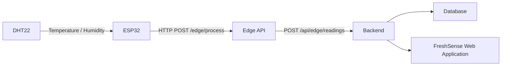

<div align="center">


<h3>Universidad Peruana de Ciencias Aplicadas</h3>

<strong>Facultad de Ingeniería</strong><br>
<strong>Carrera: Ingeniería de Software</strong><br>

<strong>Periodo:</strong> 202620<br>
<strong>Codigo del curso:</strong>  1ASI057 <br>
<strong>Nombre del curso:</strong>  Desarrollo de Soluciones IoT<br>
<strong>NRC:</strong> 8725 <br>

<strong>Nombre del profesor:</strong> Marco Antonio León Baca <br>

<br><strong>*Informe de Trabajo Final*</strong><br><br>

<strong>Nombre del startup: </strong>FreshEat<br>
<strong>Nombre del producto: </strong>FreshSense<br>


### Relación de Integrantes

| Apellidos y Nombres                  |   Código    |
|:------------------------------------:|:-----------:|
| Tuesta Marin, Romina Alejandra       | U202211706  |

<strong> Septiembre 2026</strong><br>
</div>

<div style="page-break-after: always;"></div>

# Project Report Collaboration Insights

**AV1:**


<div style="page-break-after: always;"></div>

# Registro de Versiones del Informe

| Versión | Fecha      | Autor        | Descripción de modificación                   |
|---------|------------|--------------|-----------------------------------------------|
| 1.0     | 08/09/2026 | Romina Tuesta Marin | Cargó archivos, Descripción de la Startup|


# Tabla de contenidos

- [Student Outcome](#student-outcome)

- [Capítulo I: Introducción](#capítulo-i-introducción)
  - [1.1. Startup Profile](#11-startup-profile)
    - [1.1.1. Descripción de la Startup](#111-descripción-de-la-startup)
    - [1.1.2. Perfiles de integrantes del equipo](#112-perfiles-de-integrantes-del-equipo)
  - [1.2. Solution Profile](#12-solution-profile)
    - [1.2.1. Antecedentes y problemática](#121-antecedentes-y-problemática)
    - [1.2.2. Lean UX Process](#122-lean-ux-process)
      - [1.2.2.1. Lean UX Problem Statements](#1221-lean-ux-problem-statements)
      - [1.2.2.2. Lean UX Assumptions](#1222-lean-ux-assumptions)
      - [1.2.2.3. Lean UX Hypothesis Statements](#1223-lean-ux-hypothesis-statements)
      - [1.2.2.4. Lean UX Canvas](#1224-lean-ux-canvas)
  - [1.3. Segmentos objetivo](#13-segmentos-objetivo)

- [Capítulo II: Requirements Elicitation & Analysis](#capítulo-ii-requirements-elicitation--analysis)
  - [2.1. Competidores](#21-competidores)
    - [2.1.1. Análisis competitivo](#211-análisis-competitivo)
    - [2.1.2. Estrategias y tácticas frente a competidores](#212-estrategias-y-tácticas-frente-a-competidores)
  - [2.2. Entrevistas](#22-entrevistas)
    - [2.2.1. Diseño de entrevistas](#221-diseño-de-entrevistas)
    - [2.2.2. Registro de entrevistas](#222-registro-de-entrevistas)
    - [2.2.3. Análisis de entrevistas](#223-análisis-de-entrevistas)
  - [2.3. Needfinding](#23-needfinding)
    - [2.3.1. User Personas](#231-user-personas)
    - [2.3.2. User Task Matrix](#232-user-task-matrix)
    - [2.3.3. User Journey Mapping](#233-user-journey-mapping)
    - [2.3.4. Empathy Mapping](#234-empathy-mapping)
  - [2.4. Big Picture EventStorming](#24-big-picture-eventstorming)
  - [2.5. Ubiquitous Language](#25-ubiquitous-language)

- [Capítulo III: Requirements Specification](#capítulo-iii-requirements-specification)
  - [3.1. User Stories](#31-user-stories)
  - [3.2. Impact Mapping](#32-impact-mapping)
  - [3.3. Product Backlog](#33-product-backlog)

- [Capítulo IV: Solution Software Design](#capítulo-iv-solution-software-design)
  - [4.1. Strategic-Level Domain-Driven Design](#41-strategic-level-domain-driven-design)
    - [4.1.1. Design-Level EventStorming](#411-design-level-eventstorming)
      - [4.1.1.1. Candidate Context Discovery](#4111-candidate-context-discovery)
      - [4.1.1.2. Domain Message Flows Modeling](#4112-domain-message-flows-modeling)
      - [4.1.1.3. Bounded Context Canvases](#4113-bounded-context-canvases)
    - [4.1.2. Context Mapping](#412-context-mapping)
    - [4.1.3. Software Architecture](#413-software-architecture)
      - [4.1.3.1. Software Architecture System Landscape Diagram](#4131-software-architecture-system-landscape-diagram)
      - [4.1.3.2. Software Architecture Context Level Diagrams](#4132-software-architecture-context-level-diagrams)
      - [4.1.3.2. Software Architecture Container Level Diagrams](#4132-software-architecture-container-level-diagrams)
      - [4.1.3.3. Software Architecture Deployment Diagrams](#4133-software-architecture-deployment-diagrams)
  - [4.2. Tactical-Level Domain-Driven Design](#42-tactical-level-domain-driven-design)
    - [4.2.X. Bounded Context: &lt;Bounded Context Name&gt;](#42x-bounded-context-bounded-context-name)
      - [4.2.X.1. Domain Layer](#42x1-domain-layer)
      - [4.2.X.2. Interface Layer](#42x2-interface-layer)
      - [4.2.X.3. Application Layer](#42x3-application-layer)
      - [4.2.X.4. Infrastructure Layer](#42x4-infrastructure-layer)
      - [4.2.X.5. Bounded Context Software Architecture Component Level Diagrams](#42x5-bounded-context-software-architecture-component-level-diagrams)
      - [4.2.X.6. Bounded Context Software Architecture Code Level Diagrams](#42x6-bounded-context-software-architecture-code-level-diagrams)
        - [4.2.X.6.1. Bounded Context Domain Layer Class Diagrams](#42x61-bounded-context-domain-layer-class-diagrams)
        - [4.2.X.6.2. Bounded Context Database Design Diagram](#42x62-bounded-context-database-design-diagram)

- [Capítulo V: Solution UI/UX Design](#capítulo-v-solution-uiux-design)
  - [5.1. Style Guidelines](#51-style-guidelines)
    - [5.1.1. General Style Guidelines](#511-general-style-guidelines)
    - [5.1.2. Web, Mobile and IoT Style Guidelines](#512-web-mobile-and-iot-style-guidelines)
  - [5.2. Information Architecture](#52-information-architecture)
    - [5.2.1. Organization Systems](#521-organization-systems)
    - [5.2.2. Labeling Systems](#522-labeling-systems)
    - [5.2.3. SEO Tags and Meta Tags](#523-seo-tags-and-meta-tags)
    - [5.2.4. Searching Systems](#524-searching-systems)
    - [5.2.5. Navigation Systems](#525-navigation-systems)
  - [5.3. Landing Page UI Design](#53-landing-page-ui-design)
    - [5.3.1. Landing Page Wireframe](#531-landing-page-wireframe)
    - [5.3.2. Landing Page Mock-up](#532-landing-page-mock-up)
  - [5.4. Applications UX/UI Design](#54-applications-uxui-design)
    - [5.4.1. Applications Wireframes](#541-applications-wireframes)
    - [5.4.2. Applications Wireflow Diagrams](#542-applications-wireflow-diagrams)
    - [5.4.2. Applications Mock-ups](#542-applications-mock-ups)
    - [5.4.3. Applications User Flow Diagrams](#543-applications-user-flow-diagrams)
  - [5.5. Applications Prototyping](#55-applications-prototyping)
  - [5.6. IoT Device Design](#56-iot-device-design)

- [Capítulo VI: Product Implementation, Validation & Deployment](#capítulo-vi-product-implementation-validation--deployment)
  - [6.1. Software Configuration Management](#61-software-configuration-management)
    - [6.1.1. Software Development Environment Configuration](#611-software-development-environment-configuration)
    - [6.1.2. Source Code Management](#612-source-code-management)
    - [6.1.3. Source Code Style Guide & Conventions](#613-source-code-style-guide--conventions)
    - [6.1.4. Software Deployment Configuration](#614-software-deployment-configuration)
  - [6.2. Landing Page, Services & Applications Implementation](#62-landing-page-services--applications-implementation)
    - [6.2.X. Sprint n](#62x-sprint-n)
      - [6.2.X.1. Sprint Planning n](#62x1-sprint-planning-n)
      - [6.2.X.2. Aspect Leaders and Collaborators](#62x2-aspect-leaders-and-collaborators)
      - [6.2.X.3. Sprint Backlog n](#62x3-sprint-backlog-n)
      - [6.2.X.4. Development Evidence for Sprint Review](#62x4-development-evidence-for-sprint-review)
      - [6.2.X.5. Testing Suite Evidence for Sprint Review](#62x5-testing-suite-evidence-for-sprint-review)
      - [6.2.X.6. Execution Evidence for Sprint Review](#62x6-execution-evidence-for-sprint-review)
      - [6.2.X.7. Services Documentation Evidence for Sprint Review](#62x7-services-documentation-evidence-for-sprint-review)
      - [6.2.X.8. Software Deployment Evidence for Sprint Review](#62x8-software-deployment-evidence-for-sprint-review)
      - [6.2.X.9. Team Collaboration Insights during Sprint](#62x9-team-collaboration-insights-during-sprint)
  - [6.3. Validation Interviews](#63-validation-interviews)
    - [6.3.1. Diseño de Entrevistas](#631-diseño-de-entrevistas)
    - [6.3.2. Registro de Entrevistas](#632-registro-de-entrevistas)
    - [6.3.3. Evaluaciones según heurísticas](#633-evaluaciones-según-heurísticas)
  - [6.4. Video About-the-Product](#64-video-about-the-product)

- [Conclusiones](#conclusiones)
- [Conclusiones y recomendaciones](#conclusiones-y-recomendaciones)
- [Video About-the-Team](#video-about-the-team)
- [Bibliografía](#bibliografía)
- [Anexos](#anexos)

## Student Outcome

El curso contribuye al cumplimiento del Student Outcome ABET:
ABET – EAC - Student Outcome 5
Criterio: La capacidad de funcionar efectivamente en un equipo cuyos miembros
juntos proporcionan liderazgo, crean un entorno de colaboración e inclusivo,
establecen objetivos, planifican tareas y cumplen objetivos.
En el siguiente cuadro se describe las acciones realizadas y enunciados de
conclusiones por parte del grupo, que permiten sustentar el haber alcanzado el logro
del ABET – EAC - Student Outcome 5.

| Criterio específico | Acciones realizadas | Conclusiones |
| :---- | :---- | :---- |
| Trabaja en equipo para proporcionar liderazgo en forma conjunta |  |  |
| Crea un entorno colaborativo e inclusivo, establece metas, planifica tareas y cumple objetivos |  |  |

<div style="page-break-after: always;"></div>

Capítulo I: Introducción

1.1. Startup Profilee

1.1.1. Descripción de la Startup

1.1.2. Perfiles de integrantes del equipo

1.2. Solution Profile

1.2.1 Antecedentes y problemática

1.2.2 Lean UX Process.

1.2.2.1. Lean UX Problem Statements.

1.2.2.2. Lean UX Assumptions.

1.2.2.3. Lean UX Hypothesis Statements.

1.2.2.4. Lean UX Canvas.

1.3. Segmentos objetivo.

Capítulo II: Requirements Elicitation & Analysis

2.1. Competidores.

2.1.1. Análisis competitivo.

2.1.2. Estrategias y tácticas frente a competidores.

2.2. Entrevistas.

2.2.1. Diseño de entrevistas.

2.2.2. Registro de entrevistas.

2.2.3. Análisis de entrevistas.

2.3. Needfinding.

2.3.1. User Personas.

2.3.2. User Task Matrix.

2.3.3. User Journey Mapping.

2.3.4. Empathy Mapping.

2.4. Big Picture EventStorming.

2.5. Ubiquitous Language.

Capítulo III: Requirements Specification

3.1. User Stories.

3.2. Impact Mapping.

3.3. Product Backlog.

Capítulo IV: Solution Software Design

4.1. Strategic-Level Domain-Driven Design.

4.1.1. Design-Level EventStorming.

4.1.1.1 Candidate Context Discovery.

4.1.1.2 Domain Message Flows Modeling.

4.1.1.3 Bounded Context Canvases.

4.1.2. Context Mapping.

4.1.3. Software Architecture.

4.1.3.1. Software Architecture System Landscape Diagram.

4.1.3.2. Software Architecture Context Level Diagrams.

4.1.3.2. Software Architecture Container Level Diagrams.

4.1.3.3. Software Architecture Deployment Diagrams.

4.2. Tactical-Level Domain-Driven Design

4.2.X. Bounded Context: <Bounded Context Name>

4.2.X.1. Domain Layer.

4.2.X.2. Interface Layer.

4.2.X.3. Application Layer.

4.2.X.4. Infrastructure Layer.

4.2.X.5. Bounded Context Software Architecture Component Level Diagrams.

4.2.X.6. Bounded Context Software Architecture Code Level Diagrams.

4.2.X.6.1. Bounded Context Domain Layer Class Diagrams.

4.2.X.6.2. Bounded Context Database Design Diagram.

Capítulo V: Solution UI/UX Design

## 5.1. Style Guidelines

FreshSense establece un conjunto de lineamientos visuales y de interacción orientados a mantener una experiencia consistente entre el Landing Page, la aplicación web, la aplicación móvil y la experiencia asociada al dispositivo IoT.

La solución está dirigida principalmente a **empresas de distribución y cadena de frío** y a **empresas productoras y comercializadoras de alimentos perecibles**. Por ello, la experiencia visual prioriza claridad, confiabilidad y rápida interpretación de información relacionada con monitoreo ambiental, lotes, dispositivos, alertas y trazabilidad.

Los recursos visuales del producto, como logotipos, imágenes, tipografías y demás elementos gráficos, se centralizarán en la carpeta `Assets/` del repositorio para mantener una referencia común entre todos los integrantes del equipo.

### 5.1.1. General Style Guidelines

Los lineamientos generales de FreshSense definen la identidad visual y comunicacional utilizada en los diferentes productos digitales que forman parte de la solución.

#### Branding

La identidad de FreshSense está orientada a transmitir **frescura, control, trazabilidad, tecnología y confiabilidad**.

La marca busca representar una solución tecnológica que permita a las empresas monitorear las condiciones de conservación de productos perecibles durante su almacenamiento y distribución, facilitando la detección de desviaciones y reduciendo las pérdidas asociadas al deterioro de productos.

El diseño visual mantiene una apariencia limpia y profesional, evitando interfaces excesivamente cargadas. Los elementos relacionados con monitoreo, conservación, alertas, dispositivos y trazabilidad deben utilizarse de manera consistente en todos los productos digitales.

#### Typography

FreshSense utiliza la familia tipográfica **Poppins** debido a su apariencia moderna, limpia y legible en interfaces digitales.

Se establece la siguiente jerarquía tipográfica:

- **H1:** títulos principales de páginas y mensajes de mayor importancia.
- **H2:** títulos de secciones.
- **H3:** subtítulos y encabezados de componentes.
- **Body:** contenido descriptivo, datos y textos de apoyo.
- **Labels:** nombres de campos, indicadores, filtros y estados.

La jerarquía debe mantenerse de manera consistente en las experiencias Web y Mobile para facilitar la lectura y comprensión de la información.

#### Colors

La paleta cromática de FreshSense está compuesta principalmente por verde, azul, tonos neutros y blanco.

| Color | Uso principal |
|---|---|
| **Green - Primary** | Acciones principales, indicadores de condiciones adecuadas y elementos asociados a conservación. |
| **Blue - Secondary** | Monitoreo, información tecnológica, gráficos y componentes secundarios. |
| **Gray - Neutral** | Textos secundarios, etiquetas, íconos y divisores. |
| **White - Background** | Fondos principales, tarjetas y espacios de contenido. |
| **Text - Base** | Información principal y contenido de alta prioridad. |

Los estados que requieran atención podrán utilizar indicadores visuales diferenciados según su nivel de severidad. Sin embargo, el color no será el único mecanismo de comunicación; cada estado deberá estar acompañado por texto o iconografía que permita comprender claramente la situación.

#### Spacing & Layout

FreshSense utiliza una estructura modular para mantener consistencia entre páginas y componentes.

**Base Unit**

- Size: `8 px`
- Uso: unidad base para márgenes, paddings y separación entre elementos.

**Grid System**

- Grid: `12 columnas`
- Gutter: `22 px`
- Margins: proporcionales a la unidad base.

**Section Spacing**

- Standard section: `56 px`
- Hero section: `72 px`
- Footer: `36–56 px`

**Cards & Components**

- Internal padding: `18–22 px`
- Border radius: `16 px`
- Elevation: `0 10px 25px rgba(0,0,0,.08)`

**Alignment**

- Contenido principal dentro de un contenedor máximo de `1120 px` o `92%` del ancho disponible.
- El contenido textual se alinea principalmente a la izquierda para facilitar su lectura.
- Los indicadores críticos y métricas principales deberán tener mayor jerarquía visual.
- Se utilizarán espacios amplios entre grupos de información para diferenciar claramente cada sección.

#### Tone of Voice

El tono de comunicación de FreshSense busca transmitir profesionalismo, confianza y claridad, debido a que la solución presenta información utilizada para supervisar las condiciones de conservación de productos perecibles.

| Dimensión | Orientación de FreshSense | Justificación |
|---|---|---|
| Divertido / Serio | **Serio** | Los datos de monitoreo y las alertas requieren una comunicación clara y confiable. |
| Formal / Casual | **Formal** | La solución está orientada a organizaciones y procesos empresariales. |
| Respetuoso / Irreverente | **Respetuoso** | Los mensajes deben orientar al usuario sin generar confusión. |
| Entusiasta / Sereno | **Sereno** | Las incidencias deben comunicarse con claridad sin utilizar mensajes alarmistas. |

Los mensajes del sistema deben ser breves, precisos y orientados a una acción concreta.

Ejemplos:

- `Temperature above allowed range`
- `Device disconnected`
- `Cold chain deviation detected`
- `Reading updated successfully`
- `Lot requires attention`

### 5.1.2. Web, Mobile and IoT Style Guidelines

FreshSense mantiene una identidad visual consistente entre sus diferentes interfaces. Los usuarios deben reconocer los mismos colores, tipografía, iconografía, indicadores y terminología independientemente de si utilizan la aplicación web o móvil.

#### Web Style Guidelines

El Landing Page y la aplicación web utilizarán principios de **Material Design**, manteniendo consistencia en componentes como botones, formularios, tarjetas, tablas, menús, indicadores y mensajes de estado.

Para la versión Desktop del Landing Page se utilizará principalmente el **patrón de lectura Z**, dirigiendo inicialmente la atención hacia la marca, propuesta de valor y Call-to-Action principal.

Posteriormente, el contenido presentará el funcionamiento de FreshSense, sus principales beneficios y la solución específica para cada segmento empresarial.

En pantallas de menor tamaño, el contenido adoptará una estructura principalmente vertical.

La aplicación web priorizará la visualización de información relacionada con:

- Dashboard.
- Monitoring.
- Inventory.
- Lots.
- Devices.
- Alerts.
- Traceability.
- Reports.

Los datos provenientes del dispositivo IoT, como temperatura, humedad, última lectura y estado de conexión, se presentarán mediante tarjetas, tablas, indicadores y gráficos que permitan identificar rápidamente desviaciones o situaciones que requieran atención.

#### Mobile Style Guidelines

La aplicación móvil mantendrá los mismos principios visuales definidos para la aplicación web, adaptando la distribución a pantallas de menor tamaño.

Se priorizarán las funcionalidades que requieren consulta rápida:

- Estado general del monitoreo.
- Alertas activas.
- Lecturas recientes.
- Estado de dispositivos.
- Estado de lotes.

La información se organizará principalmente en una sola columna y se priorizarán los eventos o condiciones que requieran atención inmediata.

Los nombres, colores, iconos y estados serán equivalentes a los utilizados en Web para reducir la curva de aprendizaje entre plataformas.

#### IoT Style Guidelines

El dispositivo IoT actual de FreshSense funciona como un nodo de monitoreo encargado de registrar las condiciones ambientales relacionadas con la conservación de productos perecibles.

El prototipo utiliza un microcontrolador **ESP32** junto con un sensor **DHT22** para obtener periódicamente información de temperatura y humedad.

Las mediciones son transmitidas mediante Wi-Fi hacia el Edge API y posteriormente enviadas al backend de FreshSense para su almacenamiento, procesamiento y visualización.

El prototipo físico actual no incorpora una pantalla ni controles de interacción directa documentados. Por ello, la interacción del usuario con el dispositivo se realiza principalmente mediante las aplicaciones digitales de FreshSense.

Los principales elementos relacionados con el dispositivo utilizarán etiquetas simples y consistentes:

| Elemento | Label |
|---|---|
| Estado del dispositivo | `Connected` / `Disconnected` |
| Temperatura | `Temperature` |
| Humedad | `Humidity` |
| Última medición | `Last Reading` |
| Estado del monitoreo | `Monitoring Status` |
| Identificador | `Device ID` |

La interfaz debe permitir que el usuario comprenda el estado del dispositivo y de las condiciones monitoreadas sin necesidad de conocer detalles técnicos como el funcionamiento del ESP32, DHT22, JSON o Edge API.

#### Internationalization & Accessibility

FreshSense considera dos locales principales:

- `en_US` - English.
- `es_419` - Latin American Spanish.

El idioma predeterminado de las interfaces será **English**, manteniendo disponible la estructura necesaria para presentar los mismos contenidos en español latinoamericano.

En las experiencias Web se utilizarán atributos ARIA para facilitar el uso de tecnologías de asistencia.

Asimismo, los estados importantes no serán representados únicamente mediante colores, sino también mediante texto, iconos u otros indicadores reconocibles.

La estructura visual, las etiquetas y los componentes mantendrán consistencia entre ambos idiomas.


## 5.2. Information Architecture

La arquitectura de información de FreshSense está diseñada para que los visitantes y usuarios puedan comprender rápidamente la propuesta del producto y acceder a información relacionada con monitoreo, dispositivos, productos perecibles, alertas y trazabilidad sin recorrer estructuras complejas.

La organización considera las necesidades de los dos segmentos principales:

- **Empresas de distribución y cadena de frío:** organizaciones encargadas del transporte, distribución o almacenamiento de productos perecibles que requieren supervisar continuamente las condiciones de conservación.
- **Empresas productoras y comercializadoras de alimentos perecibles:** organizaciones que producen, almacenan o comercializan alimentos y necesitan controlar las condiciones de sus productos y reducir pérdidas asociadas al deterioro.

La arquitectura considera el Landing Page, la aplicación web, la aplicación móvil y las funcionalidades asociadas al monitoreo mediante dispositivos IoT.

### 5.2.1. Organization Systems

FreshSense utiliza distintos sistemas de organización dependiendo del tipo de información y de la tarea que realiza el usuario.

#### Hierarchical Organization

El Landing Page utiliza una organización jerárquica que presenta primero la información de mayor relevancia:

1. Propuesta de valor.
2. Funcionamiento de FreshSense.
3. Beneficios.
4. Solución para distribución y cadena de frío.
5. Solución para productores y comercializadores.
6. Call-to-Action.
7. Contacto.

En las aplicaciones, la información se organiza priorizando inicialmente indicadores generales, alertas activas y posibles desviaciones antes de mostrar información secundaria.

#### Sequential Organization

Los procesos que requieren completar varias acciones utilizan una organización secuencial.

Ejemplos:

`Register → Add Device → Configure Device → Start Monitoring`

`Register Lot → Add Product Information → Associate Device → Start Tracking`

De esta manera, el usuario recibe únicamente la información necesaria para completar cada etapa del proceso.

#### Matrix Organization

Las vistas de monitoreo utilizan estructuras matriciales que permiten comparar diferentes dispositivos, lotes o variables.

**Monitoring**

| Device | Temperature | Humidity | Status | Last Reading |
|---|---|---|---|---|
| Device ID | Value | Value | Connection Status | Date & Time |

**Lots**

| Lot | Product | Location | Monitoring Status | Last Update |
|---|---|---|---|---|
| Lot ID | Product Name | Location | Status | Date & Time |

Este sistema facilita la supervisión simultánea de múltiples productos y dispositivos.

#### Alphabetical Organization

Los productos, dispositivos y ubicaciones podrán organizarse alfabéticamente cuando sea necesario localizar un elemento específico.

#### Chronological Organization

Las lecturas, alertas, incidencias y registros de trazabilidad se organizan principalmente de forma cronológica, mostrando primero los eventos más recientes.

#### Topic-Based Organization

Las principales funcionalidades se agrupan según el tópico al que pertenecen:

- Dashboard
- Monitoring
- Inventory
- Lots
- Devices
- Alerts
- Traceability
- Reports

#### Audience-Based Organization

En el Landing Page se diferencia el contenido según los segmentos objetivo:

- **For Cold Chain:** contenido orientado a empresas de distribución y operadores de cadena de frío.
- **For Producers:** contenido orientado a empresas productoras y comercializadoras de alimentos perecibles.

Esto permite presentar beneficios específicos para cada segmento sin modificar la identidad general de FreshSense.

### 5.2.2. Labeling Systems

El sistema de etiquetado de FreshSense utiliza términos breves, consistentes y fáciles de reconocer.

Se evita mostrar terminología técnica relacionada con la implementación cuando no aporta valor directo al usuario.

#### Landing Page

| Label | Propósito |
|---|---|
| `Home` | Regresar al inicio. |
| `Solution` | Presentar la solución FreshSense. |
| `How It Works` | Explicar el funcionamiento general del sistema. |
| `Benefits` | Presentar los principales beneficios. |
| `For Cold Chain` | Información dirigida a empresas de distribución y cadena de frío. |
| `For Producers` | Información dirigida a productores y comercializadores. |
| `Contact` | Presentar los medios de contacto. |
| `Sign In` | Acceder a la plataforma. |
| `Get Started` | Iniciar el proceso de acceso o registro. |

#### Web and Mobile Applications

| Label | Información asociada |
|---|---|
| `Dashboard` | Resumen general del sistema e indicadores principales. |
| `Monitoring` | Visualización de las condiciones registradas por los dispositivos. |
| `Inventory` | Información de los productos registrados. |
| `Lots` | Gestión y seguimiento de lotes. |
| `Devices` | Gestión de dispositivos IoT asociados. |
| `Alerts` | Eventos o desviaciones que requieren atención. |
| `Traceability` | Historial de eventos y condiciones asociadas a productos o lotes. |
| `Reports` | Información consolidada y resultados de monitoreo. |

#### IoT Monitoring

| Label | Información asociada |
|---|---|
| `Device` | Dispositivo IoT registrado. |
| `Device ID` | Identificador único del dispositivo. |
| `Connected` | Dispositivo comunicándose correctamente. |
| `Disconnected` | Dispositivo sin comunicación con el sistema. |
| `Temperature` | Temperatura obtenida mediante el sensor. |
| `Humidity` | Humedad obtenida mediante el sensor. |
| `Last Reading` | Fecha y hora de la lectura más reciente. |
| `Monitoring Status` | Estado actual del proceso de monitoreo. |

Las etiquetas se mantendrán equivalentes entre las experiencias Web y Mobile para evitar que un mismo concepto tenga diferentes nombres dependiendo de la plataforma.

### 5.2.3. SEO Tags and Meta Tags

FreshSense utilizará SEO Tags y Meta Tags para representar adecuadamente el contenido del Landing Page y de la aplicación web.

#### Landing Page

| Element | Value |
|---|---|
| **Title** | `FreshSense | Smart Cold Chain Monitoring for Perishable Foods` |
| **Description** | `FreshSense helps companies monitor temperature and humidity conditions during the storage and distribution of perishable food products using IoT technology.` |
| **Keywords** | `cold chain monitoring, perishable food, IoT monitoring, temperature monitoring, humidity monitoring, food traceability, cold storage` |
| **Author** | `FreshSense Team` |

#### Web Application

| Element | Value |
|---|---|
| **Title** | `FreshSense Platform | Monitor Your Cold Chain` |
| **Description** | `Monitor devices, environmental conditions, lots, alerts and traceability information for perishable food products with FreshSense.` |
| **Keywords** | `FreshSense, cold chain, IoT monitoring, food traceability, temperature, humidity, logistics` |
| **Author** | `FreshSense Team` |

#### Mobile Application - ASO

En caso de publicación de la aplicación móvil mediante un App Store, se utilizarán los siguientes elementos:

| Element | Value |
|---|---|
| **App Title** | `FreshSense` |
| **App Subtitle** | `Smart Cold Chain Monitoring` |
| **App Keywords** | `cold chain, food, monitoring, temperature, humidity, traceability, IoT` |
| **App Description** | `FreshSense helps companies monitor environmental conditions, connected devices and alerts related to the storage and distribution of perishable food products.` |

### 5.2.4. Searching Systems

El sistema de búsqueda se concentra principalmente en las aplicaciones Web y Mobile, donde el volumen de información puede aumentar debido al registro de dispositivos, lotes, productos, lecturas y alertas.

El Landing Page no requiere un buscador interno debido a que su contenido está organizado en un número reducido de secciones accesibles mediante navegación directa.

#### Lots Search

El usuario podrá buscar lotes mediante:

- Lot ID.
- Producto.
- Ubicación.

Los resultados podrán filtrarse según:

- Monitoring Status.
- Fecha.
- Ubicación.
- Producto.

Cada resultado mostrará información relevante del lote y su estado actual.

#### Device Search

Los dispositivos podrán buscarse mediante:

- Device ID.
- Ubicación.

Los resultados podrán filtrarse según:

- Connected.
- Disconnected.
- Fecha de última lectura.

Cada resultado mostrará como mínimo:

- Device ID.
- Connection Status.
- Temperature.
- Humidity.
- Last Reading.

#### Monitoring Search

La información de monitoreo podrá consultarse utilizando:

- Device.
- Lot.
- Rango de fechas.
- Ubicación.

Los resultados mostrarán las principales mediciones registradas durante el período seleccionado.

#### Alerts Search

Las alertas podrán filtrarse según:

- Estado.
- Severidad.
- Fecha.
- Tipo de evento.
- Device.
- Lot.

Por defecto, se mostrarán primero las alertas más recientes y aquellas que requieran mayor atención.

#### Traceability Search

La información de trazabilidad podrá consultarse mediante:

- Lot ID.
- Producto.
- Device.
- Período.

Los resultados se mostrarán cronológicamente para facilitar la revisión de los eventos registrados durante el almacenamiento o distribución del producto.

Cuando una búsqueda no presente coincidencias, la interfaz mostrará un mensaje claro y permitirá modificar o eliminar los filtros aplicados.

### 5.2.5. Navigation Systems

La navegación de FreshSense busca mantener recorridos simples y consistentes entre el Landing Page y las diferentes aplicaciones.

#### Landing Page - Desktop

La versión Desktop utilizará una barra de navegación superior con acceso a las principales secciones:

`Home | Solution | How It Works | Benefits | For Cold Chain | For Producers | Contact`

Además, se mostrarán las principales acciones:

`Sign In | Get Started`

Los Call-to-Action permitirán dirigir a los usuarios hacia el acceso a la plataforma o hacia información específica relacionada con su segmento.

#### Landing Page - Mobile

En pantallas móviles, las mismas opciones estarán agrupadas en un menú compacto para reducir el espacio utilizado y priorizar el contenido principal.

El orden y significado de las secciones serán equivalentes a los utilizados en Desktop.

#### Web Application

Una vez autenticado, el usuario tendrá acceso a los principales módulos de FreshSense:

`Dashboard | Monitoring | Inventory | Lots | Devices | Alerts | Traceability | Reports`

El **Dashboard** funcionará como punto inicial de la experiencia y permitirá visualizar información relevante como:

- Estado general del monitoreo.
- Dispositivos conectados.
- Alertas activas.
- Lecturas recientes.
- Lotes que requieren atención.

#### Mobile Application

La navegación móvil priorizará las funcionalidades que requieren consulta frecuente:

- Dashboard.
- Monitoring.
- Alerts.
- Devices.
- Lots.

Las funcionalidades complementarias, como Inventory, Traceability y Reports, permanecerán disponibles desde la navegación secundaria.

#### IoT Device Navigation

La interacción con los dispositivos IoT se realiza principalmente mediante las aplicaciones Web y Mobile.

El recorrido principal será:

`Devices → Select Device → Monitoring → Reading Details`

Para el seguimiento de productos, se utilizará:

`Lots → Select Lot → Traceability → Event Details`

Desde estas vistas, el usuario podrá conocer el estado de conexión de los dispositivos, consultar las mediciones de temperatura y humedad y revisar los eventos asociados al monitoreo de cada lote.

Esta organización evita que el usuario necesite interactuar directamente con componentes técnicos como el ESP32 o el sensor DHT22 para utilizar las funciones principales de FreshSense.

5.3. Landing Page UI Design.

5.3.1. Landing Page Wireframe.

5.3.2. Landing Page Mock-up.

5.4. Applications UX/UI Design.

5.4.1. Applications Wireframes.

5.4.2. Applications Wireflow Diagrams.

5.4.2. Applications Mock-ups.

5.4.3. Applications User Flow Diagrams.

## 5.5. Applications Prototyping

Para validar la navegación y la interacción de los usuarios con FreshSense se desarrolló un prototipo interactivo de la aplicación. Este prototipo permite recorrer las principales vistas y funcionalidades definidas durante el proceso de diseño UX/UI, simulando el comportamiento esperado de la solución antes de su implementación completa.

El prototipo facilita la validación de los flujos de navegación, la organización de las pantallas y las interacciones entre las diferentes funcionalidades de la aplicación.

El prototipo interactivo de FreshSense puede consultarse en el siguiente enlace:

[Prototipo interactivo de FreshSense en Figma](https://www.figma.com/proto/WMu6m6D3rPs3AI4HYKKbNJ/WireFrames-LandingPage?node-id=159-1605&p=f&t=tnVLge8rsFfHhU1S-1&scaling=min-zoom&content-scaling=fixed&page-id=159%3A1603)

## 5.6. IoT Device Design

El dispositivo IoT de FreshSense funciona como un nodo de monitoreo ambiental diseñado para ser colocado dentro de un refrigerador. Su propósito es capturar periódicamente información acerca de las condiciones en las que se encuentran almacenados los alimentos y transmitir dichas lecturas al sistema FreshSense.

La solución utiliza un microcontrolador **ESP32 DevKit C v4** junto con un sensor digital **DHT22 (AM2302)** para obtener información de temperatura y humedad. El ESP32 proporciona la capacidad de procesamiento y conectividad Wi-Fi necesaria para transmitir las mediciones hacia los servicios de la plataforma.

### Hardware del dispositivo

| Componente | Especificación | Función |
|---|---|---|
| Microcontrolador | ESP32 DevKit C v4 | Procesamiento de datos y conectividad Wi-Fi. |
| Sensor | DHT22 (AM2302) | Medición digital de temperatura y humedad. |
| Pin de datos | GPIO 12 | Recepción de la señal digital proveniente del DHT22. |
| Alimentación | 3V3 y GND | Alimentación eléctrica del sensor. |
| Conectividad | Wi-Fi 802.11 | Comunicación del dispositivo con el Edge API. |
| Entorno de simulación | Wokwi | Simulación y validación del firmware antes de utilizar hardware físico. |

La conexión principal entre el ESP32 y el DHT22 se realiza utilizando el pin **GPIO 12** para la señal de datos. El sensor se alimenta mediante los pines **3V3** y **GND** del microcontrolador.

### Firmware

El firmware del dispositivo se encarga de obtener las lecturas del sensor, estructurar la información y transmitirla hacia la plataforma.

Las principales librerías utilizadas son:

- **DHT sensor library**, para obtener las lecturas del sensor DHT22.
- **WiFi**, para establecer la conexión inalámbrica del ESP32.
- **ArduinoJson**, para serializar las lecturas utilizando formato JSON.
- **HTTPClient**, para enviar las solicitudes HTTP al Edge API.

Las principales variables generadas por el dispositivo son:

| Variable | Unidad | Descripción |
|---|---|---|
| `temperature` | °C | Temperatura medida por el sensor DHT22. |
| `humidity` | % | Humedad relativa medida por el sensor DHT22. |
| `deviceId` | - | Identificador del dispositivo que genera la lectura. |
| `id` | - | Identificador único de la medición. |
| `time` | `dd/MM/yyyy HH:mm` | Fecha y hora asociadas a la lectura. |

Un ejemplo de la información enviada por el dispositivo es:

```json
{
  "deviceId": "esp32-cocina-01",
  "id": "rd-000123",
  "temperature": 6.4,
  "humidity": 82.0,
  "time": "07/07/2026 14:35"
}
```

### Flujo de comunicación

El dispositivo forma parte de un flujo de comunicación que conecta el hardware IoT con la aplicación web de FreshSense.



El flujo funciona de la siguiente manera:

1. El sensor **DHT22** obtiene las mediciones de temperatura y humedad.
2. El **ESP32** procesa las lecturas y las serializa en formato JSON.
3. El ESP32 realiza una solicitud HTTP `POST` al endpoint `/edge/process` del **Edge API**.
4. El Edge API valida la información recibida y procesa la lectura.
5. La información es reenviada al backend mediante el endpoint `/api/edge/readings`.
6. El backend persiste la información y permite que los resultados sean utilizados por la aplicación web.

El Edge API funciona como una capa intermedia entre el dispositivo y el backend principal, permitiendo validar y procesar las lecturas antes de incorporarlas al resto de la solución.

### Simulación y prototipo físico

Durante el desarrollo de FreshSense se utilizó **Wokwi** para simular el circuito formado por el ESP32 y el sensor DHT22. Esta simulación permitió validar el firmware, la lectura de temperatura y humedad, la conexión Wi-Fi y la generación del mensaje JSON sin depender inicialmente del hardware físico.

Posteriormente, el mismo diseño fue llevado a un prototipo físico utilizando un **ESP32 y un sensor DHT22**, permitiendo obtener mediciones reales de temperatura y humedad y completar la comunicación entre el dispositivo, el Edge API y el backend de FreshSense.

Capítulo VI: Product Implementation, Validation & Deployment

6.1. Software Configuration Management.

6.1.1. Software Development Environment Configuration.

6.1.2. Source Code Management.

6.1.3. Source Code Style Guide & Conventions.

6.1.4. Software Deployment Configuration.

6.2. Landing Page, Services & Applications Implementation.

6.2.X. Sprint n

6.2.X.1. Sprint Planning n.

6.2.X.2. Aspect Leaders and Collaborators.

6.2.X.3. Sprint Backlog n.

6.2.X.4. Development Evidence for Sprint Review.

6.2.X.5. Testing Suite Evidence for Sprint Review.

6.2.X.6. Execution Evidence for Sprint Review.

6.2.X.7. Services Documentation Evidence for Sprint Review.

6.2.X.8. Software Deployment Evidence for Sprint Review.

6.2.X.9. Team Collaboration Insights during Sprint.

6.3. Validation Interviews.

6.3.1. Diseño de Entrevistas.

6.3.2. Registro de Entrevistas.

6.3.3. Evaluaciones según heurísticas.

6.4. Video About-the-Product.

Conclusiones

Conclusiones y recomendaciones.

Video About-the-Team.
Bibliografía
Anexos
