

<h3>Universidad Peruana de Ciencias Aplicadas</h3>

<strong>Facultad de Ingeniería</strong> 
<strong>Carrera: Ingeniería de Software</strong> 

<strong>Periodo:</strong> 202620 
<strong>Codigo del curso:</strong>  1ASI057  
<strong>Nombre del curso:</strong>  Desarrollo de Soluciones IoT 
<strong>NRC:</strong> 8725  

<strong>Nombre del profesor:</strong> Marco Antonio León Baca  

 <strong>*Informe de Trabajo Final*</strong>  

<strong>Nombre del startup: </strong>FreshEat 
<strong>Nombre del producto: </strong>FreshSense 

### Relación de Integrantes

| Apellidos y Nombres                  |   Código    |
|:------------------------------------:|:-----------:|
| Tuesta Marin, Romina Alejandra       | U202211706  |

<strong> Septiembre 2026</strong> 

# Project Report Collaboration Insights

**AV1:**

# Registro de Versiones del Informe

| Versión | Fecha      | Autor        | Descripción de modificación                   |
|---------|------------|--------------|-----------------------------------------------|
| 1.0     | 08/09/2026 | Romina Tuesta Marin | Cargó archivos, Descripción de la Startup|

# Tabla de contenidos

- [Student Outcome](#student-outcome)

- [Capítulo I: Introducción](#capítulo-i-introducción)
  - [1.1. Startup Profile](#11-startup-profile)
    - [1.1.1. Descripción de la Startup](#111-descripción-de-la-startup)
    - [1.1.2. Perfiles de integrantes del equipo](#112-perfiles-de-integrantes-del-equipo)
  - [1.2. Solution Profile](#12-solution-profile)
    - [1.2.1. Antecedentes y problemática](#121-antecedentes-y-problemática)
    - [1.2.2. Lean UX Process](#122-lean-ux-process)
      - [1.2.2.1. Lean UX Problem Statements](#1221-lean-ux-problem-statements)
      - [1.2.2.2. Lean UX Assumptions](#1222-lean-ux-assumptions)
      - [1.2.2.3. Lean UX Hypothesis Statements](#1223-lean-ux-hypothesis-statements)
      - [1.2.2.4. Lean UX Canvas](#1224-lean-ux-canvas)
  - [1.3. Segmentos objetivo](#13-segmentos-objetivo)

- [Capítulo II: Requirements Elicitation & Analysis](#capítulo-ii-requirements-elicitation--analysis)
  - [2.1. Competidores](#21-competidores)
    - [2.1.1. Análisis competitivo](#211-análisis-competitivo)
    - [2.1.2. Estrategias y tácticas frente a competidores](#212-estrategias-y-tácticas-frente-a-competidores)
  - [2.2. Entrevistas](#22-entrevistas)
    - [2.2.1. Diseño de entrevistas](#221-diseño-de-entrevistas)
    - [2.2.2. Registro de entrevistas](#222-registro-de-entrevistas)
    - [2.2.3. Análisis de entrevistas](#223-análisis-de-entrevistas)
  - [2.3. Needfinding](#23-needfinding)
    - [2.3.1. User Personas](#231-user-personas)
    - [2.3.2. User Task Matrix](#232-user-task-matrix)
    - [2.3.3. User Journey Mapping](#233-user-journey-mapping)
    - [2.3.4. Empathy Mapping](#234-empathy-mapping)
  - [2.4. Big Picture EventStorming](#24-big-picture-eventstorming)
  - [2.5. Ubiquitous Language](#25-ubiquitous-language)

- [Capítulo III: Requirements Specification](#capítulo-iii-requirements-specification)
  - [3.1. User Stories](#31-user-stories)
  - [3.2. Impact Mapping](#32-impact-mapping)
  - [3.3. Product Backlog](#33-product-backlog)

- [Capítulo IV: Solution Software Design](#capítulo-iv-solution-software-design)
  - [4.1. Strategic-Level Domain-Driven Design](#41-strategic-level-domain-driven-design)
    - [4.1.1. Design-Level EventStorming](#411-design-level-eventstorming)
      - [4.1.1.1. Candidate Context Discovery](#4111-candidate-context-discovery)
      - [4.1.1.2. Domain Message Flows Modeling](#4112-domain-message-flows-modeling)
      - [4.1.1.3. Bounded Context Canvases](#4113-bounded-context-canvases)
    - [4.1.2. Context Mapping](#412-context-mapping)
    - [4.1.3. Software Architecture](#413-software-architecture)
      - [4.1.3.1. Software Architecture System Landscape Diagram](#4131-software-architecture-system-landscape-diagram)
      - [4.1.3.2. Software Architecture Context Level Diagrams](#4132-software-architecture-context-level-diagrams)
      - [4.1.3.2. Software Architecture Container Level Diagrams](#4132-software-architecture-container-level-diagrams)
      - [4.1.3.3. Software Architecture Deployment Diagrams](#4133-software-architecture-deployment-diagrams)
  - [4.2. Tactical-Level Domain-Driven Design](#42-tactical-level-domain-driven-design)
    - [4.2.X. Bounded Context: &lt;Bounded Context Name&gt;](#42x-bounded-context-bounded-context-name)
      - [4.2.X.1. Domain Layer](#42x1-domain-layer)
      - [4.2.X.2. Interface Layer](#42x2-interface-layer)
      - [4.2.X.3. Application Layer](#42x3-application-layer)
      - [4.2.X.4. Infrastructure Layer](#42x4-infrastructure-layer)
      - [4.2.X.5. Bounded Context Software Architecture Component Level Diagrams](#42x5-bounded-context-software-architecture-component-level-diagrams)
      - [4.2.X.6. Bounded Context Software Architecture Code Level Diagrams](#42x6-bounded-context-software-architecture-code-level-diagrams)
        - [4.2.X.6.1. Bounded Context Domain Layer Class Diagrams](#42x61-bounded-context-domain-layer-class-diagrams)
        - [4.2.X.6.2. Bounded Context Database Design Diagram](#42x62-bounded-context-database-design-diagram)

- [Capítulo V: Solution UI/UX Design](#capítulo-v-solution-uiux-design)
  - [5.1. Style Guidelines](#51-style-guidelines)
    - [5.1.1. General Style Guidelines](#511-general-style-guidelines)
    - [5.1.2. Web, Mobile and IoT Style Guidelines](#512-web-mobile-and-iot-style-guidelines)
  - [5.2. Information Architecture](#52-information-architecture)
    - [5.2.1. Organization Systems](#521-organization-systems)
    - [5.2.2. Labeling Systems](#522-labeling-systems)
    - [5.2.3. SEO Tags and Meta Tags](#523-seo-tags-and-meta-tags)
    - [5.2.4. Searching Systems](#524-searching-systems)
    - [5.2.5. Navigation Systems](#525-navigation-systems)
  - [5.3. Landing Page UI Design](#53-landing-page-ui-design)
    - [5.3.1. Landing Page Wireframe](#531-landing-page-wireframe)
    - [5.3.2. Landing Page Mock-up](#532-landing-page-mock-up)
  - [5.4. Applications UX/UI Design](#54-applications-uxui-design)
    - [5.4.1. Applications Wireframes](#541-applications-wireframes)
    - [5.4.2. Applications Wireflow Diagrams](#542-applications-wireflow-diagrams)
    - [5.4.2. Applications Mock-ups](#542-applications-mock-ups)
    - [5.4.3. Applications User Flow Diagrams](#543-applications-user-flow-diagrams)
  - [5.5. Applications Prototyping](#55-applications-prototyping)
  - [5.6. IoT Device Design](#56-iot-device-design)

- [Capítulo VI: Product Implementation, Validation & Deployment](#capítulo-vi-product-implementation-validation--deployment)
  - [6.1. Software Configuration Management](#61-software-configuration-management)
    - [6.1.1. Software Development Environment Configuration](#611-software-development-environment-configuration)
    - [6.1.2. Source Code Management](#612-source-code-management)
    - [6.1.3. Source Code Style Guide & Conventions](#613-source-code-style-guide--conventions)
    - [6.1.4. Software Deployment Configuration](#614-software-deployment-configuration)
  - [6.2. Landing Page, Services & Applications Implementation](#62-landing-page-services--applications-implementation)
    - [6.2.X. Sprint n](#62x-sprint-n)
      - [6.2.X.1. Sprint Planning n](#62x1-sprint-planning-n)
      - [6.2.X.2. Aspect Leaders and Collaborators](#62x2-aspect-leaders-and-collaborators)
      - [6.2.X.3. Sprint Backlog n](#62x3-sprint-backlog-n)
      - [6.2.X.4. Development Evidence for Sprint Review](#62x4-development-evidence-for-sprint-review)
      - [6.2.X.5. Testing Suite Evidence for Sprint Review](#62x5-testing-suite-evidence-for-sprint-review)
      - [6.2.X.6. Execution Evidence for Sprint Review](#62x6-execution-evidence-for-sprint-review)
      - [6.2.X.7. Services Documentation Evidence for Sprint Review](#62x7-services-documentation-evidence-for-sprint-review)
      - [6.2.X.8. Software Deployment Evidence for Sprint Review](#62x8-software-deployment-evidence-for-sprint-review)
      - [6.2.X.9. Team Collaboration Insights during Sprint](#62x9-team-collaboration-insights-during-sprint)
  - [6.3. Validation Interviews](#63-validation-interviews)
    - [6.3.1. Diseño de Entrevistas](#631-diseño-de-entrevistas)
    - [6.3.2. Registro de Entrevistas](#632-registro-de-entrevistas)
    - [6.3.3. Evaluaciones según heurísticas](#633-evaluaciones-según-heurísticas)
  - [6.4. Video About-the-Product](#64-video-about-the-product)

- [Conclusiones](#conclusiones)
- [Conclusiones y recomendaciones](#conclusiones-y-recomendaciones)
- [Video About-the-Team](#video-about-the-team)
- [Bibliografía](#bibliografía)
- [Anexos](#anexos)

## Student Outcome

El curso contribuye al cumplimiento del Student Outcome ABET:
ABET – EAC - Student Outcome 5
Criterio: La capacidad de funcionar efectivamente en un equipo cuyos miembros
juntos proporcionan liderazgo, crean un entorno de colaboración e inclusivo,
establecen objetivos, planifican tareas y cumplen objetivos.
En el siguiente cuadro se describe las acciones realizadas y enunciados de
conclusiones por parte del grupo, que permiten sustentar el haber alcanzado el logro
del ABET – EAC - Student Outcome 5.

| Criterio específico | Acciones realizadas | Conclusiones |
| :---- | :---- | :---- |
| Trabaja en equipo para proporcionar liderazgo en forma conjunta |  |  |
| Crea un entorno colaborativo e inclusivo, establece metas, planifica tareas y cumple objetivos |  |  |

# Capítulo I: Introducción

## 1.1. Startup Profilee

### 1.1.1. Descripción de la Startup

### 1.1.2. Perfiles de integrantes del equipo

## 1.2. Solution Profile

### 1.2.1. Antecedentes y problemática

### 1.2.2. Lean UX Process

#### 1.2.2.1. Lean UX Problem Statements

#### 1.2.2.2. Lean UX Assumptions

#### 1.2.2.3. Lean UX Hypothesis Statements

#### 1.2.2.4. Lean UX Canvas

## 1.3. Segmentos objetivo

# Capítulo II: Requirements Elicitation & Analysis

## 2.1. Competidores

### 2.1.1. Análisis competitivo

### 2.1.2. Estrategias y tácticas frente a competidores

## 2.2. Entrevistas

### 2.2.1. Diseño de entrevistas

### 2.2.2. Registro de entrevistas

### 2.2.3. Análisis de entrevistas

## 2.3. Needfinding

### 2.3.1. User Personas

### 2.3.2. User Task Matrix

### 2.3.3. User Journey Mapping

### 2.3.4. Empathy Mapping

## 2.4. Big Picture EventStorming

## 2.5. Ubiquitous Language

# Capítulo III: Requirements Specification

## 3.1. User Stories

## 3.2. Impact Mapping

## 3.3. Product Backlog

# Capítulo IV: Solution Software Design
---
## 4.1. Strategic-Level Domain-Driven Design

Para el diseño estratégico de FreshSense se emplea Domain-Driven Design (DDD) con el objetivo de organizar la solución de acuerdo con las principales responsabilidades del dominio y mantener una separación clara entre sus capacidades de negocio.

A partir del análisis realizado sobre FreshSense, la solución se organiza en bounded contexts que mantienen sus propias reglas de negocio, modelos de dominio y mecanismos de persistencia. Los principales contextos identificados son Accounts, Monitoring, Inventory, Alerts, Recipes y Billing.

Esta separación permite reducir el acoplamiento entre las funcionalidades del sistema y facilita la evolución independiente de los diferentes módulos. La comunicación entre contextos se realiza principalmente mediante eventos de dominio, evitando dependencias directas entre sus implementaciones internas.

### 4.1.1. Design-Level EventStorming

El Design-Level EventStorming de FreshSense permite representar el comportamiento del sistema a partir de los eventos que ocurren dentro del dominio y de las acciones que los generan.

En el trabajo previo del proyecto se desarrolló un EventStorming que incluye elementos como eventos de dominio, comandos, actores, read models, sistemas externos, políticas y aggregates. El análisis de estos elementos permitió identificar responsabilidades relacionadas con la gestión de usuarios, dispositivos y sensores, inventario de alimentos, monitoreo, alertas, recetas, suscripciones y reportes.

El resultado del EventStorming sirve como base para identificar los límites entre los diferentes contextos del dominio y analizar posteriormente la comunicación existente entre ellos.

A continuación, se presentan los artefactos obtenidos durante las últimas etapas del Design-Level EventStorming de FreshSense.

<figure id="fig-eslegend" style="margin:1.5em 0;text-align:center">
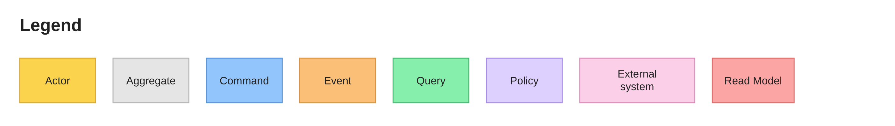
<figcaption style="font-size:0.9em;color:#555;margin-top:0.4em"><em>Legend — notación de colores empleada en el Event Storming.</em></figcaption>
</figure>

**Step 1 — Unstructured Exploration.** Lluvia de eventos de dominio sin orden ni agrupación, identificando el vocabulario inicial del negocio (sensores, alertas, reportes, recetas, suscripción).

<figure id="fig-step1" style="margin:1.5em 0;text-align:center">
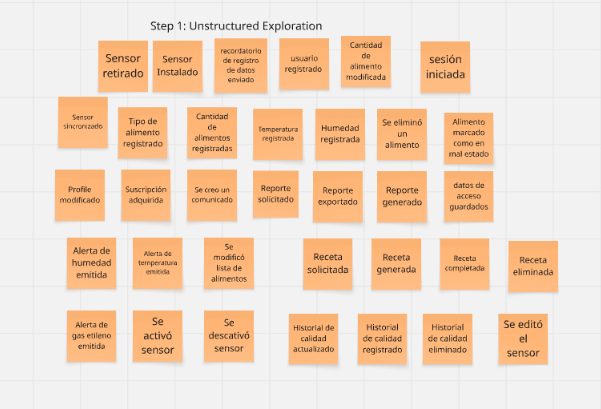
<figcaption style="font-size:0.9em;color:#555;margin-top:0.4em"><em>Step 1: Unstructured Exploration — lluvia inicial de eventos de dominio.</em></figcaption>
</figure>

**Step 2 — Timelines.** Los eventos se ordenan cronológicamente según el ciclo de vida del usuario y del dispositivo, desde el registro hasta la generación de reportes y recetas.

<figure id="fig-step2" style="margin:1.5em 0;text-align:center">

<figcaption style="font-size:0.9em;color:#555;margin-top:0.4em"><em>Step 2: Timelines — eventos ordenados cronológicamente.</em></figcaption>
</figure>

**Steps 3–5 (Actors, Commands, Aggregates preliminares)** se trabajaron de forma iterativa junto con el resto de pasos; su resultado consolidado se refleja directamente en los Steps 6 a 10 que se muestran a continuación.

**Step 6 — Policies.** Se identificaron las políticas ("cuando ocurre X, automáticamente se hace Y") que conectan eventos con nuevos comandos sin intervención directa del usuario — por ejemplo, *"si los valores del sensor superan los umbrales configurados, se emite una alerta"*.

<figure id="fig-step6" style="margin:1.5em 0;text-align:center">

<figcaption style="font-size:0.9em;color:#555;margin-top:0.4em"><em>Step 6: Policies del dominio FreshSense.</em></figcaption>
</figure>

**Step 7 — Read Models.** Se definieron las vistas de solo lectura que necesita cada actor: la lista de alimentos, el historial de calidad, el inventario y los reportes.

<figure id="fig-step7" style="margin:1.5em 0;text-align:center">

<figcaption style="font-size:0.9em;color:#555;margin-top:0.4em"><em>Step 7: Read Models identificados.</em></figcaption>
</figure>

**Step 8 — External Systems.** Se ubicó al dispositivo FreshSense (sensor físico) y a los servicios de notificación como sistemas externos que interactúan con el dominio mediante comandos y eventos.

<figure id="fig-step8" style="margin:1.5em 0;text-align:center">

<figcaption style="font-size:0.9em;color:#555;margin-top:0.4em"><em>Step 8: External Systems del dominio.</em></figcaption>
</figure>

**Step 9 — Aggregates.** Los comandos y eventos se agruparon alrededor de siete agregados candidatos: `User`, `Profile`, `Subscription`, `Sensor`, `Inventory/Organization`, `Food List/Consumption`, `Monitoring` y `Reports`.

<figure id="fig-step9" style="margin:1.5em 0;text-align:center">

<figcaption style="font-size:0.9em;color:#555;margin-top:0.4em"><em>Step 9: Aggregates — agrupación de comandos y eventos.</em></figcaption>
</figure>

**Step 10 — Bounded Context.** Finalmente, los agregados se agruparon en ocho *bounded contexts*, trazando las primeras fronteras del dominio que se detallan en la sección 4.1.1.1.

<figure id="fig-step10" style="margin:1.5em 0;text-align:center">

<figcaption style="font-size:0.9em;color:#555;margin-top:0.4em"><em>Step 10: Bounded Context — fronteras candidatas del dominio.</em></figcaption>
</figure>

#### 4.1.1.1 Candidate Context Discovery

Identificar contextos candidatos es un paso clave para gestionar la complejidad del sistema. A partir de los agregados del Step 9 y las fronteras trazadas en el Step 10, se agruparon los conceptos del dominio FreshSense en **ocho bounded contexts** lógicos y coherentes, cada uno con una responsabilidad de negocio propia:

| Bounded Context candidato | Responsabilidad principal |
|---|---|
| User Management | Registro, autenticación y recuperación de cuentas. |
| Profile Management | Datos personales, segmento de usuario y preferencias de notificación. |
| Subscription Management | Plan contratado (FREE/PREMIUM) y límites asociados. |
| Sensor Management | Instalación, sincronización y configuración del dispositivo FreshSense. |
| Inventory Management | Organización del inventario, colaboradores, zonas y recetas. |
| Consumption Management | Lista de alimentos, vencimientos y registro de consumo. |
| IoT Monitoring | Lecturas del sensor, umbrales, alertas y calidad del alimento. |
| Report Management | Reportes de inventario, calidad y consumo con métricas de sostenibilidad. |

Esta separación facilita el diseño e implementación del sistema y potencia su escalabilidad, desempeño y mantenibilidad — por ejemplo, permite que el equipo evolucione el algoritmo de alertas de **IoT Monitoring** sin afectar la lógica de **Subscription Management**, o que se sustituya el proveedor de notificaciones sin tocar el dominio de inventario.

#### 4.1.1.2 Domain Message Flows Modeling

Para analizar y diseñar sistemas de software, se usa el Modelado de Flujos de Mensajes de Dominio, un método que ilustra la transferencia de información entre componentes mediante mensajes. Este proceso se centra en especificar los mensajes enviados y recibidos por los diferentes actores del sistema y en descifrar sus relaciones. El uso de esta metodología aporta claridad para entender y representar las vías de información del sistema, permitiendo detectar problemas potenciales más fácilmente y optimizar la estructura del diseño. A modo de ejemplo, se muestran a continuación algunos diagramas aplicados a nuestro sistema.

<figure id="fig-notation" style="margin:1.5em 0;text-align:center">
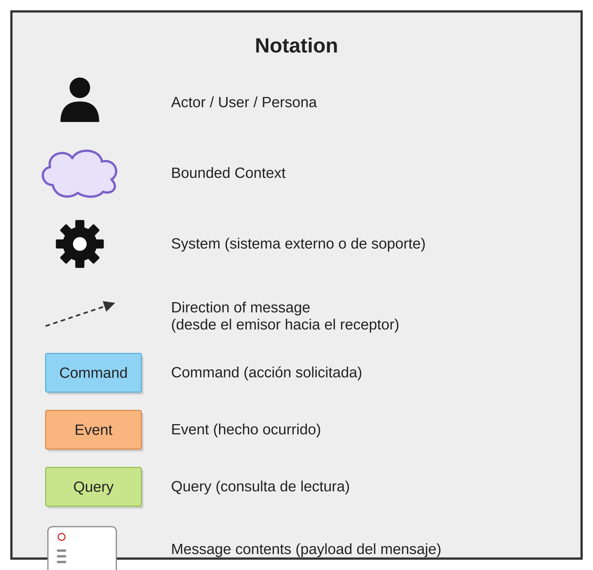
<figcaption style="font-size:0.9em;color:#555;margin-top:0.4em"><em>Notación utilizada en los Domain Message Flows.</em></figcaption>
</figure>

**Escenario 1 — Registro de usuario y asignación del plan gratuito.** El adulto joven se registra en la app; **User Management** valida y crea la cuenta, publica `UserRegistered`, y **Subscription Management** reacciona asignando automáticamente el plan FREE, que a su vez habilita el perfil.

<figure id="fig-dmfm1" style="margin:1.5em 0;text-align:center">
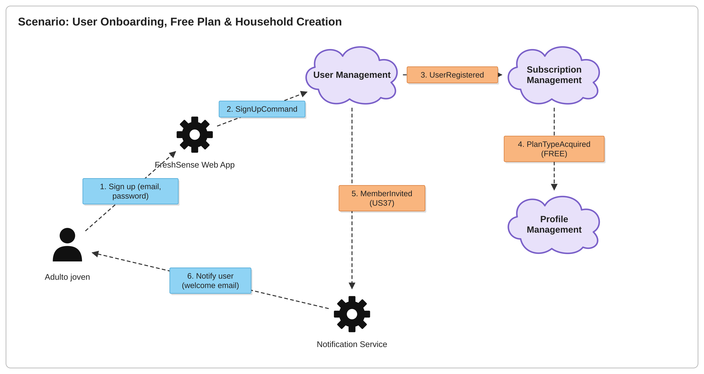
<figcaption style="font-size:0.9em;color:#555;margin-top:0.4em"><em>Escenario: User Onboarding & Free Plan Assignment.</em></figcaption>
</figure>

**Escenario 2 — Lectura del sensor y alerta de etileno.** El dispositivo físico envía una lectura; **IoT Monitoring** la traduce, evalúa los umbrales configurados, actualiza la condición del alimento en **Consumption Management** y notifica al usuario cuando el nivel de gas etileno es crítico.

<figure id="fig-dmfm2" style="margin:1.5em 0;text-align:center">
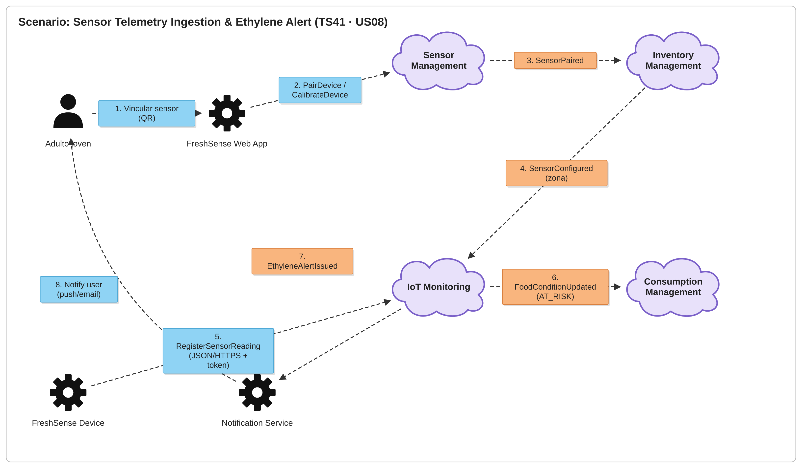
<figcaption style="font-size:0.9em;color:#555;margin-top:0.4em"><em>Escenario: Sensor Reading & Ethylene Alert.</em></figcaption>
</figure>

**Escenario 3 — Generación de un reporte de inventario.** El emprendedor solicita un reporte general; **Report Management** verifica el acceso premium y consulta a los contextos de Inventory, Consumption y Monitoring antes de generar y entregar el reporte.

<figure id="fig-dmfm3" style="margin:1.5em 0;text-align:center">
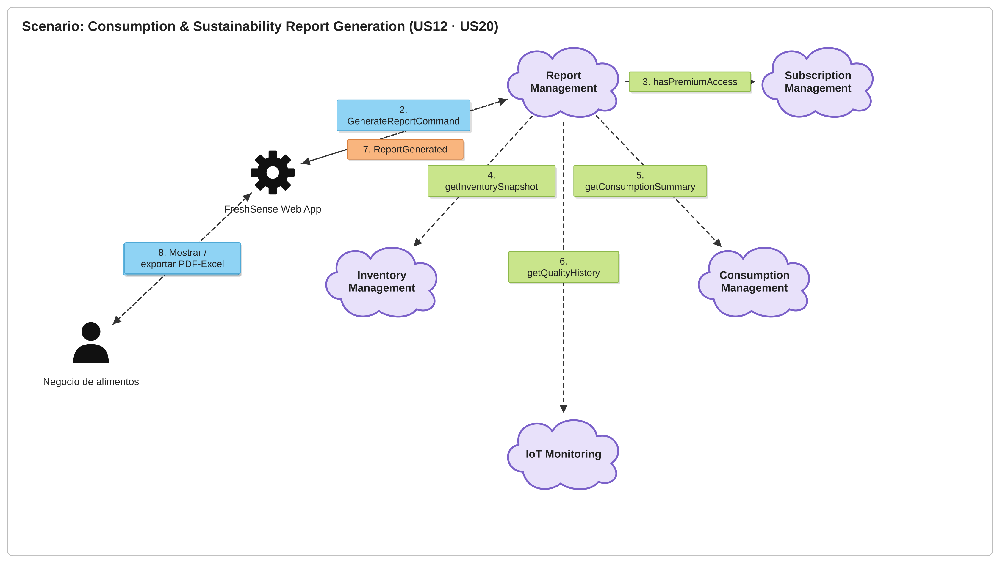
<figcaption style="font-size:0.9em;color:#555;margin-top:0.4em"><em>Escenario: Inventory Report Generation.</em></figcaption>
</figure>

#### 4.1.1.3 Bounded Context Canvases

Cada bounded context candidato se documentó con un *Bounded Context Canvas*, que resume su propósito, su clasificación estratégica, sus roles de dominio, su lenguaje ubicuo, sus decisiones de negocio y sus comunicaciones entrantes y salientes.

**User Management**

<figure id="fig-canvas-iam" style="margin:1.5em 0;text-align:center">
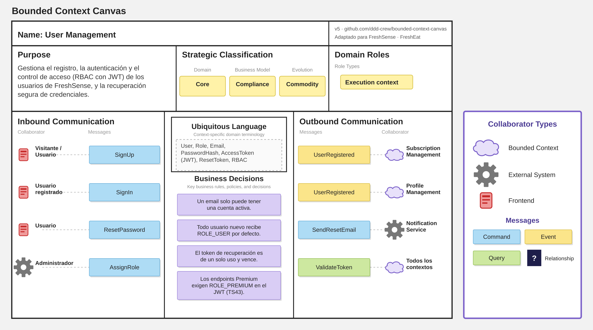
<figcaption style="font-size:0.9em;color:#555;margin-top:0.4em"><em>Bounded Context Canvas — User Management.</em></figcaption>
</figure>

**Subscription Management**

<figure id="fig-canvas-sub" style="margin:1.5em 0;text-align:center">
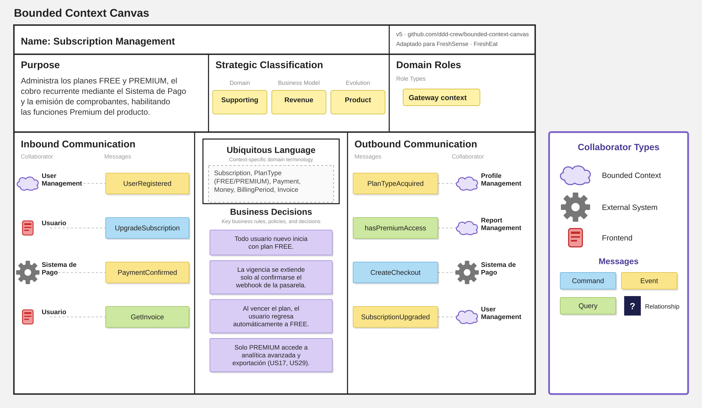
<figcaption style="font-size:0.9em;color:#555;margin-top:0.4em"><em>Bounded Context Canvas — Subscription Management.</em></figcaption>
</figure>

**Profile Management**

<figure id="fig-canvas-pro" style="margin:1.5em 0;text-align:center">
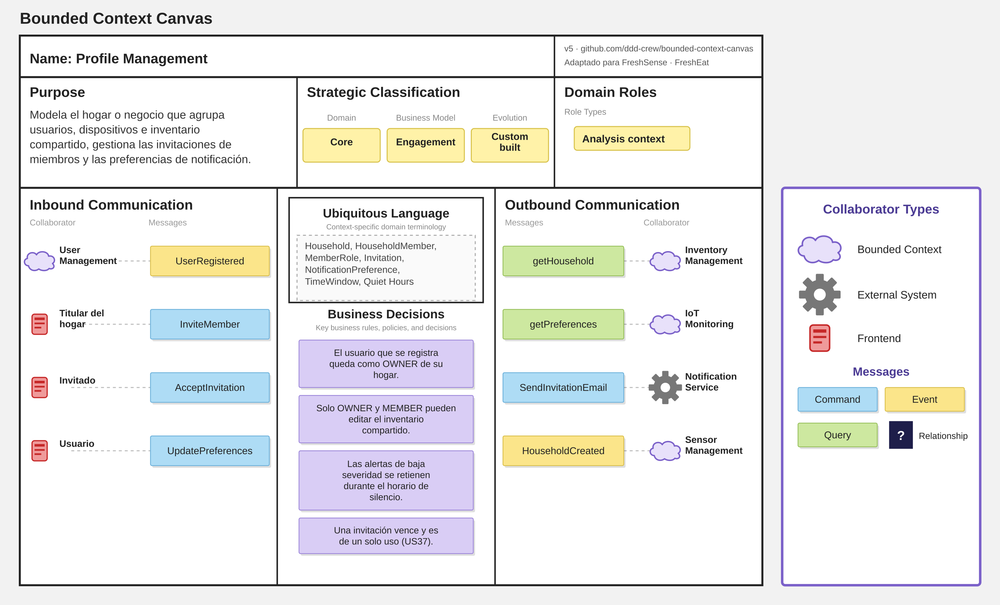
<figcaption style="font-size:0.9em;color:#555;margin-top:0.4em"><em>Bounded Context Canvas — Profile Management.</em></figcaption>
</figure>

**Sensor Management**

<figure id="fig-canvas-sen" style="margin:1.5em 0;text-align:center">
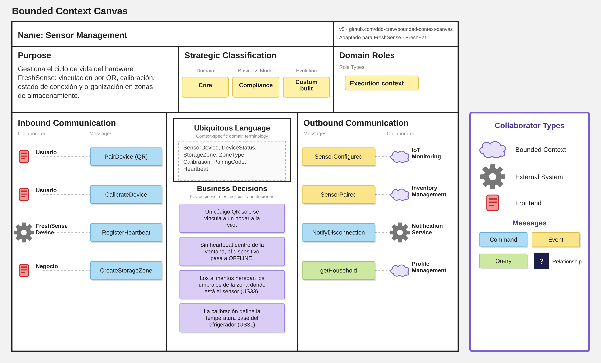
<figcaption style="font-size:0.9em;color:#555;margin-top:0.4em"><em>Bounded Context Canvas — Sensor Management.</em></figcaption>
</figure>

**Inventory Management**

<figure id="fig-canvas-inv" style="margin:1.5em 0;text-align:center">
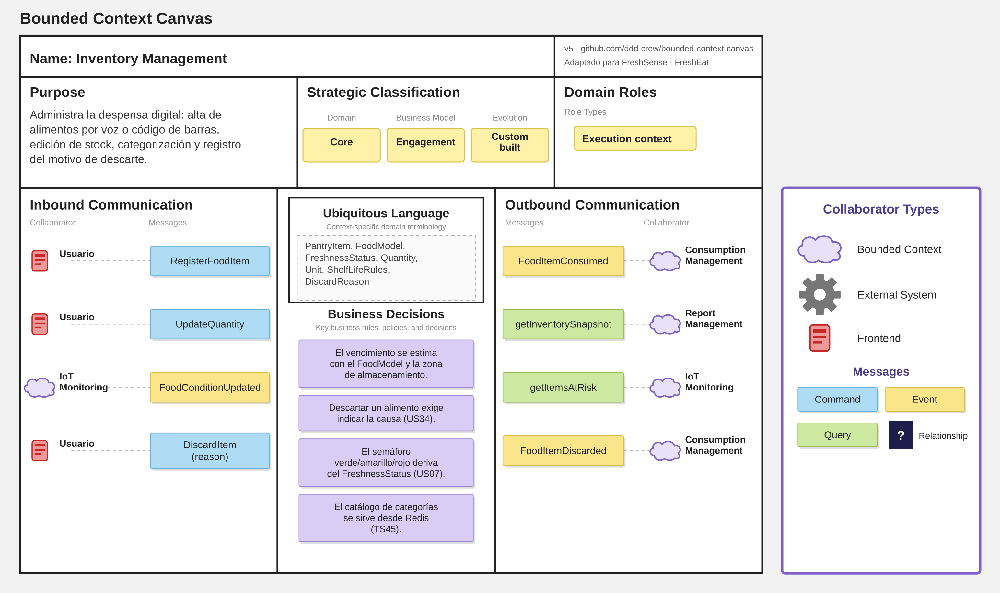
<figcaption style="font-size:0.9em;color:#555;margin-top:0.4em"><em>Bounded Context Canvas — Inventory Management.</em></figcaption>
</figure>

**Consumption Management**

<figure id="fig-canvas-con" style="margin:1.5em 0;text-align:center">
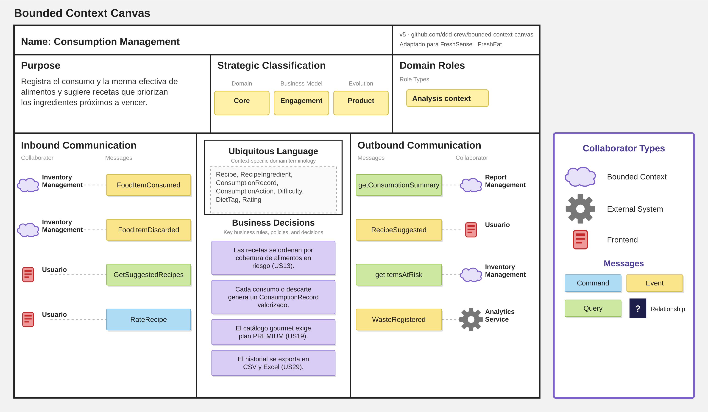
<figcaption style="font-size:0.9em;color:#555;margin-top:0.4em"><em>Bounded Context Canvas — Consumption Management.</em></figcaption>
</figure>

**IoT Monitoring**

<figure id="fig-canvas-mon" style="margin:1.5em 0;text-align:center">
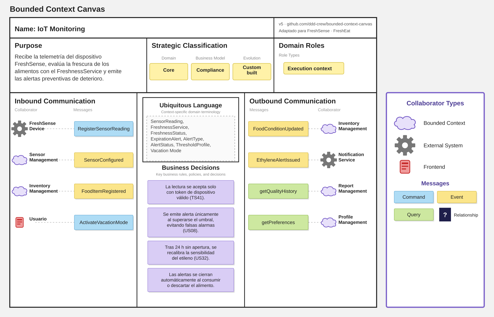
<figcaption style="font-size:0.9em;color:#555;margin-top:0.4em"><em>Bounded Context Canvas — IoT Monitoring.</em></figcaption>
</figure>

**Report Management**

<figure id="fig-canvas-rep" style="margin:1.5em 0;text-align:center">
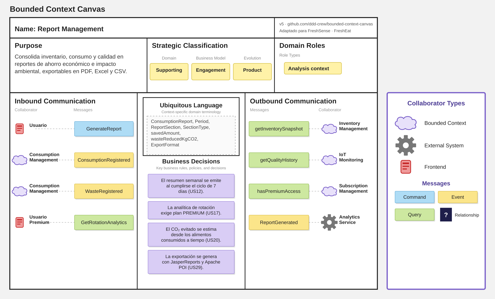
<figcaption style="font-size:0.9em;color:#555;margin-top:0.4em"><em>Bounded Context Canvas — Report Management.</em></figcaption>
</figure>

### 4.1.2. Context Mapping

En esta sección desarrollamos un conjunto de *context maps* para visualizar las relaciones entre los *bounded contexts* del sistema. A partir de la información recolectada en el Event Storming, exploramos distintas alternativas de diseño, cuestionando cómo cambiaría la estructura si reubicamos, dividimos o agrupamos *capabilities*. Finalmente, evaluamos cada propuesta considerando patrones como *Anti-corruption Layer*, *Conformist*, *Customer/Supplier* y *Shared Kernel*, con el fin de definir la mejor aproximación para la arquitectura del dominio. A continuación presentaremos las opciones que contemplamos para FreshSense y la estructura final.

**Opción 1**

En esta estructura mantenemos los cinco bounded contexts del núcleo operativo separados, con relaciones claramente definidas. Las ventajas de este tipo de contexto son, por un lado, la clara separación de responsabilidades y, por otro, que cada contexto se enfoca en una funcionalidad específica. Una de las principales desventajas es que hay una mayor complejidad en la sincronización entre contextos, especialmente entre Sensor Management e IoT Monitoring, que comparten el mismo origen de datos.

<figure id="fig-cmo1" style="margin:1.5em 0;text-align:center">

<figcaption style="font-size:0.9em;color:#555;margin-top:0.4em"><em>Opción 1 — cinco bounded contexts separados.</em></figcaption>
</figure>

**Opción 2**

Esta alternativa propone unir los contextos de Sensor Management e IoT Monitoring en un solo bounded context. Al hacerlo, se elimina la necesidad de sincronización externa entre ambos, manteniendo relaciones similares con los demás contextos del sistema.

Esta combinación presenta ventajas como la simplificación de la arquitectura al disminuir la cantidad de bounded contexts y una comunicación más directa entre la lectura del sensor y la interpretación de su estado. No obstante, tiene desventajas en la combinación de responsabilidades distintas, ya que una parte se enfoca en la infraestructura de sensores y la otra en la interpretación de datos y generación de alertas. Esto podría dificultar que el usuario realice la instalación del sistema sin ayuda técnica, y además genera el riesgo de que un solo contexto asuma demasiadas funciones.

<figure id="fig-cmo2" style="margin:1.5em 0;text-align:center">

<figcaption style="font-size:0.9em;color:#555;margin-top:0.4em"><em>Opción 2 — Sensor Management e IoT Monitoring fusionados.</em></figcaption>
</figure>

**Opción 3**

Esta alternativa propone una arquitectura compuesta por cinco bounded contexts bien definidos, con relaciones claras entre ellos. La estructura busca equilibrar la separación de responsabilidades, para permitir que el sistema escale y se mantenga con facilidad. Además, facilita la instalación sin asistencia técnica y asegura tiempos de respuesta adecuados, lo que contribuye directamente a mejorar la experiencia del cliente en el uso del sistema FreshSense.

- Sensor Management se comunica con Inventory Management y Report Management, proporcionando la información de los sensores instalados y su configuración. En ambos casos, la relación es del tipo Customer/Supplier, donde Sensor Management es el proveedor.
- Inventory Management y Consumption Management comparten el modelo de "alimento" y su estado de frescura. Por eso, tienen una relación de tipo Shared Kernel, lo que asegura que ambos usen los mismos conceptos para evitar errores o confusión.
- Consumption Management también se relaciona con Report Management, pero en este caso la relación es Conformist. Report utiliza información de consumo, pero se adapta a su estructura sin modificarla.
- IoT Monitoring se conecta con Inventory Management mediante una Anti-corruption Layer. Esta capa traduce los datos que vienen de los sensores (temperatura, humedad y etileno) a un formato que Inventory Management pueda entender. Así, se protege el sistema de los detalles técnicos del IoT y se facilita la instalación del sistema sin ayuda especializada.

<figure id="fig-cmo3" style="margin:1.5em 0;text-align:center">
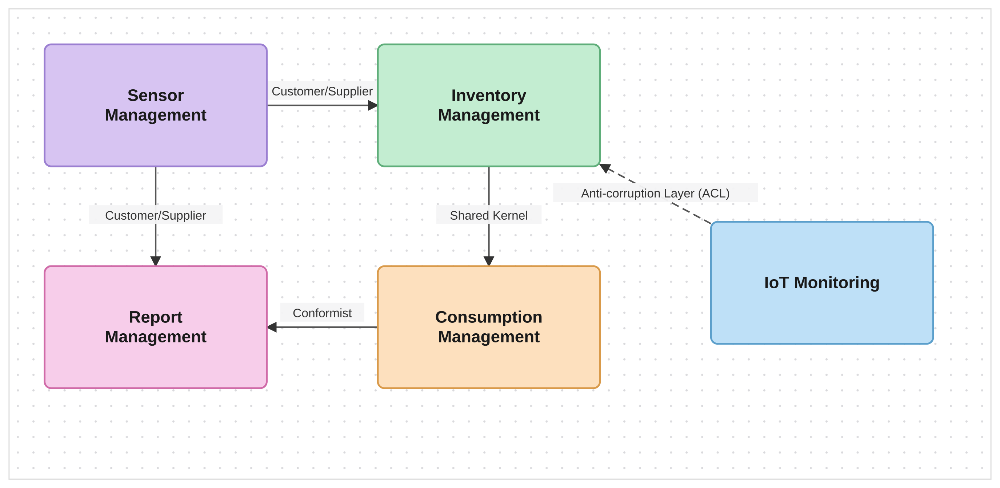
<figcaption style="font-size:0.9em;color:#555;margin-top:0.4em"><em>Opción 3 (elegida) — cinco bounded contexts con Anti-corruption Layer.</em></figcaption>
</figure>

**Elección**

Elegimos la **opción 3**, ya que proporciona el mejor equilibrio entre la separación de responsabilidades, la facilidad de implementación y el cumplimiento de los requisitos del sistema.

Al definir cinco bounded contexts con relaciones claras, se facilita la evolución independiente de cada parte del sistema, lo que mejora su escalabilidad y mantenibilidad. Además, al separar la gestión del hardware (Sensor Management) de la interpretación de las lecturas (IoT Monitoring) mediante una Anti-corruption Layer, se simplifica la instalación y el reemplazo del dispositivo. Asimismo, esta estructura garantiza tiempos de respuesta rápidos ante alertas de frescura y optimiza la gestión de inventario, consumo y reportes, brindando una experiencia más fluida y eficiente para los usuarios.

Finalmente, el siguiente *context map* consolidado muestra la totalidad de los ocho bounded contexts de FreshSense — incluyendo los contextos de cuenta (User, Subscription y Profile Management) — con las relaciones resultantes de la opción elegida.

<figure id="fig-cmap" style="margin:1.5em 0;text-align:center">
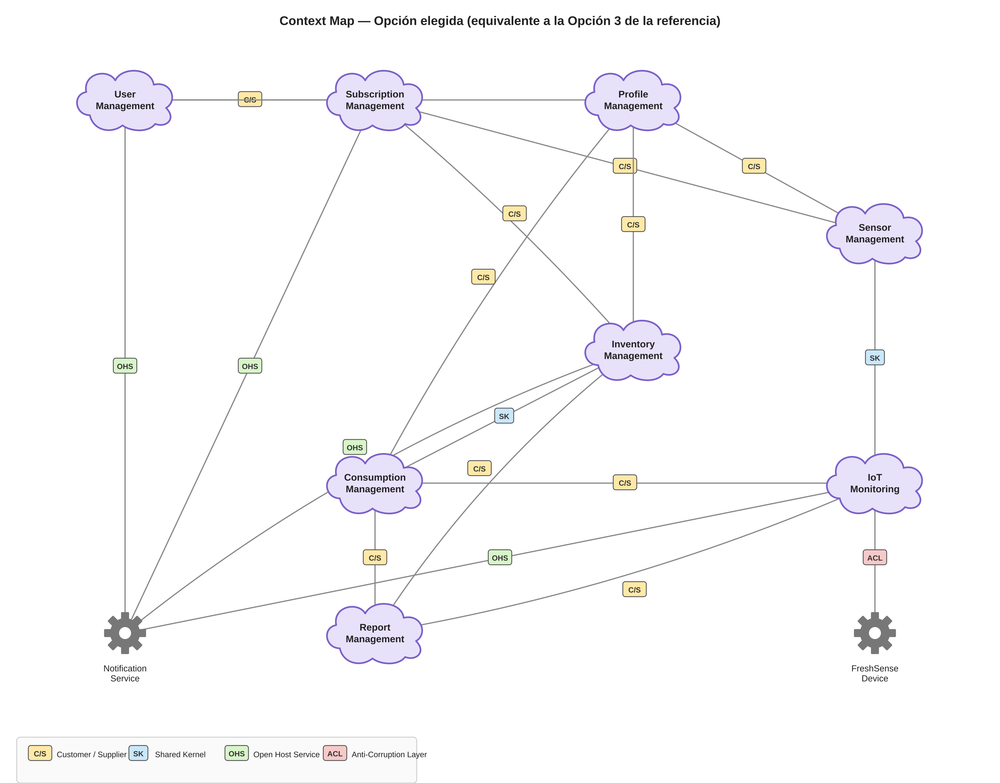
<figcaption style="font-size:0.9em;color:#555;margin-top:0.4em"><em>Context Map consolidado — los ocho bounded contexts de FreshSense.</em></figcaption>
</figure>

### 4.1.3. Software Architecture

Se utiliza el **C4 Model** para representar la arquitectura de software de FreshSense en tres niveles de abstracción: contexto, contenedores y despliegue físico.

#### 4.1.3.1. Software Architecture Context Level Diagrams

Este diagrama muestra al sistema FreshSense (representado como una única entidad) interactuando con sus tres tipos de usuario y con el **Dispositivo FreshSense**, el hardware con sensores de temperatura, humedad y gas etileno que se instala en el refrigerador o cámara fría y envía su telemetría al endpoint REST seguro definido en la **TS41**. El sistema se comunica además con el Notification Service para las alertas.

<figure id="fig-c4c" style="margin:1.5em 0;text-align:center">
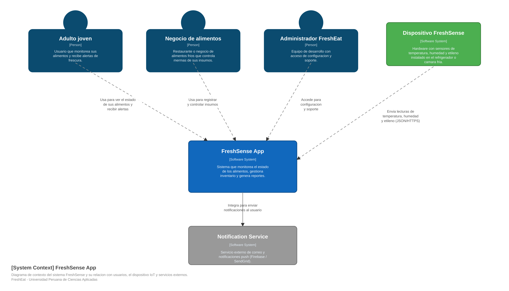
<figcaption style="font-size:0.9em;color:#555;margin-top:0.4em"><em>Software Architecture Context Level Diagram.</em></figcaption>
</figure>

#### 4.1.3.2. Software Architecture Container Level Diagrams

Este diagrama muestra que el sistema FreshSense está compuesto por una **Landing Page** (HTML, CSS, JS), una **Single Page Application** desarrollada en **Angular 19** con NGX-Translate y Angular Material, y una **API REST en Spring Boot + Java 24** que organiza los ocho bounded contexts. La API persiste en **MySQL** y documenta sus endpoints con **Swagger/OpenAPI**; estos cinco elementos son los únicos containers dentro del límite del sistema, ya que representan unidades de software desplegables. Conforme al modelo C4 y a la norma ISO/IEC/IEEE 42010 sobre vistas y puntos de vista arquitectónicos, el **hardware no se modela como container**: el **Dispositivo FreshSense** se representa como sistema externo que envía su telemetría a la API mediante JSON sobre HTTPS con token de dispositivo (**TS41**). Del mismo modo, la API **consume** tres sistemas de terceros externos al límite: el **Sistema de Pago**, para crear el cobro de las suscripciones Premium y recibir su confirmación de forma asíncrona (**TS44**); el **Analytics Service**, al que publica métricas para generar reportes; y el **Notification Service** (Firebase/SendGrid), al que invoca para despachar las alertas por correo y push (**TS42**).

<figure id="fig-c4co" style="margin:1.5em 0;text-align:center">

<figcaption style="font-size:0.9em;color:#555;margin-top:0.4em"><em>Software Architecture Container Level Diagram.</em></figcaption>
</figure>

#### 4.1.3.3. Software Architecture Deployment Diagrams

Este diagrama muestra que el sistema FreshSense se despliega en tres entornos principales: los **dispositivos cliente** (navegador web y móvil), el **refrigerador o cámara fría del usuario**, donde el dispositivo FreshSense mide temperatura, humedad y gas etileno y transmite por la red Wi-Fi local, y la **nube**, que aloja el frontend estático, el contenedor de la API (Spring Boot + Java 24), la base de datos MySQL administrada, la caché Redis exigida por la **TS45** y la documentación Swagger/OpenAPI. Todas las comunicaciones utilizan HTTPS, y la ingesta de telemetría se autentica con token de dispositivo (**TS41**).

<figure id="fig-c4d" style="margin:1.5em 0;text-align:center">

<figcaption style="font-size:0.9em;color:#555;margin-top:0.4em"><em>Software Architecture Deployment Diagram.</em></figcaption>
</figure>

---

## 4.2. Tactical-Level Domain-Driven Design

Esta sección detalla el diseño táctico de cada uno de los ocho bounded contexts de FreshSense, siguiendo la arquitectura en capas (Domain, Interface, Application, Infrastructure) y el patrón CQS (Command/Query Separation) usado de forma consistente en todo el backend.

### 4.2.1 Bounded Context: User Management

El **User Management (IAM — Identity and Access Management) Bounded Context** es responsable de gestionar la autenticación y la creación de usuarios en el sistema. Este contexto asegura que los usuarios puedan registrarse, iniciar sesión y gestionar sus credenciales de manera segura, cumpliendo con los estándares de seguridad y privacidad. Implementa el control de acceso basado en roles (RBAC) con tokens JWT exigido por la **TS43**, y el flujo de recuperación de contraseña de la **US35**.

#### 4.2.1.1. Domain Layer

La Domain Layer del User Management Bounded Context encapsula la lógica de negocio del contexto. En esta capa se definen los agregados, entidades, objetos de valor, servicios de dominio y políticas que representan los conceptos clave del sistema.

**Aggregates**

1. **User**
   - *Propósito:* Agregado raíz que representa a una persona con cuenta en FreshSense. Encapsula credenciales, datos de identidad y roles de acceso.

   - *Atributos:*
| Atributo | Tipo | Descripción |
|---|---|---|
| id | UUID | Identificador único del usuario. |
| email | Email (VO) | Correo electrónico único, usado como nombre de usuario. |
| fullName | String | Nombre completo del usuario. |
| passwordHash | PasswordHash (VO) | Contraseña almacenada con hash BCrypt (nunca en texto plano). |
| roles | Set&lt;Role&gt; | Roles asignados (ROLE_USER, ROLE_PREMIUM, ROLE_ADMIN). |
| createdAt / updatedAt | DateTime | Campos de auditoría. |
   - *Métodos:*
| Método | Descripción |
|---|---|
| User(SignUpCommand, Set&lt;Role&gt;) | Crea un usuario validando unicidad del email y la política de contraseña. |
| addRole(Role) / addRoles(List&lt;Role&gt;) | Asigna uno o varios roles válidos al usuario (US36). |
| requestPasswordReset() | Genera un `ResetToken` temporal y único para la recuperación (US35). |
| resetPassword(token, newHash) | Valida el token vigente, reemplaza el hash y lo invalida (uso único). |
| registerSignIn() | Registra el último acceso y habilita la emisión del JWT. |
**Entities**

1. **Role** — Rol que puede asignarse a un usuario para el control de acceso RBAC (TS43, US36).

| Atributo | Tipo | Descripción |
|---|---|---|
| id | UUID | Identificador del rol. |
| name | Roles (enum) | ROLE_USER, ROLE_PREMIUM o ROLE_ADMIN. |
| Método | Descripción |
|---|---|
| getDefaultRole() | Devuelve ROLE_USER. |
| toRoleFromName(String) | Convierte un nombre en instancia de Role. |
| validateRoleSet(List&lt;Role&gt;) | Asigna el rol por defecto si el conjunto es nulo o vacío. |
2. **ResetToken** — Token de un solo uso para restablecer la contraseña (US35).

| Atributo | Tipo | Descripción |
|---|---|---|
| id | UUID | Identificador. |
| tokenHash | String | Hash del token enviado por correo. |
| expiresAt | DateTime | Vencimiento del enlace de recuperación. |
| used | boolean | Indica si ya fue consumido. |
| Método | Descripción |
|---|---|
| isExpired() | Evalúa si el token venció. |
| markUsed() | Invalida el token. |
**Value Objects**

| Value Object | Descripción |
|---|---|
| Email | Encapsula y valida el formato del correo electrónico. |
| PasswordHash | Encapsula el hash BCrypt; impide exponer la contraseña en texto plano. |
| Roles | Enumeración inmutable: `ROLE_USER`, `ROLE_PREMIUM`, `ROLE_ADMIN`. |
| AccessToken | Token JWT emitido tras la autenticación, con los claims de rol (TS43). |

**Domain Services**

| Servicio | Descripción |
|---|---|
| PasswordPolicyService | Valida longitud mínima, mayúscula, minúscula y número antes de aceptar una contraseña. |
| TokenService | Genera y valida los tokens JWT que protegen los endpoints, incluidos los Premium (TS43). |

**Domain Events**

| Evento | Descripción |
|---|---|
| UserRegistered | Se creó la cuenta (ES: *cuenta registrada*). Dispara la creación del plan FREE y del perfil. |
| SessionStarted | El usuario se autenticó correctamente (ES: *sesión iniciada*). |
| PasswordResetRequested | Se solicitó el enlace de recuperación (US35). |
| PasswordReset | Se restableció la contraseña. |
| UserRoleChanged | Un administrador modificó el rol o plan del usuario (US36). |

**Policies**

- **Validar si existe el usuario**: no se permite registrar dos cuentas con el mismo email.
- **Asignar rol por defecto**: cuando se registra un usuario sin roles, el sistema le asigna automáticamente `ROLE_USER`.
- **Bloquear endpoints Premium**: cuando un JWT sin `ROLE_PREMIUM` invoca un endpoint exclusivo, el middleware responde `403 Forbidden` (TS43).

#### 4.2.1.2. Interface Layer

La Interface Layer del User Management expone los puntos de entrada del contexto mediante controladores REST, recursos y *assemblers* que traducen entre el modelo HTTP y el modelo de dominio.

**Controllers**

1. **AuthenticationController** — Registro, inicio de sesión y recuperación de credenciales.

| Método | Endpoint | Descripción |
|---|---|---|
| POST | /api/v1/authentication/sign-up | Registra un nuevo usuario en el sistema. |
| POST | /api/v1/authentication/sign-in | Autentica al usuario y genera un token de acceso. |
| POST | /api/v1/authentication/forgot-password | Envía el enlace de restablecimiento (US35). |
| POST | /api/v1/authentication/reset-password | Restablece la contraseña con el token recibido. |
   - *Dependencias:* UserCommandService

2. **UsersController** — Gestiona las operaciones relacionadas con los usuarios.

| Método | Endpoint | Descripción |
|---|---|---|
| GET | /api/v1/users | Obtiene la lista de todos los usuarios (solo ROLE_ADMIN). |
| GET | /api/v1/users/{userId} | Obtiene los detalles de un usuario específico por su ID. |
| PATCH | /api/v1/users/{userId}/roles | Modifica los roles del usuario (US36). |
   - *Dependencias:* UserQueryService, UserCommandService

3. **RolesController** — Gestiona las consultas relacionadas con los roles.

| Método | Endpoint | Descripción |
|---|---|---|
| GET | /api/v1/roles | Obtiene la lista de todos los roles disponibles. |
   - *Dependencias:* RoleQueryService

**Resources**

| Resource | Campos |
|---|---|
| UserResource | id, email, fullName, roles |
| AuthenticatedUserResource | id, email, token (JWT) |
| SignUpResource | email, fullName, password, roles |
| SignInResource | email, password |
| ResetPasswordResource | token, newPassword |
| RoleResource | id, name |

**Transformers / Assemblers**

| Assembler | Transformación |
|---|---|
| UserResourceFromEntityAssembler | Convierte una entidad `User` en un recurso `UserResource`. |
| AuthenticatedUserResourceFromEntityAssembler | Convierte un `User` y su token en `AuthenticatedUserResource`. |
| SignUpCommandFromResourceAssembler | Convierte `SignUpResource` en el comando `SignUpCommand`. |
| SignInCommandFromResourceAssembler | Convierte `SignInResource` en el comando `SignInCommand`. |
| RoleResourceFromEntityAssembler | Convierte una entidad `Role` en un recurso `RoleResource`. |

#### 4.2.1.3 Application Layer

La Application Layer del User Management coordina las operaciones entre la Interface Layer y la Domain Layer, orquestando comandos, consultas y la reacción a eventos de otros contextos.

**Command Services**

| Servicio | Comandos que maneja | Descripción |
|---|---|---|
| UserCommandServiceImpl | SignUpCommand, SignInCommand, RequestPasswordResetCommand, ResetPasswordCommand | Registra usuarios, autentica credenciales, emite el JWT y gestiona la recuperación de contraseña. |
| RoleCommandServiceImpl | SeedRolesCommand, AssignRoleCommand | Crea los roles predefinidos al iniciar el sistema y asigna roles a los usuarios (US36). |

**Query Services / Facades**

| Servicio | Consultas | Descripción |
|---|---|---|
| UserQueryServiceImpl | GetAllUsersQuery, GetUserByIdQuery, GetUserByEmailQuery | Recupera usuarios registrados sin modificar el estado del sistema. |
| RoleQueryServiceImpl | GetAllRolesQuery, GetRoleByNameQuery | Recupera los roles disponibles. |
| IamContextFacade | existsUserById, getRolesOf | Open Host Service que exponen los demás bounded contexts para validar identidad. |

**Event Handlers**

| Handler | Evento que escucha | Reacción |
|---|---|---|
| ApplicationReadyEventHandler | ApplicationReadyEvent (Spring Boot) | Ejecuta `SeedRolesCommand` para crear ROLE_USER, ROLE_PREMIUM y ROLE_ADMIN si no existen. |
| SubscriptionChangedEventHandler | PlanTypeAcquired (Subscription Management) | Sincroniza el rol `ROLE_PREMIUM` del usuario cuando su plan cambia. |

#### 4.2.1.4. Infrastructure Layer

La Infrastructure Layer del User Management implementa la persistencia y las integraciones técnicas (ACL) hacia otros contextos y sistemas externos.

| Componente | Tipo | Responsabilidad |
|---|---|---|
| UserRepository | JPA Repository | Persistencia de usuarios; `findByEmail`, `existsByEmail`. |
| RoleRepository | JPA Repository | Persistencia de roles; `findByName`, `existsByName`. |
| ResetTokenRepository | JPA Repository | Persistencia de los tokens de recuperación (US35). |
| BCryptHashingService | Servicio técnico | Codifica y verifica contraseñas con BCrypt. |
| JwtTokenService | Servicio técnico | Genera y valida los tokens JWT con los claims de rol (TS43). |
| NotificationGatewayAdapter | ACL saliente | Solicita al Notification Service el envío del correo de recuperación (TS42). |

#### 4.2.1.5. Bounded Context Software Architecture Component Level Diagrams

<figure id="fig-comp-iam" style="margin:1.5em 0;text-align:center">

<figcaption style="font-size:0.9em;color:#555;margin-top:0.4em"><em>Component Level Diagram — User Management.</em></figcaption>
</figure>

#### 4.2.1.6. Bounded Context Software Architecture Code Level Diagrams

##### 4.2.1.6.1. Bounded Context Domain Layer Class Diagrams

<figure id="fig-class-iam" style="margin:1.5em 0;text-align:center">
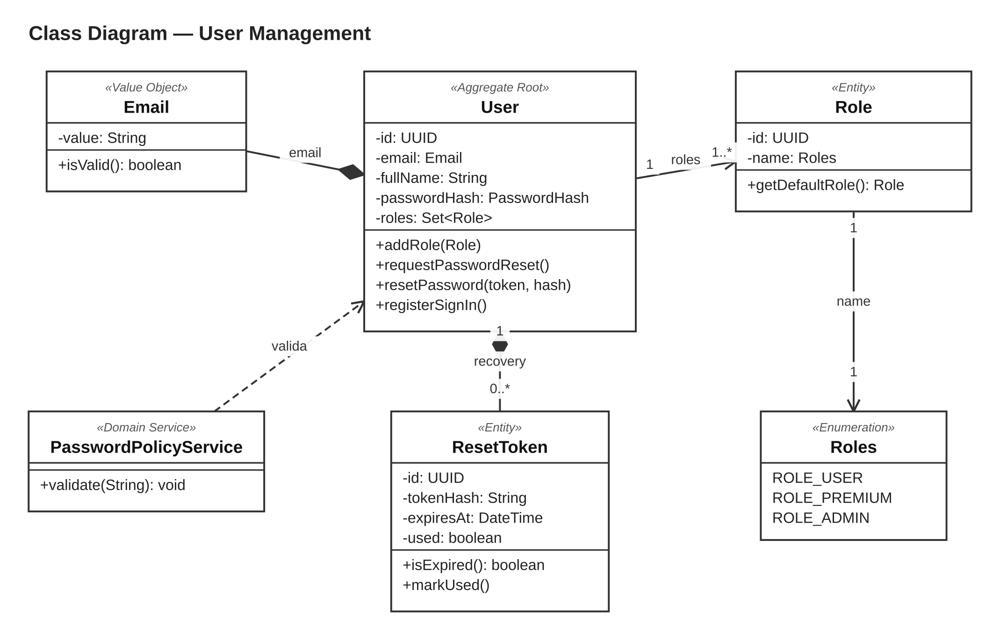
<figcaption style="font-size:0.9em;color:#555;margin-top:0.4em"><em>Class Diagram (Domain Layer) — User Management.</em></figcaption>
</figure>

##### 4.2.1.6.2. Bounded Context Database Design Diagram

<figure id="fig-er-iam" style="margin:1.5em 0;text-align:center">
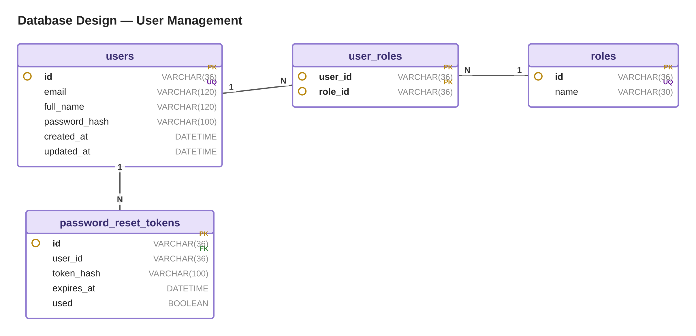
<figcaption style="font-size:0.9em;color:#555;margin-top:0.4em"><em>Database Design Diagram — User Management.</em></figcaption>
</figure>

### 4.2.2 Bounded Context: Subscription Management

El **Subscription Management Bounded Context** administra el ciclo de vida de los planes de FreshSense (FREE y PREMIUM), el cobro recurrente a través de la pasarela de pagos y la emisión de comprobantes. Implementa la integración con el **Sistema de Pago** exigida por la **TS44** y la descarga de facturas de la **US38**. Es el contexto que habilita las funcionalidades Premium (US17-US19).

#### 4.2.2.1. Domain Layer

La Domain Layer del Subscription Management Bounded Context encapsula la lógica de negocio del contexto. En esta capa se definen los agregados, entidades, objetos de valor, servicios de dominio y políticas que representan los conceptos clave del sistema.

**Aggregates**

1. **Subscription**
   - *Propósito:* Agregado raíz que representa el plan contratado por un usuario y su vigencia.

   - *Atributos:*
| Atributo | Tipo | Descripción |
|---|---|---|
| id | UUID | Identificador de la suscripción. |
| userId | UUID | Usuario propietario del plan. |
| plan | PlanType (VO) | FREE o PREMIUM. |
| startedAt | DateTime | Fecha de inicio de la vigencia. |
| endsAt | DateTime? | Fecha de término; nula para el plan FREE. |
| active | boolean | Indica si la suscripción está vigente. |
   - *Métodos:*
| Método | Descripción |
|---|---|
| isActive() | Indica si el plan está vigente a la fecha actual. |
| upgradeToPremium(period) | Cambia el plan a PREMIUM y fija la fecha de término. |
| renew(days) | Extiende la vigencia al confirmarse el webhook de pago (TS44). |
| cancel() | Desactiva la renovación automática y marca el fin del periodo. |
**Entities**

1. **Payment** — Cobro procesado por la pasarela para una suscripción (TS44, US38).

| Atributo | Tipo | Descripción |
|---|---|---|
| id | UUID | Identificador del pago. |
| subscriptionId | UUID | Suscripción asociada. |
| amount | Money (VO) | Importe cobrado. |
| provider | String | Identificador del medio de pago procesado por el Sistema de Pago. |
| externalRef | String | Identificador del cobro en la pasarela. |
| paidAt | DateTime | Fecha de confirmación. |
| invoiceUrl | String | Enlace al comprobante en PDF (US38). |
| Método | Descripción |
|---|---|
| confirm(externalRef) | Marca el pago como confirmado tras el webhook. |
| generateInvoice() | Produce el comprobante descargable en PDF. |
**Value Objects**

| Value Object | Descripción |
|---|---|
| PlanType | Enumeración inmutable: `FREE`, `PREMIUM`. |
| Money | Importe con moneda; evita operar con números sueltos. |
| BillingPeriod | Periodo de facturación: `MONTHLY` o `ANNUAL`. |

**Domain Services**

| Servicio | Descripción |
|---|---|
| PlanEntitlementService | Determina qué funcionalidades (analítica avanzada, recetas gourmet, exportación) habilita cada plan. |

**Domain Events**

| Evento | Descripción |
|---|---|
| PlanTypeAcquired | Se asignó un plan al usuario (ES: *tipo de plan adquirido*). |
| SubscriptionUpgraded | El usuario pasó de FREE a PREMIUM. |
| SubscriptionRenewed | La pasarela confirmó la renovación y se extendió la vigencia (TS44). |
| SubscriptionExpired | Venció la suscripción y el usuario regresó al plan FREE. |
| PaymentConfirmed | Se registró un cobro exitoso y su comprobante (US38). |

**Policies**

- **Asignar plan gratuito**: cuando ocurre `UserRegistered`, se crea automáticamente una suscripción FREE.
- **Extender vigencia por webhook**: cuando la pasarela confirma la renovación mensual, se extiende la fecha de vigencia 30 días (TS44).
- **Degradar al vencer**: cuando `endsAt` es anterior a la fecha actual, la suscripción se marca inactiva y el usuario vuelve a FREE.

#### 4.2.2.2. Interface Layer

La Interface Layer del Subscription Management expone los puntos de entrada del contexto mediante controladores REST, recursos y *assemblers* que traducen entre el modelo HTTP y el modelo de dominio.

**Controllers**

1. **SubscriptionsController** — Gestiona la consulta y el cambio de plan del usuario.

| Método | Endpoint | Descripción |
|---|---|---|
| GET | /api/v1/subscriptions/me | Obtiene la suscripción vigente del usuario autenticado. |
| POST | /api/v1/subscriptions/upgrade | Inicia el cambio a plan PREMIUM consumiendo el Sistema de Pago para crear el cobro (TS44). |
| POST | /api/v1/subscriptions/cancel | Cancela la renovación automática. |
   - *Dependencias:* SubscriptionCommandService, SubscriptionQueryService

2. **PaymentsController** — Expone el historial de pagos y los comprobantes (US38).

| Método | Endpoint | Descripción |
|---|---|---|
| GET | /api/v1/payments | Lista los cobros del usuario. |
| GET | /api/v1/payments/{paymentId}/invoice | Descarga el comprobante en PDF. |
   - *Dependencias:* PaymentQueryService

3. **BillingWebhookController** — Recibe las notificaciones de la pasarela de pagos (TS44).

| Método | Endpoint | Descripción |
|---|---|---|
| POST | /api/v1/billing/webhook | Procesa la notificación del Sistema de Pago y extiende la vigencia. |
   - *Dependencias:* SubscriptionCommandService

**Resources**

| Resource | Campos |
|---|---|
| SubscriptionResource | id, plan, startedAt, endsAt, active |
| UpgradeResource | plan, billingPeriod |
| PaymentResource | id, amount, provider, paidAt, invoiceUrl |
| WebhookPayloadResource | eventType, externalRef, amount, status |

**Transformers / Assemblers**

| Assembler | Transformación |
|---|---|
| SubscriptionResourceFromEntityAssembler | Convierte `Subscription` en `SubscriptionResource`. |
| PaymentResourceFromEntityAssembler | Convierte `Payment` en `PaymentResource`. |
| UpgradeCommandFromResourceAssembler | Convierte `UpgradeResource` en `UpgradeSubscriptionCommand`. |

#### 4.2.2.3 Application Layer

La Application Layer del Subscription Management coordina las operaciones entre la Interface Layer y la Domain Layer, orquestando comandos, consultas y la reacción a eventos de otros contextos.

**Command Services**

| Servicio | Comandos que maneja | Descripción |
|---|---|---|
| SubscriptionCommandServiceImpl | CreateFreeSubscriptionCommand, UpgradeSubscriptionCommand, RenewSubscriptionCommand, CancelSubscriptionCommand | Crea, actualiza y cancela suscripciones; al ejecutar `UpgradeSubscriptionCommand` consume el `PaymentGatewayAdapter` para iniciar el cobro en el Sistema de Pago. |
| PaymentCommandServiceImpl | ConfirmPaymentCommand, GenerateInvoiceCommand | Registra los cobros confirmados y genera los comprobantes en PDF (US38). |

**Query Services / Facades**

| Servicio | Consultas | Descripción |
|---|---|---|
| SubscriptionQueryServiceImpl | GetSubscriptionByUserQuery, GetActivePlanQuery | Recupera el plan vigente del usuario. |
| PaymentQueryServiceImpl | GetPaymentsByUserQuery, GetInvoiceQuery | Recupera el historial de cobros y comprobantes. |
| SubscriptionsContextFacade | hasPremiumAccess(userId) | Open Host Service consultado por Report e Inventory para habilitar funciones Premium. |

**Event Handlers**

| Handler | Evento que escucha | Reacción |
|---|---|---|
| UserRegisteredEventHandler | UserRegistered (User Management) | Crea automáticamente una suscripción FREE para el usuario recién registrado. |
| BillingWebhookEventHandler | PaymentConfirmed (pasarela externa) | Extiende la vigencia de la suscripción 30 días y emite `SubscriptionRenewed` (TS44). |

#### 4.2.2.4. Infrastructure Layer

La Infrastructure Layer del Subscription Management implementa la persistencia y las integraciones técnicas (ACL) hacia otros contextos y sistemas externos.

| Componente | Tipo | Responsabilidad |
|---|---|---|
| SubscriptionRepository | JPA Repository | Persistencia de suscripciones; `findByUserId`, `findActiveByUserId`. |
| PaymentRepository | JPA Repository | Persistencia de los cobros y sus comprobantes. |
| PaymentGatewayAdapter | ACL saliente | Consume la API del Sistema de Pago para crear el cobro y traduce su confirmación al modelo de dominio (TS44). |
| InvoicePdfGenerator | Servicio técnico | Genera el comprobante en PDF con JasperReports (US38). |
| ExternalUserService | ACL entrante | Consulta el `IamContextFacade` para validar la existencia del usuario. |

#### 4.2.2.5. Bounded Context Software Architecture Component Level Diagrams

<figure id="fig-comp-sub" style="margin:1.5em 0;text-align:center">
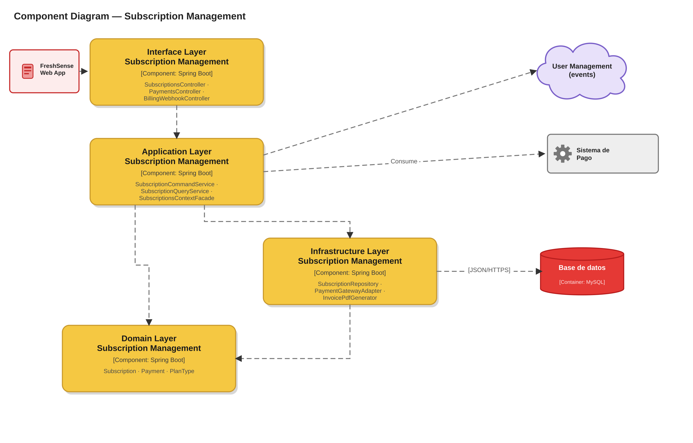
<figcaption style="font-size:0.9em;color:#555;margin-top:0.4em"><em>Component Level Diagram — Subscription Management.</em></figcaption>
</figure>

#### 4.2.2.6. Bounded Context Software Architecture Code Level Diagrams

##### 4.2.2.6.1. Bounded Context Domain Layer Class Diagrams

<figure id="fig-class-sub" style="margin:1.5em 0;text-align:center">
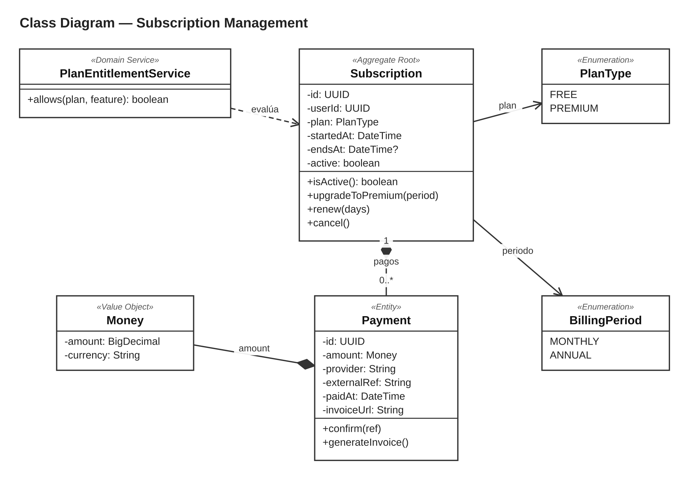
<figcaption style="font-size:0.9em;color:#555;margin-top:0.4em"><em>Class Diagram (Domain Layer) — Subscription Management.</em></figcaption>
</figure>

##### 4.2.2.6.2. Bounded Context Database Design Diagram

<figure id="fig-er-sub" style="margin:1.5em 0;text-align:center">
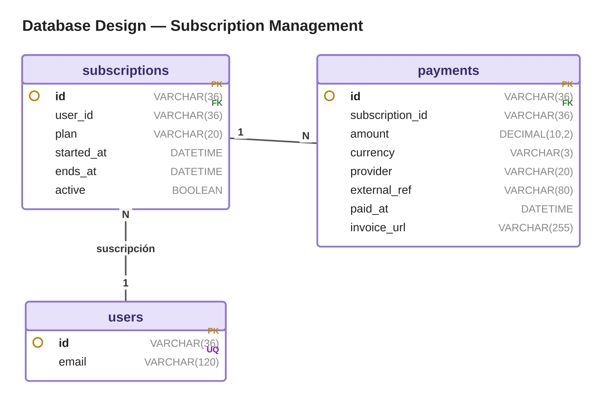
<figcaption style="font-size:0.9em;color:#555;margin-top:0.4em"><em>Database Design Diagram — Subscription Management.</em></figcaption>
</figure>

### 4.2.3 Bounded Context: Profile Management

El **Profile Management Bounded Context** modela el **hogar o negocio** (`Household`) que agrupa a los usuarios y sus dispositivos, la gestión de miembros exigida por la **US37**, y las preferencias de notificación de la **US09** y **US24**. Es el contexto que permite que varias personas —familiares o empleados— compartan un mismo inventario, y que cada una configure cómo y cuándo recibir alertas.

#### 4.2.3.1. Domain Layer

La Domain Layer del Profile Management Bounded Context encapsula la lógica de negocio del contexto. En esta capa se definen los agregados, entidades, objetos de valor, servicios de dominio y políticas que representan los conceptos clave del sistema.

**Aggregates**

1. **Household**
   - *Propósito:* Agregado raíz que representa el hogar o negocio de alimentos al que pertenecen los usuarios, los dispositivos y el inventario compartido.

   - *Atributos:*
| Atributo | Tipo | Descripción |
|---|---|---|
| id | UUID | Identificador del hogar o negocio. |
| name | String | Nombre asignado (por ejemplo, «Casa» o «Restaurante El Sabor»). |
| members | List&lt;HouseholdMember&gt; | Miembros vinculados con su rol. |
| createdAt / updatedAt | DateTime | Campos de auditoría. |
   - *Métodos:*
| Método | Descripción |
|---|---|
| invite(email, role) | Emite una invitación para incorporar a un miembro (US37). |
| addMember(userId, role) | Vincula un usuario al hogar cuando acepta la invitación. |
| removeMember(userId) | Desvincula a un miembro y revoca su acceso al inventario. |
| changeMemberRole(userId, role) | Modifica el rol del miembro dentro del hogar. |
**Entities**

1. **HouseholdMember** — Vínculo entre un usuario y un hogar o negocio, con el rol que desempeña (US37).

| Atributo | Tipo | Descripción |
|---|---|---|
| id | UUID | Identificador del vínculo. |
| householdId | UUID | Hogar o negocio al que pertenece. |
| userId | UUID | Usuario vinculado. |
| role | MemberRole (VO) | OWNER, MEMBER o STAFF. |
| joinedAt | DateTime | Fecha de incorporación. |
| Método | Descripción |
|---|---|
| canManageInventory() | Indica si el rol permite editar el inventario compartido. |
2. **Invitation** — Invitación pendiente para incorporar a un nuevo miembro (US37).

| Atributo | Tipo | Descripción |
|---|---|---|
| id | UUID | Identificador de la invitación. |
| email | Email (VO) | Correo del invitado. |
| token | String | Token único del enlace de vinculación. |
| expiresAt | DateTime | Vencimiento de la invitación. |
| status | InvitationStatus | PENDING, ACCEPTED o EXPIRED. |
| Método | Descripción |
|---|---|
| accept(userId) | Convierte la invitación en un `HouseholdMember`. |
| isExpired() | Evalúa el vencimiento. |
3. **NotificationPreference** — Preferencias de canal y horario de silencio de cada usuario (US09, US24).

| Atributo | Tipo | Descripción |
|---|---|---|
| id | UUID | Identificador. |
| userId | UUID | Usuario propietario. |
| emailEnabled | boolean | Habilita el envío por correo. |
| pushEnabled | boolean | Habilita las notificaciones push. |
| quietHours | TimeWindow (VO) | Rango de silencio (por ejemplo, 22:00–07:00). |
| updatedAt | DateTime | Última modificación. |
| Método | Descripción |
|---|---|
| isQuiet(at) | Indica si un instante cae dentro del horario de silencio. |
| routeFor(severity) | Determina el canal de destino según la severidad (US24). |
**Value Objects**

| Value Object | Descripción |
|---|---|
| MemberRole | Enumeración: `OWNER`, `MEMBER`, `STAFF`. |
| TimeWindow | Rango horario con inicio y fin, usado para el modo silencio. |
| InvitationStatus | Enumeración: `PENDING`, `ACCEPTED`, `EXPIRED`. |

**Domain Services**

| Servicio | Descripción |
|---|---|
| NotificationRoutingService | Decide el canal de entrega (push, correo, reloj inteligente) según severidad y preferencias (US24). |

**Domain Events**

| Evento | Descripción |
|---|---|
| HouseholdCreated | Se creó el hogar o negocio tras registrarse el usuario. |
| MemberInvited | Se envió una invitación a un nuevo miembro (US37). |
| MemberJoined | Un invitado aceptó y quedó vinculado al hogar. |
| NotificationPreferencesUpdated | El usuario cambió sus preferencias de alerta (US09). |
| QuietHoursConfigured | Se definió el rango de silencio para las notificaciones. |

**Policies**

- **Crear hogar al registrarse**: cuando ocurre `UserRegistered`, se crea un `Household` con el usuario como `OWNER`.
- **Retener alertas en silencio**: cuando se dispara una alerta de baja severidad dentro del rango de quietud, se retiene hasta que finalice el periodo (US09).
- **Invitación de un solo uso**: una invitación aceptada o vencida no puede volver a utilizarse.

#### 4.2.3.2. Interface Layer

La Interface Layer del Profile Management expone los puntos de entrada del contexto mediante controladores REST, recursos y *assemblers* que traducen entre el modelo HTTP y el modelo de dominio.

**Controllers**

1. **HouseholdsController** — Gestiona el hogar o negocio y sus miembros.

| Método | Endpoint | Descripción |
|---|---|---|
| GET | /api/v1/households/me | Obtiene el hogar del usuario autenticado y sus miembros. |
| POST | /api/v1/households/{id}/invitations | Envía una invitación a un nuevo miembro (US37). |
| POST | /api/v1/invitations/{token}/accept | Acepta la invitación y vincula al usuario. |
| DELETE | /api/v1/households/{id}/members/{userId} | Desvincula a un miembro. |
   - *Dependencias:* HouseholdCommandService, HouseholdQueryService

2. **NotificationPreferencesController** — Gestiona las preferencias de notificación (US09, US24).

| Método | Endpoint | Descripción |
|---|---|---|
| GET | /api/v1/notification-preferences | Obtiene las preferencias del usuario. |
| PUT | /api/v1/notification-preferences | Actualiza canales y horario de silencio. |
   - *Dependencias:* NotificationPreferenceCommandService

**Resources**

| Resource | Campos |
|---|---|
| HouseholdResource | id, name, members[] |
| HouseholdMemberResource | userId, fullName, role, joinedAt |
| InvitationResource | email, role |
| NotificationPreferenceResource | emailEnabled, pushEnabled, quietStart, quietEnd |

**Transformers / Assemblers**

| Assembler | Transformación |
|---|---|
| HouseholdResourceFromEntityAssembler | Convierte `Household` y sus miembros en `HouseholdResource`. |
| NotificationPreferenceResourceFromEntityAssembler | Convierte `NotificationPreference` en su recurso. |
| InviteMemberCommandFromResourceAssembler | Convierte `InvitationResource` en `InviteMemberCommand`. |

#### 4.2.3.3 Application Layer

La Application Layer del Profile Management coordina las operaciones entre la Interface Layer y la Domain Layer, orquestando comandos, consultas y la reacción a eventos de otros contextos.

**Command Services**

| Servicio | Comandos que maneja | Descripción |
|---|---|---|
| HouseholdCommandServiceImpl | CreateHouseholdCommand, InviteMemberCommand, AcceptInvitationCommand, RemoveMemberCommand | Crea el hogar, gestiona invitaciones y administra la membresía compartida (US37). |
| NotificationPreferenceCommandServiceImpl | UpdatePreferencesCommand, SetQuietHoursCommand | Actualiza canales y horarios de silencio de las alertas (US09). |

**Query Services / Facades**

| Servicio | Consultas | Descripción |
|---|---|---|
| HouseholdQueryServiceImpl | GetHouseholdByUserQuery, GetMembersQuery | Recupera el hogar y sus miembros. |
| ProfileContextFacade | getHouseholdOf(userId), getPreferencesOf(userId) | Open Host Service consultado por Inventory (inventario compartido) y por IoT Monitoring (envío de alertas). |

**Event Handlers**

| Handler | Evento que escucha | Reacción |
|---|---|---|
| UserRegisteredEventHandler | UserRegistered (User Management) | Crea el `Household` inicial con el usuario como OWNER y sus preferencias de notificación por defecto. |
| PlanTypeAcquiredEventHandler | PlanTypeAcquired (Subscription Management) | Ajusta el número máximo de miembros permitidos según el plan contratado. |

#### 4.2.3.4. Infrastructure Layer

La Infrastructure Layer del Profile Management implementa la persistencia y las integraciones técnicas (ACL) hacia otros contextos y sistemas externos.

| Componente | Tipo | Responsabilidad |
|---|---|---|
| HouseholdRepository | JPA Repository | Persistencia de hogares; `findByMemberUserId`. |
| HouseholdMemberRepository | JPA Repository | Persistencia de los vínculos usuario–hogar. |
| InvitationRepository | JPA Repository | Persistencia de invitaciones pendientes (US37). |
| NotificationPreferenceRepository | JPA Repository | Persistencia de las preferencias de alerta. |
| ExternalUserService | ACL entrante | Consulta el `IamContextFacade` para resolver los datos del usuario. |
| NotificationGatewayAdapter | ACL saliente | Envía el correo de invitación mediante el Notification Service (TS42). |

#### 4.2.3.5. Bounded Context Software Architecture Component Level Diagrams

<figure id="fig-comp-pro" style="margin:1.5em 0;text-align:center">

<figcaption style="font-size:0.9em;color:#555;margin-top:0.4em"><em>Component Level Diagram — Profile Management.</em></figcaption>
</figure>

#### 4.2.3.6. Bounded Context Software Architecture Code Level Diagrams

##### 4.2.3.6.1. Bounded Context Domain Layer Class Diagrams

<figure id="fig-class-pro" style="margin:1.5em 0;text-align:center">
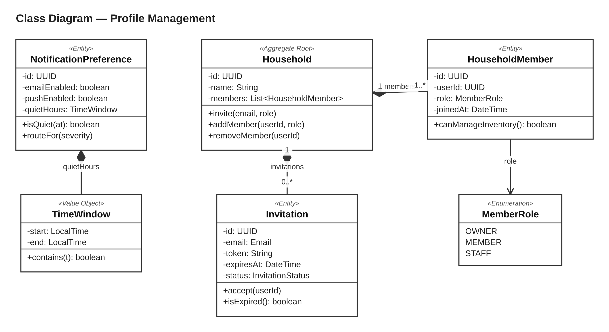
<figcaption style="font-size:0.9em;color:#555;margin-top:0.4em"><em>Class Diagram (Domain Layer) — Profile Management.</em></figcaption>
</figure>

##### 4.2.3.6.2. Bounded Context Database Design Diagram

<figure id="fig-er-pro" style="margin:1.5em 0;text-align:center">
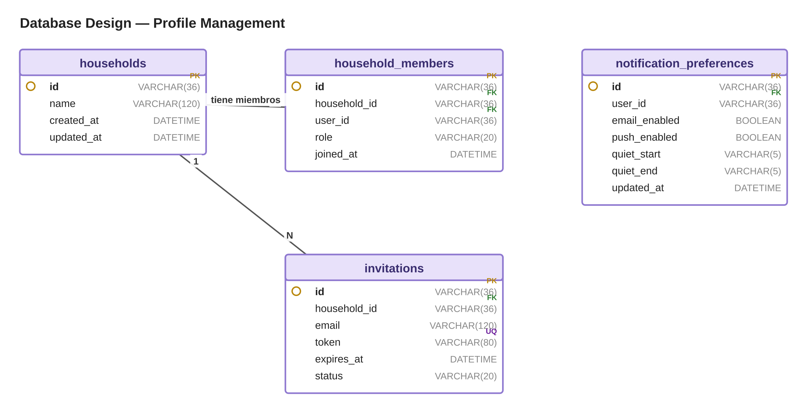
<figcaption style="font-size:0.9em;color:#555;margin-top:0.4em"><em>Database Design Diagram — Profile Management.</em></figcaption>
</figure>

### 4.2.4 Bounded Context: Sensor Management

El **Sensor Management Bounded Context** gestiona el ciclo de vida del hardware **FreshSense Device**: la vinculación mediante código QR y la calibración exigidas por la **US31**, el control del estado de conexión de la **US06**, y la organización en **zonas de almacenamiento** (cámaras frías, congeladores) que pide la **US33**. Este contexto conoce el dispositivo como equipo físico; la interpretación de sus lecturas corresponde a IoT Monitoring.

#### 4.2.4.1. Domain Layer

La Domain Layer del Sensor Management Bounded Context encapsula la lógica de negocio del contexto. En esta capa se definen los agregados, entidades, objetos de valor, servicios de dominio y políticas que representan los conceptos clave del sistema.

**Aggregates**

1. **SensorDevice**
   - *Propósito:* Agregado raíz que representa un dispositivo FreshSense instalado en un refrigerador, cámara fría o congelador.

   - *Atributos:*
| Atributo | Tipo | Descripción |
|---|---|---|
| id | UUID | Identificador del dispositivo. |
| householdId | UUID | Hogar o negocio propietario. |
| model | String | Modelo del hardware. |
| firmwareVersion | String | Versión de firmware instalada. |
| status | DeviceStatus (VO) | ACTIVE, OFFLINE o UNPAIRED. |
| zoneId | UUID? | Zona de almacenamiento asignada (US33). |
| calibration | Calibration (VO) | Temperatura base configurada durante la instalación (US31). |
| registeredAt / updatedAt | DateTime | Campos de auditoría. |
   - *Métodos:*
| Método | Descripción |
|---|---|
| register() | Da de alta el dispositivo en el sistema. |
| pairToHousehold(Household) | Vincula el dispositivo al hogar tras escanear su código QR (US31). |
| calibrate(baseTemperature) | Registra la temperatura base del refrigerador para ajustar los umbrales. |
| assignToZone(zoneId) | Asigna el dispositivo a una cámara o congelador concreto (US33). |
| markOffline() | Marca el dispositivo como desconectado al no recibirse el *heartbeat* (US06). |
**Entities**

1. **StorageZone** — Área de almacenamiento del hogar o negocio, con sus propias reglas de temperatura (US33).

| Atributo | Tipo | Descripción |
|---|---|---|
| id | UUID | Identificador de la zona. |
| householdId | UUID | Hogar o negocio propietario. |
| name | String | Nombre asignado (por ejemplo, «Cámara Fría 1» o «Congelador Carnes»). |
| type | ZoneType (VO) | FRIDGE, FREEZER o COLD_ROOM. |
| targetTempC | float | Temperatura objetivo de la zona. |
| Método | Descripción |
|---|---|
| appliesRulesTo(PantryItem) | Indica si un alimento hereda las reglas de temperatura de la zona. |
**Value Objects**

| Value Object | Descripción |
|---|---|
| DeviceStatus | Enumeración: `ACTIVE`, `OFFLINE`, `UNPAIRED`. |
| ZoneType | Enumeración: `FRIDGE`, `FREEZER`, `COLD_ROOM`. |
| Calibration | Temperatura base y desviación aceptada, definidas al instalar el equipo (US31). |
| PairingCode | Código QR impreso en el hardware que identifica al dispositivo durante la vinculación. |

**Domain Services**

| Servicio | Descripción |
|---|---|
| DeviceHealthService | Evalúa el *heartbeat* recibido y determina cuándo un dispositivo pasa a OFFLINE (US06). |

**Domain Events**

| Evento | Descripción |
|---|---|
| SensorRegistered | Se dio de alta un dispositivo en el sistema. |
| SensorPaired | El dispositivo quedó vinculado al hogar tras escanear el QR (ES: *sensor instalado*). |
| SensorCalibrated | Se registró la temperatura base del refrigerador (US31). |
| SensorConfigured | Se asignó el dispositivo a una zona de almacenamiento (ES: *sensor configurado*). |
| SensorDisconnected | El dispositivo perdió el enlace Wi-Fi y se notificó al usuario (US06). |

**Policies**

- **Vinculación única**: un código QR solo puede vincularse a un hogar a la vez.
- **Notificar desconexión**: cuando el servidor no recibe *heartbeat* dentro de la ventana esperada, se marca el dispositivo OFFLINE y se avisa al usuario (US06).
- **Heredar reglas de zona**: cuando un dispositivo se asigna a una zona, los alimentos asociados adoptan sus umbrales de temperatura (US33).

#### 4.2.4.2. Interface Layer

La Interface Layer del Sensor Management expone los puntos de entrada del contexto mediante controladores REST, recursos y *assemblers* que traducen entre el modelo HTTP y el modelo de dominio.

**Controllers**

1. **DevicesController** — Gestiona el alta, vinculación y calibración de los dispositivos.

| Método | Endpoint | Descripción |
|---|---|---|
| GET | /api/v1/devices | Lista los dispositivos del hogar. |
| POST | /api/v1/devices/pair | Vincula un dispositivo escaneando su código QR (US31). |
| PATCH | /api/v1/devices/{id}/calibration | Registra la temperatura base de calibración. |
| PATCH | /api/v1/devices/{id}/zone | Asigna el dispositivo a una zona de almacenamiento. |
   - *Dependencias:* DeviceCommandService, DeviceQueryService

2. **StorageZonesController** — Administra las zonas de almacenamiento del negocio (US33).

| Método | Endpoint | Descripción |
|---|---|---|
| GET | /api/v1/storage-zones | Lista las zonas configuradas. |
| POST | /api/v1/storage-zones | Crea una nueva cámara, congelador o refrigerador. |
| DELETE | /api/v1/storage-zones/{id} | Elimina una zona sin dispositivos asociados. |
   - *Dependencias:* StorageZoneCommandService

3. **DeviceHeartbeatController** — Recibe la señal periódica de vida del dispositivo (US06).

| Método | Endpoint | Descripción |
|---|---|---|
| POST | /api/v1/devices/{id}/heartbeat | Registra el *ping* del dispositivo y actualiza su estado. |
   - *Dependencias:* DeviceCommandService

**Resources**

| Resource | Campos |
|---|---|
| DeviceResource | id, model, firmwareVersion, status, zoneId, calibration |
| PairDeviceResource | pairingCode (QR), householdId |
| CalibrationResource | baseTemperatureC |
| StorageZoneResource | id, name, type, targetTempC |

**Transformers / Assemblers**

| Assembler | Transformación |
|---|---|
| DeviceResourceFromEntityAssembler | Convierte `SensorDevice` en `DeviceResource`. |
| StorageZoneResourceFromEntityAssembler | Convierte `StorageZone` en su recurso. |
| PairDeviceCommandFromResourceAssembler | Convierte `PairDeviceResource` en `PairDeviceCommand`. |

#### 4.2.4.3 Application Layer

La Application Layer del Sensor Management coordina las operaciones entre la Interface Layer y la Domain Layer, orquestando comandos, consultas y la reacción a eventos de otros contextos.

**Command Services**

| Servicio | Comandos que maneja | Descripción |
|---|---|---|
| DeviceCommandServiceImpl | RegisterDeviceCommand, PairDeviceCommand, CalibrateDeviceCommand, AssignZoneCommand, RegisterHeartbeatCommand | Da de alta, vincula, calibra y monitorea el estado de conexión de los dispositivos. |
| StorageZoneCommandServiceImpl | CreateZoneCommand, DeleteZoneCommand | Administra las áreas de almacenamiento del hogar o negocio (US33). |

**Query Services / Facades**

| Servicio | Consultas | Descripción |
|---|---|---|
| DeviceQueryServiceImpl | GetDevicesByHouseholdQuery, GetDeviceByIdQuery | Recupera los dispositivos y su estado. |
| StorageZoneQueryServiceImpl | GetZonesByHouseholdQuery | Recupera las zonas configuradas. |
| SensorContextFacade | existsDevice(id), getZoneOf(deviceId), getCalibration(deviceId) | Open Host Service consultado por IoT Monitoring para validar el origen de las lecturas. |

**Event Handlers**

| Handler | Evento que escucha | Reacción |
|---|---|---|
| HouseholdCreatedEventHandler | HouseholdCreated (Profile Management) | Crea la zona de almacenamiento por defecto («Refrigerador principal») para el nuevo hogar. |
| PlanTypeAcquiredEventHandler | PlanTypeAcquired (Subscription Management) | Ajusta el número máximo de dispositivos y zonas permitidos según el plan. |

#### 4.2.4.4. Infrastructure Layer

La Infrastructure Layer del Sensor Management implementa la persistencia y las integraciones técnicas (ACL) hacia otros contextos y sistemas externos.

| Componente | Tipo | Responsabilidad |
|---|---|---|
| SensorDeviceRepository | JPA Repository | Persistencia de dispositivos; `findByHouseholdId`, `findByPairingCode`. |
| StorageZoneRepository | JPA Repository | Persistencia de las zonas de almacenamiento. |
| HeartbeatScheduler | Spring Scheduler | Revisa periódicamente los *heartbeats* y marca los dispositivos OFFLINE (US06). |
| ExternalHouseholdService | ACL entrante | Consulta el `ProfileContextFacade` para validar el hogar propietario. |
| NotificationGatewayAdapter | ACL saliente | Notifica al usuario la desconexión del dispositivo (TS42). |

#### 4.2.4.5. Bounded Context Software Architecture Component Level Diagrams

<figure id="fig-comp-sen" style="margin:1.5em 0;text-align:center">

<figcaption style="font-size:0.9em;color:#555;margin-top:0.4em"><em>Component Level Diagram — Sensor Management.</em></figcaption>
</figure>

#### 4.2.4.6. Bounded Context Software Architecture Code Level Diagrams

##### 4.2.4.6.1. Bounded Context Domain Layer Class Diagrams

<figure id="fig-class-sen" style="margin:1.5em 0;text-align:center">
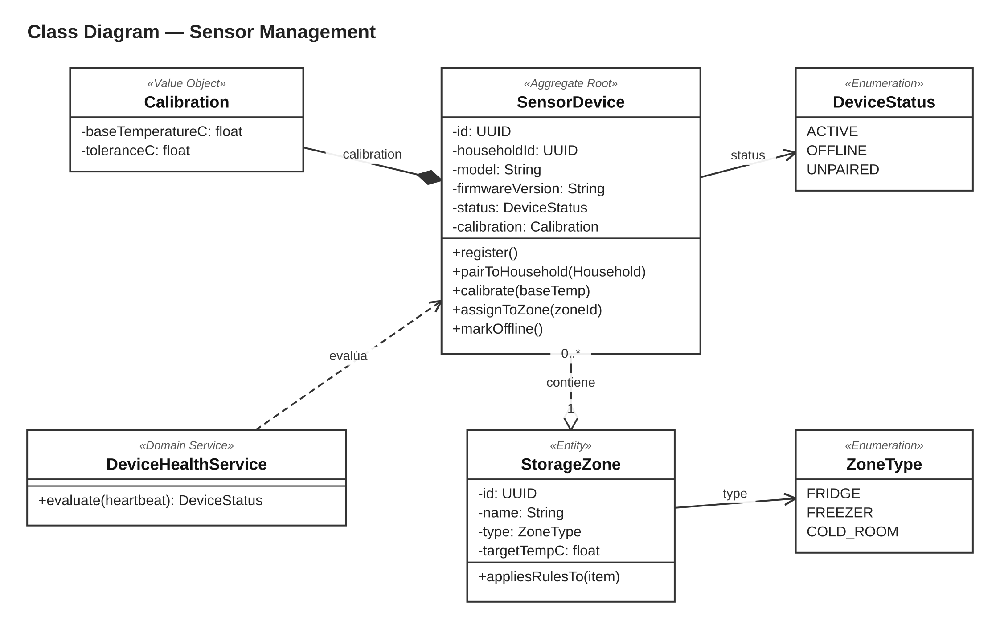
<figcaption style="font-size:0.9em;color:#555;margin-top:0.4em"><em>Class Diagram (Domain Layer) — Sensor Management.</em></figcaption>
</figure>

##### 4.2.4.6.2. Bounded Context Database Design Diagram

<figure id="fig-er-sen" style="margin:1.5em 0;text-align:center">
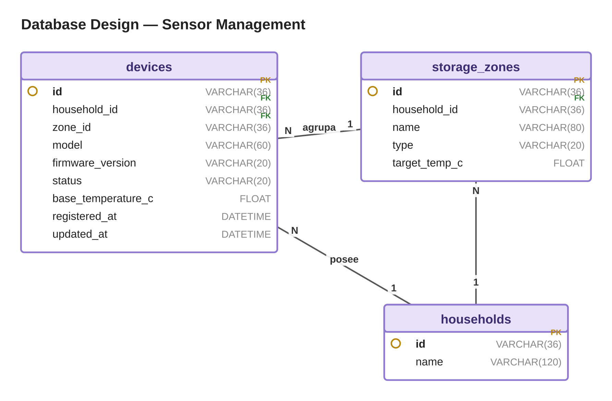
<figcaption style="font-size:0.9em;color:#555;margin-top:0.4em"><em>Database Design Diagram — Sensor Management.</em></figcaption>
</figure>

### 4.2.5 Bounded Context: Inventory Management

El **Inventory Management Bounded Context** administra la despensa digital del hogar o negocio: el alta de alimentos por voz o escaneo de código de barras (**US10**), la edición manual del stock (**US11**), la categorización personalizada (**US28**) y el registro del motivo de descarte (**US34**). Contiene el agregado `PantryItem` y el catálogo `FoodModel`, que define la vida útil estimada por categoría de alimento y las reglas usadas para estimar la fecha de consumo preferente.

#### 4.2.5.1. Domain Layer

La Domain Layer del Inventory Management Bounded Context encapsula la lógica de negocio del contexto. En esta capa se definen los agregados, entidades, objetos de valor, servicios de dominio y políticas que representan los conceptos clave del sistema.

**Aggregates**

1. **PantryItem**
   - *Propósito:* Agregado raíz que representa un alimento registrado en la despensa, con su cantidad, vencimiento estimado y estado de frescura.

   - *Atributos:*
| Atributo | Tipo | Descripción |
|---|---|---|
| id | UUID | Identificador del alimento. |
| userId | UUID | Usuario o miembro que lo registró. |
| foodModelId | UUID | Categoría del catálogo que define su vida útil. |
| name | String | Nombre del alimento. |
| quantity | Quantity (VO) | Cantidad disponible. |
| unit | Unit (VO) | Unidad de medida (kg, unidades, litros). |
| addedAt | DateTime | Fecha de registro en la despensa. |
| bestBefore | DateTime? | Fecha estimada de consumo preferente. |
| status | FreshnessStatus (VO) | FRESH, AT_RISK o SPOILED. |
| notes | String | Observaciones y etiquetas personalizadas (US28). |
   - *Métodos:*
| Método | Descripción |
|---|---|
| markConsumed() | Registra el consumo del alimento y descuenta la cantidad. |
| markDiscarded(reason) | Registra el descarte indicando la causa: caducado, contaminado o mal estado (US34). |
| updateQuantity(qty) | Corrige manualmente el stock disponible (US11). |
| updateStatus(FreshnessStatus) | Actualiza el estado de frescura según la evaluación del dominio. |
| estimateBestBefore(FoodModel) | Calcula la fecha de consumo preferente a partir de la vida útil del catálogo. |
**Entities**

1. **FoodModel** — Catálogo que define la vida útil y las reglas de conservación de cada categoría de alimento.

| Atributo | Tipo | Descripción |
|---|---|---|
| id | UUID | Identificador del modelo. |
| name | String | Nombre de la categoría. |
| category | String | Agrupación (Fruta, Verdura, Lácteo, Carne). |
| shelfLifeDays | int | Vida útil estimada en días. |
| rulesJson | ShelfLifeRules (VO) | Umbrales de temperatura, humedad y etileno aplicables. |
| Método | Descripción |
|---|---|
| rulesFor(zoneType) | Devuelve los umbrales ajustados al tipo de zona de almacenamiento. |
**Value Objects**

| Value Object | Descripción |
|---|---|
| FreshnessStatus | Enumeración: `FRESH`, `AT_RISK`, `SPOILED`. |
| Quantity | Cantidad con validación de no negatividad. |
| Unit | Unidad de medida del alimento (kg, g, L, unidades). |
| ShelfLifeRules | Reglas de vida útil y umbrales por categoría, serializadas en JSON. |
| DiscardReason | Enumeración: `EXPIRED`, `CONTAMINATED`, `BAD_ON_PURCHASE` (US34). |

**Domain Services**

| Servicio | Descripción |
|---|---|
| ShelfLifeEstimationService | Estima la fecha de consumo preferente combinando el `FoodModel` y la zona de almacenamiento. |
| BarcodeLookupService | Resuelve el nombre y la categoría del producto a partir del código de barras escaneado (US10). |

**Domain Events**

| Evento | Descripción |
|---|---|
| FoodItemRegistered | Se agregó un alimento a la despensa (ES: *alimento agregado*). |
| FoodItemUpdated | Se modificó manualmente la cantidad o los datos del alimento (US11). |
| FoodItemConsumed | El alimento fue consumido (ES: *alimento consumido*). |
| FoodItemDiscarded | El alimento fue descartado indicando la causa (US34). |
| FoodConditionUpdated | Cambió el estado de frescura del alimento tras una evaluación. |

**Policies**

- **Estimar vencimiento al registrar**: cuando se agrega un alimento, el sistema calcula automáticamente su `bestBefore` a partir del `FoodModel`.
- **Heredar reglas de la zona**: cuando el alimento se asocia a una zona de almacenamiento, adopta sus umbrales de temperatura (US33).
- **Solicitar motivo al descartar**: cuando el usuario elimina un producto marcándolo como desechado, la aplicación exige el motivo para el informe de mermas (US34).

#### 4.2.5.2. Interface Layer

La Interface Layer del Inventory Management expone los puntos de entrada del contexto mediante controladores REST, recursos y *assemblers* que traducen entre el modelo HTTP y el modelo de dominio.

**Controllers**

1. **PantryItemsController** — Gestiona el inventario de alimentos del hogar o negocio.

| Método | Endpoint | Descripción |
|---|---|---|
| GET | /api/v1/pantry-items | Lista los alimentos con su estado de frescura (semáforo, US07). |
| POST | /api/v1/pantry-items | Registra un alimento por voz, código de barras o manualmente (US10). |
| PUT | /api/v1/pantry-items/{id} | Actualiza cantidad, unidad o etiquetas (US11, US28). |
| POST | /api/v1/pantry-items/{id}/consume | Marca el alimento como consumido. |
| POST | /api/v1/pantry-items/{id}/discard | Marca el alimento como descartado con su causa (US34). |
   - *Dependencias:* PantryItemCommandService, PantryItemQueryService

2. **FoodModelsController** — Expone el catálogo de categorías y vida útil.

| Método | Endpoint | Descripción |
|---|---|---|
| GET | /api/v1/food-models | Lista las categorías disponibles. |
| GET | /api/v1/food-models/{id} | Obtiene las reglas de vida útil de una categoría. |
   - *Dependencias:* FoodModelQueryService

3. **InventorySearchController** — Búsqueda global con autocompletado sobre el inventario (US39).

| Método | Endpoint | Descripción |
|---|---|---|
| GET | /api/v1/inventory/search | Devuelve coincidencias en vivo de alimentos y recetas. |
   - *Dependencias:* PantryItemQueryService

**Resources**

| Resource | Campos |
|---|---|
| PantryItemResource | id, name, quantity, unit, addedAt, bestBefore, status, notes |
| CreatePantryItemResource | name, quantity, unit, foodModelId, barcode? |
| DiscardResource | reason (EXPIRED | CONTAMINATED | BAD_ON_PURCHASE) |
| FoodModelResource | id, name, category, shelfLifeDays |

**Transformers / Assemblers**

| Assembler | Transformación |
|---|---|
| PantryItemResourceFromEntityAssembler | Convierte `PantryItem` en `PantryItemResource`. |
| FoodModelResourceFromEntityAssembler | Convierte `FoodModel` en su recurso. |
| CreatePantryItemCommandFromResourceAssembler | Convierte el recurso de alta en `RegisterFoodItemCommand`. |

#### 4.2.5.3 Application Layer

La Application Layer del Inventory Management coordina las operaciones entre la Interface Layer y la Domain Layer, orquestando comandos, consultas y la reacción a eventos de otros contextos.

**Command Services**

| Servicio | Comandos que maneja | Descripción |
|---|---|---|
| PantryItemCommandServiceImpl | RegisterFoodItemCommand, UpdateFoodItemCommand, ConsumeFoodItemCommand, DiscardFoodItemCommand | Registra, actualiza, consume y descarta alimentos, publicando los eventos correspondientes. |
| FoodModelCommandServiceImpl | SeedFoodModelsCommand | Carga el catálogo inicial de categorías y vidas útiles al iniciar el sistema. |

**Query Services / Facades**

| Servicio | Consultas | Descripción |
|---|---|---|
| PantryItemQueryServiceImpl | GetPantryItemsQuery, GetItemsAtRiskQuery, SearchInventoryQuery | Recupera el inventario, los alimentos en riesgo y las coincidencias de búsqueda (US39). |
| FoodModelQueryServiceImpl | GetAllFoodModelsQuery, GetFoodModelByIdQuery | Recupera el catálogo de categorías. |
| InventoryContextFacade | getInventorySnapshot(householdId), getItemsAtRisk(userId) | Open Host Service consultado por Consumption y Report Management. |

**Event Handlers**

| Handler | Evento que escucha | Reacción |
|---|---|---|
| FoodConditionUpdatedEventHandler | FoodConditionUpdated (IoT Monitoring) | Actualiza el `status` del `PantryItem` a AT_RISK o SPOILED según la evaluación del FreshnessService. |
| SensorConfiguredEventHandler | SensorConfigured (Sensor Management) | Asocia los alimentos de la zona con el dispositivo que la monitorea. |

#### 4.2.5.4. Infrastructure Layer

La Infrastructure Layer del Inventory Management implementa la persistencia y las integraciones técnicas (ACL) hacia otros contextos y sistemas externos.

| Componente | Tipo | Responsabilidad |
|---|---|---|
| PantryItemRepository | JPA Repository | Persistencia del inventario; `findByUserId`, `findByStatus`. |
| FoodModelRepository | JPA Repository | Persistencia del catálogo de categorías. |
| BarcodeApiAdapter | ACL saliente | Consulta el catálogo externo de códigos de barras (US10). |
| RedisCacheAdapter | Caché | Almacena el catálogo y las consultas frecuentes del inventario (TS45). |
| ExternalSensorService | ACL entrante | Consulta el `SensorContextFacade` para conocer la zona del alimento. |

#### 4.2.5.5. Bounded Context Software Architecture Component Level Diagrams

<figure id="fig-comp-inv" style="margin:1.5em 0;text-align:center">

<figcaption style="font-size:0.9em;color:#555;margin-top:0.4em"><em>Component Level Diagram — Inventory Management.</em></figcaption>
</figure>

#### 4.2.5.6. Bounded Context Software Architecture Code Level Diagrams

##### 4.2.5.6.1. Bounded Context Domain Layer Class Diagrams

<figure id="fig-class-inv" style="margin:1.5em 0;text-align:center">
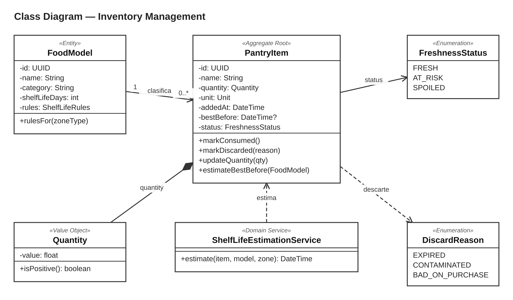
<figcaption style="font-size:0.9em;color:#555;margin-top:0.4em"><em>Class Diagram (Domain Layer) — Inventory Management.</em></figcaption>
</figure>

##### 4.2.5.6.2. Bounded Context Database Design Diagram

<figure id="fig-er-inv" style="margin:1.5em 0;text-align:center">
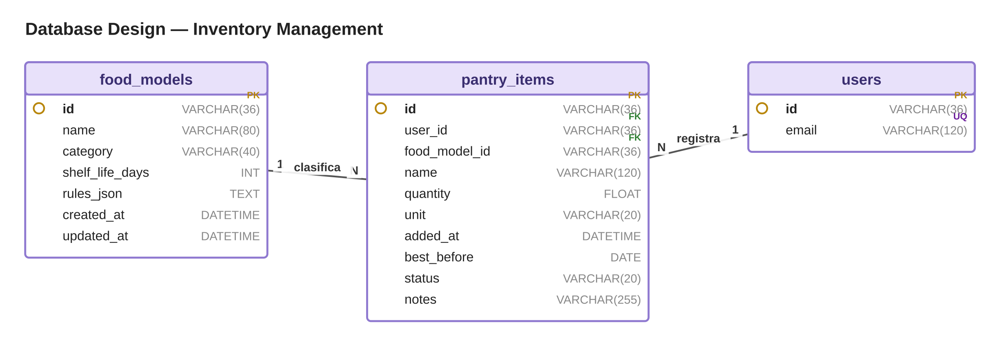
<figcaption style="font-size:0.9em;color:#555;margin-top:0.4em"><em>Database Design Diagram — Inventory Management.</em></figcaption>
</figure>

### 4.2.6 Bounded Context: Consumption Management

El **Consumption Management Bounded Context** registra el consumo y descarte efectivo de los alimentos y gestiona el **motor de sugerencia de recetas** (**EP05**). Propone platillos priorizando los ingredientes en riesgo (**US13**), permite filtrarlos por tiempo, dificultad y tipo de dieta (**US14**), y recoge las calificaciones de la comunidad (**US40**). Su registro de consumo es la fuente de los reportes de ahorro e impacto ambiental.

#### 4.2.6.1. Domain Layer

La Domain Layer del Consumption Management Bounded Context encapsula la lógica de negocio del contexto. En esta capa se definen los agregados, entidades, objetos de valor, servicios de dominio y políticas que representan los conceptos clave del sistema.

**Aggregates**

1. **Recipe**
   - *Propósito:* Agregado raíz que representa una receta sugerida por la plataforma para aprovechar alimentos próximos a vencer.

   - *Atributos:*
| Atributo | Tipo | Descripción |
|---|---|---|
| id | UUID | Identificador de la receta. |
| title | String | Nombre del platillo. |
| prepMinutes | int | Tiempo de preparación en minutos. |
| difficulty | Difficulty (VO) | EASY, MEDIUM o HARD. |
| instructions | String | Pasos de preparación. |
| ingredients | List&lt;RecipeIngredient&gt; | Ingredientes requeridos. |
| isPremium | boolean | Indica si pertenece al catálogo gourmet exclusivo (US19). |
   - *Métodos:*
| Método | Descripción |
|---|---|
| matches(atRiskItems) | Evalúa cuántos ingredientes en riesgo cubre la receta (US13). |
| addIngredient(name, qty, unit, optional) | Incorpora un ingrediente a la receta. |
| rate(userId, stars, comment) | Registra la calificación y reseña de un usuario (US40). |
**Entities**

1. **RecipeIngredient** — Ingrediente que forma parte de una receta.

| Atributo | Tipo | Descripción |
|---|---|---|
| id | UUID | Identificador. |
| recipeId | UUID | Receta a la que pertenece. |
| name | String | Nombre del ingrediente. |
| qty | Quantity (VO) | Cantidad requerida. |
| unit | Unit (VO) | Unidad de medida. |
| optional | boolean | Indica si el ingrediente es opcional. |
| Método | Descripción |
|---|---|
| isSatisfiedBy(pantryItems) | Indica si el inventario cubre este ingrediente. |
2. **ConsumptionRecord** — Registro histórico de cada alimento consumido o descartado, base de los reportes (US29, US34).

| Atributo | Tipo | Descripción |
|---|---|---|
| id | UUID | Identificador del registro. |
| userId | UUID | Usuario que realizó la acción. |
| pantryItemId | UUID | Alimento afectado. |
| action | ConsumptionAction (VO) | CONSUMED o DISCARDED. |
| reason | DiscardReason? | Causa del descarte, si aplica (US34). |
| estimatedValue | Money (VO) | Valor económico del alimento. |
| recordedAt | DateTime | Fecha del registro. |
| Método | Descripción |
|---|---|
| isWaste() | Indica si el registro representa una merma. |
| carbonFootprint() | Estima el CO₂ asociado al alimento (US20). |
**Value Objects**

| Value Object | Descripción |
|---|---|
| Difficulty | Enumeración: `EASY`, `MEDIUM`, `HARD`. |
| ConsumptionAction | Enumeración: `CONSUMED`, `DISCARDED`. |
| DietTag | Etiqueta dietética de la receta: vegana, keto, sin gluten (US14). |
| Rating | Calificación de 1 a 5 estrellas con reseña opcional (US40). |

**Domain Services**

| Servicio | Descripción |
|---|---|
| RecipeSuggestionService | Selecciona y ordena las recetas según los alimentos en estado AT_RISK del inventario (US13). |
| WasteValuationService | Calcula el valor económico y la huella de carbono del consumo y la merma (US18, US20). |

**Domain Events**

| Evento | Descripción |
|---|---|
| ConsumptionRegistered | Se registró el consumo de un alimento (ES: *alimento consumido*). |
| WasteRegistered | Se registró el descarte de un alimento con su causa (ES: *alimento desechado*). |
| RecipeSuggested | Se propusieron recetas a partir de los alimentos en riesgo (ES: *receta sugerida*). |
| RecipeRated | Un usuario calificó una receta (US40). |

**Policies**

- **Sugerir recetas al detectar riesgo**: cuando existen alimentos en estado AT_RISK, el motor propone recetas que los utilicen como base (US13).
- **Registrar valor al consumir**: cuando ocurre `FoodItemConsumed`, se crea un `ConsumptionRecord` con el valor económico estimado.
- **Restringir catálogo gourmet**: cuando un usuario sin plan PREMIUM consulta las recetas exclusivas, el acceso se bloquea (US19).

#### 4.2.6.2. Interface Layer

La Interface Layer del Consumption Management expone los puntos de entrada del contexto mediante controladores REST, recursos y *assemblers* que traducen entre el modelo HTTP y el modelo de dominio.

**Controllers**

1. **RecipesController** — Expone el catálogo y las sugerencias de recetas.

| Método | Endpoint | Descripción |
|---|---|---|
| GET | /api/v1/recipes | Lista las recetas con filtros de tiempo, dificultad y dieta (US14). |
| GET | /api/v1/recipes/suggested | Devuelve las recetas sugeridas según los alimentos en riesgo (US13). |
| GET | /api/v1/recipes/{id} | Obtiene el detalle e ingredientes de una receta. |
| POST | /api/v1/recipes/{id}/ratings | Registra una calificación y reseña (US40). |
   - *Dependencias:* RecipeQueryService, RecipeCommandService

2. **ConsumptionController** — Expone el historial de consumo y descarte.

| Método | Endpoint | Descripción |
|---|---|---|
| GET | /api/v1/consumption | Lista los registros de consumo y merma por periodo. |
| GET | /api/v1/consumption/export | Descarga el historial en CSV o Excel (US29). |
   - *Dependencias:* ConsumptionQueryService

**Resources**

| Resource | Campos |
|---|---|
| RecipeResource | id, title, prepMinutes, difficulty, instructions, ingredients[] |
| RecipeIngredientResource | name, qty, unit, optional |
| RatingResource | stars, comment |
| ConsumptionRecordResource | id, pantryItemId, action, reason, estimatedValue, recordedAt |

**Transformers / Assemblers**

| Assembler | Transformación |
|---|---|
| RecipeResourceFromEntityAssembler | Convierte `Recipe` y sus ingredientes en `RecipeResource`. |
| ConsumptionRecordResourceFromEntityAssembler | Convierte `ConsumptionRecord` en su recurso. |
| RatingCommandFromResourceAssembler | Convierte `RatingResource` en `RateRecipeCommand`. |

#### 4.2.6.3 Application Layer

La Application Layer del Consumption Management coordina las operaciones entre la Interface Layer y la Domain Layer, orquestando comandos, consultas y la reacción a eventos de otros contextos.

**Command Services**

| Servicio | Comandos que maneja | Descripción |
|---|---|---|
| RecipeCommandServiceImpl | SeedRecipesCommand, RateRecipeCommand | Carga el catálogo de recetas y registra las calificaciones de la comunidad (US40). |
| ConsumptionCommandServiceImpl | RegisterConsumptionCommand, RegisterWasteCommand | Crea los registros de consumo y merma con su valoración económica y ambiental. |

**Query Services / Facades**

| Servicio | Consultas | Descripción |
|---|---|---|
| RecipeQueryServiceImpl | GetRecipesQuery, GetSuggestedRecipesQuery, GetRecipeByIdQuery | Recupera el catálogo y las sugerencias priorizadas por riesgo (US13, US14). |
| ConsumptionQueryServiceImpl | GetConsumptionByPeriodQuery, ExportConsumptionQuery | Recupera el historial y genera la exportación en CSV/Excel (US29). |
| ConsumptionContextFacade | getConsumptionSummary(userId, period) | Open Host Service consultado por Report Management para construir los reportes. |

**Event Handlers**

| Handler | Evento que escucha | Reacción |
|---|---|---|
| FoodItemConsumedEventHandler | FoodItemConsumed (Inventory Management) | Crea un `ConsumptionRecord` de tipo CONSUMED y calcula el valor económico rescatado. |
| FoodItemDiscardedEventHandler | FoodItemDiscarded (Inventory Management) | Crea un `ConsumptionRecord` de tipo DISCARDED con su causa y estima la huella de carbono. |
| FoodConditionUpdatedEventHandler | FoodConditionUpdated (IoT Monitoring) | Recalcula las sugerencias de recetas cuando un alimento entra en estado AT_RISK (US13). |

#### 4.2.6.4. Infrastructure Layer

La Infrastructure Layer del Consumption Management implementa la persistencia y las integraciones técnicas (ACL) hacia otros contextos y sistemas externos.

| Componente | Tipo | Responsabilidad |
|---|---|---|
| RecipeRepository | JPA Repository | Persistencia de recetas; `findByDifficulty`, `findByIngredientName`. |
| RecipeIngredientRepository | JPA Repository | Persistencia de los ingredientes de cada receta. |
| ConsumptionRecordRepository | JPA Repository | Persistencia del historial de consumo y merma. |
| RedisCacheAdapter | Caché | Sirve el catálogo de recetas filtradas en menos de 50 ms (TS45). |
| CsvExcelExporter | Servicio técnico | Genera el archivo CSV/Excel del historial con Apache POI (US29). |
| ExternalInventoryService | ACL entrante | Consulta el `InventoryContextFacade` para obtener los alimentos en riesgo. |

#### 4.2.6.5. Bounded Context Software Architecture Component Level Diagrams

<figure id="fig-comp-con" style="margin:1.5em 0;text-align:center">
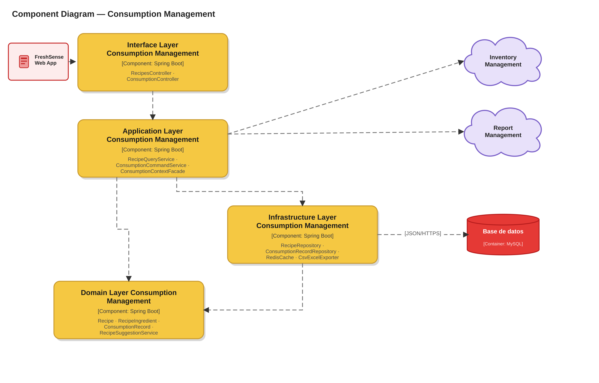
<figcaption style="font-size:0.9em;color:#555;margin-top:0.4em"><em>Component Level Diagram — Consumption Management.</em></figcaption>
</figure>

#### 4.2.6.6. Bounded Context Software Architecture Code Level Diagrams

##### 4.2.6.6.1. Bounded Context Domain Layer Class Diagrams

<figure id="fig-class-con" style="margin:1.5em 0;text-align:center">
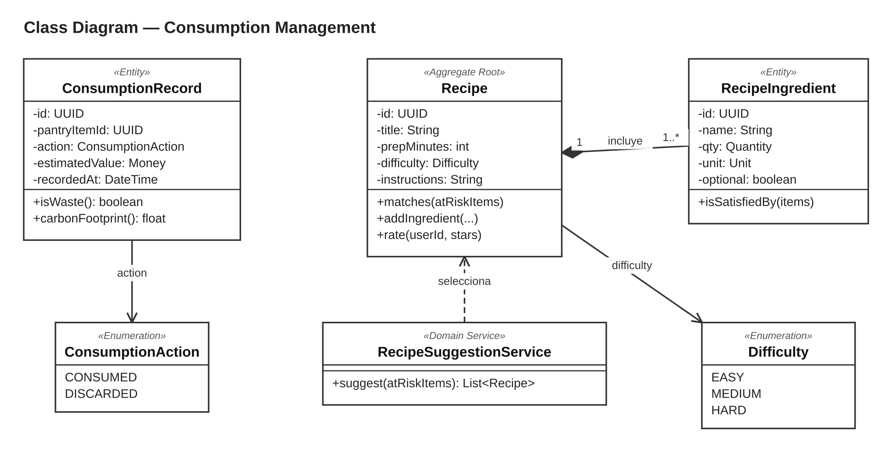
<figcaption style="font-size:0.9em;color:#555;margin-top:0.4em"><em>Class Diagram (Domain Layer) — Consumption Management.</em></figcaption>
</figure>

##### 4.2.6.6.2. Bounded Context Database Design Diagram

<figure id="fig-er-con" style="margin:1.5em 0;text-align:center">
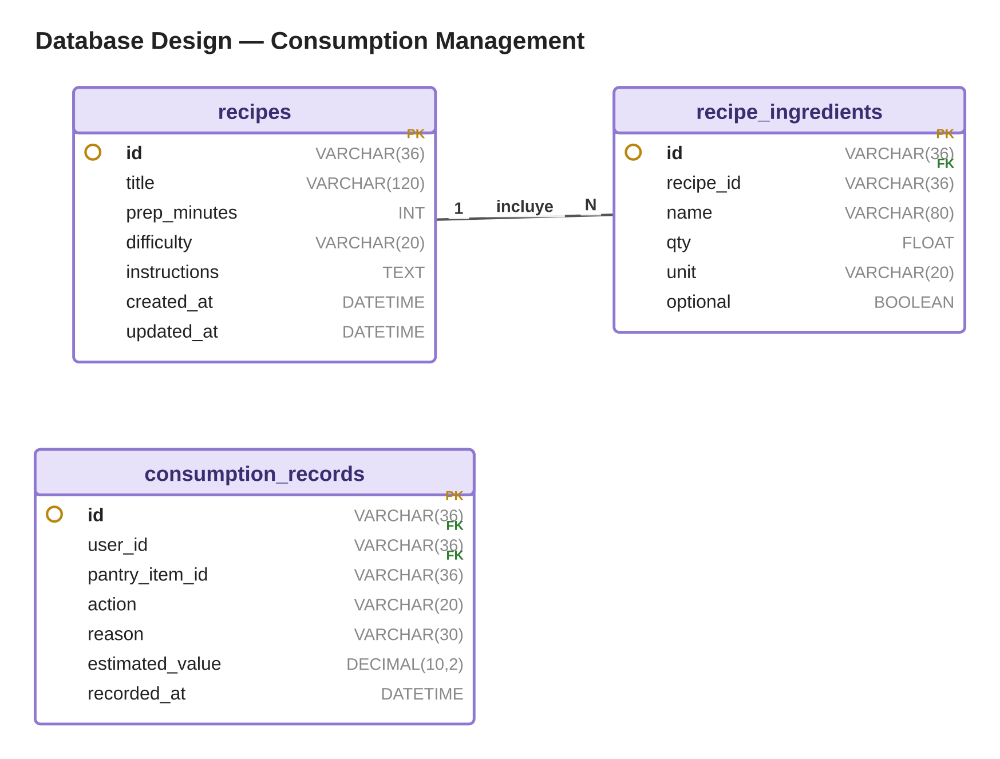
<figcaption style="font-size:0.9em;color:#555;margin-top:0.4em"><em>Database Design Diagram — Consumption Management.</em></figcaption>
</figure>

### 4.2.7 Bounded Context: IoT Monitoring

El **IoT Monitoring Bounded Context** es el núcleo de la integración IoT del producto. Recibe la telemetría del dispositivo FreshSense mediante el endpoint REST seguro definido en la **TS41**, evalúa las lecturas contra los umbrales de cada alimento a través del `FreshnessService` del modelo de dominio, y emite las alertas preventivas de la **US08**, respetando el **Modo Vacaciones** de la **US32**. Este contexto traduce la señal física (temperatura, humedad, etileno) en conocimiento de negocio: el estado de frescura del alimento.

#### 4.2.7.1. Domain Layer

La Domain Layer del IoT Monitoring Bounded Context encapsula la lógica de negocio del contexto. En esta capa se definen los agregados, entidades, objetos de valor, servicios de dominio y políticas que representan los conceptos clave del sistema.

**Aggregates**

1. **SensorReading**
   - *Propósito:* Agregado raíz que representa una lectura de telemetría enviada por el dispositivo FreshSense.

   - *Atributos:*
| Atributo | Tipo | Descripción |
|---|---|---|
| id | UUID | Identificador de la lectura. |
| deviceId | UUID | Dispositivo que la originó. |
| timestamp | DateTime | Instante de la medición. |
| temperatureC | float | Temperatura en grados Celsius. |
| humidityPct | float | Humedad relativa en porcentaje. |
| ethylenePpm | float | Concentración de gas etileno en ppm. |
| meta | String | Metadatos del envío (versión de firmware, calidad de señal). |
   - *Métodos:*
| Método | Descripción |
|---|---|
| isValid() | Valida que los rangos de las tres magnitudes sean físicamente posibles. |
| exceeds(ShelfLifeRules) | Indica si la lectura supera los umbrales de la categoría del alimento. |
| toQualityRecord() | Proyecta la lectura al histórico de calidad consultado en los reportes. |
**Entities**

1. **ExpirationAlert** — Alerta generada cuando un alimento entra en riesgo de deterioro (US08).

| Atributo | Tipo | Descripción |
|---|---|---|
| id | UUID | Identificador de la alerta. |
| pantryItemId | UUID | Alimento afectado. |
| raisedAt | DateTime | Momento en que se emitió. |
| type | AlertType (VO) | NEARING_EXPIRY, HIGH_ETHYLENE o TEMP_RISK. |
| status | AlertStatus (VO) | OPEN, SENT, SNOOZED o RESOLVED. |
| meta | String | Valores que motivaron la alerta. |
| Método | Descripción |
|---|---|
| resolve() | Marca la alerta como resuelta cuando el alimento se consume o descarta. |
| snooze(until) | Pospone la alerta según las preferencias del usuario (US09). |
| markSent() | Registra que la notificación fue despachada. |
2. **ThresholdProfile** — Perfil de umbrales aplicado a una zona, incluido el Modo Vacaciones (US32).

| Atributo | Tipo | Descripción |
|---|---|---|
| id | UUID | Identificador del perfil. |
| zoneId | UUID | Zona de almacenamiento a la que aplica. |
| maxTemperatureC | float | Temperatura máxima tolerada. |
| maxEthylenePpm | float | Concentración máxima de etileno tolerada. |
| vacationMode | boolean | Indica si el modo de baja sensibilidad está activo (US32). |
| Método | Descripción |
|---|---|
| applyVacationMode() | Recalibra los umbrales al no abrirse la puerta durante 24 horas. |
| evaluate(SensorReading) | Determina si la lectura constituye una desviación. |
**Value Objects**

| Value Object | Descripción |
|---|---|
| AlertType | Enumeración: `NEARING_EXPIRY`, `HIGH_ETHYLENE`, `TEMP_RISK`. |
| AlertStatus | Enumeración: `OPEN`, `SENT`, `SNOOZED`, `RESOLVED`. |
| FreshnessStatus | Enumeración compartida con Inventory: `FRESH`, `AT_RISK`, `SPOILED` (Shared Kernel). |
| Severity | Nivel de la alerta empleado para decidir el canal de entrega (US24). |

**Domain Services**

| Servicio | Descripción |
|---|---|
| FreshnessService | Servicio de dominio central del modelo: `evaluate(PantryItem, SensorReading*)` determina el `FreshnessStatus` y `estimateBestBefore(PantryItem, FoodModel, SensorReading*)` ajusta la fecha de consumo preferente con la telemetría real. |
| ThresholdEvaluationService | Compara cada lectura con el `ThresholdProfile` vigente y decide si corresponde emitir una alerta. |

**Domain Events**

| Evento | Descripción |
|---|---|
| SensorReadingRegistered | Se persistió una lectura del dispositivo (ES: *registrar humedad / temperatura / etileno*). |
| FoodConditionUpdated | El `FreshnessService` recalculó el estado del alimento (ES: *estado del alimento actualizado*). |
| EthyleneAlertIssued | La concentración de etileno superó el umbral y se emitió la alerta (ES: *alerta emitida*). |
| TemperatureAlertIssued | La temperatura salió del rango tolerado de la zona. |
| AlertResolved | La alerta se cerró al consumirse o descartarse el alimento. |
| VacationModeActivated | Se recalibraron los umbrales por ausencia prolongada (US32). |

**Policies**

- **Emitir alerta al superar umbrales**: cuando los valores del sensor superan los umbrales configurados, se emite una alerta de expiración (US08).
- **Evitar falsas alarmas**: cuando no existen desviaciones en los parámetros, el chequeo periódico no emite ninguna notificación (US08).
- **Recalibrar en Modo Vacaciones**: cuando transcurren más de 24 horas sin apertura de puerta, se ajusta la sensibilidad del etileno (US32).
- **Respetar el horario de silencio**: cuando una alerta de baja severidad cae en el rango de quietud, se retiene hasta que finalice (US09).

#### 4.2.7.2. Interface Layer

La Interface Layer del IoT Monitoring expone los puntos de entrada del contexto mediante controladores REST, recursos y *assemblers* que traducen entre el modelo HTTP y el modelo de dominio.

**Controllers**

1. **SensorReadingsController** — Endpoint de ingesta de telemetría del dispositivo IoT (TS41).

| Método | Endpoint | Descripción |
|---|---|---|
| POST | /api/v1/sensor-readings | Recibe un JSON con temperatura, humedad y etileno; valida el token del dispositivo y responde 201. |
| GET | /api/v1/sensor-readings | Consulta el histórico de lecturas por dispositivo y periodo. |
   - *Dependencias:* MonitoringCommandService, MonitoringQueryService

2. **AlertsController** — Expone y gestiona las alertas de expiración (US08).

| Método | Endpoint | Descripción |
|---|---|---|
| GET | /api/v1/alerts | Lista las alertas abiertas del usuario. |
| POST | /api/v1/alerts/{id}/snooze | Pospone la alerta según las preferencias (US09). |
| POST | /api/v1/alerts/{id}/resolve | Marca la alerta como resuelta. |
   - *Dependencias:* AlertCommandService, AlertQueryService

3. **ThresholdsController** — Configura los umbrales y el Modo Vacaciones (US32).

| Método | Endpoint | Descripción |
|---|---|---|
| GET | /api/v1/thresholds/{zoneId} | Obtiene el perfil de umbrales de la zona. |
| PUT | /api/v1/thresholds/{zoneId} | Actualiza los umbrales o activa el Modo Vacaciones. |
   - *Dependencias:* ThresholdCommandService

**Resources**

| Resource | Campos |
|---|---|
| SensorReadingResource | deviceId, timestamp, temperatureC, humidityPct, ethylenePpm, meta |
| AlertResource | id, pantryItemId, type, status, raisedAt, meta |
| ThresholdProfileResource | zoneId, maxTemperatureC, maxEthylenePpm, vacationMode |
| QualityHistoryResource | deviceId, period, avgTemperature, avgHumidity, maxEthylene |

**Transformers / Assemblers**

| Assembler | Transformación |
|---|---|
| SensorReadingCommandFromResourceAssembler | Convierte el JSON entrante del dispositivo en `RegisterSensorReadingCommand` (TS41). |
| AlertResourceFromEntityAssembler | Convierte `ExpirationAlert` en `AlertResource`. |
| ThresholdProfileResourceFromEntityAssembler | Convierte `ThresholdProfile` en su recurso. |

#### 4.2.7.3 Application Layer

La Application Layer del IoT Monitoring coordina las operaciones entre la Interface Layer y la Domain Layer, orquestando comandos, consultas y la reacción a eventos de otros contextos.

**Command Services**

| Servicio | Comandos que maneja | Descripción |
|---|---|---|
| MonitoringCommandServiceImpl | RegisterSensorReadingCommand | Valida el token del dispositivo, persiste la lectura y dispara la evaluación de frescura (TS41). |
| AlertCommandServiceImpl | IssueAlertCommand, SnoozeAlertCommand, ResolveAlertCommand | Emite, pospone y cierra las alertas de expiración (US08, US09). |
| ThresholdCommandServiceImpl | UpdateThresholdsCommand, ActivateVacationModeCommand | Ajusta los umbrales por zona y activa el Modo Vacaciones (US32). |

**Query Services / Facades**

| Servicio | Consultas | Descripción |
|---|---|---|
| MonitoringQueryServiceImpl | GetReadingsByDeviceQuery, GetQualityHistoryQuery | Recupera el histórico de telemetría y las métricas agregadas de calidad. |
| AlertQueryServiceImpl | GetOpenAlertsQuery, GetAlertsByItemQuery | Recupera las alertas vigentes del usuario. |
| MonitoringContextFacade | getQualityHistory(householdId, period), getOpenAlerts(userId) | Open Host Service consultado por Report Management e Inventory Management. |

**Event Handlers**

| Handler | Evento que escucha | Reacción |
|---|---|---|
| SensorConfiguredEventHandler | SensorConfigured (Sensor Management) | Crea el `ThresholdProfile` inicial de la zona con los umbrales por defecto de sus alimentos. |
| FoodItemRegisteredEventHandler | FoodItemRegistered (Inventory Management) | Asocia el nuevo alimento a la zona monitoreada y comienza a evaluarlo. |
| PantryItemResolvedEventHandler | FoodItemConsumed / FoodItemDiscarded (Inventory Management) | Cierra automáticamente las alertas abiertas del alimento (`AlertResolved`). |

#### 4.2.7.4. Infrastructure Layer

La Infrastructure Layer del IoT Monitoring implementa la persistencia y las integraciones técnicas (ACL) hacia otros contextos y sistemas externos.

| Componente | Tipo | Responsabilidad |
|---|---|---|
| SensorReadingRepository | JPA Repository | Persistencia de la telemetría; `findByDeviceIdAndTsBetween`. |
| ExpirationAlertRepository | JPA Repository | Persistencia de alertas; `findByStatus`, `findByPantryItemId`. |
| ThresholdProfileRepository | JPA Repository | Persistencia de los perfiles de umbrales por zona. |
| DeviceTokenValidator | ACL entrante | Valida el token del dispositivo antes de aceptar la lectura (TS41). |
| NotificationGatewayAdapter | ACL saliente | Despacha la alerta a la cola de eventos del Notification Service (TS42). |
| FreshnessEvaluationScheduler | Spring Scheduler | Ejecuta el chequeo periódico de frescura sobre los alimentos activos. |

#### 4.2.7.5. Bounded Context Software Architecture Component Level Diagrams

<figure id="fig-comp-mon" style="margin:1.5em 0;text-align:center">

<figcaption style="font-size:0.9em;color:#555;margin-top:0.4em"><em>Component Level Diagram — IoT Monitoring.</em></figcaption>
</figure>

#### 4.2.7.6. Bounded Context Software Architecture Code Level Diagrams

##### 4.2.7.6.1. Bounded Context Domain Layer Class Diagrams

<figure id="fig-class-mon" style="margin:1.5em 0;text-align:center">
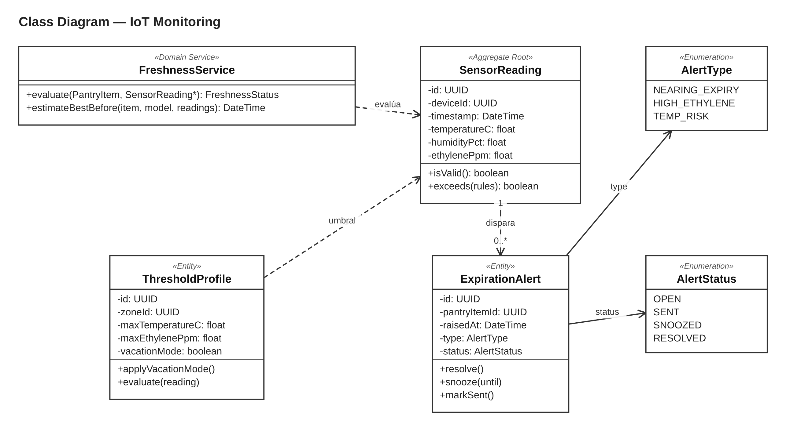
<figcaption style="font-size:0.9em;color:#555;margin-top:0.4em"><em>Class Diagram (Domain Layer) — IoT Monitoring.</em></figcaption>
</figure>

##### 4.2.7.6.2. Bounded Context Database Design Diagram

<figure id="fig-er-mon" style="margin:1.5em 0;text-align:center">
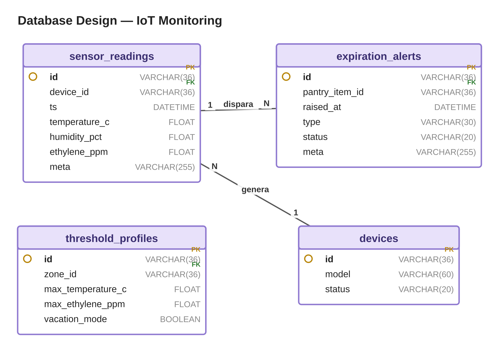
<figcaption style="font-size:0.9em;color:#555;margin-top:0.4em"><em>Database Design Diagram — IoT Monitoring.</em></figcaption>
</figure>

### 4.2.8 Bounded Context: Report Management

El **Report Management Bounded Context** consolida la información de los demás contextos para producir los **reportes de consumo y sostenibilidad**: el informe semanal de hábitos (**US12**), la analítica avanzada de rotación (**US17**), el panel de ahorro económico (**US18**) y las métricas de impacto ecológico en kg de CO₂ evitado (**US20**). Genera los archivos descargables en PDF y Excel con JasperReports y Apache POI, y expone la información al Analytics Service externo.

#### 4.2.8.1. Domain Layer

La Domain Layer del Report Management Bounded Context encapsula la lógica de negocio del contexto. En esta capa se definen los agregados, entidades, objetos de valor, servicios de dominio y políticas que representan los conceptos clave del sistema.

**Aggregates**

1. **ConsumptionReport**
   - *Propósito:* Agregado raíz que representa un reporte consolidado de consumo, merma y ahorro para un periodo determinado.

   - *Atributos:*
| Atributo | Tipo | Descripción |
|---|---|---|
| id | UUID | Identificador del reporte. |
| userId | UUID | Usuario o negocio destinatario. |
| period | Period (VO) | Rango de fechas cubierto (periodStart–periodEnd). |
| savedAmount | Money (VO) | Valor económico rescatado al consumir a tiempo (US18). |
| wasteReducedKgCO2 | float | Kilogramos de CO₂ evitados (US20). |
| sections | List&lt;ReportSection&gt; | Bloques del reporte: inventario, consumo, calidad. |
| createdAt | DateTime | Fecha de generación. |
   - *Métodos:*
| Método | Descripción |
|---|---|
| generate(inventory, consumption, quality) | Construye el reporte a partir de los tres contextos fuente. |
| exportTo(format) | Exporta el reporte a PDF o Excel (US29). |
| isPremiumOnly() | Indica si el nivel de detalle requiere plan PREMIUM (US17). |
**Entities**

1. **ReportSection** — Bloque temático del reporte con sus métricas calculadas.

| Atributo | Tipo | Descripción |
|---|---|---|
| id | UUID | Identificador de la sección. |
| reportId | UUID | Reporte al que pertenece. |
| type | SectionType (VO) | INVENTORY, CONSUMPTION, QUALITY o SUSTAINABILITY. |
| metricsJson | String | Métricas calculadas serializadas. |
| order | int | Posición dentro del reporte. |
| Método | Descripción |
|---|---|
| render(format) | Produce la representación de la sección en el formato solicitado. |
**Value Objects**

| Value Object | Descripción |
|---|---|
| Period | Rango de fechas con inicio y fin; valida que el fin sea posterior al inicio. |
| Money | Importe con moneda, usado para el ahorro estimado (US18). |
| SectionType | Enumeración: `INVENTORY`, `CONSUMPTION`, `QUALITY`, `SUSTAINABILITY`. |
| ExportFormat | Enumeración: `PDF`, `XLSX`, `CSV` (US29). |

**Domain Services**

| Servicio | Descripción |
|---|---|
| ReportAssemblyService | Orquesta la consulta a Inventory, Consumption e IoT Monitoring y arma las secciones del reporte. |
| SustainabilityMetricsService | Convierte los kilogramos de alimento salvado en CO₂ evitado y litros de agua preservados (US20). |

**Domain Events**

| Evento | Descripción |
|---|---|
| ReportRequested | El usuario solicitó un reporte (ES: *solicitar reporte*). |
| ReportGenerated | El reporte se construyó y quedó disponible (ES: *reporte generado*). |
| WeeklyReportSent | Se despachó el resumen semanal al correo del usuario (US12). |
| ReportExported | El usuario descargó el reporte en PDF, Excel o CSV (US29). |

**Policies**

- **Emitir reporte semanal**: cuando se cumple el ciclo de 7 días, el servidor consolida los datos y envía un resumen gráfico al correo y al panel (US12).
- **Verificar plan antes de la analítica avanzada**: cuando un usuario sin PREMIUM solicita la rotación detallada, el acceso se bloquea (US17).
- **Calcular impacto ambiental**: cuando se genera el reporte, se estima el CO₂ evitado a partir de los alimentos consumidos a tiempo (US20).

#### 4.2.8.2. Interface Layer

La Interface Layer del Report Management expone los puntos de entrada del contexto mediante controladores REST, recursos y *assemblers* que traducen entre el modelo HTTP y el modelo de dominio.

**Controllers**

1. **ReportsController** — Genera y expone los reportes de consumo y sostenibilidad.

| Método | Endpoint | Descripción |
|---|---|---|
| GET | /api/v1/reports | Lista los reportes generados del usuario. |
| POST | /api/v1/reports | Genera un reporte para el periodo indicado (US12). |
| GET | /api/v1/reports/{id} | Obtiene el detalle del reporte y sus secciones. |
| GET | /api/v1/reports/{id}/export | Descarga el reporte en PDF, Excel o CSV (US29). |
   - *Dependencias:* ReportCommandService, ReportQueryService

2. **AnalyticsController** — Expone la analítica avanzada y el panel de ahorro (US17, US18).

| Método | Endpoint | Descripción |
|---|---|---|
| GET | /api/v1/analytics/rotation | Gráficos de rotación de inventario (solo PREMIUM). |
| GET | /api/v1/analytics/savings | Ahorro acumulado estimado en moneda local. |
| GET | /api/v1/analytics/sustainability | Métricas de CO₂ evitado y agua preservada (US20). |
   - *Dependencias:* ReportQueryService

**Resources**

| Resource | Campos |
|---|---|
| ReportResource | id, period, savedAmount, wasteReducedKgCO2, sections[], createdAt |
| ReportSectionResource | type, metrics, order |
| CreateReportResource | periodStart, periodEnd, scope |
| SustainabilityResource | kgCO2Avoided, litersWaterSaved, itemsSaved |

**Transformers / Assemblers**

| Assembler | Transformación |
|---|---|
| ReportResourceFromEntityAssembler | Convierte `ConsumptionReport` y sus secciones en `ReportResource`. |
| SustainabilityResourceFromEntityAssembler | Convierte las métricas ambientales en su recurso. |
| CreateReportCommandFromResourceAssembler | Convierte `CreateReportResource` en `GenerateReportCommand`. |

#### 4.2.8.3 Application Layer

La Application Layer del Report Management coordina las operaciones entre la Interface Layer y la Domain Layer, orquestando comandos, consultas y la reacción a eventos de otros contextos.

**Command Services**

| Servicio | Comandos que maneja | Descripción |
|---|---|---|
| ReportCommandServiceImpl | GenerateReportCommand, ExportReportCommand | Construye el reporte consultando los contextos fuente y genera el archivo descargable. |
| WeeklyReportSchedulerImpl | SendWeeklyReportCommand | Consolida y despacha el resumen semanal de hábitos al correo del usuario (US12). |

**Query Services / Facades**

| Servicio | Consultas | Descripción |
|---|---|---|
| ReportQueryServiceImpl | GetReportsByUserQuery, GetReportByIdQuery, GetSustainabilityMetricsQuery | Recupera los reportes generados y las métricas de impacto ambiental. |
| AnalyticsQueryServiceImpl | GetRotationAnalyticsQuery, GetSavingsQuery | Recupera la analítica avanzada y el ahorro acumulado, previa verificación del plan (US17, US18). |
| ReportContextFacade | getLatestReport(userId) | Open Host Service consultado por el Analytics Service externo. |

**Event Handlers**

| Handler | Evento que escucha | Reacción |
|---|---|---|
| ConsumptionRegisteredEventHandler | ConsumptionRegistered (Consumption Management) | Acumula el valor rescatado y actualiza las métricas del periodo en curso. |
| WasteRegisteredEventHandler | WasteRegistered (Consumption Management) | Acumula la merma y recalcula la huella de carbono del periodo (US20). |
| WeeklyCycleEventHandler | WeeklyCycleCompleted (Spring Scheduler) | Dispara `SendWeeklyReportCommand` para generar y enviar el resumen (US12). |

#### 4.2.8.4. Infrastructure Layer

La Infrastructure Layer del Report Management implementa la persistencia y las integraciones técnicas (ACL) hacia otros contextos y sistemas externos.

| Componente | Tipo | Responsabilidad |
|---|---|---|
| ConsumptionReportRepository | JPA Repository | Persistencia de reportes; `findByUserIdAndPeriod`. |
| ReportSectionRepository | JPA Repository | Persistencia de las secciones de cada reporte. |
| JasperPdfExporter | Servicio técnico | Genera el reporte en PDF con JasperReports. |
| ApachePoiExcelExporter | Servicio técnico | Genera el reporte en Excel con Apache POI (US29). |
| ExternalInventoryService | ACL entrante | Consulta el `InventoryContextFacade` para el snapshot de inventario. |
| ExternalConsumptionService | ACL entrante | Consulta el `ConsumptionContextFacade` para el resumen de consumo. |
| ExternalMonitoringService | ACL entrante | Consulta el `MonitoringContextFacade` para el histórico de calidad. |
| AnalyticsServiceAdapter | ACL saliente | Publica las métricas consolidadas al Analytics Service externo. |

#### 4.2.8.5. Bounded Context Software Architecture Component Level Diagrams

<figure id="fig-comp-rep" style="margin:1.5em 0;text-align:center">

<figcaption style="font-size:0.9em;color:#555;margin-top:0.4em"><em>Component Level Diagram — Report Management.</em></figcaption>
</figure>

#### 4.2.8.6. Bounded Context Software Architecture Code Level Diagrams

##### 4.2.8.6.1. Bounded Context Domain Layer Class Diagrams

<figure id="fig-class-rep" style="margin:1.5em 0;text-align:center">
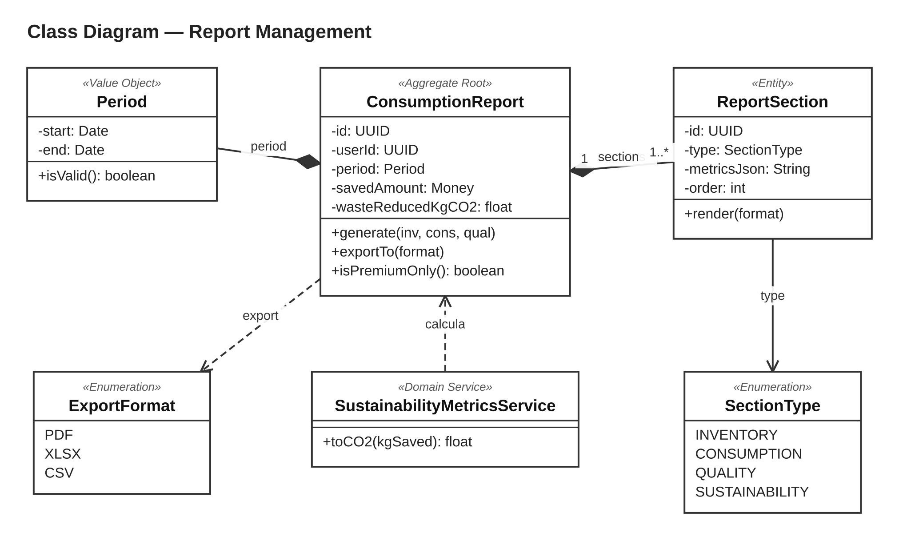
<figcaption style="font-size:0.9em;color:#555;margin-top:0.4em"><em>Class Diagram (Domain Layer) — Report Management.</em></figcaption>
</figure>

##### 4.2.8.6.2. Bounded Context Database Design Diagram

<figure id="fig-er-rep" style="margin:1.5em 0;text-align:center">
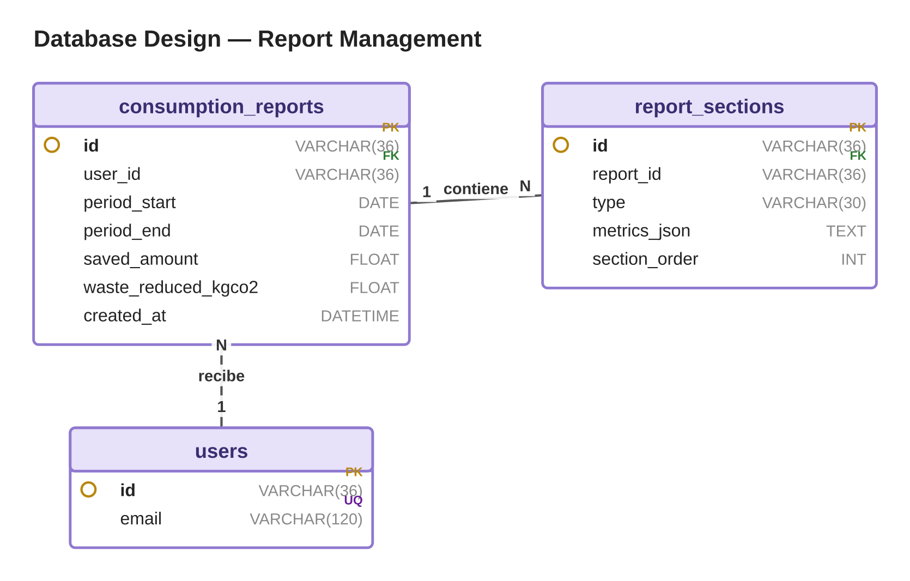
<figcaption style="font-size:0.9em;color:#555;margin-top:0.4em"><em>Database Design Diagram — Report Management.</em></figcaption>
</figure>

# Capítulo V: Solution UI/UX Design

## 5.1. Style Guidelines

### 5.1.1. General Style Guidelines

### 5.1.2. Web, Mobile and IoT Style Guidelines

## 5.2. Information Architecture

### 5.2.1. Organization Systems

### 5.2.2. Labeling Systems

### 5.2.3. SEO Tags and Meta Tags

### 5.2.4. Searching Systems

### 5.2.5. Navigation Systems

## 5.3. Landing Page UI Design

### 5.3.1. Landing Page Wireframe

### 5.3.2. Landing Page Mock-up

## 5.4. Applications UX/UI Design

### 5.4.1. Applications Wireframes

### 5.4.2. Applications Wireflow Diagrams

### 5.4.2. Applications Mock-ups

### 5.4.3. Applications User Flow Diagrams

## 5.5. Applications Prototyping

## 5.6. IoT Device Design

# Capítulo VI: Product Implementation, Validation & Deployment

## 6.1. Software Configuration Management

### 6.1.1. Software Development Environment Configuration

### 6.1.2. Source Code Management

### 6.1.3. Source Code Style Guide & Conventions

### 6.1.4. Software Deployment Configuration

## 6.2. Landing Page, Services & Applications Implementation

### 6.2.X. Sprint n

#### 6.2.X.1. Sprint Planning n

#### 6.2.X.2. Aspect Leaders and Collaborators

#### 6.2.X.3. Sprint Backlog n

#### 6.2.X.4. Development Evidence for Sprint Review

#### 6.2.X.5. Testing Suite Evidence for Sprint Review

#### 6.2.X.6. Execution Evidence for Sprint Review

#### 6.2.X.7. Services Documentation Evidence for Sprint Review

#### 6.2.X.8. Software Deployment Evidence for Sprint Review

#### 6.2.X.9. Team Collaboration Insights during Sprint

## 6.3. Validation Interviews

### 6.3.1. Diseño de Entrevistas

### 6.3.2. Registro de Entrevistas

### 6.3.3. Evaluaciones según heurísticas

## 6.4. Video About-the-Product

## Conclusiones

## Conclusiones y recomendaciones

## Video About-the-Team
## Bibliografía
## Anexos
