

<h3>Universidad Peruana de Ciencias Aplicadas</h3>

<strong>Facultad de Ingeniería</strong> 
<strong>Carrera: Ingeniería de Software</strong> 

<strong>Periodo:</strong> 202620 
<strong>Codigo del curso:</strong>  1ASI057  
<strong>Nombre del curso:</strong>  Desarrollo de Soluciones IoT 
<strong>NRC:</strong> 8725  

<strong>Nombre del profesor:</strong> Marco Antonio León Baca  

 <strong>*Informe de Trabajo Final*</strong>  

<strong>Nombre del startup: </strong>FreshEat 
<strong>Nombre del producto: </strong>FreshSense 

### Relación de Integrantes

| Apellidos y Nombres                  |   Código    |
|:------------------------------------:|:-----------:|
| Tuesta Marin, Romina Alejandra       | U202211706  |

<strong> Septiembre 2026</strong> 

# Project Report Collaboration Insights

**AV1:**

# Registro de Versiones del Informe

| Versión | Fecha      | Autor        | Descripción de modificación                   |
|---------|------------|--------------|-----------------------------------------------|
| 1.0     | 08/09/2026 | Romina Tuesta Marin | Cargó archivos, Descripción de la Startup|

# Tabla de contenidos

- [Student Outcome](#student-outcome)

- [Capítulo I: Introducción](#capítulo-i-introducción)
  - [1.1. Startup Profile](#11-startup-profile)
    - [1.1.1. Descripción de la Startup](#111-descripción-de-la-startup)
    - [1.1.2. Perfiles de integrantes del equipo](#112-perfiles-de-integrantes-del-equipo)
  - [1.2. Solution Profile](#12-solution-profile)
    - [1.2.1. Antecedentes y problemática](#121-antecedentes-y-problemática)
    - [1.2.2. Lean UX Process](#122-lean-ux-process)
      - [1.2.2.1. Lean UX Problem Statements](#1221-lean-ux-problem-statements)
      - [1.2.2.2. Lean UX Assumptions](#1222-lean-ux-assumptions)
      - [1.2.2.3. Lean UX Hypothesis Statements](#1223-lean-ux-hypothesis-statements)
      - [1.2.2.4. Lean UX Canvas](#1224-lean-ux-canvas)
  - [1.3. Segmentos objetivo](#13-segmentos-objetivo)

- [Capítulo II: Requirements Elicitation & Analysis](#capítulo-ii-requirements-elicitation--analysis)
  - [2.1. Competidores](#21-competidores)
    - [2.1.1. Análisis competitivo](#211-análisis-competitivo)
    - [2.1.2. Estrategias y tácticas frente a competidores](#212-estrategias-y-tácticas-frente-a-competidores)
  - [2.2. Entrevistas](#22-entrevistas)
    - [2.2.1. Diseño de entrevistas](#221-diseño-de-entrevistas)
    - [2.2.2. Registro de entrevistas](#222-registro-de-entrevistas)
    - [2.2.3. Análisis de entrevistas](#223-análisis-de-entrevistas)
  - [2.3. Needfinding](#23-needfinding)
    - [2.3.1. User Personas](#231-user-personas)
    - [2.3.2. User Task Matrix](#232-user-task-matrix)
    - [2.3.3. User Journey Mapping](#233-user-journey-mapping)
    - [2.3.4. Empathy Mapping](#234-empathy-mapping)
  - [2.4. Big Picture EventStorming](#24-big-picture-eventstorming)
  - [2.5. Ubiquitous Language](#25-ubiquitous-language)

- [Capítulo III: Requirements Specification](#capítulo-iii-requirements-specification)
  - [3.1. User Stories](#31-user-stories)
  - [3.2. Impact Mapping](#32-impact-mapping)
  - [3.3. Product Backlog](#33-product-backlog)

- [Capítulo IV: Solution Software Design](#capítulo-iv-solution-software-design)
  - [4.1. Strategic-Level Domain-Driven Design](#41-strategic-level-domain-driven-design)
    - [4.1.1. Design-Level EventStorming](#411-design-level-eventstorming)
      - [4.1.1.1. Candidate Context Discovery](#4111-candidate-context-discovery)
      - [4.1.1.2. Domain Message Flows Modeling](#4112-domain-message-flows-modeling)
      - [4.1.1.3. Bounded Context Canvases](#4113-bounded-context-canvases)
    - [4.1.2. Context Mapping](#412-context-mapping)
    - [4.1.3. Software Architecture](#413-software-architecture)
      - [4.1.3.1. Software Architecture System Landscape Diagram](#4131-software-architecture-system-landscape-diagram)
      - [4.1.3.2. Software Architecture Context Level Diagrams](#4132-software-architecture-context-level-diagrams)
      - [4.1.3.2. Software Architecture Container Level Diagrams](#4132-software-architecture-container-level-diagrams)
      - [4.1.3.3. Software Architecture Deployment Diagrams](#4133-software-architecture-deployment-diagrams)
  - [4.2. Tactical-Level Domain-Driven Design](#42-tactical-level-domain-driven-design)
    - [4.2.X. Bounded Context: &lt;Bounded Context Name&gt;](#42x-bounded-context-bounded-context-name)
      - [4.2.X.1. Domain Layer](#42x1-domain-layer)
      - [4.2.X.2. Interface Layer](#42x2-interface-layer)
      - [4.2.X.3. Application Layer](#42x3-application-layer)
      - [4.2.X.4. Infrastructure Layer](#42x4-infrastructure-layer)
      - [4.2.X.5. Bounded Context Software Architecture Component Level Diagrams](#42x5-bounded-context-software-architecture-component-level-diagrams)
      - [4.2.X.6. Bounded Context Software Architecture Code Level Diagrams](#42x6-bounded-context-software-architecture-code-level-diagrams)
        - [4.2.X.6.1. Bounded Context Domain Layer Class Diagrams](#42x61-bounded-context-domain-layer-class-diagrams)
        - [4.2.X.6.2. Bounded Context Database Design Diagram](#42x62-bounded-context-database-design-diagram)

- [Capítulo V: Solution UI/UX Design](#capítulo-v-solution-uiux-design)
  - [5.1. Style Guidelines](#51-style-guidelines)
    - [5.1.1. General Style Guidelines](#511-general-style-guidelines)
    - [5.1.2. Web, Mobile and IoT Style Guidelines](#512-web-mobile-and-iot-style-guidelines)
  - [5.2. Information Architecture](#52-information-architecture)
    - [5.2.1. Organization Systems](#521-organization-systems)
    - [5.2.2. Labeling Systems](#522-labeling-systems)
    - [5.2.3. SEO Tags and Meta Tags](#523-seo-tags-and-meta-tags)
    - [5.2.4. Searching Systems](#524-searching-systems)
    - [5.2.5. Navigation Systems](#525-navigation-systems)
  - [5.3. Landing Page UI Design](#53-landing-page-ui-design)
    - [5.3.1. Landing Page Wireframe](#531-landing-page-wireframe)
    - [5.3.2. Landing Page Mock-up](#532-landing-page-mock-up)
  - [5.4. Applications UX/UI Design](#54-applications-uxui-design)
    - [5.4.1. Applications Wireframes](#541-applications-wireframes)
    - [5.4.2. Applications Wireflow Diagrams](#542-applications-wireflow-diagrams)
    - [5.4.2. Applications Mock-ups](#542-applications-mock-ups)
    - [5.4.3. Applications User Flow Diagrams](#543-applications-user-flow-diagrams)
  - [5.5. Applications Prototyping](#55-applications-prototyping)
  - [5.6. IoT Device Design](#56-iot-device-design)

- [Capítulo VI: Product Implementation, Validation & Deployment](#capítulo-vi-product-implementation-validation--deployment)
  - [6.1. Software Configuration Management](#61-software-configuration-management)
    - [6.1.1. Software Development Environment Configuration](#611-software-development-environment-configuration)
    - [6.1.2. Source Code Management](#612-source-code-management)
    - [6.1.3. Source Code Style Guide & Conventions](#613-source-code-style-guide--conventions)
    - [6.1.4. Software Deployment Configuration](#614-software-deployment-configuration)
  - [6.2. Landing Page, Services & Applications Implementation](#62-landing-page-services--applications-implementation)
    - [6.2.X. Sprint n](#62x-sprint-n)
      - [6.2.X.1. Sprint Planning n](#62x1-sprint-planning-n)
      - [6.2.X.2. Aspect Leaders and Collaborators](#62x2-aspect-leaders-and-collaborators)
      - [6.2.X.3. Sprint Backlog n](#62x3-sprint-backlog-n)
      - [6.2.X.4. Development Evidence for Sprint Review](#62x4-development-evidence-for-sprint-review)
      - [6.2.X.5. Testing Suite Evidence for Sprint Review](#62x5-testing-suite-evidence-for-sprint-review)
      - [6.2.X.6. Execution Evidence for Sprint Review](#62x6-execution-evidence-for-sprint-review)
      - [6.2.X.7. Services Documentation Evidence for Sprint Review](#62x7-services-documentation-evidence-for-sprint-review)
      - [6.2.X.8. Software Deployment Evidence for Sprint Review](#62x8-software-deployment-evidence-for-sprint-review)
      - [6.2.X.9. Team Collaboration Insights during Sprint](#62x9-team-collaboration-insights-during-sprint)
  - [6.3. Validation Interviews](#63-validation-interviews)
    - [6.3.1. Diseño de Entrevistas](#631-diseño-de-entrevistas)
    - [6.3.2. Registro de Entrevistas](#632-registro-de-entrevistas)
    - [6.3.3. Evaluaciones según heurísticas](#633-evaluaciones-según-heurísticas)
  - [6.4. Video About-the-Product](#64-video-about-the-product)

- [Conclusiones](#conclusiones)
- [Conclusiones y recomendaciones](#conclusiones-y-recomendaciones)
- [Video About-the-Team](#video-about-the-team)
- [Bibliografía](#bibliografía)
- [Anexos](#anexos)

## Student Outcome

El curso contribuye al cumplimiento del Student Outcome ABET:
ABET – EAC - Student Outcome 5
Criterio: La capacidad de funcionar efectivamente en un equipo cuyos miembros
juntos proporcionan liderazgo, crean un entorno de colaboración e inclusivo,
establecen objetivos, planifican tareas y cumplen objetivos.
En el siguiente cuadro se describe las acciones realizadas y enunciados de
conclusiones por parte del grupo, que permiten sustentar el haber alcanzado el logro
del ABET – EAC - Student Outcome 5.

| Criterio específico | Acciones realizadas | Conclusiones |
| :---- | :---- | :---- |
| Trabaja en equipo para proporcionar liderazgo en forma conjunta | **AV1:**   **Romina Tuesta Marin:** Se distribuyeron responsabilidades entre los integrantes según sus habilidades, coordinando las actividades de análisis, diseño, desarrollo y documentación. Asimismo, se tomaron decisiones de manera conjunta y se realizó seguimiento al avance de cada tarea.   | **AV1:**   El trabajo colaborativo permitió aprovechar las habilidades de cada integrante, mantener una participación activa y avanzar de manera coordinada hacia los objetivos del proyecto. |
| Crea un entorno colaborativo e inclusivo, establece metas, planifica tareas y cumple objetivos | **AV1:**   **Romina Tuesta Marin:** Se establecieron objetivos y tareas para cada integrante, organizando las actividades de acuerdo con las prioridades del proyecto. Se mantuvo una comunicación constante para resolver dudas, compartir avances y realizar ajustes cuando fue necesario. | **AV1:** La planificación y comunicación constante facilitaron la coordinación del equipo, permitiendo cumplir las actividades asignadas y mantener el avance del proyecto de acuerdo con los objetivos establecidos.|

## Capítulo I: Introducción

### 1.1. Startup Profilee

### 1.1.1. Descripción de la Startup

FreshSense es una startup de tecnología orientada a ayudar a restaurantes y negocios de alimentos fríos a reducir las pérdidas económicas ocasionadas por el deterioro y desperdicio de productos perecibles. La solución combina una aplicación de gestión de inventario con dispositivos de monitoreo para supervisar las condiciones de conservación de los alimentos y generar alertas oportunas ante situaciones que puedan afectar su calidad.

FreshSense permite a los negocios conocer el estado de sus productos, gestionar su inventario y recibir información que facilite la toma de decisiones sobre conservación, rotación y aprovechamiento de los alimentos. De esta manera, busca reducir las mermas, disminuir costos innecesarios y contribuir a mejorar la rentabilidad de los negocios.

La startup plantea un modelo de negocio basado en la comercialización de los dispositivos de monitoreo y una suscripción para acceder a funcionalidades avanzadas de la plataforma, como reportes, análisis del inventario y seguimiento de pérdidas.

### 1.1.2. Perfiles de integrantes del equipo

### 1.2. Solution Profile

### 1.2.1 Antecedentes y problemática

El desperdicio de alimentos es un problema grave en el Perú tanto a nivel económico como ambiental. Según la información explicada en el II Foro Nacional de la Recuperación de Alimentos y Conmemoración del Día de Concienciación sobre la Pérdida y el Desperdicio de Alimentos en el Perú, realizado por la FOA (Organización de la Naciones Unidas para la Alimentación y la Agricultura) junto con MIDAGRI (Ministerio de Desarrollo Agrario y Riego) y PMA (Programa Mundial de Alimentos), en el país, 12.8 millones de toneladas de alimentos se pierden en la cadena de producción (FOA, 2024). Es un número muy preocupante considerando que el 51% de las familias peruanas está en situación de inseguridad alimentaria (Blas, 2022). A partir de ello, es claro que hay una relaciónestrecha entre el desperdicio de alimentos y la inseguridad alimentaria; el gobierno se está encargando de mitigar tal desperdicio mediante foros, proyectos, etc. Teniendo en cuenta este contexto, Enrique Román, representante asistente de FAO en Perú señala que los hogares peruanos representan el 16% en el desperdicio de alimentos (FAO, 2024), un porcentaje alarmante. Más aún, acorde a Alberto Huiman, doctor en Ciencias Ambientales, cada peruano genera un desperdicio de 67 kilogramos por año y los restaurantes es alrededor de 500 kilogramos por día. Esto complica gravemente la situación del país respecto a las pérdidas en el aspecto de alimentos.  

Para analizar con más detalle los antecedentes y problemáticas, se realizó con anticipación la técnica 5 ‘W’s & 2 ‘H’s:

## What? (¿Qué es?)

FreshSense es una aplicación web orientada a restaurantes y negocios de alimentos fríos que permite monitorear y gestionar el inventario de productos perecibles. Mediante alertas y notificaciones, ayuda a detectar oportunamente condiciones que pueden ocasionar el deterioro de los alimentos, facilitando decisiones para reducir mermas y pérdidas económicas.

#### Why? (¿Por qué?)

La falta de información precisa y oportuna sobre las condiciones de conservación de los alimentos dificulta detectar su deterioro antes de que se convierta en una pérdida. Esto puede generar desperdicio de productos, costos de reposición y una reducción de la rentabilidad del negocio.

#### Where? (¿Dónde?)

FreshSense está orientada a restaurantes y negocios de alimentos fríos, principalmente en espacios donde se almacenan productos perecibles, como refrigeradores, congeladores, cámaras de frío y almacenes.

#### When? (¿Cuándo?)

El problema ocurre durante el almacenamiento y conservación de los productos, especialmente cuando permanecen durante periodos prolongados sin un monitoreo adecuado de sus condiciones. FreshSense permite realizar un seguimiento continuo y recibir alertas para tomar decisiones oportunas.

#### Who? (¿Quién?)

Los principales usuarios de FreshSense son los propietarios, administradores y encargados de restaurantes, así como los responsables de negocios de alimentos fríos que necesitan controlar la conservación de sus productos, reducir mermas y proteger la rentabilidad del negocio.

#### How? (¿Cómo?)

FreshSense busca facilitar la gestión y conservación de los productos mediante:

* Registro y gestión del inventario de alimentos.
* Monitoreo de condiciones de conservación mediante sensores.
* Alertas ante condiciones que puedan afectar los productos.
* Notificaciones sobre productos próximos a deteriorarse o vencer.
* Reportes sobre pérdidas, rotación y estado del inventario.
* Sugerencias para aprovechar productos antes de que representen una pérdida económica.
* Acceso a la información desde diferentes dispositivos.

#### How much? (¿Cuánto?)

El desperdicio y deterioro de alimentos representa una pérdida económica para los negocios, ya que implica desechar productos que fueron adquiridos para su comercialización o utilización. FreshSense busca reducir estas pérdidas mediante el monitoreo y gestión preventiva del inventario.

El modelo de negocio considera:

* Suscripción mensual o anual para acceder a funcionalidades avanzadas.
* Venta del dispositivo sensor como pago único.
* Funcionalidades premium orientadas al análisis del inventario y las pérdidas económicas.

### 1.2.2 Lean UX Process.

### 1.2.2.1. Lean UX Problem Statements.

Los restaurantes y negocios de alimentos fríos pueden sufrir pérdidas económicas debido al deterioro de productos perecibles que no es detectado oportunamente. La falta de monitoreo continuo de las condiciones de conservación dificulta tomar decisiones preventivas sobre el inventario, generando mermas, costos de reposición y reducción de la rentabilidad.

La gestión manual del inventario y las condiciones de conservación también dificulta conocer en tiempo real qué productos presentan mayor riesgo de deterioro y cuáles requieren atención prioritaria.

**Creemos que** reducir el desperdicio de alimentos permitirá a los negocios disminuir sus pérdidas económicas y mejorar su rentabilidad. **Sabremos que esto es cierto cuando** se observe una reducción medible de las pérdidas asociadas al deterioro de productos durante el periodo de evaluación.

**Creemos que** las alertas sobre condiciones de conservación y productos próximos a deteriorarse ayudarán a los usuarios a tomar decisiones oportunas. 
**Sabremos que esto es cierto cuando** los usuarios utilicen las alertas para realizar acciones preventivas sobre los productos identificados.

**Creemos que** permitir el acceso a la aplicación desde diferentes dispositivos facilitará el monitoreo del inventario durante la operación diaria. 
**Sabremos que esto es cierto cuando** los usuarios consulten regularmente el estado de sus productos desde al menos dos tipos de dispositivos.

**Creemos que** los reportes de pérdidas y rotación de inventario ayudarán a los administradores a identificar oportunidades para reducir mermas. **Sabremos que esto es cierto cuando** los usuarios consulten estos reportes para tomar decisiones relacionadas con su inventario.

### 1.2.2.2. Lean UX Assumptions.

##### Business Assumptions

* Creemos que nuestros usuarios necesitan una solución que les permita monitorear las condiciones de conservación de sus productos y gestionar su inventario para reducir pérdidas económicas. 

*  Estas necesidades pueden resolverse mediante una aplicación que centralice el inventario, las alertas de conservación y los reportes de pérdidas en una interfaz sencilla y accesible.

*  Nuestros clientes iniciales son restaurantes y negocios de alimentos fríos que manejan productos perecibles y buscan reducir mermas y proteger la rentabilidad de sus operaciones.

* El principal valor que el cliente requiere de FreshSense es conocer oportunamente el estado de sus productos para tomar decisiones antes de que estos representen una pérdida económica.

* Como beneficios adicionales, el cliente podrá acceder a reportes de inventario, análisis de pérdidas, alertas preventivas y recomendaciones para aprovechar productos próximos a deteriorarse.

* Adquiriremos clientes mediante una landing page, demostraciones del producto, marketing digital y estrategias de venta directa orientadas a los segmentos objetivo.

* Generaremos ingresos mediante la venta del dispositivo sensor y suscripciones para acceder a funcionalidades avanzadas.

* Nuestra competencia incluye métodos manuales de control de inventario, hojas de cálculo y sistemas genéricos de gestión de inventario.
  
* Nos diferenciaremos mediante una solución especializada en la conservación de productos perecibles, que combine monitoreo, alertas y gestión del inventario.

* Nuestros principales riesgos son la resistencia al cambio tecnológico, la preferencia por métodos manuales, el costo percibido de la solución y la dificultad para incorporar el sistema en las actividades diarias del negocio.

* Reduciremos estos riesgos mediante una interfaz sencilla, procesos de registro rápidos, funcionalidades enfocadas en las necesidades principales del usuario y una implementación que requiera la menor cantidad posible de cambios en su rutina.

* Sabremos que hemos tenido éxito cuando los negocios usuarios reduzcan sus pérdidas asociadas al deterioro de alimentos y utilicen regularmente la aplicación para gestionar su inventario.

##### Business Outcomes

* Reducir las pérdidas económicas ocasionadas por el deterioro de alimentos.
* Disminuir la merma de productos perecibles.
* Mejorar la rentabilidad de los negocios mediante una gestión eficiente del inventario.
* Lograr la adopción y retención de usuarios mediante una solución simple y útil.
* Generar ingresos recurrentes mediante la venta del dispositivo y suscripción premium.
* Validar un modelo de negocio escalable para restaurantes y negocios de alimentos fríos.

##### User Assumptions

###### ¿Quiénes serán nuestros usuarios?

**Nuestros usuarios principales son:**

* Propietarios y administradores de restaurantes que necesitan controlar sus insumos perecibles y reducir pérdidas económicas.
* Propietarios y encargados de negocios de alimentos fríos que necesitan monitorear la conservación de sus productos y reducir mermas.

###### ¿Dónde encaja nuestro producto en su vida o trabajo?

Para los restaurantes, FreshSense se integra en la gestión diaria de insumos, permitiendo conocer el estado de los productos, recibir alertas y tomar decisiones para evitar pérdidas.

Para los negocios de alimentos fríos, FreshSense se integra en el proceso de almacenamiento y conservación, proporcionando información sobre las condiciones de los productos y alertando ante situaciones que puedan generar pérdidas.

###### ¿Qué problemas tiene nuestro producto y cómo se pueden resolver?

**Problemas:**

* El control del inventario y conservación puede realizarse mediante inspecciones manuales o registros poco actualizados.
* Los usuarios pueden no detectar oportunamente condiciones que afectan la conservación de sus productos.
* El deterioro de alimentos genera merma, costos de reposición y reducción de la rentabilidad.
* El monitoreo manual consume tiempo durante las actividades operativas del negocio.

**Soluciones:**

* Implementar monitoreo de las condiciones de conservación.
* Generar alertas ante condiciones que puedan afectar los productos.
* Mostrar información del inventario de forma clara y accesible.
* Generar reportes que permitan identificar pérdidas y oportunidades de mejora.
* Facilitar decisiones preventivas para reducir la merma.

###### ¿Cómo y cuándo es usado nuestro producto?

FreshSense es utilizada por propietarios, administradores y encargados durante las actividades de almacenamiento, conservación y gestión del inventario. Los usuarios pueden consultar el estado de sus productos, recibir alertas y revisar información sobre pérdidas y rotación durante la jornada operativa.

###### ¿Qué características son importantes?

* Interfaz clara, sencilla y fácil de utilizar.
* Monitoreo de las condiciones de conservación.
* Alertas oportunas ante situaciones de riesgo.
* Gestión rápida del inventario.
* Reportes de pérdidas y rotación.
* Acceso desde diferentes dispositivos.

###### ¿Cómo debe verse y comportarse nuestro producto?

FreshSense debe presentar una interfaz profesional, clara y orientada a la consulta rápida de información crítica. La navegación debe permitir acceder fácilmente al estado del inventario, alertas y reportes sin requerir múltiples pasos.

La aplicación debe estar disponible durante la jornada operativa del negocio y permitir consultas desde dispositivos móviles y computadoras.

##### User Outcomes

* Reducción de pérdidas económicas por deterioro de alimentos.
* Reducción de productos desperdiciados o descartados.
* Mayor frecuencia de monitoreo del inventario.
* Identificación oportuna de productos en riesgo.
* Mejor planificación de compras y reposición.
* Mayor control sobre las condiciones de conservación.
* Mejora de la rentabilidad mediante la reducción de mermas.

##### Features Assumptions

**Desde la cuenta de un restaurante:**

* Registrar alimentos e ingredientes, incluyendo cantidad, fecha de vencimiento y costo.
* Recibir alertas sobre productos próximos a deteriorarse.
* Consultar las condiciones de conservación de los productos.
* Recibir sugerencias para aprovechar productos próximos a deteriorarse.
* Generar reportes de rotación y pérdidas.

**Desde la cuenta de un negocio de alimentos fríos:**

* Registrar productos y cantidades disponibles.
* Monitorear las condiciones de conservación.
* Recibir alertas ante cambios que puedan afectar los productos.
* Identificar productos próximos a deteriorarse o vencer.
* Consultar reportes sobre pérdidas, rotación y estado del inventario.

### 1.2.2.3. Lean UX Hypothesis Statements.

**Creemos que** los restaurantes y negocios de alimentos fríos necesitan una solución que les permita monitorear sus productos y detectar oportunamente condiciones que puedan generar pérdidas económicas.

**Creemos que** las alertas de deterioro y las sugerencias de comercialización ayudarán a los negocios a reducir la merma de productos.

**Creemos que** la carga rápida del inventario facilitará la adopción de la aplicación sin alterar significativamente las actividades diarias de los usuarios.

**Creemos que** los reportes de pérdidas y rotación ayudarán a los administradores a identificar oportunidades para reducir costos y mejorar la rentabilidad.

**Creemos que** una aplicación accesible desde diferentes dispositivos facilitará el monitoreo del inventario durante la operación diaria.

**Sabremos que estas hipótesis son válidas cuando** los usuarios utilicen regularmente las funcionalidades de monitoreo, alertas y reportes, y se observe una reducción medible de las pérdidas económicas asociadas al deterioro de alimentos.

### 1.2.2.4. Lean UX Canvas.

A continuación se presenta el Lean UX Canvas:

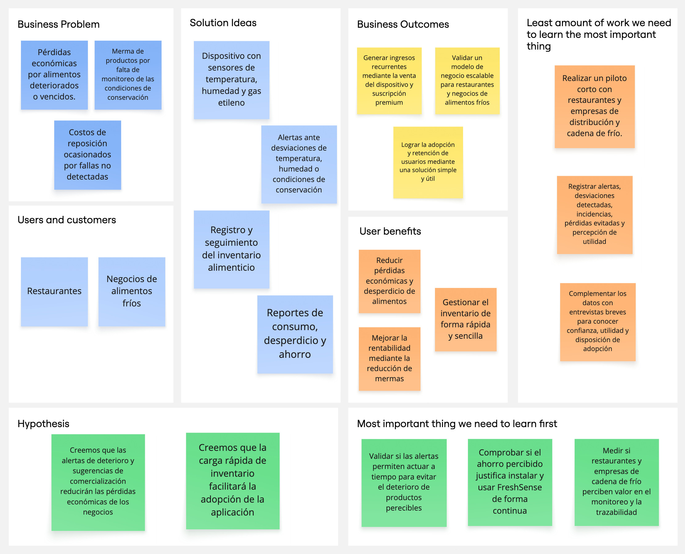

### 1.3. Segmentos objetivo.

Para el proyecto FreshSense se han seleccionado dos segmentos principales de usuarios a los cuales la solución aporta un valor adaptado a sus necesidades específicas:

##### Propietarios y Gerentes de Restaurantes Pequeños

**Edad:** 28 a 50 años

**Perfil:** Emprendedores que administran restaurantes pequeños y gestionan insumos perecibles para la preparación de alimentos.

**Estilo de vida:** Dinámico y enfocado en las operaciones diarias, atención al cliente y control del negocio.

**Uso de tecnología:** Frecuente, principalmente mediante dispositivos móviles y computadoras para realizar consultas rápidas.

**Necesidad principal:** Controlar y conservar adecuadamente los insumos perecibles para reducir desperdicios, pérdidas económicas y costos innecesarios.

**Beneficios buscados:** Alertas sobre productos en riesgo de deterioro, monitoreo de las condiciones de conservación, gestión del inventario y reportes que permitan identificar pérdidas y mejorar la rentabilidad.

##### Propietarios y Encargados de Negocios de Alimentos Fríos

**Edad:** 30 a 55 años

**Perfil:** Emprendedores y encargados de negocios dedicados al almacenamiento, conservación y comercialización de productos que requieren cadena de frío.

**Estilo de vida:** Ocupado y enfocado en la operación diaria, supervisión de productos, atención al cliente y gestión del inventario.

**Uso de tecnología:** Moderado a frecuente, con disposición a utilizar herramientas que faciliten el monitoreo y control de sus productos.

**Necesidad principal:** Mantener las condiciones adecuadas de conservación para reducir el deterioro de productos, las mermas y las pérdidas económicas.

**Beneficios buscados:** Monitoreo de las condiciones de conservación, alertas ante posibles riesgos, información sobre el estado del inventario y reportes que permitan identificar pérdidas y mejorar la rentabilidad del negocio.

Capítulo II: Requirements Elicitation & Analysis

2.1. Competidores.

2.1.1. Análisis competitivo.

2.1.2. Estrategias y tácticas frente a competidores.

2.2. Entrevistas.

2.2.1. Diseño de entrevistas.

2.2.2. Registro de entrevistas.

2.2.3. Análisis de entrevistas.

2.3. Needfinding.

### 2.3.1. User Personas.

#### SEGMENTO 1: Propietarios y Encargados de Negocios de Alimentos Fríos
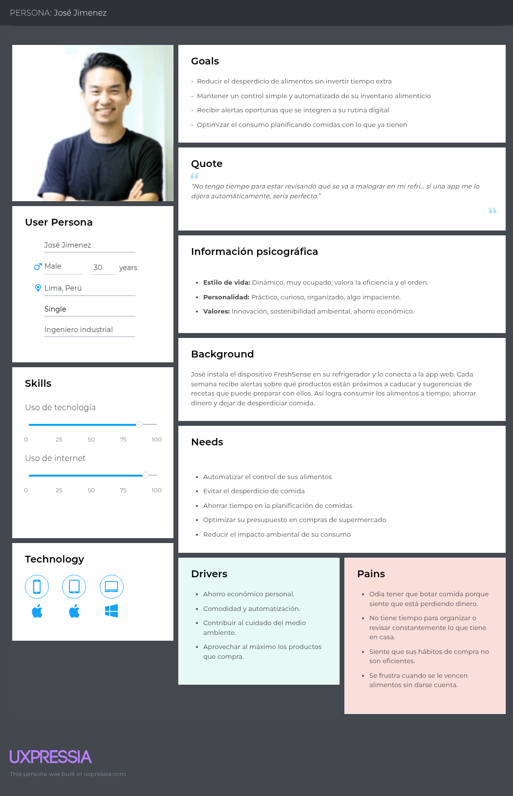

El perfil de José Jiménez representa a los adultos jóvenes con rutinas ocupadas que buscan optimizar su presupuesto alimentario sin invertir demasiado tiempo. Requiere un sistema automatizado para monitorear la caducidad de sus compras, evitando mermas económicas y simplificando la gestión del hogar.

### SEGMENTO 2: Pequeños negocios / emprendedores de alimentos caseros
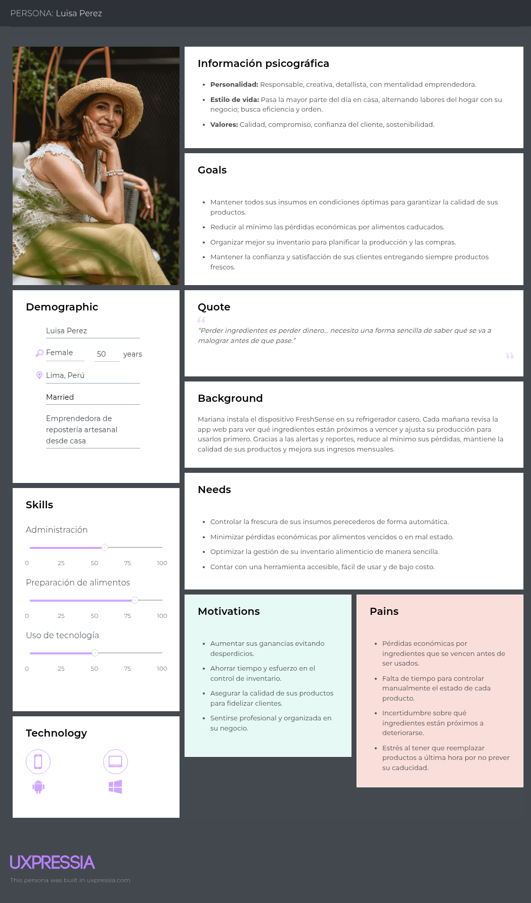

El perfil de Luisa Pérez representa a las emprendedoras de repostería y alimentos caseros que necesitan asegurar la frescura de sus insumos. Su prioridad es minimizar pérdidas financieras por ingredientes vencidos, garantizar estándares de calidad para sus clientes y llevar un control eficiente del inventario.

### 2.3.2. User Task Matrix

<table>
  <thead>
    <tr>
      <th rowspan="2">Tareas</th>
      <th colspan="2">José Jimenez (Propietarios de Negocios de Alimentos Fríos)</th>
      <th colspan="2">Luisa Pérez (Emprendedora de alimentos)</th>
    </tr>
    <tr>
      <th>Frecuencia</th>
      <th>Importancia</th>
      <th>Frecuencia</th>
      <th>Importancia</th>
    </tr>
  </thead>
  <tbody>
    <tr>
      <td><b>Revisar estado de alimentos en la app</b></td>
      <td>Casi siempre</td>
      <td>Muy alta</td>
      <td>Siempre</td>
      <td>Muy alta</td>
    </tr>
    <tr>
      <td><b>Recibir alertas de vencimiento</b></td>
      <td>Siempre</td>
      <td>Muy alta</td>
      <td>Siempre</td>
      <td>Muy alta</td>
    </tr>
    <tr>
      <td><b>Consultar recetas sugeridas</b></td>
      <td>A veces</td>
      <td>Alta</td>
      <td>Raramente</td>
      <td>Media</td>
    </tr>
    <tr>
      <td><b>Editar inventario manualmente</b></td>
      <td>Raramente</td>
      <td>Media</td>
      <td>Casi siempre</td>
      <td>Alta</td>
    </tr>
    <tr>
      <td><b>Revisar reportes semanales (ahorro, consumo)</b></td>
      <td>A veces</td>
      <td>Media</td>
      <td>Siempre</td>
      <td>Alta</td>
    </tr>
    <tr>
      <td><b>Compartir logros/impacto en redes sociales</b></td>
      <td>A veces</td>
      <td>Media</td>
      <td>Raramente</td>
      <td>Baja</td>
    </tr>
    <tr>
      <td><b>Usar notificaciones configurables (hora/frecuencia)</b></td>
      <td>Casi siempre</td>
      <td>Alta</td>
      <td>Casi siempre</td>
      <td>Alta</td>
    </tr>
    <tr>
      <td><b>Generar proyecciones de compra</b></td>
      <td>Nunca</td>
      <td>Baja</td>
      <td>Casi siempre</td>
      <td>Muy alta</td>
    </tr>
  </tbody>
</table>

El análisis de la matriz de tareas evidencia una clara diferencia en las prioridades operativas y patrones de uso entre ambos perfiles de usuario.

En el caso de José Jiménez, quien representa al público de adultos jóvenes con agendas ajustadas, el valor principal radica en la supervisión rápida de la frescura y la recepción de avisos de caducidad; ambas funcionalidades le resultan esenciales para evitar el desperdicio de comida y proteger su economía personal. Otras herramientas, como el catálogo de recetas recomendadas o la difusión de logros en plataformas digitales, son utilizadas de forma secundaria sin representar un factor crítico dentro de su rutina diaria.

Por su parte, Luisa Pérez, orientada a la gestión de su negocio de comida casera, enfoca su interacción en herramientas de control riguroso, tales como el monitoreo constante del inventario, la revisión de métricas y la proyección de abastecimiento. Para su perfil, estas funciones son vitales para garantizar la calidad en sus productos finales y mitigar las mermas de insumos. Por el contrario, la búsqueda de recetas o funciones lúdicas resulta poco relevante para sus objetivos comerciales.

### 2.3.3. User Journey Mapping

**Segmento 1: Propietarios y Encargados de Negocios de Alimentos Fríos**

A través de este mapa de viaje se analiza el flujo de interacción que siguen los dueños de negocios de alimentos fríos al gestionar sus productos perecibles y supervisar sus condiciones de conservación. Este grupo está conformado por propietarios que deben controlar constantemente el estado de sus productos y mantener adecuadas condiciones de almacenamiento, especialmente en la cadena de frío. La falta de monitoreo oportuno puede ocasionar el deterioro de productos, mermas y pérdidas económicas. Por ello, buscan alternativas tecnológicas intuitivas y eficientes que les permitan monitorear las condiciones de conservación, recibir alertas ante posibles riesgos y gestionar su inventario de manera ágil para reducir pérdidas y mejorar la rentabilidad del negocio.

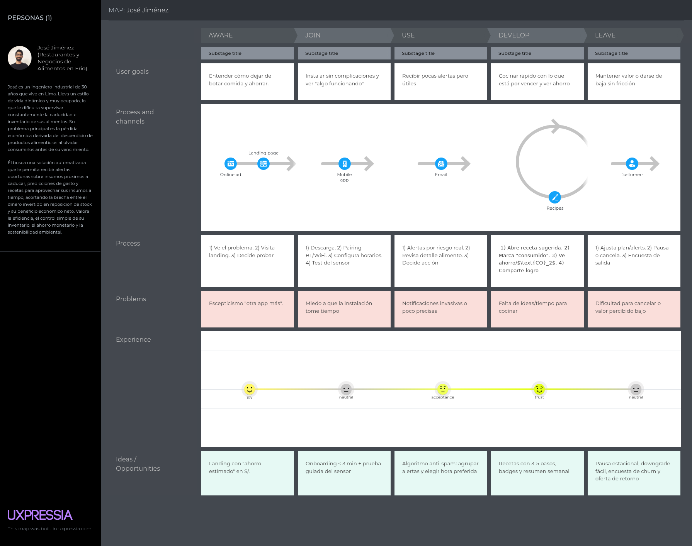

**Segmento 2: Pequeños Negocios y Emprendedores de Alimentos**

El presente mapa refleja la secuencia de pasos que efectúan los usuarios del segundo segmento con el fin de supervisar sus materias primas y garantizar insumos óptimos a sus consumidores. Este perfil engloba a emprendimientos gastronómicos del hogar que experimentan merma financiera ante el vencimiento de sus ingredientes por llevar un registro manual. Priorizan sistemas que sistematicen la medición de frescura, emitan análisis de stock e indicadores de reabastecimiento, ayudando a sostener el estándar de sus entregas y la lealtad comercial de sus clientes.

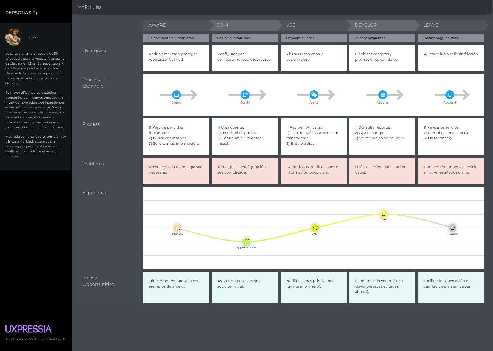

### 2.3.4. Empathy Mapping

**Segmento 1: Propietarios y Encargados de Negocios de Alimentos Fríos**

El esquema de empatía enfocado en José ilustra el perfil de un dueño de un negocio de alimentos fríos que requiere controlar de manera constante sus productos perecibles para reducir pérdidas económicas e ineficiencias. Experimenta preocupación cuando sus productos se deterioran debido a fallas en las condiciones de conservación y busca herramientas digitales ágiles que faciliten el monitoreo de su inventario, generen alertas oportunas y contribuyan a mantener la calidad de sus productos y mejorar la rentabilidad del negocio.

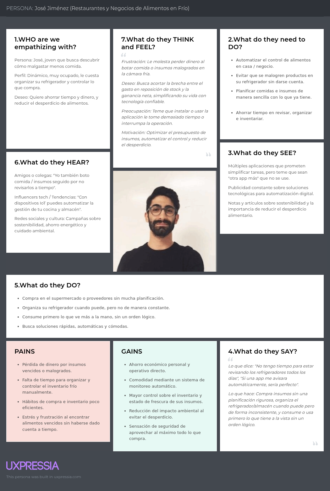

**Segmento 2: Pequeños Negocios y Emprendedores de Alimentos**

El mapa de empatía representativo de Luisa sintetiza la perspectiva de una emprendedora comprometida con mantener la calidad de sus insumos y resguardar el prestigio de su marca. Requiere una plataforma accesible que aminore la merma económica, simplifique la organización del almacenamiento y consolide el respaldo de su clientela.

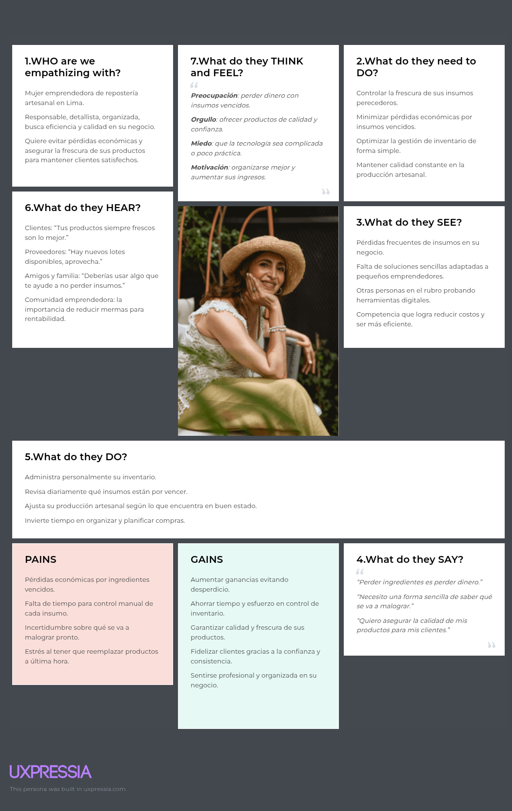

## 2.4. Big Picture EventStorming

Con la finalidad de estructurar una solución integral y alineada a las dinámicas del negocio, el equipo llevó a cabo una sesión colaborativa de EventStorming para mapear el flujo de eventos del sistema, orientándolo a nuestros dos segmentos objetivos: **Restaurantes** (control de insumos en cocina, estandarización de recetas/porciones y prevención de mermas) y **Negocios de venta de alimentos en frío** (monitoreo de la cadena de frío, gestión de stock en congeladores/vitrinas y rotación de productos):

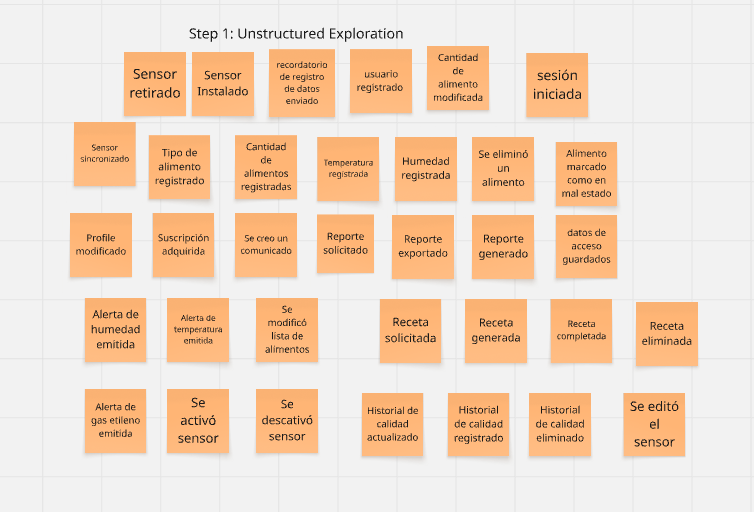
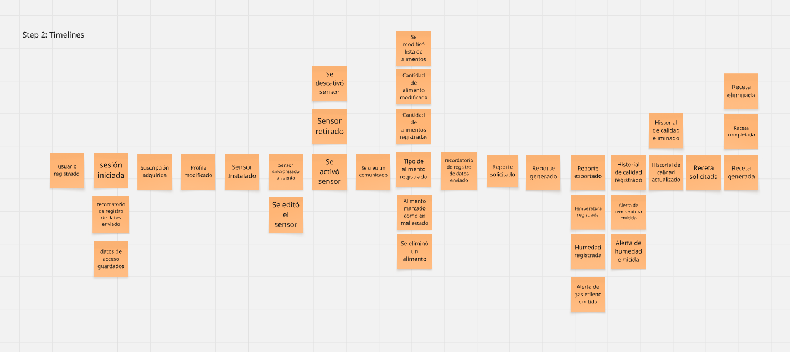
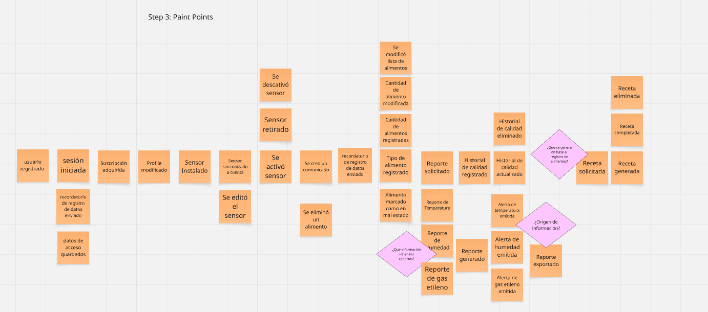
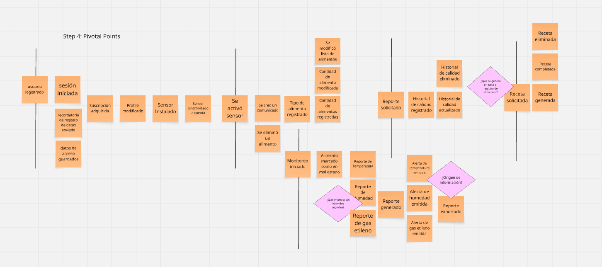
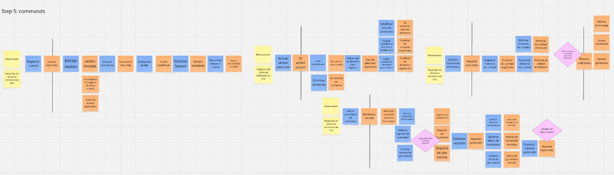
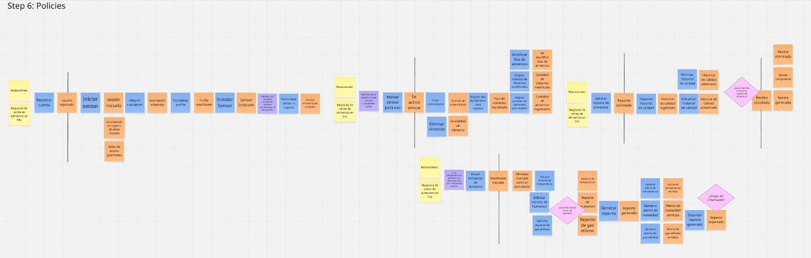
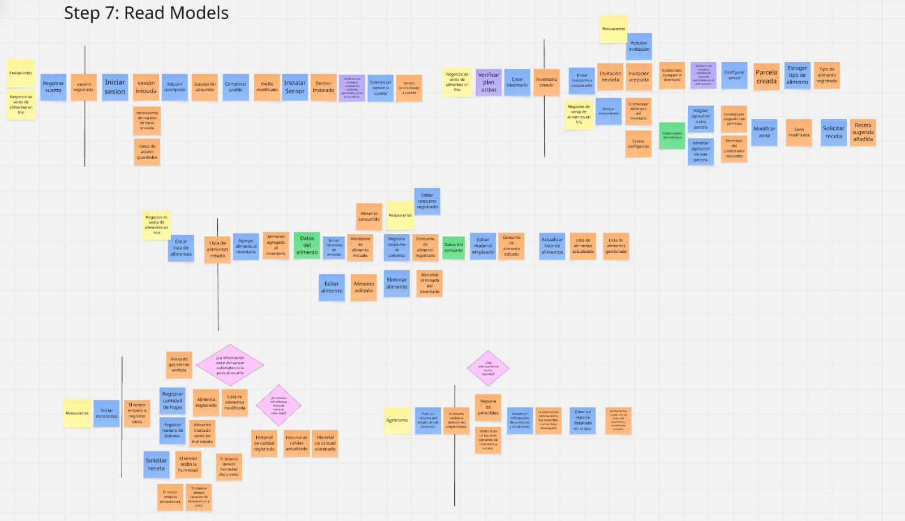
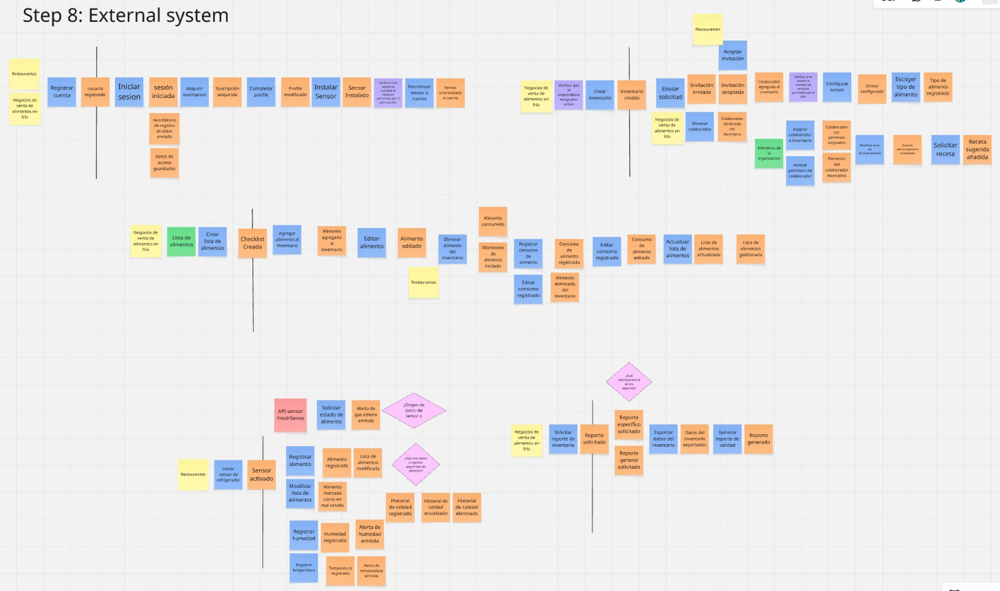

## 2.5. Ubiquitous Language

| Ubiquitous Term | Definition of Functional Domain |
|---|---|
| Food Waste | Loss or discard of raw materials, culinary ingredients, or commercial inventory due to poor stock rotation, cold chain disruption, or unexpected spoilage. |
| FreshSense Device | Sensor-based hardware placed inside commercial fridges, walk-in coolers, display cases, or cold rooms to monitor temperature, humidity, and ethylene gas levels. |
| Ethylene Gas | Natural plant hormone released by fruits and vegetables during ripening, monitored to prevent accelerated deterioration in kitchen storage or produce display cases. |
| Food Inventory | Organized tracking system for raw ingredients (for kitchens) or cold retail products (for display/storage), including expiration control and batch management. |
| Food Condition | Physical freshness and safety state of stored inventory monitored continuously by FreshSense (Optimal, At Risk, or Spoiled/Unusable). |
| Expiration Alert | Critical notification sent to staff or store managers when ingredients or retail stock are approaching expiration or entering an unviable commercial phase. |
| Standardized Recipe / Dish Tech Sheet | Technical recipe specification used by **Restaurants** to calculate standardized ingredient quantities, portion yields, and prevent kitchen over-consumption. |
| Stock Rotation / Cold Batch Management | Inventory control system (e.g., FIFO) used by **Food Cold-Sales Businesses** to prioritize the sale or removal of cold display stock prior to expiration. |
| Commercial Merma Report | Periodic summary detailing discarded ingredients or cold stock losses, quantifying monetary loss and supporting purchasing/stock projections. |
| Premium Subscription | Paid plan unlocking advanced multi-device monitoring, multi-zone/multi-cooler management, detailed merma analytics, and exportable CSV/PDF reports. |
| Restaurant Manager / Chef | Commercial actor (**Segment 1: Restaurants**) who uses FreshSense to optimize kitchen supply usage, track culinary mermas, and ensure dish consistency. |
| Cold Retail Operator / Store Manager | Commercial actor (**Segment 2: Cold-Sales Businesses**) who uses FreshSense to safeguard display cases/cold rooms, prevent merchandise loss, and audit cold chain integrity. |
| Cold Chain Monitoring | Uninterrupted automated tracking of storage temperatures and humidity levels in refrigeration equipment to meet safety standards and protect saleable inventory. |
| Smart Alert System | Priority-based notification system that routes critical alerts (e.g., fridge temperature spike) immediately to store or kitchen supervisors. |
| Stock & Cost Projection | Automated estimation model that predicts replenishment needs and potential financial loss based on historical mermas and current stock levels. |

# Capítulo III: Requirements Specification

## 3.1. User Stories

| User Story ID | Título | Descripción | Criterios de Aceptación (Gherkin) | Relacionado con (Epic) |
| :--- | :--- | :--- | :--- | :--- |
| **US01** | Visualización de propuesta B2B | Como administrador de restaurante o negocio de frío, deseo comprender la propuesta de valor de FreshSense al ingresar al portal para evaluar sus beneficios operativos. | **Escenario 1: Carga limpia y mensaje claro** Dado que un visitante comercial navega a la página web Cuando la plataforma cargue completamente Entonces se desplegará el mensaje central de valor enfocado en reducción de mermas y conservación de la cadena de frío. | **EP01** (Landing Page) |
| **US02** | Sección para Restaurantes y Negocios en Frío | Como gestor gastronómico o de venta comercial, requiero información enfocada en mi rubro para entender el retorno de inversión y las ventajas operativas en mis cámaras. | **Escenario 1: Navegación por perfil comercial** Dado que un potencial cliente B2B interactúa con la landing page Cuando acceda a las pestañas de "Restaurantes" o "Comercio en Frío" Entonces visualizará los módulos dedicados a mermas de cocina, control de vitrinas frías y planes corporativos. | **EP01** (Landing Page) |
| **US03** | Formulario de contacto y demos B2B | Como gerente interesado, quiero enviar una solicitud de contacto de forma ágil para coordinar una prueba piloto o agendar una demostración técnica. | **Escenario 1: Envío exitoso de consulta** Dado que el representante comercial llena sus datos de contacto válidos y tipo de negocio Cuando presione el botón de envío Entonces el sistema registrará la solicitud y mostrará un mensaje de confirmación en pantalla. | **EP01** (Landing Page) |
| **US04** | Call to Action (CTA) Corporativo | Como cliente potencial B2B, deseo disponer de un botón de acción visible para solicitar una demostración o iniciar la prueba comercial gratuita. | **Escenario 1: Redirección desde el CTA** Dado que el usuario explora los planes comerciales Cuando haga clic en "Solicitar Demo Comercial" Entonces será redirigido inmediatamente al formulario de registro de empresa. | **EP01** (Landing Page) |
| **US05** | Adaptabilidad en dispositivos móviles y tablets | Como chef o supervisor en movimiento, quiero navegar por la plataforma desde tablets de cocina o teléfonos sin distorsión de contenido. | **Escenario 1: Renders responsivos** Dado que el supervisor ingresa mediante una tablet o navegador móvil Cuando explore las secciones Entonces la interfaz ajustará dinámicamente sus márgenes, tablas y botones a la pantalla. | **EP01** (Landing Page) |
| **US06** | Telemetría y monitoreo IoT de cámaras frías | Como encargado de almacén/cocina, necesito que el sensor recolecte métricas de temperatura, humedad y gas etileno para prevenir el deterioro de los insumos y stock comercial. | **Escenario 1: Transmisión continua de telemetría** Dado que el dispositivo FreshSense está instalado en una cámara/vitrina en línea Cuando detecte un cambio en las condiciones del ambiente Entonces enviará los datos a la app en tiempo real para actualizar el panel de control.  **Escenario 2: Notificación por pérdida de señal** Dado que el sensor pierda enlace con la red industrial Cuando el servidor detecte la falta de ping Entonces notificará al supervisor sobre el fallo de conectividad en el área afectada. | **EP02** (Monitoreo IoT) |
| **US07** | Dashboard de inventario con semáforo | Como chef o jefe de tienda, quiero supervisar el estado del stock mediante un código de colores para identificar el riesgo de pérdida o caducidad. | **Escenario 1: Vista por código de colores** Dado que el usuario consulta el inventario comercial Cuando la interfaz procese la lectura de los sensores Entonces catalogará cada insumo/producto en verde (óptimo), amarillo (priorizar uso/venta) o rojo (crítico/merma).  **Escenario 2: Inspección detallada del lote** Dado que el usuario haga clic en un insumo o lote Cuando se abra la tarjeta del producto Entonces mostrará la fecha estimada de caducidad, lote y niveles de etileno o variación térmica. | **EP02** (Monitoreo IoT) |
| **US08** | Sistema de alertas preventivas de temperatura | Como encargado de cadena de frío o cocina, requiero notificaciones oportunas cuando una cámara o vitrina pierda temperatura o un insumo esté en riesgo. | **Escenario 1: Notificación de quiebre de temperatura** Dado que una cámara o lote pase a estado crítico Cuando el motor de reglas procese los datos Entonces enviará una alerta push o SMS al personal responsable.  **Escenario 2: Ausencia de falsas alarmas** Dado que no existan desviaciones en los parámetros de la cámara Cuando el sistema realice el chequeo periódico Entonces no emitirá ninguna notificación innecesaria. | **EP03** (Alertas Inteligentes) |
| **US09** | Preferencias de alertas por turno de trabajo | Como administrador, deseo parametrizar las alertas según los turnos de trabajo o niveles de urgencia para no saturar al personal fuera de hora. | **Escenario 1: Ajuste de canal por severidad** Dado que se active una alerta leve fuera del turno operativo Cuando el sistema procese la severidad Entonces registrará el evento en el panel sin disparar alarmas sonoras de emergencia. | **EP03** (Alertas Inteligentes) |
| **US10** | Alta de insumos por lector de código de barras y QR | Como personal de recepción de mercadería, quiero ingresar insumos o productos al inventario mediante código de barras o QR para agilizar la entrada. | **Escenario 1: Alta rápida de lote por scanner** Dado que el recepcionista escanee el código de un paquete o caja de insumos Cuando la app identifique el código en el catálogo Entonces registrará automáticamente el insumo, la fecha de ingreso y categoría. | **EP04** (Gestión de Inventario) |
| **US11** | Modificación manual de stock e insumos | Como jefe de almacén, quiero corregir o actualizar las cantidades del inventario manualmente tras los arqueos de cocina o tienda. | **Escenario 1: Actualización de existencias** Dado que el supervisor ajuste las unidades restantes de un insumo Cuando guarde la modificación Entonces el sistema reajustará el stock disponible y emitirá el registro de auditoría. | **EP04** (Gestión de Inventario) |
| **US12** | Reporte semanal de mermas y desperdicios | Como gerente de restaurante o tienda, requiero un informe periódico de mermas e insumos descartados para evaluar el impacto económico. | **Escenario 1: Emisión de reporte de mermas** Dado que se cumpla el ciclo semanal o mensual Cuando el servidor consolide las bajas e incidencias Entonces enviará un resumen gráfico al correo de administración y al panel general. | **EP04** (Gestión de Inventario) |
| **US13** | Estandarización de recetas y fichas técnicas | Como Chef Ejecutivo (Restaurantes), quiero vincular insumos a fichas técnicas de platillos para calcular la salida automática de ingredientes. | **Escenario 1: Descuento de insumos por comanda/receta** Dado que existan insumos en alerta amarilla Cuando el chef consulte el módulo de recetas Entonces el sistema priorizará la sugerencia de platillos del menú que utilicen dichos insumos prontos a vencer. | **EP05** (Recetas Personalizadas) |
| **US14** | Filtrado avanzado de insumos y lotes | Como supervisor, quiero filtrar el inventario por cámara fría, fecha de caducidad, lote o categoría (carnes, lácteos, vegetales). | **Escenario 1: Aplicación de filtros combinados** Dado que el usuario seleccione "Cámara 1", "Vegetales" y "Vencimiento < 3 días" Cuando ejecute la búsqueda Entonces la pantalla desplegará únicamente los insumos que cumplan con todos los criterios. | **EP05** (Recetas Personalizadas) |
| **US15** | Onboarding comercial e inducción de personal | Como administrador, deseo contar con un tutorial interactivo para que los nuevos empleados de cocina o tienda aprendan a usar la plataforma. | **Escenario 1: Módulo de aprendizaje comercial** Dado que un colaborador inicie sesión por primera vez Cuando se abra la pantalla principal Entonces se desplegará una guía paso a paso sobre el registro de mermas y lectura de alertas. | **EP06** (UX y Accesibilidad) |
| **US16** | Interfaz optimizada para entornos operativos | Como personal de cocina o almacén, quiero disponer de una interfaz clara, con texto grande y alto contraste para operar rápido con tablets. | **Escenario 1: Navegación accesible en planta** Dado que el trabajador explore el tablero en la tablet de cocina Cuando interactúe con los botones y alertas Entonces la interfaz responderá de manera fluida y adaptada a condiciones de alta operatividad. | **EP06** (UX y Accesibilidad) |
| **US17** | Analítica avanzada de rotación e inventarios | Como gerente B2B, deseo visualizar gráficos detallados de rotación de stock (FIFO) y velocidad de consumo para optimizar las órdenes de compra. | **Escenario 1: Acceso a métricas corporativas** Dado un usuario con plan Enterprise/B2B activo Cuando acceda al menú de analítica Entonces podrá inspeccionar gráficos comparativos de entradas, rotación y mermas por periodos. | **EP07** (Suscripción Premium) |
| **US18** | Panel de impacto financiero de mermas rescatadas | Como director financiero del negocio, quiero evaluar el dinero ahorrado al reducir las pérdidas de insumos y mercadería en frío. | **Escenario 1: Cálculo de ahorro operativo** Dado que el sistema registre alimentos e insumos utilizados/vendidos antes de su vencimiento gracias a las alertas Cuando el gerente consulte el panel financiero Entonces visualizará una estimación en moneda local del valor rescatado. | **EP07** (Suscripción Premium) |
| **US19** | Módulo de fichas técnicas gourmet/avanzadas | Como chef ejecutivo, quiero acceder a plantillas avanzadas de costeo de recetas e insumos para optimizar los márgenes de los platillos. | **Escenario 1: Desbloqueo de herramientas de costeo** Dado un restaurante con suscripción Premium/Enterprise Cuando consulte la sección de recetas avanzadas Entonces dispondrá de cálculo de rendimiento de merma por corte e insumo. | **EP07** (Suscripción Premium) |
| **US20** | Métricas de impacto ambiental corporativo | Como empresa comprometida con la sostenibilidad, quiero revisar la reducción de CO₂ y huella hídrica derivada de evitar desperdicios comerciales. | **Escenario 1: Reporte ESG corporativo** Dado el registro de insumos salvados durante el periodo Cuando el usuario visite la pestaña de sostenibilidad Entonces la app generará las equivalencias en CO₂ no emitido y litros de agua preservados para auditorías ambientales. | **EP08** (Sostenibilidad) |
| **US21** | Difusión de sellos de sostenibilidad | Como negocio sostenible, quiero exportar insignias y reportes de desperdicio cero para mostrarlos en mis redes o local comercial. | **Escenario 1: Descarga de certificado ambiental** Dado que el local alcance la meta mensual de reducción de mermas Cuando presione "Generar Sello Verde" Entonces la plataforma emitirá una imagen certificada lista para difusión o impresión. | **EP08** (Sostenibilidad) |
| **US22** | Sincronización con equipos de refrigeración industrial | Como gerente de operaciones, quiero enlazar FreshSense con sistemas de frío o heladeras comerciales inteligentes vía API. | **Escenario 1: Mapeo de refrigeración industrial** Dado un equipo de refrigeración comercial compatible Cuando se complete el emparejamiento mediante API Entonces la app consolidará la información de los compresores y sensores en el panel central. | **EP09** (Integración IoT) |
| **US23** | Consultas por voz en estaciones de trabajo | Como chef o preparador de pedidos, quiero consultar el estado de insumos críticos mediante comandos de voz para mantener las manos libres. | **Escenario 1: Consulta verbal de insumos** Dado que el terminal de cocina esté vinculado con el asistente de voz Cuando el chef pregunte "¿Qué insumos de la Cámara 1 vencen hoy?" Entonces el asistente leerá en voz alta los artículos marcados en alerta. | **EP09** (Integración IoT) |
| **US24** | Ruteo de alertas multidispositivo por jerarquía | Como administrador de local, quiero seleccionar qué alertas críticas van al teléfono del gerente de guardia y cuáles a la pantalla de cocina. | **Escenario 1: Ruteo jerárquico** Dado que se detecte una caída crítica de temperatura en la madrugada Cuando se dispare la alerta roja Entonces el servidor la enviará directamente al celular del gerente de turno. | **EP09** (Integración IoT) |
| **US25** | Gamificación y metas de equipo | Como jefe de tienda/cocina, quiero establecer metas de desperdicio cero para motivar a mis empleados a registrar y cuidar el stock. | **Escenario 1: Adjudicación de reconocimientos al equipo** Dado que la cocina pase 30 días operando sin mermas por negligencia Cuando el sistema verifique el registro Entonces otorgará una insignia al perfil de la sucursal y sumará puntos al programa comercial. | **EP10** (Gamificación) |
| **US26** | Red de proveedores e intercambio de buenas prácticas | Como gerente comercial, quiero acceder a un foro B2B para intercambiar técnicas de conservación y proveedores de insumos frescos. | **Escenario 1: Publicación en la red B2B** Dado que el usuario ingrese a la comunidad de comercios Cuando busque o publique un consejo de calibración o conservación Entonces otros gerentes registrados podrán interactuar y guardar la sugerencia. | **EP10** (Gamificación) |
| **US27** | Benchmarking entre sucursales | Como director de una cadena de restaurantes o locales fríos, quiero comparar el rendimiento de mermas entre mis distintas sedes. | **Escenario 1: Posicionamiento en tabla interna** Dado que la empresa gestione 3 o más sucursales Cuando consulte la comparativa del mes Entonces el panel ordenará las sedes de menor a mayor porcentaje de mermas. | **EP10** (Gamificación) |
| **US28** | Categorización personalizada de insumos y cámaras | Como jefe de almacén, quiero crear categorías a medida (ej. "Insumos de Marisquería", "Vitrinas de Charcutería") para ordenar el stock. | **Escenario 1: Creación de categorías custom** Dado que el usuario agregue la categoría "Mariscos Congelados" Cuando catalogue un nuevo lote Entonces podrá filtrar todo el inventario y establecer alertas bajo ese grupo específico. | **EP11** (Gestión Avanzada) |
| **US29** | Historial de mermas e inventario exportable | Como auditor o contador del negocio, quiero descargar la lista histórica de bajas, mermas e insumos consumidos para ajustar costos y balances. | **Escenario 1: Exportación de archivo contable** Dado que el usuario defina un rango de fechas y sucursal Cuando presione "Exportar historial comercial" Entonces el sistema descargará un archivo en formato CSV o Excel con el desglose por lotes y costos. | **EP11** (Gestión Avanzada) |
| **US30** | Algoritmo de sugerencias de reposición de stock | Como comprador de insumos, quiero recibir sugerencias automáticas de abastecimiento según el consumo histórico y tiempos de vida útil. | **Escenario 1: Generación de orden sugerida** Dado el historial de ventas e insumos utilizados en los últimos 30 días Cuando el encargado prepare la orden de compra Entonces la plataforma recomendará las cantidades de reposición para evitar sobre-stock. | **EP11** (Gestión Avanzada) |
| **US31** | Vinculación y calibración de sensores de cámaras | Como instalador o supervisor, quiero vincular un sensor FreshSense escaneando su QR e ingresar los umbrales de frío de la cámara correspondiente. | **Escenario 1: Vinculación QR exitosa** Dado que el supervisor abre el módulo de hardware Cuando escanee el código QR del sensor colocado en la cámara de congelación Entonces el equipo quedará asociado a esa zona y calibrado a la temperatura límite definida. | **EP02** (Monitoreo IoT) |
| **US32** | Modo de mantenimiento de equipos fríos | Como encargado de mantenimiento, quiero activar el "Modo Mantenimiento/Limpieza" en una cámara para pausar las alarmas mientras se limpia o repara. | **Escenario 1: Pausa temporal de alertas** Dado que el técnico active el "Modo Mantenimiento" en la Cámara 2 Cuando transcurran los 60 minutos programados de limpieza Entonces el sistema suspenderá las alertas por puerta abierta o alza de temperatura en esa zona. | **EP03** (Alertas Inteligentes) |
| **US33** | Gestión de múltiples áreas y cámaras frías | Como gerente de local, quiero crear y estructurar la jerarquía de mis zonas de conservación (ej. "Cocina Central", "Cámara de Carnes", "Exhibidor Verduras"). | **Escenario 1: Asignación de ubicación física** Dado que el usuario crea la zona "Vitrinas Lácteos" Cuando vincule un sensor a dicha zona Entonces los productos almacenados allí heredarán automáticamente las reglas de frío de ese exhibidor. | **EP11** (Gestión Avanzada) |
| **US34** | Registro de causas corporativas de merma | Como auditor de calidad, quiero registrar el motivo exacto por el cual se descarta un insumo (ej. "Falla de Frío", "Caducidad", "Contaminación Cruzada", "Mal Estado de Proveedor"). | **Escenario 1: Registro de causa de baja** Dado que el cocinero o empleado dé de baja un lote Cuando la app solicite la causa obligatoria Entonces guardará el motivo para incluirlo en los gráficos analíticos de auditoría. | **EP04** (Gestión de Inventario) |
| **US35** | Recuperación corporativa de contraseña | Como colaborador registrado, quiero restablecer mi clave mediante un correo seguro corporativo cuando olvide mis credenciales de acceso. | **Escenario 1: Restablecimiento seguro** Dado que el usuario solicite el cambio de clave en la pantalla de ingreso Cuando presione "Enviar enlace de recuperación" Entonces el sistema despachará un token temporal único al correo corporativo registrado. | **EP12** (Core API) |
| **US36** | Panel de administración de usuarios y roles B2B | Como administrador del sistema FreshSense, quiero gestionar cuentas corporativas, modificar permisos (Chef, Supervisor, Gerente, Admin) y suspender accesos. | **Escenario 1: Modificación de permisos de usuario** Dado un colaborador asignado al rol "Cocinero" Cuando el administrador actualice su usuario al rol "Jefe de Cocina" Entonces obtendrá permisos inmediatos para autorizar bajas de insumos y editar fichas técnicas. | **EP12** (Core API) |
| **US37** | Gestión de colaboradores de local/sucursal | Como gerente de sede, quiero invitar a empleados del restaurante o tienda para que gestionen el inventario del local con sus respectivos permisos. | **Escenario 1: Aceptación de invitación de colaborador** Dado que el gerente envíe una invitación al correo corporativo del nuevo supervisor Cuando el invitado acepte el enlace de vinculación Entonces podrá acceder al inventario asignado a su turno y sucursal. | **EP04** (Gestión de Inventario) |
| **US38** | Descarga de facturación y comprobantes B2B | Como departamento de contabilidad, quiero descargar las facturas o comprobantes fiscales de la suscripción SaaS para sustentar gastos operativos. | **Escenario 1: Descarga de factura PDF/XML** Dado que el cobro mensual de la suscripción corporativa haya sido procesado Cuando el contador acceda a la sección "Facturación B2B" Entonces podrá descargar el comprobante en formato PDF y datos fiscales. | **EP07** (Suscripción Premium) |
| **US39** | Búsqueda global de inventario y lotes | Como encargado de almacén, quiero buscar rápidamente cualquier insumo, lote o receta escribiendo en un buscador con sugerencias en tiempo real. | **Escenario 1: Búsqueda dinámica de insumos** Dado que el usuario escriba "Lomo" en el buscador corporativo Cuando el sistema procese la búsqueda Entonces desplegará inmediatamente la ubicación en cámaras, fechas de caducidad y lotes asociados. | **EP06** (UX y Accesibilidad) |
| **US40** | Evaluación de calidad de proveedores de insumos | Como jefe de compras, quiero calificar y registrar notas sobre la durabilidad real de la mercadería recibida por cada proveedor. | **Escenario 1: Registro de evaluación de proveedor** Dado que un lote de verduras se deteriore antes del tiempo previsto Cuando el usuario registre la incidencia en la ficha de la compra Entonces el sistema actualizará la puntuación histórica de frescura de dicho proveedor. | **EP05** (Recetas Personalizadas) |
| **TS41** | API Ingesta de Sensores IoT B2B | Como desarrollador Backend, requiero un endpoint RESTful/MQTT seguro de alta velocidad para almacenar masivamente las lecturas de los microcontroladores de las cámaras. | **Escenario 1: Persistencia exitosa de telemetría** Dado que un sensor autenticado envíe un JSON con lecturas de etileno, humedad y temperatura Cuando el backend valide el token JWT del hardware Entonces almacenará los registros en la base de datos de serie temporal y responderá un código HTTP 201. | **EP12** (Core API) |
| **TS42** | Microservicio de Notificaciones de Emergencia | Como desarrollador Backend, necesito un módulo independiente para la gestión y despacho prioritario de avisos push, SMS y correos sobre fallas de frío. | **Escenario 1: Despacho asíncrono de alertas críticas** Dado un evento de alza crítica de temperatura en una cámara fría Cuando el microservicio reciba el mensaje del broker de eventos Then procesará la plantilla de emergencia y la despachará hacia el proveedor de mensajería (Firebase/Twilio/SendGrid). | **EP12** (Core API) |
| **TS43** | API Gestor de Autenticación y RBAC B2B | Como desarrollador Backend, preciso implementar un control de acceso basado en roles (RBAC) con tokens JWT para gestionar permisos según jerarquía comercial. | **Escenario 1: Validación de permisos por rol** Dado que un usuario con rol "Cocinero" intente acceder a endpoints de facturación o analítica avanzada Cuando el middleware analice el token JWT Entonces bloqueará la solicitud devolviendo un estado HTTP 403 Forbidden. | **EP12** (Core API) |
| **TS44** | Integración de Pasarela de Pagos B2B (Stripe/PayPal) | Como desarrollador Backend, necesito integrar los webhooks de cobro recurrente para automatizar la activación de planes corporativos e historial de facturación. | **Escenario 1: Confirmación de pago por Webhook** Dado que la pasarela procese exitosamente el pago del plan Enterprise del restaurante Cuando el servidor reciba la notificación del Webhook Entonces extenderá automáticamente la vigencia de la suscripción y emitirá el comprobante contable. | **EP07** (Suscripción Premium) |
| **TS45** | Caching de Consultas Frecuentes e Inventarios en Tiempo Real | Como desarrollador Backend, necesito implementar una capa de caché con Redis para optimizar el tiempo de respuesta del panel de inventario y listado de insumos. | **Escenario 1: Respuesta acelerada desde memoria caché** Dado que una consulta de stock de local haya sido solicitada previamente Cuando un nuevo usuario de la misma sucursal abra el inventario Entonces la API servirá la información estructurada desde Redis reduciendo el tiempo de respuesta a menos de 50ms. | **EP12** (Core API) |
## Epics (Épicas)

| Epic ID | Título de la Épica | Alcance y Descripción Corta |
| :--- | :--- | :--- |
| **EP01** | Portal Informativo y Landing Page B2B | Estructuración y despliegue del sitio web principal enfocado en la conversión de clientes comerciales, destacando la propuesta de valor para **Restaurantes** y **Negocios en Frío**, demostraciones interactivas, retorno de inversión (ROI) y captura de leads B2B. |
| **EP02** | Telemetría e Ingesta IoT Comercial | Desarrollo del sistema continuo de captura, calibración y procesamiento en tiempo real de las lecturas de sensores (temperatura, porcentaje de humedad y niveles de gas etileno) instalados en cámaras industriales, walk-in coolers y vitrinas comerciales. |
| **EP03** | Motor de Alertas e Indicadores de Riesgo de Frío | Algoritmo inteligente encargado de evaluar las desviaciones métricas frente a los umbrales de seguridad de la cadena de frío, gestionando notificaciones de emergencia (SMS/Push), ruteo por turnos y modo de mantenimiento técnico. |
| **EP04** | Gestión Dinámica de Inventario y Lotes Commerciales | Módulo para la organización integral de insumos y productos en frío, incluyendo altas rápidas por código de barras/QR, control de lotes y fechas de vencimiento, arqueos manuales de stock y gestión de colaboradores por sucursal. |
| **EP05** | Fichas Técnicas de Cocina y Rotación Comercial | Sistema dinámico que gestiona la estandarización de recetas/costeo para **Restaurantes** (salida automática de insumos) y la rotación FIFO de productos para **Negocios en Frío** (evaluación de proveedores e insumos próximos a vencer). |
| **EP06** | Experiencia de Usuario, Accesibilidad y Navegación Operativa | Diseño UX/UI optimizado para entornos de alta operatividad (tablets de cocina/tienda) bajo estándares WCAG AA, que contempla búsquedas globales de lotes, vistas responsivas y onboarding guiado para el personal operativo. |
| **EP07** | Modelo de Suscripción SaaS y Facturación B2B | Módulo de monetización encargado del cobro recurrente mediante webhooks (Stripe/PayPal), emisión de comprobantes y facturación electrónica, y el desbloqueo de capacidades corporativas Enterprise. |
| **EP08** | Analítica de Sostenibilidad y Reportes ESG | Sistema de cálculo enfocado en cuantificar el volumen de insumos y mercadería salvada, la reducción estimada de la huella de carbono (kg de CO₂ evitado), el agua preservada y la emisión de sellos/certificados de sostenibilidad para empresas. |
| **EP09** | Conectividad y Ecosistemas Smart Industrial | Módulos de integración mediante API con equipos de refrigeración comercial/industrial, asistentes de voz para estaciones de trabajo (manos libres en cocina) y ruteo jerárquico de alertas hacia relojes y teléfonos del personal de turno. |
| **EP10** | Gamificación, Metas de Equipo y Red B2B | Funcionalidades de interacción comercial que incentivan el desperdicio cero mediante metas por sucursal, foros B2B para intercambio de buenas prácticas de conservación y rankings comparativos entre sedes de la empresa. |
| **EP11** | Analítica Comercial y Gestión Avanzada B2B | Herramientas orientadas a la gestión por cámaras frías, registro de causas corporativas de merma (falla de frío, vencimiento, mala recepción), exportación de reportes contables (Excel/PDF) y sugerencias automáticas de reposición de stock. |
| **EP12** | Arquitectura Backend, Seguridad y Core API B2B | Construcción de la infraestructura del servidor, ingestión asíncrona de alta velocidad para sensores IoT, capa de almacenamiento en caché con Redis, recuperación segura de claves y control de acceso basado en roles corporativos (RBAC JWT). |

## 3.2. Impact Mapping

En conclusión, el Impact Mapping permitió establecer una trazabilidad nítida entre la visión de negocio y la implementación del software para nuestros dos segmentos objetivos (**Restaurantes** y **Negocios de venta de alimentos en frío**). Esto garantiza que cada desarrollo atienda un requisito técnico específico y genere una transformación medible en las operaciones comerciales, optimizando el rendimiento de las cámaras de frío, disminuyendo las mermas de cocina e inventario, y acelerando el crecimiento sostenible de FreshSense.
## 3.3. Product Backlog

A continuación se presenta el **Product Backlog** priorizado del proyecto FreshSense, estimando el esfuerzo en Story Points mediante la escala de Fibonacci (1, 2, 3, 5, 8) e integrando la totalidad de las 45 historias definidas, enfocadas en nuestros dos segmentos objetivos (**Restaurantes** y **Negocios de venta de alimentos en frío**):

| Orden (#) | User Story ID | Título de la Historia / Tarea Técnica | Descripción Sintetizada | Story Points |
| :-: | :--- | :--- | :--- | :-: |
| **1** | **US01** | Visualización de propuesta B2B | Explicación clara de la propuesta de valor comercial de FreshSense en la landing page. | **2** |
| **2** | **US02** | Sección para Restaurantes y Negocios en Frío | Módulo web orientado a gerentes gastronómicos y comercios de frío para destacar ventajas del ROI. | **2** |
| **3** | **US03** | Formulario de contacto y demos B2B | Formulario dinámico para la recepción de solicitudes de información y coordinar pruebas piloto. | **2** |
| **4** | **US04** | Call to Action (CTA) Corporativo | Botón de llamado a la acción para la conversión rápida hacia la solicitud de demo o prueba comercial. | **2** |
| **5** | **US05** | Adaptabilidad en móviles y tablets | Configuración de estilos responsivos para lectura en tablets de cocina y teléfonos de supervisores. | **3** |
| **6** | **TS43** | API Gestor de Autenticación y RBAC B2B | Configuración del servidor de identidad con seguridad basada en tokens JWT y roles comerciales. | **5** |
| **7** | **TS41** | API Ingesta de Sensores IoT B2B | Endpoint RESTful/MQTT para recibir y almacenar telemetría de cámaras frías en tiempo real. | **5** |
| **8** | **US06** | Telemetría y monitoreo IoT de cámaras frías | Recolección en tiempo real de métricas enviadas por sensores instalados en refrigeración comercial. | **5** |
| **9** | **US07** | Dashboard con semáforo comercial | Módulo visual que clasifica la frescura de insumos y stock mediante colores verde, amarillo y rojo. | **3** |
| **10** | **US08** | Alertas preventivas de temperatura | Notificaciones automáticas ante el riesgo de ruptura de cadena de frío o descomposición. | **5** |
| **11** | **TS42** | Microservicio de Notificaciones de Emergencia | Módulo asíncrono para emisión prioritaria de avisos push, SMS y correo sobre fallas de frío. | **3** |
| **12** | **US09** | Preferencias de alertas por turno | Panel para parametrizar horarios de notificación y canales según el turno del personal operativo. | **3** |
| **13** | **US31** | Vinculación y calibración de sensores | Módulo de emparejamiento mediante QR y calibración de rangos de temperatura para cámaras. | **3** |
| **14** | **US10** | Alta de insumos por lector de código/QR | Registro rápido de lotes e ingredientes escaneando códigos de barra o empaques recibidos. | **5** |
| **15** | **US11** | Modificación manual de stock e insumos | Ajuste y corrección de cantidades y categorías tras realizar arqueos de inventario. | **2** |
| **16** | **US37** | Gestión de colaboradores por local | Invitación y asignación de permisos a empleados del restaurante o tienda sobre el inventario. | **3** |
| **17** | **US12** | Reporte semanal de mermas | Consolidado periódico que detalla el volumen y costo de insumos consumidos y descartados. | **3** |
| **18** | **US13** | Fichas técnicas y rotación de insumos | Algoritmo que sugiere uso prioritario en recetas (Restaurantes) o salida FIFO (Negocios en frío). | **5** |
| **19** | **US14** | Filtrado avanzado de insumos y lotes | Búsqueda y filtrado por cámara fría, fecha de caducidad, lote o categoría de producto. | **3** |
| **20** | **US39** | Búsqueda global de inventario y lotes | Barra de búsqueda centralizada para ubicar insumos, lotes y recetas con sugerencias en vivo. | **3** |
| **21** | **US15** | Onboarding comercial interactivo | Guía interactiva para capacitar al nuevo personal operativo en el uso del sistema. | **2** |
| **22** | **US16** | Interfaz optimizada para operación | Optimización UX/UI con alto contraste para uso fluido en tablets de cocina y almacén. | **3** |
| **23** | **TS44** | Pasarela de Pagos Recurrentes B2B | Integración de webhooks para cobros periódicos de planes corporativos (Stripe/PayPal). | **5** |
| **24** | **US17** | Analítica avanzada de rotación e inventario | Dashboard corporativo con gráficos de velocidad de rotación (FIFO) e insumos críticos. | **5** |
| **25** | **US18** | Panel de impacto financiero de mermas | Métricas que cuantifican en moneda local el valor monetario rescatado al evitar mermas. | **3** |
| **26** | **US19** | Fichas técnicas gourmet y costeo | Módulo avanzado de costeo de platillos y cálculo de mermas por corte para cocinas. | **2** |
| **27** | **US38** | Descarga de facturación B2B | Módulo de consulta y descarga de comprobantes contables y facturas electrónicas en PDF/XML. | **2** |
| **28** | **US20** | Métricas de impacto ambiental corporativo | Estimación del equivalente en CO₂ evitado y agua preservada para auditorías ESG. | **3** |
| **29** | **US21** | Difusión de sellos de sostenibilidad | Generador de certificados y sellos de "Desperdicio Cero" para difusión en redes y locales. | **2** |
| **30** | **US32** | Modo de mantenimiento de equipos fríos | Pausa temporal de alarmas durante periodos de limpieza o mantenimiento técnico de cámaras. | **2** |
| **31** | **US33** | Gestión de cámaras y áreas de frío | Configuración y jerarquización de múltiples cámaras frías y vitrinas dentro de la sede. | **3** |
| **32** | **US34** | Registro de causas corporativas de merma | Clasificación obligatoria del motivo de baja (falla de frío, vencimiento, mala recepción). | **2** |
| **33** | **US28** | Categorización personalizada de insumos | Creación de etiquetas y grupos custom para clasificar stock según la dinámica del local. | **3** |
| **34** | **US29** | Historial de mermas e inventario exportable | Funcionalidad para descargar informes detallados de mermas e inventarios en CSV y Excel. | **5** |
| **35** | **US30** | Algoritmo de sugerencias de reposición | Proyección automatizada de compras de insumos según histórico de consumo y ventas. | **5** |
| **36** | **US25** | Gamificación y metas de equipo | Otorgamiento de insignias y reconocimientos a las sucursales que cumplan metas de cero mermas. | **3** |
| **37** | **US26** | Red B2B e intercambio de prácticas | Espacio para interacción entre comercios para compartir técnicas de conservación y proveedores. | **2** |
| **38** | **US27** | Benchmarking entre sucursales | Tabla comparativa de rendimiento en reducción de mermas entre distintas sedes de la empresa. | **5** |
| **39** | **US40** | Evaluación de calidad de proveedores | Sistema de calificación e historial sobre la frescura y vida útil de los insumos entregados. | **2** |
| **40** | **US35** | Recuperación corporativa de contraseña | Flujo seguro de restablecimiento de clave vía enlace temporal al correo corporativo. | **2** |
| **41** | **US36** | Panel de administración de usuarios B2B | Módulo interno para la supervisión de cuentas corporativas, gestión de roles y accesos. | **3** |
| **42** | **US24** | Ruteo de notificaciones por jerarquía | Enrutamiento de alertas críticas hacia los teléfonos de los gerentes o supervisores de turno. | **3** |
| **43** | **TS45** | Caching de Consultas e Inventario | Capa de memoria en caché con Redis para servir inventarios de alta concurrencia en <50ms. | **3** |
| **44** | **US22** | Sincronización con frio industrial | Enlace e integración API directa con sistemas de refrigeración comercial e industrial. | **8** |
| **45** | **US23** | Consultas por voz en estaciones de trabajo | Desarrollo de skill de voz para consultar el estado de insumos con las manos libres en cocina. | **5** |

Capítulo IV: Solution Software Design

4.1. Strategic-Level Domain-Driven Design.

4.1.1. Design-Level EventStorming.

4.1.1.1 Candidate Context Discovery.

4.1.1.2 Domain Message Flows Modeling.

4.1.1.3 Bounded Context Canvases.

4.1.2. Context Mapping.

4.1.3. Software Architecture.

4.1.3.1. Software Architecture System Landscape Diagram.

4.1.3.2. Software Architecture Context Level Diagrams.

4.1.3.2. Software Architecture Container Level Diagrams.

4.1.3.3. Software Architecture Deployment Diagrams.

4.2. Tactical-Level Domain-Driven Design

4.2.X. Bounded Context: <Bounded Context Name>

4.2.X.1. Domain Layer.

4.2.X.2. Interface Layer.

4.2.X.3. Application Layer.

4.2.X.4. Infrastructure Layer.

4.2.X.5. Bounded Context Software Architecture Component Level Diagrams.

4.2.X.6. Bounded Context Software Architecture Code Level Diagrams.

4.2.X.6.1. Bounded Context Domain Layer Class Diagrams.

4.2.X.6.2. Bounded Context Database Design Diagram.

Capítulo V: Solution UI/UX Design

5.1. Style Guidelines.

5.1.1. General Style Guidelines.

5.1.2. Web, Mobile and IoT Style Guidelines.

5.2. Information Architecture.

5.2.1. Organization Systems.

5.2.2. Labeling Systems.

5.2.3. SEO Tags and Meta Tags

5.2.4. Searching Systems.

5.2.5. Navigation Systems.

5.3. Landing Page UI Design.

5.3.1. Landing Page Wireframe.

5.3.2. Landing Page Mock-up.

5.4. Applications UX/UI Design.

5.4.1. Applications Wireframes.

5.4.2. Applications Wireflow Diagrams.

5.4.2. Applications Mock-ups.

5.4.3. Applications User Flow Diagrams.

5.5. Applications Prototyping.

5.6. IoT Device Design.

Capítulo VI: Product Implementation, Validation & Deployment

6.1. Software Configuration Management.

6.1.1. Software Development Environment Configuration.

6.1.2. Source Code Management.

6.1.3. Source Code Style Guide & Conventions.

6.1.4. Software Deployment Configuration.

6.2. Landing Page, Services & Applications Implementation.

6.2.X. Sprint n

6.2.X.1. Sprint Planning n.

6.2.X.2. Aspect Leaders and Collaborators.

6.2.X.3. Sprint Backlog n.

6.2.X.4. Development Evidence for Sprint Review.

6.2.X.5. Testing Suite Evidence for Sprint Review.

6.2.X.6. Execution Evidence for Sprint Review.

6.2.X.7. Services Documentation Evidence for Sprint Review.

6.2.X.8. Software Deployment Evidence for Sprint Review.

6.2.X.9. Team Collaboration Insights during Sprint.

6.3. Validation Interviews.

6.3.1. Diseño de Entrevistas.

6.3.2. Registro de Entrevistas.

6.3.3. Evaluaciones según heurísticas.

6.4. Video About-the-Product.

Conclusiones

Conclusiones y recomendaciones.

Video About-the-Team.
Bibliografía
Anexos
