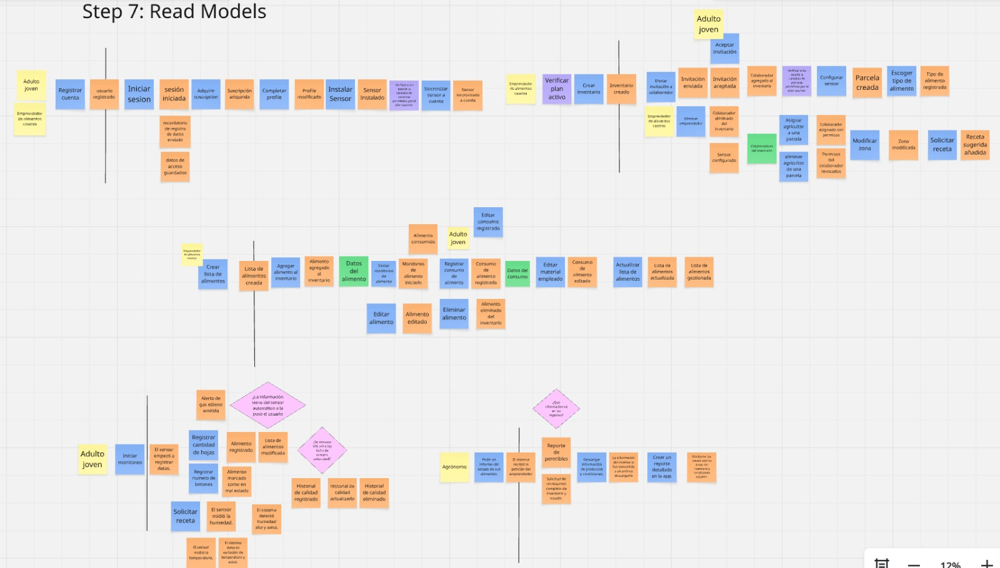
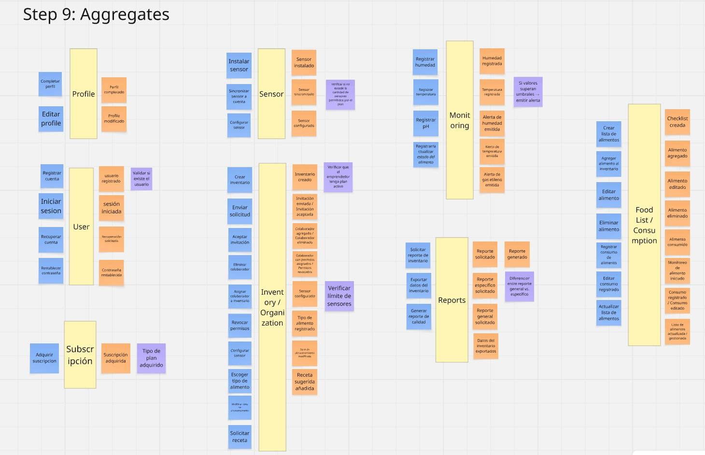
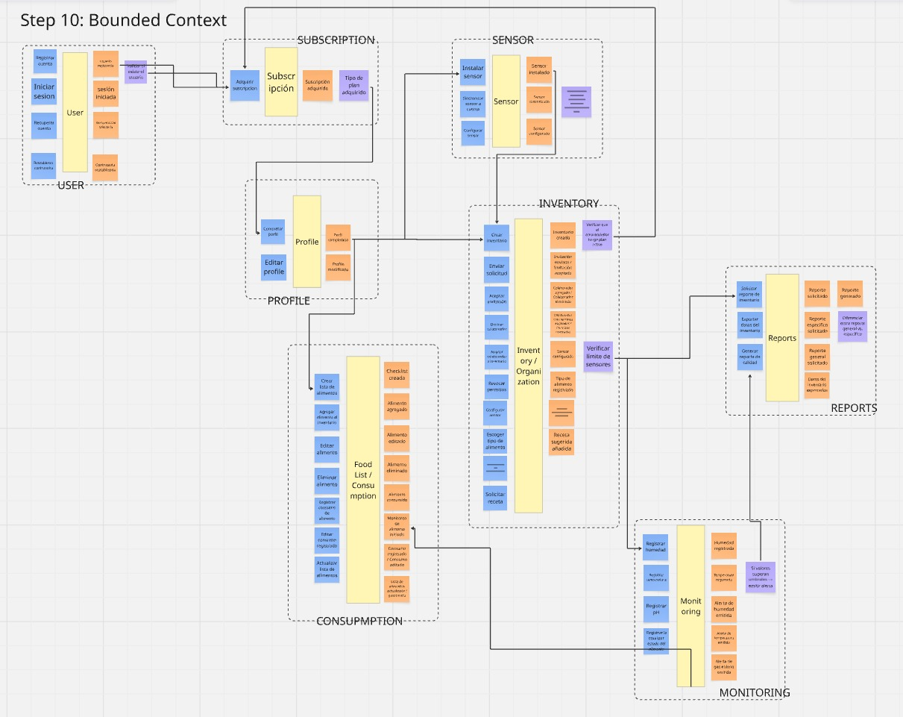
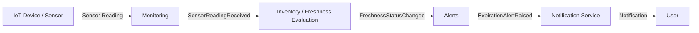

<h3>Universidad Peruana de Ciencias Aplicadas</h3>

<strong>Facultad de Ingeniería</strong> 
<strong>Carrera: Ingeniería de Software</strong> 

<strong>Periodo:</strong> 202620 
<strong>Codigo del curso:</strong>  1ASI057  
<strong>Nombre del curso:</strong>  Desarrollo de Soluciones IoT 
<strong>NRC:</strong> 8725  

<strong>Nombre del profesor:</strong> Marco Antonio León Baca  

 <strong>*Informe de Trabajo Final*</strong>  

<strong>Nombre del startup: </strong>FreshEat 
<strong>Nombre del producto: </strong>FreshSense 

### Relación de Integrantes

| Apellidos y Nombres                  |   Código    |
|:------------------------------------:|:-----------:|
| Tuesta Marin, Romina Alejandra       | U202211706  |

<strong> Septiembre 2026</strong> 

# Project Report Collaboration Insights

**AV1:**

# Registro de Versiones del Informe

| Versión | Fecha      | Autor        | Descripción de modificación                   |
|---------|------------|--------------|-----------------------------------------------|
| 1.0     | 08/09/2026 | Romina Tuesta Marin | Cargó archivos, Descripción de la Startup|

# Tabla de contenidos

- [Student Outcome](#student-outcome)

- [Capítulo I: Introducción](#capítulo-i-introducción)
  - [1.1. Startup Profile](#11-startup-profile)
    - [1.1.1. Descripción de la Startup](#111-descripción-de-la-startup)
    - [1.1.2. Perfiles de integrantes del equipo](#112-perfiles-de-integrantes-del-equipo)
  - [1.2. Solution Profile](#12-solution-profile)
    - [1.2.1. Antecedentes y problemática](#121-antecedentes-y-problemática)
    - [1.2.2. Lean UX Process](#122-lean-ux-process)
      - [1.2.2.1. Lean UX Problem Statements](#1221-lean-ux-problem-statements)
      - [1.2.2.2. Lean UX Assumptions](#1222-lean-ux-assumptions)
      - [1.2.2.3. Lean UX Hypothesis Statements](#1223-lean-ux-hypothesis-statements)
      - [1.2.2.4. Lean UX Canvas](#1224-lean-ux-canvas)
  - [1.3. Segmentos objetivo](#13-segmentos-objetivo)

- [Capítulo II: Requirements Elicitation & Analysis](#capítulo-ii-requirements-elicitation--analysis)
  - [2.1. Competidores](#21-competidores)
    - [2.1.1. Análisis competitivo](#211-análisis-competitivo)
    - [2.1.2. Estrategias y tácticas frente a competidores](#212-estrategias-y-tácticas-frente-a-competidores)
  - [2.2. Entrevistas](#22-entrevistas)
    - [2.2.1. Diseño de entrevistas](#221-diseño-de-entrevistas)
    - [2.2.2. Registro de entrevistas](#222-registro-de-entrevistas)
    - [2.2.3. Análisis de entrevistas](#223-análisis-de-entrevistas)
  - [2.3. Needfinding](#23-needfinding)
    - [2.3.1. User Personas](#231-user-personas)
    - [2.3.2. User Task Matrix](#232-user-task-matrix)
    - [2.3.3. User Journey Mapping](#233-user-journey-mapping)
    - [2.3.4. Empathy Mapping](#234-empathy-mapping)
  - [2.4. Big Picture EventStorming](#24-big-picture-eventstorming)
  - [2.5. Ubiquitous Language](#25-ubiquitous-language)

- [Capítulo III: Requirements Specification](#capítulo-iii-requirements-specification)
  - [3.1. User Stories](#31-user-stories)
  - [3.2. Impact Mapping](#32-impact-mapping)
  - [3.3. Product Backlog](#33-product-backlog)

- [Capítulo IV: Solution Software Design](#capítulo-iv-solution-software-design)
  - [4.1. Strategic-Level Domain-Driven Design](#41-strategic-level-domain-driven-design)
    - [4.1.1. Design-Level EventStorming](#411-design-level-eventstorming)
      - [4.1.1.1. Candidate Context Discovery](#4111-candidate-context-discovery)
      - [4.1.1.2. Domain Message Flows Modeling](#4112-domain-message-flows-modeling)
      - [4.1.1.3. Bounded Context Canvases](#4113-bounded-context-canvases)
    - [4.1.2. Context Mapping](#412-context-mapping)
    - [4.1.3. Software Architecture](#413-software-architecture)
      - [4.1.3.1. Software Architecture System Landscape Diagram](#4131-software-architecture-system-landscape-diagram)
      - [4.1.3.2. Software Architecture Context Level Diagrams](#4132-software-architecture-context-level-diagrams)
      - [4.1.3.2. Software Architecture Container Level Diagrams](#4132-software-architecture-container-level-diagrams)
      - [4.1.3.3. Software Architecture Deployment Diagrams](#4133-software-architecture-deployment-diagrams)
  - [4.2. Tactical-Level Domain-Driven Design](#42-tactical-level-domain-driven-design)
    - [4.2.X. Bounded Context: &lt;Bounded Context Name&gt;](#42x-bounded-context-bounded-context-name)
      - [4.2.X.1. Domain Layer](#42x1-domain-layer)
      - [4.2.X.2. Interface Layer](#42x2-interface-layer)
      - [4.2.X.3. Application Layer](#42x3-application-layer)
      - [4.2.X.4. Infrastructure Layer](#42x4-infrastructure-layer)
      - [4.2.X.5. Bounded Context Software Architecture Component Level Diagrams](#42x5-bounded-context-software-architecture-component-level-diagrams)
      - [4.2.X.6. Bounded Context Software Architecture Code Level Diagrams](#42x6-bounded-context-software-architecture-code-level-diagrams)
        - [4.2.X.6.1. Bounded Context Domain Layer Class Diagrams](#42x61-bounded-context-domain-layer-class-diagrams)
        - [4.2.X.6.2. Bounded Context Database Design Diagram](#42x62-bounded-context-database-design-diagram)

- [Capítulo V: Solution UI/UX Design](#capítulo-v-solution-uiux-design)
  - [5.1. Style Guidelines](#51-style-guidelines)
    - [5.1.1. General Style Guidelines](#511-general-style-guidelines)
    - [5.1.2. Web, Mobile and IoT Style Guidelines](#512-web-mobile-and-iot-style-guidelines)
  - [5.2. Information Architecture](#52-information-architecture)
    - [5.2.1. Organization Systems](#521-organization-systems)
    - [5.2.2. Labeling Systems](#522-labeling-systems)
    - [5.2.3. SEO Tags and Meta Tags](#523-seo-tags-and-meta-tags)
    - [5.2.4. Searching Systems](#524-searching-systems)
    - [5.2.5. Navigation Systems](#525-navigation-systems)
  - [5.3. Landing Page UI Design](#53-landing-page-ui-design)
    - [5.3.1. Landing Page Wireframe](#531-landing-page-wireframe)
    - [5.3.2. Landing Page Mock-up](#532-landing-page-mock-up)
  - [5.4. Applications UX/UI Design](#54-applications-uxui-design)
    - [5.4.1. Applications Wireframes](#541-applications-wireframes)
    - [5.4.2. Applications Wireflow Diagrams](#542-applications-wireflow-diagrams)
    - [5.4.2. Applications Mock-ups](#542-applications-mock-ups)
    - [5.4.3. Applications User Flow Diagrams](#543-applications-user-flow-diagrams)
  - [5.5. Applications Prototyping](#55-applications-prototyping)
  - [5.6. IoT Device Design](#56-iot-device-design)

- [Capítulo VI: Product Implementation, Validation & Deployment](#capítulo-vi-product-implementation-validation--deployment)
  - [6.1. Software Configuration Management](#61-software-configuration-management)
    - [6.1.1. Software Development Environment Configuration](#611-software-development-environment-configuration)
    - [6.1.2. Source Code Management](#612-source-code-management)
    - [6.1.3. Source Code Style Guide & Conventions](#613-source-code-style-guide--conventions)
    - [6.1.4. Software Deployment Configuration](#614-software-deployment-configuration)
  - [6.2. Landing Page, Services & Applications Implementation](#62-landing-page-services--applications-implementation)
    - [6.2.X. Sprint n](#62x-sprint-n)
      - [6.2.X.1. Sprint Planning n](#62x1-sprint-planning-n)
      - [6.2.X.2. Aspect Leaders and Collaborators](#62x2-aspect-leaders-and-collaborators)
      - [6.2.X.3. Sprint Backlog n](#62x3-sprint-backlog-n)
      - [6.2.X.4. Development Evidence for Sprint Review](#62x4-development-evidence-for-sprint-review)
      - [6.2.X.5. Testing Suite Evidence for Sprint Review](#62x5-testing-suite-evidence-for-sprint-review)
      - [6.2.X.6. Execution Evidence for Sprint Review](#62x6-execution-evidence-for-sprint-review)
      - [6.2.X.7. Services Documentation Evidence for Sprint Review](#62x7-services-documentation-evidence-for-sprint-review)
      - [6.2.X.8. Software Deployment Evidence for Sprint Review](#62x8-software-deployment-evidence-for-sprint-review)
      - [6.2.X.9. Team Collaboration Insights during Sprint](#62x9-team-collaboration-insights-during-sprint)
  - [6.3. Validation Interviews](#63-validation-interviews)
    - [6.3.1. Diseño de Entrevistas](#631-diseño-de-entrevistas)
    - [6.3.2. Registro de Entrevistas](#632-registro-de-entrevistas)
    - [6.3.3. Evaluaciones según heurísticas](#633-evaluaciones-según-heurísticas)
  - [6.4. Video About-the-Product](#64-video-about-the-product)

- [Conclusiones](#conclusiones)
- [Conclusiones y recomendaciones](#conclusiones-y-recomendaciones)
- [Video About-the-Team](#video-about-the-team)
- [Bibliografía](#bibliografía)
- [Anexos](#anexos)

## Student Outcome

El curso contribuye al cumplimiento del Student Outcome ABET:
ABET – EAC - Student Outcome 5
Criterio: La capacidad de funcionar efectivamente en un equipo cuyos miembros
juntos proporcionan liderazgo, crean un entorno de colaboración e inclusivo,
establecen objetivos, planifican tareas y cumplen objetivos.
En el siguiente cuadro se describe las acciones realizadas y enunciados de
conclusiones por parte del grupo, que permiten sustentar el haber alcanzado el logro
del ABET – EAC - Student Outcome 5.

| Criterio específico | Acciones realizadas | Conclusiones |
| :---- | :---- | :---- |
| Trabaja en equipo para proporcionar liderazgo en forma conjunta |  |  |
| Crea un entorno colaborativo e inclusivo, establece metas, planifica tareas y cumple objetivos |  |  |

Capítulo I: Introducción

1.1. Startup Profilee

1.1.1. Descripción de la Startup

1.1.2. Perfiles de integrantes del equipo

1.2. Solution Profile

1.2.1 Antecedentes y problemática

1.2.2 Lean UX Process.

1.2.2.1. Lean UX Problem Statements.

1.2.2.2. Lean UX Assumptions.

1.2.2.3. Lean UX Hypothesis Statements.

1.2.2.4. Lean UX Canvas.

1.3. Segmentos objetivo.

Capítulo II: Requirements Elicitation & Analysis

2.1. Competidores.

2.1.1. Análisis competitivo.

2.1.2. Estrategias y tácticas frente a competidores.

2.2. Entrevistas.

2.2.1. Diseño de entrevistas.

2.2.2. Registro de entrevistas.

2.2.3. Análisis de entrevistas.

2.3. Needfinding.

2.3.1. User Personas.

2.3.2. User Task Matrix.

2.3.3. User Journey Mapping.

2.3.4. Empathy Mapping.

2.4. Big Picture EventStorming.

2.5. Ubiquitous Language.

Capítulo III: Requirements Specification

3.1. User Stories.

3.2. Impact Mapping.

3.3. Product Backlog.

Capítulo IV: Solution Software Design

## 4.1. Strategic-Level Domain-Driven Design

Para el diseño estratégico de FreshSense se emplea Domain-Driven Design (DDD) con el objetivo de organizar la solución de acuerdo con las principales responsabilidades del dominio y mantener una separación clara entre sus capacidades de negocio.

A partir del análisis realizado sobre FreshSense, la solución se organiza en bounded contexts que mantienen sus propias reglas de negocio, modelos de dominio y mecanismos de persistencia. Los principales contextos identificados son **Accounts, Monitoring, Inventory, Alerts, Recipes y Billing**.

Esta separación permite reducir el acoplamiento entre las funcionalidades del sistema y facilita la evolución independiente de los diferentes módulos. La comunicación entre contextos se realiza principalmente mediante eventos de dominio, evitando dependencias directas entre sus implementaciones internas.

### 4.1.1. Design-Level EventStorming

El Design-Level EventStorming de FreshSense permite representar el comportamiento del sistema a partir de los eventos que ocurren dentro del dominio y de las acciones que los generan.

En el trabajo previo del proyecto se desarrolló un EventStorming que incluye elementos como eventos de dominio, comandos, actores, read models, sistemas externos, políticas y aggregates. El análisis de estos elementos permitió identificar responsabilidades relacionadas con la gestión de usuarios, dispositivos y sensores, inventario de alimentos, monitoreo, alertas, recetas, suscripciones y reportes.

El resultado del EventStorming sirve como base para identificar los límites entre los diferentes contextos del dominio y analizar posteriormente la comunicación existente entre ellos.

A continuación, se presentan los artefactos obtenidos durante las últimas etapas del Design-Level EventStorming de FreshSense.

**Step 6: Policies**

**Step 7: Read Models**

**Step 8: External System**

**Step 9: Aggregates**

**Step 10: Bounded Context**

#### 4.1.1.1. Candidate Context Discovery

A partir del Design-Level EventStorming y del análisis previo de la arquitectura de FreshSense, se identificaron diferentes áreas con responsabilidades y reglas de negocio propias. Estas áreas constituyen los candidate contexts que posteriormente permiten establecer límites explícitos dentro del dominio.

| Candidate Context | Responsabilidad principal |
|---|---|
| **Accounts** | Gestionar los usuarios, sus datos de cuenta, autenticación y acceso a la plataforma. |
| **Monitoring** | Recibir, validar y procesar las lecturas generadas por los dispositivos y sensores IoT. |
| **Inventory** | Gestionar los alimentos registrados por el usuario y su información asociada, incluyendo su estado de frescura. |
| **Alerts** | Detectar condiciones que requieren atención y generar alertas relacionadas con el estado de los alimentos. |
| **Recipes** | Gestionar y recomendar recetas utilizando los alimentos disponibles en el inventario. |
| **Billing** | Gestionar los planes y suscripciones asociados con las funcionalidades de la plataforma. |

La identificación de estos candidate contexts permite agrupar funcionalidades que comparten un mismo propósito y modelo de dominio, evitando que las responsabilidades de diferentes áreas se mezclen dentro de un único módulo.

Asimismo, el resultado obtenido en el **Step 10: Bounded Context** del EventStorming permite visualizar gráficamente la separación propuesta y las principales interacciones entre las áreas identificadas.

#### 4.1.1.2. Domain Message Flows Modeling

Los eventos de dominio permiten que los diferentes módulos de FreshSense intercambien información sin depender directamente de la implementación interna de otros contextos.

Uno de los principales flujos del dominio comienza con las lecturas obtenidas desde el dispositivo IoT. Cuando una nueva lectura llega al sistema, el módulo encargado del monitoreo la procesa y publica un evento que puede ser consumido por otros componentes interesados.

Los principales eventos identificados para este flujo son:

- `SensorReadingReceived`: representa la recepción de una nueva lectura proveniente de un dispositivo IoT.
- `FreshnessStatusChanged`: representa un cambio en el estado de frescura de un alimento después de evaluar las nuevas condiciones detectadas.
- `ExpirationAlertRaised`: representa la generación de una alerta cuando el estado del alimento requiere notificar al usuario.

El flujo principal de mensajes del dominio puede representarse de la siguiente manera:

El flujo comienza cuando el dispositivo genera una lectura de las condiciones ambientales. **Monitoring** recibe y normaliza la información, publicando `SensorReadingReceived`. A partir de estos datos se evalúa el estado de los alimentos y, cuando existe un cambio relevante, se genera `FreshnessStatusChanged`.

El módulo **Alerts** puede reaccionar ante dicho cambio y determinar si debe generarse una alerta. Cuando se cumple una condición de riesgo se produce `ExpirationAlertRaised`, que posteriormente puede ser utilizado por el servicio de notificaciones para informar al usuario.

El uso de eventos de dominio permite mantener desacoplados los módulos involucrados. El productor de un evento no necesita conocer directamente la implementación de los consumidores, permitiendo que cada contexto pueda evolucionar de manera independiente.

#### 4.1.1.3. Bounded Context Canvases

### 4.1.2. Context Mapping

4.1.3. Software Architecture.

4.1.3.1. Software Architecture System Landscape Diagram.

4.1.3.2. Software Architecture Context Level Diagrams.

4.1.3.2. Software Architecture Container Level Diagrams.

4.1.3.3. Software Architecture Deployment Diagrams.

4.2. Tactical-Level Domain-Driven Design

4.2.X. Bounded Context: <Bounded Context Name>

4.2.X.1. Domain Layer.

4.2.X.2. Interface Layer.

4.2.X.3. Application Layer.

4.2.X.4. Infrastructure Layer.

4.2.X.5. Bounded Context Software Architecture Component Level Diagrams.

4.2.X.6. Bounded Context Software Architecture Code Level Diagrams.

4.2.X.6.1. Bounded Context Domain Layer Class Diagrams.

4.2.X.6.2. Bounded Context Database Design Diagram.

Capítulo V: Solution UI/UX Design

5.1. Style Guidelines.

5.1.1. General Style Guidelines.

5.1.2. Web, Mobile and IoT Style Guidelines.

5.2. Information Architecture.

5.2.1. Organization Systems.

5.2.2. Labeling Systems.

5.2.3. SEO Tags and Meta Tags

5.2.4. Searching Systems.

5.2.5. Navigation Systems.

5.3. Landing Page UI Design.

5.3.1. Landing Page Wireframe.

5.3.2. Landing Page Mock-up.

5.4. Applications UX/UI Design.

5.4.1. Applications Wireframes.

5.4.2. Applications Wireflow Diagrams.

5.4.2. Applications Mock-ups.

5.4.3. Applications User Flow Diagrams.

5.5. Applications Prototyping.

5.6. IoT Device Design.

Capítulo VI: Product Implementation, Validation & Deployment

6.1. Software Configuration Management.

6.1.1. Software Development Environment Configuration.

6.1.2. Source Code Management.

6.1.3. Source Code Style Guide & Conventions.

6.1.4. Software Deployment Configuration.

6.2. Landing Page, Services & Applications Implementation.

6.2.X. Sprint n

6.2.X.1. Sprint Planning n.

6.2.X.2. Aspect Leaders and Collaborators.

6.2.X.3. Sprint Backlog n.

6.2.X.4. Development Evidence for Sprint Review.

6.2.X.5. Testing Suite Evidence for Sprint Review.

6.2.X.6. Execution Evidence for Sprint Review.

6.2.X.7. Services Documentation Evidence for Sprint Review.

6.2.X.8. Software Deployment Evidence for Sprint Review.

6.2.X.9. Team Collaboration Insights during Sprint.

6.3. Validation Interviews.

6.3.1. Diseño de Entrevistas.

6.3.2. Registro de Entrevistas.

6.3.3. Evaluaciones según heurísticas.

6.4. Video About-the-Product.

Conclusiones

Conclusiones y recomendaciones.

Video About-the-Team.
Bibliografía
Anexos
