<div align="center">

<p align="center" style="margin: 0 0 1.75rem;">
  
</p>

<h3>Universidad Peruana de Ciencias Aplicadas</h3>

<strong>Facultad de Ingeniería</strong><br>
<strong>Carrera: Ingeniería de Software</strong><br>

<strong>Periodo:</strong> 202620<br>
<strong>Codigo del curso:</strong>  1ASI057 <br>
<strong>Nombre del curso:</strong>  Desarrollo de Soluciones IoT<br>
<strong>NRC:</strong> 8725 <br>

<strong>Nombre del profesor:</strong> Marco Antonio León Baca <br>

<br><strong>*Informe de Trabajo Final*</strong><br><br>

<strong>Nombre del startup: </strong>FreshEat<br>
<strong>Nombre del producto: </strong>FreshSense<br>


### Relación de Integrantes

| Apellidos y Nombres                  |   Código    |
|:------------------------------------:|:-----------:|
| Tuesta Marin, Romina Alejandra       | U202211706  |
| Cossar Sanchez, Eduardo Jose     | U202312109  |
| Mostajo Orosco, Maria Fernanda    | U202312874  |
| Chavez Viera, Joseph Manuel| u202314019  |
| Pastor Napa, Juan Carlos    | u202217288  |

<strong> Septiembre 2026</strong><br>
</div>

<div style="page-break-after: always;"></div>

# Project Report Collaboration Insights

**AV1:**
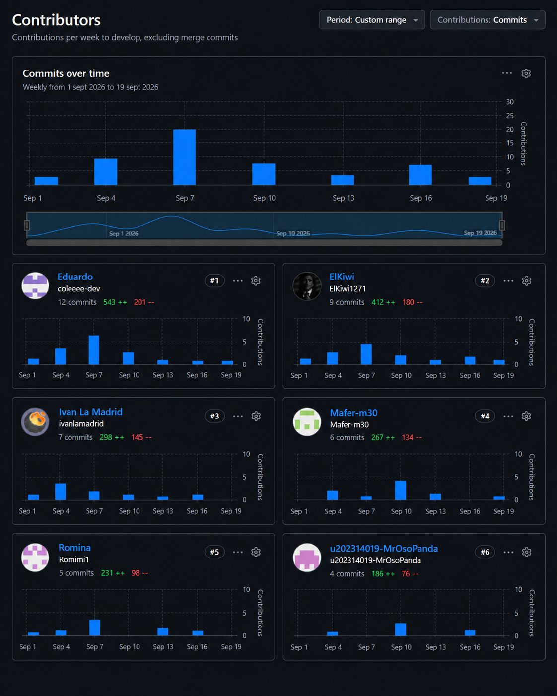


<div style="page-break-after: always;"></div>

# Registro de Versiones del Informe

| Versión | Fecha      | Autor        | Descripción de modificación                   |
|---------|------------|--------------|-----------------------------------------------|
| 1.0     | 19/09/2026 | Todos los Integrantes | Se realizo los capitulos del 1 - 4|
| 1.1     | 06/10/2026 | Todos los Integrantes | Se completaron los tres escenarios de cada historia de usuario y las secciones 6.1, 6.1.2, 6.2.1.3 y 6.2.1.6 |
| 1.2     | 07/10/2026 | Joseph | Se agregaron las capturas del recorrido del sprint 1 en 6.2.1.6 |
| 1.3     | 07/10/2026 | Joseph | En 6.2.1.6 se deja la landing publicada y el front publico pendiente del despliegue |
| 1.4     | 07/10/2026 | Joseph | En 6.2.1.6 quedan el enlace del back y el de la landing; el del front se reemplaza cuando lo pasen |
| 1.5     | 07/10/2026 | Joseph | Se agregó el perfil de Joseph y su aporte en el Student Outcome |


# Tabla de contenidos

- [Student Outcome](#student-outcome)

- [Capítulo I: Introducción](#capítulo-i-introducción)
  - [1.1. Startup Profile](#11-startup-profile)
    - [1.1.1. Descripción de la Startup](#111-descripción-de-la-startup)
    - [1.1.2. Perfiles de integrantes del equipo](#112-perfiles-de-integrantes-del-equipo)
  - [1.2. Solution Profile](#12-solution-profile)
    - [1.2.1. Antecedentes y problemática](#121-antecedentes-y-problemática)
    - [1.2.2. Lean UX Process](#122-lean-ux-process)
      - [1.2.2.1. Lean UX Problem Statements](#1221-lean-ux-problem-statements)
      - [1.2.2.2. Lean UX Assumptions](#1222-lean-ux-assumptions)
      - [1.2.2.3. Lean UX Hypothesis Statements](#1223-lean-ux-hypothesis-statements)
      - [1.2.2.4. Lean UX Canvas](#1224-lean-ux-canvas)
  - [1.3. Segmentos objetivo](#13-segmentos-objetivo)

- [Capítulo II: Requirements Elicitation & Analysis](#capítulo-ii-requirements-elicitation--analysis)
  - [2.1. Competidores](#21-competidores)
    - [2.1.1. Análisis competitivo](#211-análisis-competitivo)
    - [2.1.2. Estrategias y tácticas frente a competidores](#212-estrategias-y-tácticas-frente-a-competidores)
  - [2.2. Entrevistas](#22-entrevistas)
    - [2.2.1. Diseño de entrevistas](#221-diseño-de-entrevistas)
    - [2.2.2. Registro de entrevistas](#222-registro-de-entrevistas)
    - [2.2.3. Análisis de entrevistas](#223-análisis-de-entrevistas)
  - [2.3. Needfinding](#23-needfinding)
    - [2.3.1. User Personas](#231-user-personas)
    - [2.3.2. User Task Matrix](#232-user-task-matrix)
    - [2.3.3. User Journey Mapping](#233-user-journey-mapping)
    - [2.3.4. Empathy Mapping](#234-empathy-mapping)
  - [2.4. Big Picture EventStorming](#24-big-picture-eventstorming)
  - [2.5. Ubiquitous Language](#25-ubiquitous-language)

- [Capítulo III: Requirements Specification](#capítulo-iii-requirements-specification)
  - [3.1. User Stories](#31-user-stories)
  - [3.2. Impact Mapping](#32-impact-mapping)
  - [3.3. Product Backlog](#33-product-backlog)

- [Capítulo IV: Solution Software Design](#capítulo-iv-solution-software-design)
  - [4.1. Strategic-Level Domain-Driven Design](#41-strategic-level-domain-driven-design)
    - [4.1.1. Design-Level EventStorming](#411-design-level-eventstorming)
      - [4.1.1.1. Candidate Context Discovery](#4111-candidate-context-discovery)
      - [4.1.1.2. Domain Message Flows Modeling](#4112-domain-message-flows-modeling)
      - [4.1.1.3. Bounded Context Canvases](#4113-bounded-context-canvases)
    - [4.1.2. Context Mapping](#412-context-mapping)
    - [4.1.3. Software Architecture](#413-software-architecture)
      - [4.1.3.1. Software Architecture System Landscape Diagram](#4131-software-architecture-system-landscape-diagram)
      - [4.1.3.2. Software Architecture Context Level Diagrams](#4132-software-architecture-context-level-diagrams)
      - [4.1.3.2. Software Architecture Container Level Diagrams](#4132-software-architecture-container-level-diagrams)
      - [4.1.3.3. Software Architecture Deployment Diagrams](#4133-software-architecture-deployment-diagrams)
  - [4.2. Tactical-Level Domain-Driven Design](#42-tactical-level-domain-driven-design)
    - [4.2.X. Bounded Context: &lt;Bounded Context Name&gt;](#42x-bounded-context-bounded-context-name)
      - [4.2.X.1. Domain Layer](#42x1-domain-layer)
      - [4.2.X.2. Interface Layer](#42x2-interface-layer)
      - [4.2.X.3. Application Layer](#42x3-application-layer)
      - [4.2.X.4. Infrastructure Layer](#42x4-infrastructure-layer)
      - [4.2.X.5. Bounded Context Software Architecture Component Level Diagrams](#42x5-bounded-context-software-architecture-component-level-diagrams)
      - [4.2.X.6. Bounded Context Software Architecture Code Level Diagrams](#42x6-bounded-context-software-architecture-code-level-diagrams)
        - [4.2.X.6.1. Bounded Context Domain Layer Class Diagrams](#42x61-bounded-context-domain-layer-class-diagrams)
        - [4.2.X.6.2. Bounded Context Database Design Diagram](#42x62-bounded-context-database-design-diagram)

- [Capítulo V: Solution UI/UX Design](#capítulo-v-solution-uiux-design)
  - [5.1. Style Guidelines](#51-style-guidelines)
    - [5.1.1. General Style Guidelines](#511-general-style-guidelines)
    - [5.1.2. Web, Mobile and IoT Style Guidelines](#512-web-mobile-and-iot-style-guidelines)
  - [5.2. Information Architecture](#52-information-architecture)
    - [5.2.1. Organization Systems](#521-organization-systems)
    - [5.2.2. Labeling Systems](#522-labeling-systems)
    - [5.2.3. SEO Tags and Meta Tags](#523-seo-tags-and-meta-tags)
    - [5.2.4. Searching Systems](#524-searching-systems)
    - [5.2.5. Navigation Systems](#525-navigation-systems)
  - [5.3. Landing Page UI Design](#53-landing-page-ui-design)
    - [5.3.1. Landing Page Wireframe](#531-landing-page-wireframe)
    - [5.3.2. Landing Page Mock-up](#532-landing-page-mock-up)
  - [5.4. Applications UX/UI Design](#54-applications-uxui-design)
    - [5.4.1. Applications Wireframes](#541-applications-wireframes)
    - [5.4.2. Applications Wireflow Diagrams](#542-applications-wireflow-diagrams)
    - [5.4.2. Applications Mock-ups](#542-applications-mock-ups)
    - [5.4.3. Applications User Flow Diagrams](#543-applications-user-flow-diagrams)
  - [5.5. Applications Prototyping](#55-applications-prototyping)
  - [5.6. IoT Device Design](#56-iot-device-design)

- [Capítulo VI: Product Implementation, Validation & Deployment](#capítulo-vi-product-implementation-validation--deployment)
  - [6.1. Software Configuration Management](#61-software-configuration-management)
    - [6.1.1. Software Development Environment Configuration](#611-software-development-environment-configuration)
    - [6.1.2. Source Code Management](#612-source-code-management)
    - [6.1.3. Source Code Style Guide & Conventions](#613-source-code-style-guide--conventions)
    - [6.1.4. Software Deployment Configuration](#614-software-deployment-configuration)
  - [6.2. Landing Page, Services & Applications Implementation](#62-landing-page-services--applications-implementation)
    - [6.2.1. Sprint 1](#621-sprint-1)
      - [6.2.1.1. Sprint Planning 1](#6211-sprint-planning-1)
      - [6.2.1.2. Aspect Leaders and Collaborators](#6212-aspect-leaders-and-collaborators)
      - [6.2.1.3. Sprint Backlog 1](#6213-sprint-backlog-1)
      - [6.2.1.4. Development Evidence for Sprint Review](#6214-development-evidence-for-sprint-review)
      - [6.2.1.5. Testing Suite Evidence for Sprint Review](#6215-testing-suite-evidence-for-sprint-review)
      - [6.2.1.6. Execution Evidence for Sprint Review](#6216-execution-evidence-for-sprint-review)
      - [6.2.1.7. Services Documentation Evidence for Sprint Review](#6217-services-documentation-evidence-for-sprint-review)
      - [6.2.1.8. Software Deployment Evidence for Sprint Review](#6218-software-deployment-evidence-for-sprint-review)
      - [6.2.1.9. Team Collaboration Insights during Sprint](#6219-team-collaboration-insights-during-sprint)
  - [6.3. Validation Interviews](#63-validation-interviews)
    - [6.3.1. Diseño de Entrevistas](#631-diseño-de-entrevistas)
    - [6.3.2. Registro de Entrevistas](#632-registro-de-entrevistas)
    - [6.3.3. Evaluaciones según heurísticas](#633-evaluaciones-según-heurísticas)
  - [6.4. Video About-the-Product](#64-video-about-the-product)

- [Conclusiones](#conclusiones)
- [Conclusiones y recomendaciones](#conclusiones-y-recomendaciones)
- [Video About-the-Team](#video-about-the-team)
- [Bibliografía](#bibliografía)
- [Anexos](#anexos)

## Student Outcome

El curso contribuye al cumplimiento del Student Outcome ABET:
ABET – EAC - Student Outcome 5
Criterio: La capacidad de funcionar efectivamente en un equipo cuyos miembros
juntos proporcionan liderazgo, crean un entorno de colaboración e inclusivo,
establecen objetivos, planifican tareas y cumplen objetivos.
En el siguiente cuadro se describe las acciones realizadas y enunciados de
conclusiones por parte del grupo, que permiten sustentar el haber alcanzado el logro
del ABET – EAC - Student Outcome 5.
| Criterio específico | Acciones realizadas | Conclusiones |
| :---- | :---- | :---- |
| Trabaja en equipo para proporcionar liderazgo en forma conjunta | **AV1:** <br> **Romina Tuesta Marin:** Se distribuyeron responsabilidades entre los integrantes según sus habilidades, coordinando las actividades de análisis, diseño, desarrollo y documentación. Asimismo, se tomaron decisiones de manera conjunta y se realizó seguimiento al avance de cada tarea. <br><br> **Eduardo Cossar:** Participó activamente en la organización y distribución de las responsabilidades del equipo, apoyando en las actividades de análisis, diseño y documentación del proyecto. Asimismo, coordinó con los demás integrantes para revisar los avances. <br><br> **Maria Fernanda Mostajo :** Contribuyó al desarrollo del proyecto mediante la coordinación permanente con los integrantes del equipo, proponiendo alternativas ante los problemas encontrados y apoyando en la organización de las actividades pendientes.<br><br>  **Joseph Manuel Chavez Viera:** Se distribuyeron responsabilidades entre los integrantes según sus habilidades, coordinando las actividades de análisis, diseño, desarrollo y documentación. Asimismo, se tomaron decisiones de manera conjunta y se realizó seguimiento al avance de cada tarea. Además tomé la gestión de la configuración y del código (6.1 y 6.1.2), el sprint backlog 1 (6.2.1.3) y la evidencia de ejecución (6.2.1.6). Lo coordiné con el equipo para los dos segmentos, propietarios y administradores de restaurantes y encargados de negocios de distribución de alimentos en fríos, dejando el mismo recorrido para los dos. Cuando Romina indicó que la landing ya estaba publicada y que el front lo seguía desplegando Juan Carlos, ajusté esa evidencia: quedó el enlace del back y el de la landing, y el del front pendiente para cambiarlo cuando nos lo pasen. <br><br> **Juan Carlos Pastor Napa:** Enriqueció las decisiones de arquitectura de software del proyecto, adaptando y ajustando el diseño propuesto según las necesidades del equipo y los requerimientos del curso. | **AV1:** <br> El trabajo colaborativo permitió aprovechar las habilidades de cada integrante, mantener una participación activa y avanzar de manera coordinada hacia los objetivos del proyecto. |
| Crea un entorno colaborativo e inclusivo, establece metas, planifica tareas y cumple objetivos | **AV1:** <br> **Romina Tuesta Marin:** Se establecieron objetivos y tareas para cada integrante, organizando las actividades de acuerdo con las prioridades del proyecto. Se mantuvo una comunicación constante para resolver dudas, compartir avances y realizar ajustes cuando fue necesario.<br><br> **Eduardo Cossar:** Colaboró en la definición de las tareas y metas del equipo, organizando sus actividades de acuerdo con las prioridades establecidas. Además, mantuvo una comunicación constante con los integrantes para compartir avances <br><br> **Maria Fernanda Mostajo :** Participó en la planificación de las actividades del equipo, definiendo tiempos de trabajo y priorizando las tareas necesarias para cada etapa del proyecto. Asimismo, promovió el intercambio de ideas entre los integrantes y realizó seguimiento a los compromisos asumidos <br><br> **Joseph Manuel Chavez Viera:** Se establecieron objetivos y tareas para cada integrante, organizando las actividades de acuerdo con las prioridades del proyecto. Se mantuvo una comunicación constante para resolver dudas, compartir avances y realizar ajustes cuando fue necesario. Además organicé las 11 historias del sprint 1 y armé la evidencia con las capturas del recorrido, el Swagger del back y la landing. Fui cerrando esa parte con lo que el equipo ya tenía definido y dejé anotado el enlace del front para reemplazarlo apenas nos lo entreguen. <br><br> **Juan Carlos Pastor Napa:** Enriqueció la planificación de tareas relacionadas con el diseño de la solución, manteniendo comunicación constante con el equipo para ajustar el trabajo según los avances. | **AV1:** La planificación y comunicación constante facilitaron la coordinación del equipo, permitiendo cumplir las actividades asignadas y mantener el avance del proyecto de acuerdo con los objetivos establecidos.|

<div style="page-break-after: always;"></div>

## Capítulo I: Introducción

### 1.1. Startup Profilee

### 1.1.1. Descripción de la Startup

FreshSense es una startup de tecnología orientada a ayudar a restaurantes y negocios de alimentos fríos a reducir las pérdidas económicas ocasionadas por el deterioro y desperdicio de productos perecibles. La solución combina una aplicación de gestión de inventario con dispositivos de monitoreo para supervisar las condiciones de conservación de los alimentos y generar alertas oportunas ante situaciones que puedan afectar su calidad.

FreshSense permite a los negocios conocer el estado de sus productos, gestionar su inventario y recibir información que facilite la toma de decisiones sobre conservación, rotación y aprovechamiento de los alimentos. De esta manera, busca reducir las mermas, disminuir costos innecesarios y contribuir a mejorar la rentabilidad de los negocios.

La startup plantea un modelo de negocio basado en la comercialización de los dispositivos de monitoreo y una suscripción para acceder a funcionalidades avanzadas de la plataforma, como reportes, análisis del inventario y seguimiento de pérdidas.

### 1.1.2. Perfiles de integrantes del equipo

<table border="1">
  <tr>
      <td style="text-align:center;"></td>
      <td><strong>-</strong><br>-</td>
  </tr>
<tr>
      <td style="text-align:center;"></td>
      <td><strong>-</strong><br>-</td>
  </tr>
<tr>
      <td style="text-align:center;"></td>
      <td><strong>-</strong><br>-</td>
  </tr>
  <tr>
      <td style="text-align:center;"></td>
      <td><strong>Eduardo Cossar - u202312109</strong><br>Mi nombre es Eduardo Cossar. Soy estudiante de la carrera de Ingeniería de Software, tengo 20 años y actualmente estoy cursando el septimo ciclo en la UPC. Me considero una persona responsable y comprometida con un gran interés por la tecnología. Como integrante de este equipo, me comprometo a brindar todo mi apoyo y participación activa para afrontar los desafíos que se presenten y dar lo mejor de mí para lograr el éxito de este proyecto.</td>
  </tr>
  <tr>
      <td style="text-align:center;"></td>
      <td><strong>Maria Fernanda Mostajo - u202312874</strong><br>Mi nombre es Maria Fernanda Mostajo, estoy estudiando la carrera de Ingeniería de Software en la UPC, tengo conocimientos en los lenguajes de programación C++, Python, HTML, CSS, JavaScript y SQL. Además, cuento con habilidades de trabajo en equipo, el cual me permitira realizar un buen trabajo y cumplir con los objetivos planteados en el tiempo establecido.</td>
  </tr>
  <tr>
      <td style="text-align:center;"></td>
      <td><strong>Joseph Manuel Chavez Viera - U202314019</strong><br>Soy un estudiante de séptimo ciclo de Ingeniería de Software en la UPC, con manejo de C++, Python y Java. Me considero una persona adaptable, comunicativa y con gran gusto por el trabajo en equipo. Apuesto por la mejora continua y el aprendizaje constante, buscando siempre involucrarme en proyectos que me pongan a prueba y me permitan aportar valor real mientras sigo sumando experiencia.</td>
  </tr>
</table>

### 1.2. Solution Profile

### 1.2.1 Antecedentes y problemática

El desperdicio de alimentos es un problema grave en el Perú tanto a nivel económico como ambiental. Según la información explicada en el II Foro Nacional de la Recuperación de Alimentos y Conmemoración del Día de Concienciación sobre la Pérdida y el Desperdicio de Alimentos en el Perú, realizado por la FOA (Organización de la Naciones Unidas para la Alimentación y la Agricultura) junto con MIDAGRI (Ministerio de Desarrollo Agrario y Riego) y PMA (Programa Mundial de Alimentos), en el país, 12.8 millones de toneladas de alimentos se pierden en la cadena de producción (FOA, 2024). Es un número muy preocupante considerando que el 51% de las familias peruanas está en situación de inseguridad alimentaria (Blas, 2022). A partir de ello, es claro que hay una relaciónestrecha entre el desperdicio de alimentos y la inseguridad alimentaria; el gobierno se está encargando de mitigar tal desperdicio mediante foros, proyectos, etc. Teniendo en cuenta este contexto, Enrique Román, representante asistente de FAO en Perú señala que los hogares peruanos representan el 16% en el desperdicio de alimentos (FAO, 2024), un porcentaje alarmante. Más aún, acorde a Alberto Huiman, doctor en Ciencias Ambientales, cada peruano genera un desperdicio de 67 kilogramos por año y los restaurantes es alrededor de 500 kilogramos por día. Esto complica gravemente la situación del país respecto a las pérdidas en el aspecto de alimentos.  

Para analizar con más detalle los antecedentes y problemáticas, se realizó con anticipación la técnica 5 ‘W’s & 2 ‘H’s:

## What? (¿Qué es?)

FreshSense es una aplicación web orientada a restaurantes y negocios de alimentos fríos que permite monitorear y gestionar el inventario de productos perecibles. Mediante alertas y notificaciones, ayuda a detectar oportunamente condiciones que pueden ocasionar el deterioro de los alimentos, facilitando decisiones para reducir mermas y pérdidas económicas.

#### Why? (¿Por qué?)

La falta de información precisa y oportuna sobre las condiciones de conservación de los alimentos dificulta detectar su deterioro antes de que se convierta en una pérdida. Esto puede generar desperdicio de productos, costos de reposición y una reducción de la rentabilidad del negocio.

#### Where? (¿Dónde?)

FreshSense está orientada a restaurantes y negocios de alimentos fríos, principalmente en espacios donde se almacenan productos perecibles, como refrigeradores, congeladores, cámaras de frío y almacenes.

#### When? (¿Cuándo?)

El problema ocurre durante el almacenamiento y conservación de los productos, especialmente cuando permanecen durante periodos prolongados sin un monitoreo adecuado de sus condiciones. FreshSense permite realizar un seguimiento continuo y recibir alertas para tomar decisiones oportunas.

#### Who? (¿Quién?)

Los principales usuarios de FreshSense son los propietarios y administradores de restaurantes, y los encargados de negocios de distribución de alimentos en fríos. Los dos necesitan controlar la conservación de sus productos, reducir mermas y cuidar la rentabilidad del negocio.

#### How? (¿Cómo?)

FreshSense busca facilitar la gestión y conservación de los productos mediante:

* Registro y gestión del inventario de alimentos.
* Monitoreo de condiciones de conservación mediante sensores.
* Alertas ante condiciones que puedan afectar los productos.
* Notificaciones sobre productos próximos a deteriorarse o vencer.
* Reportes sobre pérdidas, rotación y estado del inventario.
* Sugerencias para aprovechar productos antes de que representen una pérdida económica.
* Acceso a la información desde diferentes dispositivos.

#### How much? (¿Cuánto?)

El desperdicio y deterioro de alimentos representa una pérdida económica para los negocios, ya que implica desechar productos que fueron adquiridos para su comercialización o utilización. FreshSense busca reducir estas pérdidas mediante el monitoreo y gestión preventiva del inventario.

El modelo de negocio considera:

* Suscripción mensual o anual para acceder a funcionalidades avanzadas.
* Venta del dispositivo sensor como pago único.
* Funcionalidades premium orientadas al análisis del inventario y las pérdidas económicas.

### 1.2.2 Lean UX Process.

### 1.2.2.1. Lean UX Problem Statements.

Los restaurantes y negocios de distribución de alimentos fríos pueden sufrir pérdidas económicas debido al deterioro de productos perecibles que no es detectado oportunamente. La falta de monitoreo continuo de las condiciones de conservación dificulta tomar decisiones preventivas sobre el inventario, generando mermas, costos de reposición y reducción de la rentabilidad.

La gestión manual del inventario y las condiciones de conservación también dificulta conocer en tiempo real qué productos presentan mayor riesgo de deterioro y cuáles requieren atención prioritaria.

**Creemos que** reducir el desperdicio de alimentos permitirá a los negocios disminuir sus pérdidas económicas y mejorar su rentabilidad. **Sabremos que esto es cierto cuando** se observe una reducción medible de las pérdidas asociadas al deterioro de productos durante el periodo de evaluación.

**Creemos que** las alertas sobre condiciones de conservación y productos próximos a deteriorarse ayudarán a los usuarios a tomar decisiones oportunas. 
**Sabremos que esto es cierto cuando** los usuarios utilicen las alertas para realizar acciones preventivas sobre los productos identificados.

**Creemos que** permitir el acceso a la aplicación desde diferentes dispositivos facilitará el monitoreo del inventario durante la operación diaria. 
**Sabremos que esto es cierto cuando** los usuarios consulten regularmente el estado de sus productos desde al menos dos tipos de dispositivos.

**Creemos que** los reportes de pérdidas y rotación de inventario ayudarán a los administradores a identificar oportunidades para reducir mermas. **Sabremos que esto es cierto cuando** los usuarios consulten estos reportes para tomar decisiones relacionadas con su inventario.

### 1.2.2.2. Lean UX Assumptions.

##### Business Assumptions

* Creemos que nuestros usuarios necesitan una solución que les permita monitorear las condiciones de conservación de sus productos y gestionar su inventario para reducir pérdidas económicas. 

*  Estas necesidades pueden resolverse mediante una aplicación que centralice el inventario, las alertas de conservación y los reportes de pérdidas en una interfaz sencilla y accesible.

*  Nuestros clientes iniciales son restaurantes y negocios de alimentos fríos que manejan productos perecibles y buscan reducir mermas y proteger la rentabilidad de sus operaciones.

* El principal valor que el cliente requiere de FreshSense es conocer oportunamente el estado de sus productos para tomar decisiones antes de que estos representen una pérdida económica.

* Como beneficios adicionales, el cliente podrá acceder a reportes de inventario, análisis de pérdidas, alertas preventivas y recomendaciones para aprovechar productos próximos a deteriorarse.

* Adquiriremos clientes mediante una landing page, demostraciones del producto, marketing digital y estrategias de venta directa orientadas a los segmentos objetivo.

* Generaremos ingresos mediante la venta del dispositivo sensor y suscripciones para acceder a funcionalidades avanzadas.

* Nuestra competencia incluye métodos manuales de control de inventario, hojas de cálculo y sistemas genéricos de gestión de inventario.
  
* Nos diferenciaremos mediante una solución especializada en la conservación de productos perecibles, que combine monitoreo, alertas y gestión del inventario.

* Nuestros principales riesgos son la resistencia al cambio tecnológico, la preferencia por métodos manuales, el costo percibido de la solución y la dificultad para incorporar el sistema en las actividades diarias del negocio.

* Reduciremos estos riesgos mediante una interfaz sencilla, procesos de registro rápidos, funcionalidades enfocadas en las necesidades principales del usuario y una implementación que requiera la menor cantidad posible de cambios en su rutina.

* Sabremos que hemos tenido éxito cuando los negocios usuarios reduzcan sus pérdidas asociadas al deterioro de alimentos y utilicen regularmente la aplicación para gestionar su inventario.

##### Business Outcomes

* Reducir las pérdidas económicas ocasionadas por el deterioro de alimentos.
* Disminuir la merma de productos perecibles.
* Mejorar la rentabilidad de los negocios mediante una gestión eficiente del inventario.
* Lograr la adopción y retención de usuarios mediante una solución simple y útil.
* Generar ingresos recurrentes mediante la venta del dispositivo y suscripción premium.
* Validar un modelo de negocio escalable para restaurantes y negocios de distribución de alimentos fríos.

##### User Assumptions

###### ¿Quiénes serán nuestros usuarios?

**Nuestros usuarios principales son:**

* Propietarios y administradores de restaurantes que necesitan controlar sus insumos perecibles y reducir pérdidas económicas.
* Encargados de negocios de distribución de alimentos en fríos que necesitan monitorear la conservación de sus productos y reducir mermas.

###### ¿Dónde encaja nuestro producto en su vida o trabajo?

Para los restaurantes, FreshSense se integra en la gestión diaria de insumos, permitiendo conocer el estado de los productos, recibir alertas y tomar decisiones para evitar pérdidas.

Para los negocios de distribución de alimentos fríos, FreshSense se integra en el proceso de almacenamiento y conservación, proporcionando información sobre las condiciones de los productos y alertando ante situaciones que puedan generar pérdidas.

###### ¿Qué problemas tiene nuestro producto y cómo se pueden resolver?

**Problemas:**

* El control del inventario y conservación puede realizarse mediante inspecciones manuales o registros poco actualizados.
* Los usuarios pueden no detectar oportunamente condiciones que afectan la conservación de sus productos.
* El deterioro de alimentos genera merma, costos de reposición y reducción de la rentabilidad.
* El monitoreo manual consume tiempo durante las actividades operativas del negocio.

**Soluciones:**

* Implementar monitoreo de las condiciones de conservación.
* Generar alertas ante condiciones que puedan afectar los productos.
* Mostrar información del inventario de forma clara y accesible.
* Generar reportes que permitan identificar pérdidas y oportunidades de mejora.
* Facilitar decisiones preventivas para reducir la merma.

###### ¿Cómo y cuándo es usado nuestro producto?

FreshSense es utilizada por propietarios, administradores y encargados durante las actividades de almacenamiento, conservación y gestión del inventario. Los usuarios pueden consultar el estado de sus productos, recibir alertas y revisar información sobre pérdidas y rotación durante la jornada operativa.

###### ¿Qué características son importantes?

* Interfaz clara, sencilla y fácil de utilizar.
* Monitoreo de las condiciones de conservación.
* Alertas oportunas ante situaciones de riesgo.
* Gestión rápida del inventario.
* Reportes de pérdidas y rotación.
* Acceso desde diferentes dispositivos.

###### ¿Cómo debe verse y comportarse nuestro producto?

FreshSense debe presentar una interfaz profesional, clara y orientada a la consulta rápida de información crítica. La navegación debe permitir acceder fácilmente al estado del inventario, alertas y reportes sin requerir múltiples pasos.

La aplicación debe estar disponible durante la jornada operativa del negocio y permitir consultas desde dispositivos móviles y computadoras.

##### User Outcomes

* Reducción de pérdidas económicas por deterioro de alimentos.
* Reducción de productos desperdiciados o descartados.
* Mayor frecuencia de monitoreo del inventario.
* Identificación oportuna de productos en riesgo.
* Mejor planificación de compras y reposición.
* Mayor control sobre las condiciones de conservación.
* Mejora de la rentabilidad mediante la reducción de mermas.

##### Features Assumptions

**Desde la cuenta de un restaurante:**

* Registrar alimentos e ingredientes, incluyendo cantidad, fecha de vencimiento y costo.
* Recibir alertas sobre productos próximos a deteriorarse.
* Consultar las condiciones de conservación de los productos.
* Recibir sugerencias para aprovechar productos próximos a deteriorarse.
* Generar reportes de rotación y pérdidas.

**Desde la cuenta de un negocio de alimentos fríos:**

* Registrar productos y cantidades disponibles.
* Monitorear las condiciones de conservación.
* Recibir alertas ante cambios que puedan afectar los productos.
* Identificar productos próximos a deteriorarse o vencer.
* Consultar reportes sobre pérdidas, rotación y estado del inventario.


### 1.2.2.3. Lean UX Hypothesis Statements.

**Creemos que** los restaurantes y negocios de distribución de alimentos fríos necesitan una solución que les permita monitorear sus productos y detectar oportunamente condiciones que puedan generar pérdidas económicas.

**Creemos que** las alertas de deterioro y las sugerencias de comercialización ayudarán a los negocios a reducir la merma de productos.

**Creemos que** la carga rápida del inventario facilitará la adopción de la aplicación sin alterar significativamente las actividades diarias de los usuarios.

**Creemos que** los reportes de pérdidas y rotación ayudarán a los administradores a identificar oportunidades para reducir costos y mejorar la rentabilidad.

**Creemos que** una aplicación accesible desde diferentes dispositivos facilitará el monitoreo del inventario durante la operación diaria.

**Sabremos que estas hipótesis son válidas cuando** los usuarios utilicen regularmente las funcionalidades de monitoreo, alertas y reportes, y se observe una reducción medible de las pérdidas económicas asociadas al deterioro de alimentos.

### 1.2.2.4. Lean UX Canvas.

A continuación se presenta el Lean UX Canvas:

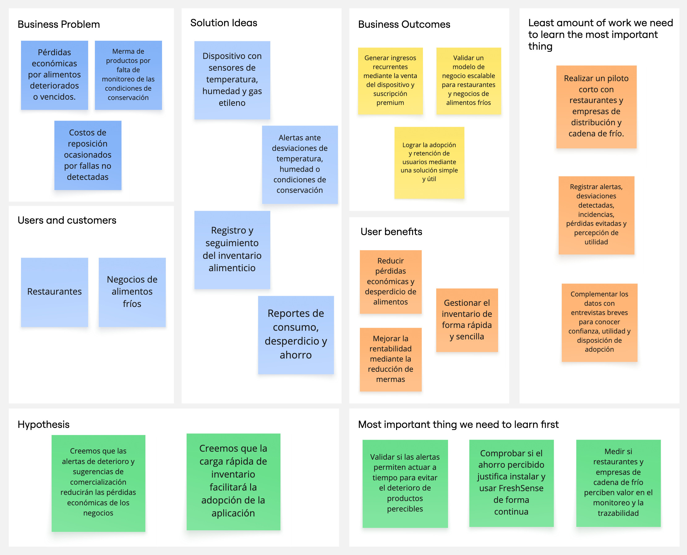

### 1.3. Segmentos objetivo.

Para el proyecto FreshSense se han seleccionado dos segmentos principales de usuarios a los cuales la solución aporta un valor adaptado a sus necesidades específicas:

##### Propietarios y administradores de restaurantes

**Edad:** 28 a 50 años

**Perfil:** Emprendedores que administran restaurantes que gestionan insumos perecibles para la preparación de alimentos.

**Estilo de vida:** Dinámico y enfocado en las operaciones diarias, atención al cliente y control del negocio.

**Uso de tecnología:** Frecuente, principalmente mediante dispositivos móviles y computadoras para realizar consultas rápidas.

**Necesidad principal:** Controlar y conservar adecuadamente los insumos perecibles para reducir desperdicios, pérdidas económicas y costos innecesarios.

**Beneficios buscados:** Alertas sobre productos en riesgo de deterioro, monitoreo de las condiciones de conservación, gestión del inventario y reportes que permitan identificar pérdidas y mejorar la rentabilidad.

##### Encargados de negocios de distribución de alimentos en fríos

**Edad:** 30 a 55 años

**Perfil:** Emprendedores y encargados de negocios dedicados a la distribución y conservación de productos que requieren cadena de frío.

**Estilo de vida:** Ocupado y enfocado en la operación diaria, supervisión de productos, atención al cliente y gestión del inventario.

**Uso de tecnología:** Moderado a frecuente, con disposición a utilizar herramientas que faciliten el monitoreo y control de sus productos.

**Necesidad principal:** Mantener las condiciones adecuadas de conservación para reducir el deterioro de productos, las mermas y las pérdidas económicas.

**Beneficios buscados:** Monitoreo de las condiciones de conservación, alertas ante posibles riesgos, información sobre el estado del inventario y reportes que permitan identificar pérdidas y mejorar la rentabilidad del negocio.

# Capítulo II: Requirements Elicitation & Analysis

## 2.1. Competidores

El análisis de competidores de FreshSense se enfoca en soluciones empresariales relacionadas con monitoreo de cadena de frío, control de condiciones ambientales, trazabilidad y supervisión de productos sensibles a la temperatura.

El análisis lo hicimos pensando en los dos segmentos del proyecto, propietarios y administradores de restaurantes y encargados de negocios de distribución de alimentos en fríos. Por eso se tomaron tres competidores que ya monitorean temperatura y condiciones de conservación con dispositivos IoT:

- **Sensitech**
- **Tive**
- **Roambee**

Estas soluciones presentan similitudes con FreshSense en el monitoreo de variables ambientales, generación de alertas y visualización de información en plataformas digitales. Sin embargo, se diferencian en su nivel de especialización, mercados atendidos, alcance internacional y complejidad tecnológica.

### 2.1.1. Análisis competitivo

El objetivo de este análisis es responder la siguiente pregunta:

> **¿Cómo puede FreshSense diferenciarse de las soluciones empresariales existentes de monitoreo de cadena de frío mediante una propuesta enfocada en alimentos perecibles, facilidad de implementación y centralización de información de lotes, dispositivos y alertas?**

Los competidores seleccionados representan alternativas consolidadas dentro del mercado de monitoreo de condiciones y visibilidad de cadena de suministro.

#### Competitive Analysis Landscape

| Criterio | FreshSense | Sensitech | Tive | Roambee |
|---|---|---|---|---|
| **Tipo de competidor** | Startup analizada | Directo | Directo | Directo |
| **Overview** | Solución IoT enfocada en el monitoreo de productos perecibles mediante dispositivos que recopilan temperatura y humedad y transmiten información hacia una plataforma digital. | Empresa especializada en visibilidad y monitoreo de cadena de frío, con soluciones para almacenamiento y transporte de productos sensibles. | Plataforma de visibilidad logística en tiempo real que combina rastreadores IoT con una plataforma cloud para monitorear envíos. | Plataforma de visibilidad de cadena de suministro que combina dispositivos IoT, sensores, conectividad y análisis para monitorear mercancías y activos. |
| **Ventaja competitiva** | Propuesta enfocada específicamente en empresas que trabajan con alimentos perecibles, con una arquitectura simplificada basada en dispositivos IoT, monitoreo de lotes, alertas y trazabilidad. | Amplio portafolio especializado en cadena de frío, experiencia empresarial y soluciones para almacenamiento y transporte. | Amplia capacidad de monitoreo multimodal y dispositivos capaces de medir múltiples variables en tiempo real. | Integración de monitoreo de condiciones, ubicación, analítica y visibilidad logística en una misma plataforma. |
| **Valor ofrecido al cliente** | Centralizar información sobre condiciones de conservación, dispositivos, lotes y alertas para detectar desviaciones y reducir pérdidas por deterioro. | Proteger la integridad de productos mediante monitoreo continuo, alertas y visibilidad de extremo a extremo. | Detectar desviaciones durante el transporte en tiempo real para actuar antes de que el producto resulte comprometido. | Proporcionar información en tiempo real y señales relacionadas con condiciones y ubicación para mejorar la toma de decisiones logísticas. |
| **Mercado objetivo** | Propietarios y administradores de restaurantes, y encargados de negocios de distribución de alimentos en fríos. | Alimentos, ciencias de la vida, industria y organizaciones con cadenas de suministro sensibles a temperatura. | Alimentos y bebidas, productos perecibles, farmacéutica, ciencias de la vida, bienes de alto valor y operadores logísticos. | Empresas de logística, alimentos y bebidas, farmacéutica, manufactura y organizaciones con cadenas de suministro complejas. |
| **Estrategia de marketing** | Marketing B2B orientado a demostrar reducción de pérdidas, control de condiciones y facilidad de monitoreo. | Demostraciones comerciales, contenido especializado, casos de uso e información dirigida a industrias reguladas y cadenas de frío. | Demostraciones, pruebas de producto, contenido especializado y comunicación centrada en visibilidad logística y prevención de pérdidas. | Demostraciones, pruebas del servicio, contenido sobre supply chain y comunicación orientada a visibilidad y analítica logística. |
| **Productos y servicios** | Dispositivo IoT con ESP32 + DHT22, Edge API, plataforma Web/Mobile, monitoreo de temperatura y humedad, lotes, dispositivos, alertas, trazabilidad y reportes. | SensiWatch Platform, TempTale, ColdStream Site y distintos sensores/registradores para monitoreo estacionario y en tránsito. | Plataforma Tive, trackers Solo Lite, Solo 5G, Solo Pro, sensores, alertas, reportes e integraciones. | Plataforma de visibilidad, dispositivos como BeeSense, monitoreo de temperatura, humedad, ubicación y eventos de transporte. |
| **Precios y costos** | Modelo previsto basado en dispositivo IoT y servicio digital. Los precios comerciales deben validarse posteriormente con los segmentos objetivo. | No publica una lista estándar de precios; el acceso comercial se gestiona mediante contacto y demostración. | Los precios de los trackers principales no se publican de forma general y dependen del volumen y contrato. La plataforma dispone de niveles Essential, Plus y Premium. | Utiliza modelos de suscripción y planes bajo demanda definidos mediante órdenes comerciales según cantidad de dispositivos, activos o envíos. |
| **Canales de distribución** | Landing Page, Web Application y Mobile Application. | Plataforma web, aplicación móvil y contacto comercial. | Plataforma web, integraciones/API y soluciones de seguimiento accesibles digitalmente. | Plataforma web, aplicación móvil, API y contacto comercial. |

### Sensitech

Sensitech ofrece soluciones de monitoreo de cadena de frío tanto para productos almacenados como transportados. Su sistema de monitoreo estacionario permite controlar temperatura y humedad en almacenes e instalaciones, consultar datos históricos y en tiempo real y generar alertas cuando las condiciones salen de los rangos establecidos.

También dispone de la plataforma SensiWatch, que proporciona visibilidad de extremo a extremo de la cadena de suministro y acceso a información desde dispositivos móviles.

#### SWOT - Sensitech

**Fortalezas**

- Amplio portafolio especializado en cadena de frío.
- Monitoreo estacionario y durante transporte.
- Soporte para temperatura, humedad y otras variables.
- Alertas y datos en tiempo real.
- Experiencia en sectores como alimentos y ciencias de la vida.
- Plataforma Web y aplicación móvil.

**Debilidades**

- Solución empresarial de mayor complejidad que puede requerir procesos de implementación y contratación más extensos.
- No ofrece precios públicos estándar para sus principales soluciones.
- Su amplio alcance puede resultar superior a las necesidades de empresas que requieren únicamente monitoreo básico de alimentos perecibles.

**Oportunidades**

- Crecimiento de la digitalización en cadenas de frío.
- Mayor necesidad de trazabilidad y reducción de pérdidas de productos sensibles.
- Incremento de requisitos de control y cumplimiento en cadenas logísticas.

**Amenazas**

- Aparición de soluciones IoT de menor costo.
- Empresas que desarrollen sistemas internos utilizando sensores y plataformas cloud.
- Competidores especializados en soluciones más simples para sectores específicos.

### Tive

Tive ofrece monitoreo de cadena de frío en tiempo real utilizando dispositivos capaces de recopilar información sobre temperatura, humedad, luz, impactos y ubicación.

Su plataforma permite supervisar envíos por transporte terrestre, marítimo, aéreo y ferroviario y generar alertas cuando las condiciones se encuentran fuera de los rangos establecidos.

#### SWOT - Tive

**Fortalezas**

- Monitoreo en tiempo real de múltiples variables.
- Seguimiento multimodal de envíos.
- Amplia cobertura de conectividad.
- Diversos modelos de trackers según el nivel de monitoreo requerido.
- Alertas automáticas e historial de los envíos.
- Integraciones mediante API y webhooks.

**Debilidades**

- Orientación principal hacia monitoreo de mercancías en tránsito.
- La oferta puede resultar más compleja para organizaciones que solo necesitan monitorear instalaciones o lotes específicos.
- Los precios de los dispositivos principales dependen de cotización y volumen.

**Oportunidades**

- Crecimiento del comercio y logística de productos sensibles.
- Mayor demanda de monitoreo en tiempo real.
- Integración con sistemas empresariales y plataformas logísticas.

**Amenazas**

- Competidores globales con soluciones equivalentes de seguimiento IoT.
- Reducción del costo de sensores y conectividad que facilita la entrada de nuevas soluciones.
- Desarrollo de plataformas de monitoreo propias por grandes operadores logísticos.

### Roambee

Roambee desarrolla soluciones de visibilidad de cadena de suministro mediante dispositivos IoT y servicios cloud.

Sus soluciones permiten monitorear condiciones como temperatura y humedad, además de eventos relacionados con ubicación y transporte. La plataforma genera alertas y señales para apoyar la toma de decisiones durante operaciones logísticas.

#### SWOT - Roambee

**Fortalezas**

- Combina monitoreo de condiciones y ubicación.
- Dispositivos con múltiples sensores.
- Plataforma orientada a visibilidad logística empresarial.
- Integración mediante API.
- Opciones de servicio y suscripción según necesidades de monitoreo.
- Capacidad para trabajar con operaciones logísticas de gran escala.

**Debilidades**

- Solución de mayor alcance y complejidad que un sistema enfocado únicamente en conservación de alimentos.
- Costos dependientes de contratos, dispositivos y volumen de operaciones.
- Su propuesta está orientada a supply chain visibility de forma amplia y no exclusivamente al sector de alimentos perecibles.

**Oportunidades**

- Mayor adopción de IoT en transporte y logística.
- Demanda creciente de información en tiempo real.
- Necesidad empresarial de reducir interrupciones y pérdidas en cadenas de suministro.

**Amenazas**

- Alta competencia en plataformas de supply chain visibility.
- Evolución rápida de sensores IoT y plataformas de análisis.
- Aparición de alternativas especializadas de menor costo.

### SWOT - FreshSense

**Fortalezas**

- Enfoque específico en productos alimenticios perecibles.
- Integración de dispositivos IoT con una plataforma digital.
- Monitoreo de temperatura y humedad.
- Gestión centralizada de dispositivos y lotes.
- Generación de alertas ante condiciones que requieren atención.
- Arquitectura preparada para Web y Mobile.
- Propuesta orientada a trazabilidad y reducción de pérdidas.

**Debilidades**

- Producto aún en etapa de desarrollo y validación.
- Menor cantidad de variables monitoreadas frente a competidores internacionales.
- Menor cobertura tecnológica y comercial.
- Dependencia inicial de sensores y conectividad del dispositivo.
- Modelo comercial y precios aún pendientes de validación con usuarios empresariales.

**Oportunidades**

- Digitalización de empresas de distribución y comercialización de alimentos.
- Necesidad de reducir pérdidas provocadas por una conservación inadecuada.
- Crecimiento de soluciones IoT accesibles.
- Posibilidad de adaptar la solución a necesidades específicas del mercado local.
- Incorporación futura de sensores adicionales y analítica avanzada.

**Amenazas**

- Presencia de competidores internacionales consolidados.
- Reducción de precios de soluciones comerciales existentes.
- Resistencia de algunas empresas a reemplazar procesos manuales.
- Entrada de nuevos proveedores de soluciones IoT.
- Dependencia de la correcta instalación y conectividad de los dispositivos.

### Conclusión del análisis competitivo

El análisis evidencia que FreshSense participaría en un mercado en el que existen soluciones consolidadas con capacidades superiores en cobertura global, cantidad de sensores e infraestructura tecnológica.

Sensitech presenta una propuesta especialmente fuerte en monitoreo de cadena de frío tanto estacionario como en tránsito; Tive destaca por el seguimiento multimodal y la captura de múltiples variables en tiempo real; y Roambee ofrece una solución amplia de visibilidad y monitoreo de cadenas de suministro.

Frente a estos competidores, FreshSense no busca inicialmente competir por amplitud tecnológica, sino desarrollar una propuesta más específica para organizaciones que gestionan alimentos perecibles. Su diferenciación preliminar se basa en simplificar el monitoreo de temperatura y humedad y relacionarlo directamente con dispositivos, lotes, alertas y trazabilidad dentro de una experiencia centralizada.

Esta diferenciación deberá validarse posteriormente mediante entrevistas con los segmentos objetivo, principalmente para determinar qué variables necesitan monitorear, qué nivel de trazabilidad requieren y cuánto estarían dispuestos a invertir en una solución de este tipo.

### 2.1.2. Estrategias y tácticas frente a competidores

A partir del análisis competitivo, FreshSense plantea una estrategia de diferenciación enfocada en especialización, simplicidad y adaptación a las necesidades de empresas que gestionan alimentos perecibles.

Las principales estrategias y tácticas serán las siguientes:

- **Especialización en alimentos perecibles:** enfocar la experiencia, terminología, dashboards, lotes y alertas en procesos relacionados con almacenamiento y distribución de alimentos, evitando incorporar funcionalidades empresariales que no sean necesarias para los segmentos objetivo.

- **Implementación progresiva:** facilitar que las empresas puedan comenzar con un número reducido de dispositivos y ampliar posteriormente el monitoreo según sus necesidades.

- **Experiencia simplificada:** diferenciarse de plataformas empresariales de mayor complejidad mediante una interfaz centrada en las funciones principales: monitoreo, lotes, dispositivos, alertas y trazabilidad.

- **Adaptación al mercado objetivo:** usar las entrevistas para ver qué temperatura, reportes y alertas necesitan los propietarios y administradores de restaurantes, y los encargados de negocios de distribución de alimentos en fríos.

- **Modelo comercial flexible:** evaluar alternativas de venta o provisión de dispositivos combinadas con una suscripción por acceso a la plataforma, evitando establecer precios definitivos antes de validar la disposición de pago de los segmentos.

- **Alertas orientadas a la acción:** priorizar notificaciones que permitan identificar rápidamente desviaciones y relacionarlas con un dispositivo o lote determinado.

- **Trazabilidad centralizada:** mantener el historial de lecturas y eventos de cada lote para facilitar la revisión de condiciones durante almacenamiento o distribución.

- **Evolución tecnológica gradual:** mantener una arquitectura que permita incorporar nuevos sensores, capacidades de conectividad y funciones analíticas a medida que el producto y las necesidades del mercado evolucionen.

Estas estrategias buscan que FreshSense compita inicialmente mediante una solución especializada y comprensible para empresas del sector alimentario, en lugar de intentar replicar desde el inicio la amplitud funcional de plataformas internacionales consolidadas.

## 2.2. Entrevistas

Las entrevistas constituyen una de las principales fuentes de información para comprender las necesidades, problemas y expectativas de los segmentos objetivo de FreshSense.

El proceso de investigación se enfoca en representantes de empresas que participan en actividades de almacenamiento, distribución, producción y comercialización de alimentos perecibles. A través de estas entrevistas se busca conocer cómo gestionan actualmente las condiciones de conservación de sus productos, qué dificultades enfrentan, qué herramientas utilizan y qué valor podría aportar una solución basada en dispositivos IoT y monitoreo digital.

Los resultados obtenidos permitirán validar los principales supuestos de FreshSense y servirán posteriormente como base para la elaboración de User Personas, User Task Matrix, User Journey Maps y demás artefactos de análisis.

Los segmentos considerados son:

- **Segmento 1: Propietarios y administradores de restaurantes**
- **Segmento 2: Encargados de negocios de distribución de alimentos en fríos**


### 2.2.1. Diseño de entrevistas

Las entrevistas serán de tipo semiestructurado, utilizando preguntas orientadas a conocer el contexto de trabajo del entrevistado, los procesos actuales de conservación de productos perecibles, los principales problemas encontrados, el uso de tecnología y la percepción de valor frente a una solución como FreshSense.

Las preguntas han sido diseñadas de acuerdo con las características de cada segmento objetivo y buscan obtener información suficiente para identificar necesidades, objetivos, frustraciones y patrones de comportamiento que posteriormente serán utilizados en la construcción de los arquetipos de usuario.

#### Segmento 1: Propietarios y administradores de restaurantes

1. ¿Qué tipo de alimentos manejas en tu negocio y cuáles son más propensos a perderse o malograrse?
   
3. ¿Con qué frecuencia enfrentas pérdidas por deterioro de productos?
   
4. ¿Tienes actualmente un método para controlar la frescura de tus ingredientes (listas, hojas de Excel, memoria, otro)?
   
5. ¿Qué impacto tiene para tu negocio perder productos perecibles? (económico, reputación, tiempo, clientes).
   
6. ¿Qué importancia le das a la calidad y frescura de los alimentos que vendes?
   
7. ¿Qué tipo de alertas o reportes te gustaría recibir para mejorar tu control de inventario?
   
8. ¿Te resultaría útil tener un dispositivo que monitoree automáticamente el estado de los productos dentro de tu refrigerador?
   
9. ¿Qué características serían imprescindibles para que confíes en este tipo de solución
   
10. ¿Pagarías por una herramienta que te ayude a reducir pérdidas y mantener la frescura? ¿Prefieres un pago único por el dispositivo o una suscripción mensual con funciones adicionales?
    
11. ¿Si el sistema pudiera darte estadísticas de consumo, desperdicio y hasta proyecciones de compras, ¿te serviría para tu negocio? 

---

#### Segmento 2: Encargados de negocios de distribución de alimentos en fríos

1. ¿Cuál es su cargo dentro de la empresa y qué responsabilidades tiene relacionadas con producción, almacenamiento, calidad o comercialización?

2. ¿Qué tipo de alimentos perecibles maneja la empresa y cuáles requieren un mayor control de sus condiciones de conservación?

3. ¿Cómo verifican actualmente que los productos se encuentren almacenados bajo condiciones adecuadas?

4. ¿Qué problemas de conservación o deterioro se presentan con mayor frecuencia dentro de la empresa?

5. ¿Qué impacto generan estas pérdidas o deterioros en términos económicos, operativos o de calidad?

6. ¿Utilizan sensores, termómetros, hojas de cálculo, sistemas de inventario u otras herramientas para controlar las condiciones de almacenamiento?

7. ¿Con qué frecuencia revisan actualmente variables como temperatura y humedad?

8. ¿Qué tan útil sería contar con información de estas condiciones en tiempo real y recibir alertas cuando exista una desviación?

9. ¿Cómo identifican y realizan actualmente el seguimiento de los diferentes lotes de productos?

10. Si se detecta un problema de conservación, ¿qué tan sencillo es identificar cuáles lotes podrían haber sido afectados?

11. ¿Qué características considera indispensables en una plataforma de monitoreo de productos perecibles?

12. ¿Qué factores serían más importantes al momento de adoptar una solución como FreshSense: costo, facilidad de uso, precisión, trazabilidad, alertas, reportes u otros?

### 2.2.2. Registro de entrevistas

#### Segmento 1: Propietarios y administradores de restaurantes

##### Entrevista 1

| Dato | Información |
| --- | --- |
| Nombre y apellidos | Guillermo |
| Edad | 26 años |
| Ubicación | Lima |
| Empresa / sector | Restaurante |
| Cargo | Propietario |
| Inicio de entrevista | 00:00 |
| Duración | 06:18 |
| Enlace | https://drive.google.com/file/d/1NJtkNjEPtNI9XM_wAJCINVNJYsAqRvtj/view?usp=sharing |


**Resumen:**

Guillermo tiene 26 años y es propietario de un restaurante en Lima, donde supervisa las compras, el inventario y el estado de los alimentos. Trabaja principalmente con carnes, pescado, pollo, verduras y lácteos, siendo las carnes, el pescado y algunas verduras los productos más propensos a deteriorarse.

Actualmente, el control de frescura se realiza mediante revisión manual, fechas de vencimiento, etiquetas y registros en Excel. Sin embargo, este proceso depende bastante del personal y puede generar pérdidas cuando algún producto no se revisa a tiempo. Para Guillermo, estas pérdidas representan un impacto económico y también afectan la operatividad del restaurante.

Considera útil una solución que permita monitorear temperatura y humedad, enviar alertas ante variaciones anormales y avisar sobre productos próximos a vencer. También valora contar con reportes de desperdicio y consumo para mejorar las compras. Estaría dispuesto a pagar por una herramienta de este tipo siempre que sea precisa, fácil de usar y contribuya realmente a reducir pérdidas.

##### Entrevista 2

| Dato | Información |
| --- | --- |
| Nombre y apellidos | Romy Panduro |
| Edad | 46 años |
| Ubicación | San Borja |
| Empresa / sector | Restobar karaoke |
| Cargo | Propietaria |
| Inicio de entrevista | 00:00 |
| Duración | 9:04 |
| Enlace | https://drive.google.com/file/d/1yaP9FCvV9rKo09GO2Eu2jYF9UUS8Ujob/view?usp=sharing |


**Resumen:**

Romy Panduro tiene 46 años y administra un restobar karaoke ubicado en Tarapoto, con aproximadamente dos años de funcionamiento. En su negocio trabaja principalmente con carnes rojas, pollo y pescado, siendo este último el producto que considera más propenso a deteriorarse.

Actualmente utiliza una aplicación para registrar el stock, mientras que sus trabajadores realizan manualmente la rotación de los productos según su antigüedad. Debido a ello, considera útil contar con una solución que permita recibir alertas automáticas sobre el estado y calidad de los alimentos almacenados en las congeladoras, pudiendo consultar esta información desde cualquier lugar.

Respecto a una solución como FreshSense, valora especialmente el monitoreo automático y las notificaciones. Además, estaría interesada en un modelo de pago anual que incluya actualizaciones y mejoras continuas del sistema.

##### Entrevista 3


#### Segmento 2: Encargados de negocios de distribución de alimentos en fríos

##### Entrevista 1

| Dato | Información |
| --- | --- |
| Nombre y apellidos | Silvia |
| Edad | 40 años |
| Empresa / sector | Comercialización y distribución de alimentos perecibles |
| Función | Supervisión del almacenamiento, control de inventario y conservación de productos |
| Inicio de entrevista | 00:00 |
| Duración | 3:52 |
| Enlace | https://drive.google.com/file/d/1im0wnd2XqLIU5hLwFVeBPy_K5FL50XW8/view?usp=sharing |


**Resumen:**

Silvia tiene 40 años y trabaja en una empresa dedicada a la comercialización y distribución de alimentos perecibles, donde participa en la supervisión del almacenamiento y control del inventario. La empresa maneja principalmente carnes, lácteos y productos congelados, siendo las carnes y los lácteos los que requieren mayor cuidado debido a su sensibilidad ante cambios de temperatura.

Actualmente realizan inspecciones manuales, revisiones periódicas de los equipos de refrigeración y registros de inventario, utilizando también Excel. Sin embargo, el proceso todavía depende considerablemente de verificaciones realizadas por el personal. Silvia señala que una variación de temperatura no detectada a tiempo puede deteriorar productos, generar pérdidas económicas y afectar los pedidos planificados.

Considera útil una solución como FreshSense que permita monitorear temperatura y humedad en tiempo real, enviar alertas ante condiciones inadecuadas y consultar el historial de cada lote. Para ella, la plataforma debería ser fácil de utilizar, ofrecer mediciones confiables y generar reportes que permitan identificar problemas ocurridos durante el almacenamiento.


##### Entrevista 2


##### Entrevista 3


### 2.2.3. Análisis de entrevistas

#### Segmento 1:  Propietarios y administradores de restaurantes

A partir de las tres entrevistas realizadas, se identificó que el **100 % de los entrevistados realiza algún control de temperatura**, aunque todos mencionaron que parte del proceso todavía depende de verificaciones manuales.

El **66.7 %** indicó que utiliza sensores o registradores digitales en determinadas etapas, pero la información no siempre se encuentra centralizada. Asimismo, el **100 % considera útil recibir alertas automáticas** cuando las condiciones salen de los rangos establecidos.

También se observó que el **100 % considera importante relacionar las condiciones registradas con los lotes monitoreados**, principalmente para identificar rápidamente posibles incidencias.

En este segmento, las principales necesidades identificadas son el monitoreo continuo, las alertas oportunas, la trazabilidad y la centralización de la información.

#### Segmento 2: Encargados de negocios de distribución de alimentos en fríos

En este segmento, el **100 % de los entrevistados utiliza algún mecanismo para controlar la temperatura**, aunque las tres empresas también realizan verificaciones manuales periódicas.

El **100 % considera útil contar con información en tiempo real y alertas automáticas**, especialmente para detectar desviaciones antes de que afecten la calidad de los productos.

Además, el **100 % considera relevante asociar las condiciones de almacenamiento con los lotes**, mientras que el **66.7 %** destacó la utilidad de contar con reportes e historiales de mediciones.

Las principales necesidades identificadas son el monitoreo en tiempo real, la gestión de lotes, las alertas y el acceso a información histórica.

#### Conclusión general

En ambos segmentos se observa una necesidad común de mejorar el control de las condiciones de conservación mediante una solución más centralizada y automatizada.

Los resultados respaldan principalmente cuatro funcionalidades de FreshSense: **monitoreo de temperatura y humedad, alertas automáticas, gestión de lotes e historial de mediciones**.

2.3. Needfinding.

### 2.3.1. User Personas.

#### SEGMENTO 1: Propietarios y administradores de restaurantes


José Jiménez representa a un propietario o administrador de restaurante. En el día a día tiene que ver los insumos de la cocina y de las cámaras, porque si algo se vence o la cámara falla, esa comida se bota y el restaurante pierde dinero. Lo que necesita es enterarse a tiempo, sin estar abriendo el refrigerador a cada rato.

### SEGMENTO 2: Encargados de negocios de distribución de alimentos en fríos
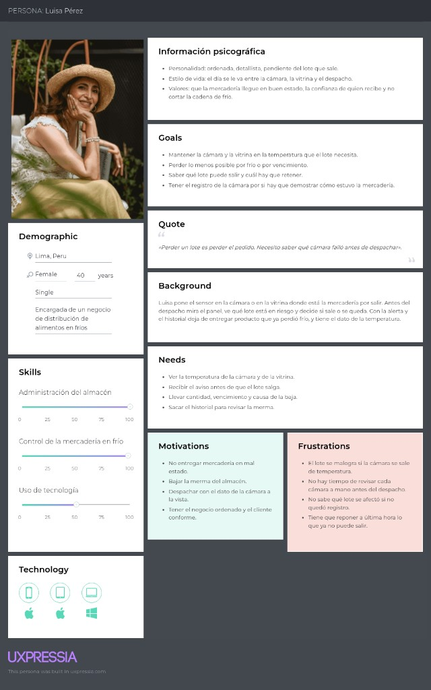

Luisa Pérez representa a una encargada de un negocio de distribución de alimentos en fríos. Su problema es la mercadería que se malogra si la cámara se sale de temperatura o si el lote no sale a tiempo. Quiere ver el estado de las cámaras y saber qué lote está en riesgo antes de entregarlo.


### 2.3.2. User Task Matrix

<table>
  <thead>
    <tr>
      <th rowspan="2">Tareas</th>
      <th colspan="2">José Jimenez<br>(Propietarios y administradores de restaurantes)</th>
      <th colspan="2">Luisa Pérez<br>(Encargados de negocios de distribución de alimentos en fríos)</th>
    </tr>
    <tr>
      <th>Frecuencia</th>
      <th>Importancia</th>
      <th>Frecuencia</th>
      <th>Importancia</th>
    </tr>
  </thead>
  <tbody>
    <tr>
      <td><b>Revisar estado de alimentos en la app</b></td>
      <td>Casi siempre</td>
      <td>Muy alta</td>
      <td>Siempre</td>
      <td>Muy alta</td>
    </tr>
    <tr>
      <td><b>Recibir alertas de vencimiento</b></td>
      <td>Siempre</td>
      <td>Muy alta</td>
      <td>Siempre</td>
      <td>Muy alta</td>
    </tr>
    <tr>
      <td><b>Consultar recetas sugeridas</b></td>
      <td>A veces</td>
      <td>Alta</td>
      <td>Raramente</td>
      <td>Media</td>
    </tr>
    <tr>
      <td><b>Editar inventario manualmente</b></td>
      <td>Raramente</td>
      <td>Media</td>
      <td>Casi siempre</td>
      <td>Alta</td>
    </tr>
    <tr>
      <td><b>Revisar reportes semanales (ahorro, consumo)</b></td>
      <td>A veces</td>
      <td>Media</td>
      <td>Siempre</td>
      <td>Alta</td>
    </tr>
    <tr>
      <td><b>Compartir logros/impacto en redes sociales</b></td>
      <td>A veces</td>
      <td>Media</td>
      <td>Raramente</td>
      <td>Baja</td>
    </tr>
    <tr>
      <td><b>Usar notificaciones configurables (hora/frecuencia)</b></td>
      <td>Casi siempre</td>
      <td>Alta</td>
      <td>Casi siempre</td>
      <td>Alta</td>
    </tr>
    <tr>
      <td><b>Generar proyecciones de compra</b></td>
      <td>Nunca</td>
      <td>Baja</td>
      <td>Casi siempre</td>
      <td>Muy alta</td>
    </tr>
  </tbody>
</table>

El análisis de la matriz de tareas evidencia una clara diferencia en las prioridades operativas y patrones de uso entre ambos perfiles de usuario.

José Jiménez, del segmento de propietarios y administradores de restaurantes, usa más la revisión del estado de los alimentos y las alertas de vencimiento. Las recetas le sirven cuando tiene insumos por salir, pero no es lo primero que mira en el turno.

Luisa Pérez, del segmento de encargados de negocios de distribución de alimentos en fríos, se queda más en el inventario, las métricas y la reposición. Para ella la receta no es lo central: le importa que el lote siga en frío y salga antes de que se malogre.

### 2.3.3. User Journey Mapping

**Segmento 1: Propietarios y administradores de restaurantes**

En este recorrido se ve el día de un propietario o administrador de restaurante. Revisa la cámara de la cocina, mira qué insumos están por vencer y decide si los usa en el servicio o los da de baja. Si nadie le avisa que la temperatura subió, se entera cuando el producto ya no sirve.

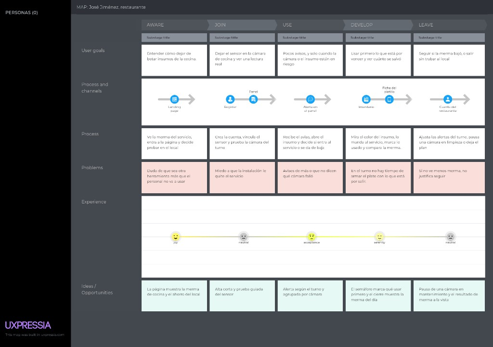

**Segmento 2: Encargados de negocios de distribución de alimentos en fríos**

En este recorrido se ve el día de un encargado de un negocio de distribución de alimentos en fríos. Controla las cámaras y las vitrinas, revisa los lotes y decide qué mercadería puede salir. Si la cadena de frío se corta y no queda registro, no puede saber qué lote se afectó.

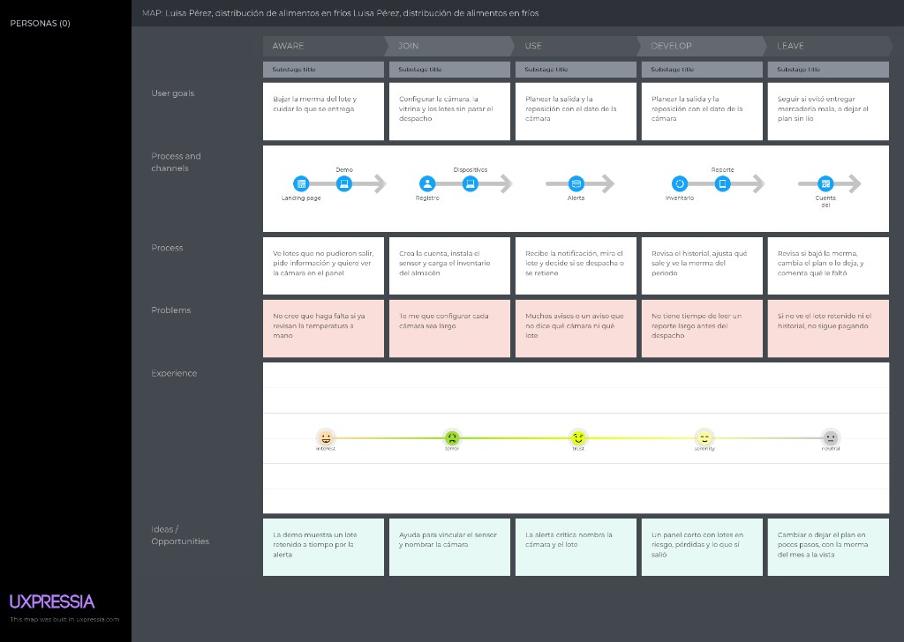


### 2.3.4. Empathy Mapping

**Segmento 1: Propietarios y administradores de restaurantes**

José representa a quien administra un restaurante. Le preocupa botar insumos porque se vencieron o porque la cámara de la cocina falló. Quiere un aviso claro y ver el inventario sin perder el turno de cocina.

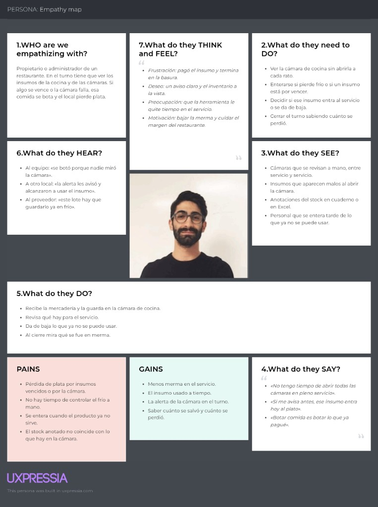

**Segmento 2: Encargados de negocios de distribución de alimentos en fríos**

Luisa representa a quien está a cargo de un negocio de distribución de alimentos en fríos. Le preocupa entregar un lote que ya no está en buen estado y no tener cómo demostrar a qué temperatura estuvo la cámara. Necesita el historial y la alerta antes de que la mercadería salga.

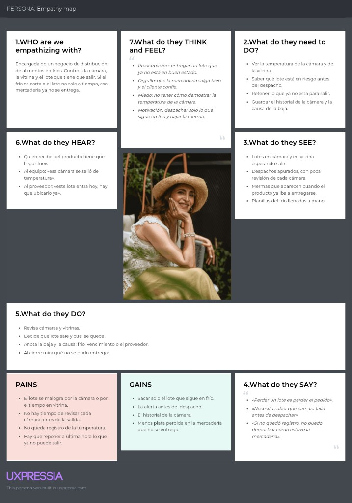

## 2.4. Big Picture EventStorming

Hicimos el EventStorming pensando en los dos segmentos con los que trabajamos: **propietarios y administradores de restaurantes** (insumos de cocina, recetas y mermas) y **encargados de negocios de distribución de alimentos en fríos** (cámaras, vitrinas, lotes y cadena de frío):

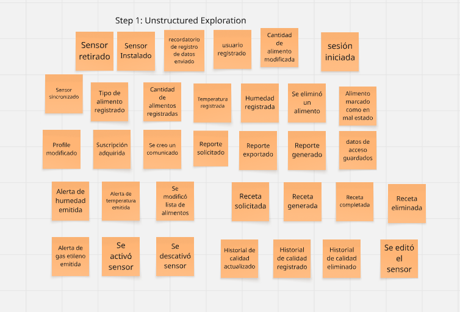
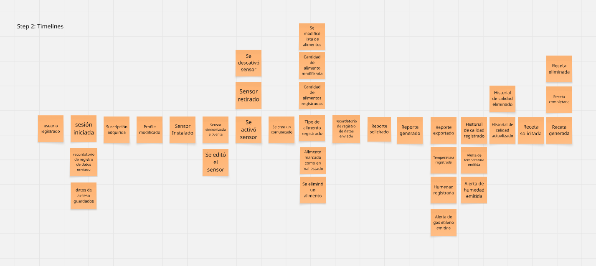
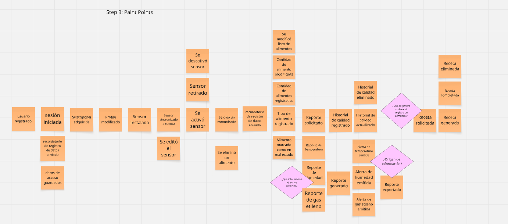
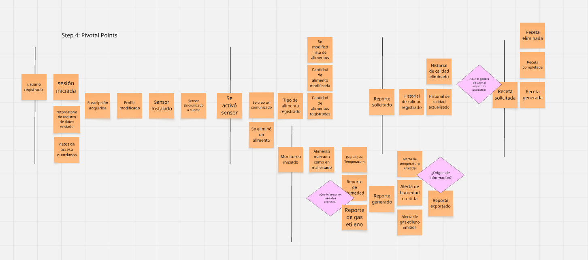
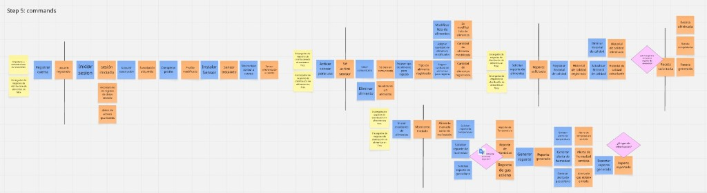
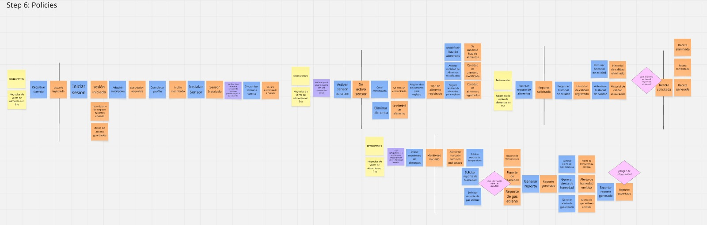
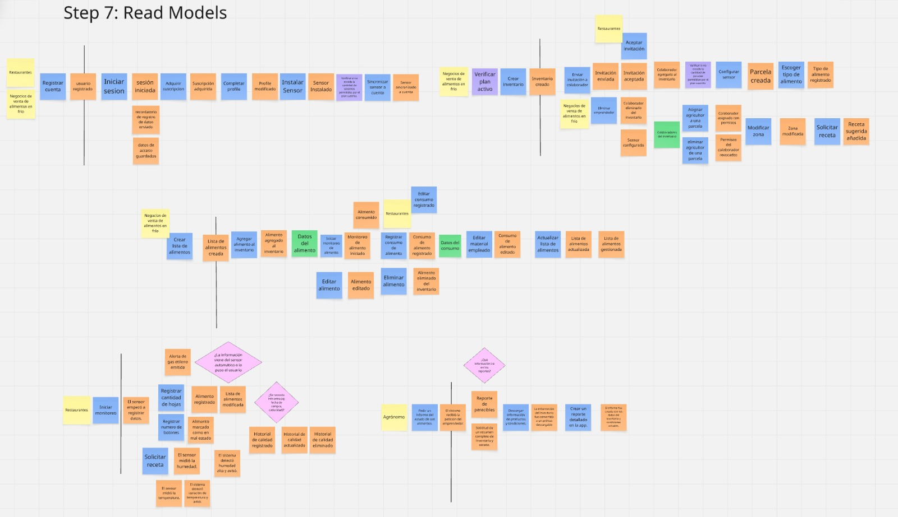
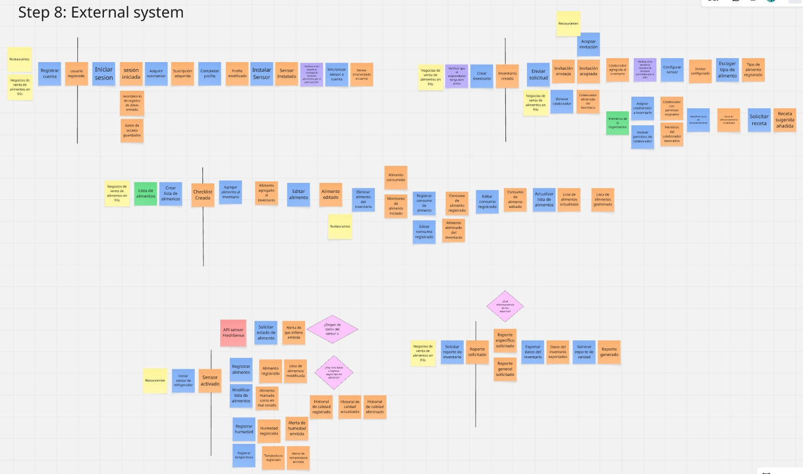


## 2.5. Ubiquitous Language

| Ubiquitous Term | Definition of Functional Domain |
|---|---|
| Food Waste | Loss or discard of raw materials, culinary ingredients, or commercial inventory due to poor stock rotation, cold chain disruption, or unexpected spoilage. |
| FreshSense Device | Sensor-based hardware placed inside commercial fridges, walk-in coolers, display cases, or cold rooms to monitor temperature, humidity, and ethylene gas levels. |
| Ethylene Gas | Natural plant hormone released by fruits and vegetables during ripening, monitored to prevent accelerated deterioration in kitchen storage or produce display cases. |
| Food Inventory | Organized tracking system for raw ingredients (for kitchens) or cold retail products (for display/storage), including expiration control and batch management. |
| Food Condition | Physical freshness and safety state of stored inventory monitored continuously by FreshSense (Optimal, At Risk, or Spoiled/Unusable). |
| Expiration Alert | Critical notification sent to staff or store managers when ingredients or retail stock are approaching expiration or entering an unviable commercial phase. |
| Standardized Recipe / Dish Tech Sheet | Technical recipe specification used by **Restaurants** to calculate standardized ingredient quantities, portion yields, and prevent kitchen over-consumption. |
| Stock Rotation / Cold Batch Management | Inventory control system (e.g., FIFO) used by **Food Cold-Sales Businesses** to prioritize the sale or removal of cold display stock prior to expiration. |
| Commercial Merma Report | Periodic summary detailing discarded ingredients or cold stock losses, quantifying monetary loss and supporting purchasing/stock projections. |
| Premium Subscription | Paid plan unlocking advanced multi-device monitoring, multi-zone/multi-cooler management, detailed merma analytics, and exportable CSV/PDF reports. |
| Restaurant Manager / Chef | Commercial actor (**Segment 1: Restaurants**) who uses FreshSense to optimize kitchen supply usage, track culinary mermas, and ensure dish consistency. |
| Cold Retail Operator / Store Manager | Commercial actor (**Segment 2: Cold-Sales Businesses**) who uses FreshSense to safeguard display cases/cold rooms, prevent merchandise loss, and audit cold chain integrity. |
| Cold Chain Monitoring | Uninterrupted automated tracking of storage temperatures and humidity levels in refrigeration equipment to meet safety standards and protect saleable inventory. |
| Smart Alert System | Priority-based notification system that routes critical alerts (e.g., fridge temperature spike) immediately to store or kitchen supervisors. |
| Stock & Cost Projection | Automated estimation model that predicts replenishment needs and potential financial loss based on historical mermas and current stock levels. |

# Capítulo III: Requirements Specification

## 3.1. User Stories

Las historias están escritas para los dos segmentos del proyecto: propietarios y administradores de restaurantes, y encargados de negocios de distribución de alimentos en fríos. Cada historia tiene tres escenarios.

| User Story ID | Título | Descripción | Criterios de Aceptación (Gherkin) | Relacionado con (Epic) |
| :--- | :--- | :--- | :--- | :--- |
| **US01** | Visualización de propuesta B2B | Como propietario o administrador de un restaurante, o como encargado de un negocio de distribución de alimentos en fríos, quiero entender la propuesta de FreshSense al entrar a la página, para ver si me ayuda a bajar la merma de mi local. | **Escenario 1: Carga limpia y mensaje claro**<br>Dado que un visitante comercial navega a la página web<br>Cuando la plataforma cargue completamente<br>Entonces se mostrará el mensaje central de valor sobre reducción de mermas y conservación de la cadena de frío.<br><br>**Escenario 2: Mensaje según el rubro**<br>Dado que el visitante identifica su negocio como restaurante o como encargado de un negocio de distribución de alimentos en fríos<br>Cuando recorra la portada<br>Entonces verá el beneficio operativo de su rubro: mermas de cocina o control de cámaras y vitrinas.<br><br>**Escenario 3: Fallo de carga**<br>Dado que la portada no termina de cargar<br>Cuando el visitante espera el contenido principal<br>Entonces verá un aviso de error con opción de reintentar, y no una pantalla vacía presentada como propuesta comercial. | **EP01** (Landing Page) |
| **US02** | Sección para Restaurantes y Negocios en Frío | Como propietario o administrador de un restaurante, o como encargado de un negocio de distribución de alimentos en fríos, quiero ver la información de mi rubro, para saber qué me aporta en las cámaras. | **Escenario 1: Navegación por perfil comercial**<br>Dado que un potencial cliente B2B está en la landing page<br>Cuando abra la pestaña «Restaurantes» o «Distribución de alimentos en fríos»<br>Entonces verá los módulos de mermas de cocina, control de vitrinas frías y planes corporativos de ese rubro.<br><br>**Escenario 2: Cambio de rubro**<br>Dado que el visitante está en «Restaurantes»<br>Cuando pase a «Distribución de alimentos en fríos»<br>Entonces el contenido cambia al segmento de encargados de negocios de distribución de alimentos en fríos sin recargar el sitio ni mezclar ambos textos.<br><br>**Escenario 3: Sección no disponible**<br>Dado que el enlace de una pestaña no resuelve a un módulo válido<br>Cuando el visitante lo activa<br>Entonces permanece en la vista general del portal y no ve un módulo vacío como si fuera información del rubro. | **EP01** (Landing Page) |
| **US03** | Formulario de contacto y demos B2B | Como propietario o administrador de un restaurante, o como encargado de un negocio de distribución de alimentos en fríos, quiero dejar mis datos, para coordinar una demo o una prueba en el local. | **Escenario 1: Envío exitoso de consulta**<br>Dado que el representante completa datos de contacto válidos y el tipo de negocio<br>Cuando presione enviar<br>Entonces el sistema registra la solicitud y muestra la confirmación en pantalla.<br><br>**Escenario 2: Solicitud identificada por rubro**<br>Dado que el gerente elige «Restaurante» o «Distribución de alimentos en fríos»<br>Cuando la solicitud se registra<br>Entonces la confirmación y el registro conservan ese tipo de negocio para coordinar la demo.<br><br>**Escenario 3: Datos inválidos**<br>Dado que falta el correo, el tipo de negocio o el correo no tiene formato válido<br>Cuando presione enviar<br>Entonces la solicitud no se registra y se señalan los campos que debe corregir. | **EP01** (Landing Page) |
| **US04** | Call to Action (CTA) Corporativo | Como propietario o administrador de un restaurante, o como encargado de un negocio de distribución de alimentos en fríos, quiero encontrar un botón claro para pedir la demo, para no buscar el formulario. | **Escenario 1: Redirección desde el CTA**<br>Dado que el usuario explora los planes comerciales<br>Cuando haga clic en «Solicitar demo comercial»<br>Entonces llega al formulario de registro de empresa.<br><br>**Escenario 2: CTA en tablet o teléfono**<br>Dado que el supervisor abre los planes desde una tablet de cocina o un teléfono<br>Cuando pulse el mismo llamado a la acción<br>Entonces también llega al formulario, con el botón visible y accionable.<br><br>**Escenario 3: Formulario no disponible**<br>Dado que el destino del formulario no responde<br>Cuando pulse «Solicitar demo comercial»<br>Entonces ve un aviso de que la solicitud no pudo abrirse y permanece en la página de planes. | **EP01** (Landing Page) |
| **US05** | Adaptabilidad en dispositivos móviles y tablets | Como propietario o administrador de un restaurante, o como encargado de un negocio de distribución de alimentos en fríos, quiero abrir la plataforma en la tablet o en el celular, para revisarla mientras estoy en el local. | **Escenario 1: Ajuste a la pantalla**<br>Dado que el supervisor ingresa desde una tablet o un navegador móvil<br>Cuando recorra las secciones<br>Entonces márgenes, tablas y botones se ajustan al ancho de la pantalla.<br><br>**Escenario 2: Cambio de orientación**<br>Dado que la tablet está en vertical<br>Cuando el supervisor la gire a horizontal<br>Entonces la sección en la que estaba sigue visible y las tablas se reacomodan sin cortar botones.<br><br>**Escenario 3: Ancho mínimo**<br>Dado que el ancho de pantalla es el mínimo soportado para operación en planta<br>Cuando interactúe con alertas, inventario o planes<br>Entonces el texto y los controles permanecen legibles, sin quedar fuera de la pantalla. | **EP01** (Landing Page) |
| **US06** | Telemetría y monitoreo IoT de cámaras frías | Como propietario o administrador de un restaurante, o como encargado de un negocio de distribución de alimentos en fríos, quiero que el sensor mida temperatura, humedad y etileno de la cámara, para enterarme antes de que el producto se malogre. | **Escenario 1: Transmisión continua de telemetría**<br>Dado que el dispositivo FreshSense está en línea en una cámara o vitrina<br>Cuando detecte un cambio de temperatura, humedad o etileno<br>Entonces envía la lectura y el panel se actualiza con esos valores.<br><br>**Escenario 2: Notificación por pérdida de señal**<br>Dado que el sensor pierde enlace con la red<br>Cuando el servidor deja de recibir señal de esa cámara<br>Entonces notifica al supervisor el fallo de conectividad del área afectada.<br><br>**Escenario 3: Lectura incompleta**<br>Dado que el sensor envía una lectura sin temperatura, humedad o etileno<br>Cuando el panel procese ese envío<br>Entonces no la presenta como una medición válida de la cámara. | **EP02** (Monitoreo IoT) |
| **US07** | Dashboard de inventario con semáforo | Como propietario o administrador de un restaurante, o como encargado de un negocio de distribución de alimentos en fríos, quiero ver el inventario en verde, amarillo o rojo, para saber qué está bien, qué hay que sacar pronto y qué ya está crítico. | **Escenario 1: Vista por código de colores**<br>Dado que el usuario consulta el inventario<br>Cuando la interfaz procese la lectura de los sensores<br>Entonces cada insumo queda en verde (óptimo), amarillo (priorizar uso o venta) o rojo (crítico).<br><br>**Escenario 2: Inspección detallada del lote**<br>Dado que el usuario selecciona un insumo o lote<br>Cuando se abra su ficha<br>Entonces verá la fecha estimada de caducidad, el lote y los niveles de etileno o la variación térmica.<br><br>**Escenario 3: Sin lectura utilizable**<br>Dado que un producto no tiene una lectura reciente de su cámara<br>Cuando el usuario consulte el inventario<br>Entonces ese producto figura como estado desconocido y no como verde. | **EP02** (Monitoreo IoT) |
| **US08** | Sistema de alertas preventivas de temperatura | Como propietario o administrador de un restaurante, o como encargado de un negocio de distribución de alimentos en fríos, quiero recibir un aviso cuando la cámara pierda frío o un producto esté en riesgo, para actuar antes de perderlo. | **Escenario 1: Notificación de quiebre de temperatura**<br>Dado que una cámara o lote pasa a estado crítico<br>Cuando el motor de reglas procese los datos<br>Entonces envía una alerta push o SMS al personal responsable y la deja visible en el panel.<br><br>**Escenario 2: Ausencia de falsas alarmas**<br>Dado que la cámara se mantiene dentro de sus umbrales<br>Cuando el sistema haga el chequeo periódico<br>Entonces no emite ninguna notificación.<br><br>**Escenario 3: Fallo del canal externo**<br>Dado que la condición es crítica y el envío push o SMS no se entrega<br>Cuando el motor termine de procesar el evento<br>Entonces la alerta queda en el panel como pendiente de envío y no figura como entregada. | **EP03** (Alertas Inteligentes) |
| **US09** | Preferencias de alertas por turno de trabajo | Como propietario o administrador de un restaurante, o como encargado de un negocio de distribución de alimentos en fríos, quiero configurar las alertas según el turno, para que una alerta leve no suene fuera de hora. | **Escenario 1: Alerta leve fuera de turno**<br>Dado que se activa una alerta leve fuera del turno operativo<br>Cuando el sistema evalúe su severidad y el horario<br>Entonces registra el evento en el panel y no dispara alarma sonora de emergencia.<br><br>**Escenario 2: Alerta crítica en cualquier horario**<br>Dado que una cámara cae a estado rojo fuera del turno de cocina o de tienda<br>Cuando el sistema evalúe la severidad<br>Entonces notifica al responsable de guardia por el canal configurado para alertas críticas.<br><br>**Escenario 3: Configuración incompleta**<br>Dado que el administrador no indicó horario o canal<br>Cuando intente guardar las preferencias<br>Entonces el sistema no las aplica y señala los datos que faltan. | **EP03** (Alertas Inteligentes) |
| **US10** | Alta de insumos por lector de código de barras y QR | Como propietario o administrador de un restaurante, o como encargado de un negocio de distribución de alimentos en fríos, quiero dar de alta la mercadería con código de barras o QR, para no registrar el lote a mano. | **Escenario 1: Alta rápida de lote por scanner**<br>Dado que el recepcionista escanea el código de un paquete o caja<br>Cuando la aplicación lo identifique en el catálogo<br>Entonces registra el insumo, la fecha de ingreso y la categoría.<br><br>**Escenario 2: Nuevo ingreso de un insumo ya existente**<br>Dado que el código corresponde a un insumo que ya está en la sucursal<br>Cuando el recepcionista confirme la cantidad recibida<br>Entonces suma esa cantidad al stock y conserva el registro del nuevo ingreso.<br><br>**Escenario 3: Código fuera de catálogo**<br>Dado que el código escaneado no existe en el catálogo<br>Cuando la aplicación lo procese<br>Entonces no crea el insumo automáticamente y ofrece completar el alta manual. | **EP04** (Gestión de Inventario) |
| **US11** | Modificación manual de stock e insumos | Como propietario o administrador de un restaurante, o como encargado de un negocio de distribución de alimentos en fríos, quiero corregir las cantidades después del conteo, para que el sistema coincida con lo que hay en la cámara. | **Escenario 1: Actualización de existencias**<br>Dado que el supervisor ajusta las unidades restantes de un insumo<br>Cuando guarde la modificación<br>Entonces el stock disponible queda con la nueva cantidad y se genera el registro de auditoría.<br><br>**Escenario 2: Auditoría del ajuste**<br>Dado que el ajuste se guardó<br>Cuando un auditor consulte ese insumo<br>Entonces ve usuario, fecha, cantidad anterior y cantidad nueva.<br><br>**Escenario 3: Cantidad no válida**<br>Dado que el supervisor ingresa una cantidad negativa o un valor no numérico<br>Cuando intente guardar<br>Entonces el stock no cambia y se indica que la cantidad no es válida. | **EP04** (Gestión de Inventario) |
| **US12** | Reporte semanal de mermas y desperdicios | Como propietario o administrador de un restaurante, o como encargado de un negocio de distribución de alimentos en fríos, quiero recibir el reporte de lo descartado en la semana, para ver cuánto se perdió. | **Escenario 1: Emisión de reporte de mermas**<br>Dado que se cumple el ciclo semanal o mensual configurado<br>Cuando el servidor consolide las bajas y los descartes<br>Entonces envía el resumen al correo de administración y lo publica en el panel.<br><br>**Escenario 2: Consulta en el panel**<br>Dado que el resumen del periodo ya fue consolidado<br>Cuando el gerente lo abra en el panel antes de revisar el correo<br>Entonces ve el mismo volumen de mermas y el mismo costo del periodo.<br><br>**Escenario 3: Periodo sin mermas**<br>Dado que en el ciclo no hubo descartes ni bajas<br>Cuando se genere el reporte<br>Entonces el resumen indica cero mermas y no agrega pérdidas. | **EP04** (Gestión de Inventario) |
| **US13** | Estandarización de recetas y fichas técnicas | Como propietario o administrador de un restaurante, quiero armar la ficha del platillo con sus insumos, para descontar lo que sale en cocina y usar primero lo que está por vencer. | **Escenario 1: Prioridad de insumos en alerta**<br>Dado que existen insumos en alerta amarilla<br>Cuando el chef consulte el módulo de recetas<br>Entonces el sistema sugiere primero los platillos que usan esos insumos.<br><br>**Escenario 2: Descuento por ficha técnica**<br>Dado que el platillo tiene una ficha con insumos y cantidades<br>Cuando el chef confirme la preparación<br>Entonces el inventario descuenta las cantidades indicadas en la ficha.<br><br>**Escenario 3: Stock insuficiente**<br>Dado que un insumo de la ficha no alcanza para la preparación<br>Cuando el chef intente confirmarla<br>Entonces no se descuenta ningún insumo de esa preparación y se indica el faltante. | **EP05** (Recetas Personalizadas) |
| **US14** | Filtrado avanzado de insumos y lotes | Como propietario o administrador de un restaurante, o como encargado de un negocio de distribución de alimentos en fríos, quiero filtrar por cámara, vencimiento, lote o categoría, para ubicar lo que tengo que mover. | **Escenario 1: Aplicación de filtros combinados**<br>Dado que el usuario selecciona «Cámara 1», «Vegetales» y vencimiento menor a 3 días<br>Cuando ejecute la búsqueda<br>Entonces solo aparecen los insumos que cumplen las tres condiciones.<br><br>**Escenario 2: Quitar un filtro**<br>Dado que la lista está filtrada por cámara, categoría y vencimiento<br>Cuando el usuario quite el filtro de categoría<br>Entonces la lista se actualiza con los insumos que siguen cumpliendo los filtros restantes.<br><br>**Escenario 3: Sin coincidencias**<br>Dado que ningún insumo cumple la combinación elegida<br>Cuando ejecute la búsqueda<br>Entonces la pantalla muestra un resultado vacío y no el inventario completo. | **EP05** (Recetas Personalizadas) |
| **US15** | Onboarding comercial e inducción de personal | Como propietario o administrador de un restaurante, o como encargado de un negocio de distribución de alimentos en fríos, quiero dejar un tutorial para el personal nuevo, para que sepa registrar una merma y leer una alerta. | **Escenario 1: Primer ingreso**<br>Dado que un colaborador inicia sesión por primera vez<br>Cuando se abra la pantalla principal<br>Entonces aparece una guía paso a paso sobre el registro de mermas y la lectura de alertas.<br><br>**Escenario 2: Retomar la guía**<br>Dado que el colaborador omitió la guía en el primer ingreso<br>Cuando elija volver a verla desde su perfil<br>Entonces la guía se abre en el primer paso, sin borrar su avance operativo.<br><br>**Escenario 3: Ingreso posterior**<br>Dado que el colaborador ya completó u omitió la guía<br>Cuando vuelva a iniciar sesión<br>Entonces entra directo al panel y la guía no bloquea la pantalla. | **EP06** (UX y Accesibilidad) |
| **US16** | Interfaz optimizada para entornos operativos | Como propietario o administrador de un restaurante, o como encargado de un negocio de distribución de alimentos en fríos, quiero una pantalla clara en la tablet, para usarla en la cocina o en el almacén sin detenerme. | **Escenario 1: Lectura en planta**<br>Dado que el trabajador abre el tablero en la tablet de cocina o almacén<br>Cuando revise botones y alertas<br>Entonces distingue el estado de cada insumo por texto, color y contraste suficientes para esa pantalla.<br><br>**Escenario 2: Acción táctil**<br>Dado que el trabajador necesita atender una alerta o abrir un lote<br>Cuando pulse el control correspondiente<br>Entonces el área táctil responde en un solo toque, sin exigir precisión de puntero.<br><br>**Escenario 3: Contenido que no cabe**<br>Dado que el nombre del insumo o el mensaje de alerta es más largo que el ancho disponible<br>Cuando se muestre en la tablet<br>Entonces el texto se ajusta sin tapar el semáforo ni el botón de acción. | **EP06** (UX y Accesibilidad) |
| **US17** | Analítica avanzada de rotación e inventarios | Como propietario o administrador de un restaurante, o como encargado de un negocio de distribución de alimentos en fríos, quiero ver cómo rota el stock, para comprar mejor y no llenar la cámara de más. | **Escenario 1: Acceso con plan activo**<br>Dado un usuario con plan Enterprise o B2B activo<br>Cuando abra el menú de analítica<br>Entonces ve gráficos de entradas, rotación y mermas del periodo.<br><br>**Escenario 2: Cambio de periodo**<br>Dado que el gerente está viendo la analítica del mes<br>Cuando seleccione otra semana u otro mes<br>Entonces los gráficos se recalculan solo con los movimientos de ese periodo.<br><br>**Escenario 3: Plan sin analítica avanzada**<br>Dado un usuario cuyo plan no incluye analítica Enterprise<br>Cuando intente abrir ese menú<br>Entonces no ve los gráficos comparativos y se informa que la función corresponde a otro plan. | **EP07** (Suscripción Premium) |
| **US18** | Panel de impacto financiero de mermas rescatadas | Como propietario o administrador de un restaurante, o como encargado de un negocio de distribución de alimentos en fríos, quiero ver cuánto dinero se salvó al usar o vender el producto antes del vencimiento, para saber si el control está sirviendo. | **Escenario 1: Ahorro del periodo**<br>Dado que el sistema registró alimentos utilizados o vendidos antes de su vencimiento gracias a las alertas<br>Cuando el gerente consulte el panel financiero<br>Entonces ve la estimación en moneda local del valor rescatado.<br><br>**Escenario 2: Desglose del ahorro**<br>Dado que el periodo tiene rescates en más de una cámara o categoría<br>Cuando abra el detalle<br>Entonces el valor rescatado se muestra separado por categoría de insumo.<br><br>**Escenario 3: Periodo sin rescates**<br>Dado que no hubo insumos aprovechados por alerta en el periodo<br>Cuando consulte el panel financiero<br>Entonces el ahorro figura en cero. | **EP07** (Suscripción Premium) |
| **US19** | Módulo de fichas técnicas gourmet/avanzadas | Como propietario o administrador de un restaurante, quiero el costeo del platillo y la merma del corte, para ver si el plato deja margen. | **Escenario 1: Costeo con plan premium**<br>Dado un restaurante con suscripción Premium o Enterprise<br>Cuando consulte las recetas avanzadas<br>Entonces puede calcular el rendimiento de merma por corte e insumo.<br><br>**Escenario 2: Recálculo del costo**<br>Dado que el chef modifica el rendimiento de merma de un corte<br>Cuando guarde la ficha<br>Entonces el costo del platillo se actualiza con ese rendimiento.<br><br>**Escenario 3: Plan sin costeo avanzado**<br>Dado un local sin suscripción Premium o Enterprise<br>Cuando abra la sección de recetas avanzadas<br>Entonces ve la función bloqueada y no los costos por corte. | **EP07** (Suscripción Premium) |
| **US20** | Métricas de impacto ambiental corporativo | Como propietario o administrador de un restaurante, o como encargado de un negocio de distribución de alimentos en fríos, quiero ver el CO2 y el agua que se dejó de perder al rescatar producto, para tener el dato del periodo. | **Escenario 1: Reporte del periodo**<br>Dado el registro de insumos salvados durante el periodo<br>Cuando el usuario abra la pestaña de sostenibilidad<br>Entonces ve el CO₂ no emitido y los litros de agua preservados de ese periodo.<br><br>**Escenario 2: Otro rango de fechas**<br>Dado que el usuario cambia el rango del reporte<br>Cuando la pestaña se actualice<br>Entonces las equivalencias corresponden solo a los insumos salvados en ese rango.<br><br>**Escenario 3: Sin insumos salvados**<br>Dado que el periodo no tiene insumos salvados<br>Cuando abra la pestaña<br>Entonces CO₂ y agua preservada figuran en cero. | **EP08** (Sostenibilidad) |
| **US21** | Difusión de sellos de sostenibilidad | Como propietario o administrador de un restaurante, o como encargado de un negocio de distribución de alimentos en fríos, quiero descargar un sello cuando cumpla la meta de merma, para mostrarlo en el local. | **Escenario 1: Meta cumplida**<br>Dado que el local alcanzó la meta mensual de reducción de mermas<br>Cuando presione «Generar sello verde»<br>Entonces obtiene una imagen del sello, con el periodo y la sede, lista para difusión o impresión.<br><br>**Escenario 2: Nueva descarga del mismo sello**<br>Dado que el sello del mes ya fue generado<br>Cuando lo vuelva a descargar<br>Entonces obtiene la misma certificación del periodo, sin crear otra meta cumplida.<br><br>**Escenario 3: Meta no alcanzada**<br>Dado que el local no cumplió la meta mensual<br>Cuando presione «Generar sello verde»<br>Entonces no se emite el certificado de ese mes. | **EP08** (Sostenibilidad) |
| **US22** | Sincronización con equipos de refrigeración industrial | Como propietario o administrador de un restaurante, o como encargado de un negocio de distribución de alimentos en fríos, quiero enlazar FreshSense con el equipo de frío del local, para ver sus lecturas en el mismo panel. | **Escenario 1: Emparejamiento exitoso**<br>Dado un equipo de refrigeración compatible<br>Cuando se complete el emparejamiento mediante API<br>Entonces el panel central muestra la información de sus compresores y sensores.<br><br>**Escenario 2: Varias cámaras del mismo equipo**<br>Dado que el equipo vinculado controla más de una cámara<br>Cuando el gerente abra el panel<br>Entonces cada cámara aparece identificada con sus propias lecturas.<br><br>**Escenario 3: Credenciales o equipo no compatible**<br>Dado que la API rechaza las credenciales o el equipo no es compatible<br>Cuando se intente el emparejamiento<br>Entonces no se crea el vínculo y el panel no muestra lecturas de ese equipo. | **EP09** (Integración IoT) |
| **US23** | Consultas por voz en estaciones de trabajo | Como propietario o administrador de un restaurante, quiero preguntar por voz qué insumos de una cámara vencen hoy, para no soltar la preparación. | **Escenario 1: Consulta reconocida**<br>Dado que el terminal de cocina está vinculado al asistente de voz<br>Cuando el chef pregunte qué insumos de la Cámara 1 vencen hoy<br>Entonces el asistente lee en voz alta los artículos en alerta de esa cámara.<br><br>**Escenario 2: Consulta de otra cámara**<br>Dado que el asistente ya respondió por la Cámara 1<br>Cuando el chef pregunte por otra cámara de la misma sede<br>Entonces la respuesta corresponde solo a los insumos en alerta de esa segunda cámara.<br><br>**Escenario 3: Voz no disponible o no entendida**<br>Dado que el terminal no está vinculado o el comando no se reconoce<br>Cuando el chef haga la consulta<br>Entonces no se modifica el inventario y se indica que debe repetir la consulta o usar la pantalla. | **EP09** (Integración IoT) |
| **US24** | Ruteo de alertas multidispositivo por jerarquía | Como propietario o administrador de un restaurante, o como encargado de un negocio de distribución de alimentos en fríos, quiero elegir si la alerta crítica le llega al responsable de turno o se muestra en la pantalla del local. | **Escenario 1: Alerta roja al gerente de turno**<br>Dado que hay una caída crítica de temperatura en la madrugada y el destino configurado es el gerente de guardia<br>Cuando se dispare la alerta roja<br>Entonces el aviso llega al teléfono de ese gerente.<br><br>**Escenario 2: Alerta operativa a la pantalla de cocina**<br>Dado que la regla envía las alertas de prioridad de cocina a la pantalla del turno<br>Cuando se active una de esas alertas dentro del horario de cocina<br>Entonces se muestra en la pantalla de cocina y no se trata como aviso de madrugada al gerente.<br><br>**Escenario 3: Destinatario sin canal**<br>Dado que la alerta es crítica y el gerente de guardia no tiene un teléfono configurado<br>Cuando se dispare<br>Entonces queda visible en el panel con el estado de destinatario no disponible y no figura como entregada al teléfono. | **EP09** (Integración IoT) |
| **US25** | Gamificación y metas de equipo | Como propietario o administrador de un restaurante, o como encargado de un negocio de distribución de alimentos en fríos, quiero poner una meta de merma al equipo, para que registren y cuiden el stock. | **Escenario 1: Meta cumplida**<br>Dado que la cocina o tienda cumple el periodo configurado sin mermas por negligencia<br>Cuando el sistema cierre ese periodo<br>Entonces otorga la insignia al perfil de la sucursal y suma los puntos de la meta.<br><br>**Escenario 2: Puntos visibles para el equipo**<br>Dado que la sucursal recibió la insignia<br>Cuando el jefe de cocina o tienda abra el perfil de la sede<br>Entonces ve la insignia y los puntos acumulados de esa meta.<br><br>**Escenario 3: Meta no cumplida**<br>Dado que en el periodo hubo una merma registrada por negligencia<br>Cuando el sistema cierre el periodo<br>Entonces no otorga la insignia ni suma esos puntos. | **EP10** (Gamificación) |
| **US26** | Red de proveedores e intercambio de buenas prácticas | Como propietario o administrador de un restaurante, o como encargado de un negocio de distribución de alimentos en fríos, quiero ver y dejar consejos de conservación con otros locales del mismo rubro. | **Escenario 1: Publicación en la red B2B**<br>Dado que el usuario entra a la comunidad de comercios<br>Cuando publique un consejo de calibración o conservación<br>Entonces los demás gerentes registrados pueden verlo y responder.<br><br>**Escenario 2: Guardar una sugerencia**<br>Dado que otro gerente publicó una práctica de conservación<br>Cuando el usuario elija guardarla<br>Entonces queda en sus sugerencias guardadas y sigue visible en la comunidad.<br><br>**Escenario 3: Publicación vacía**<br>Dado que el mensaje no tiene contenido<br>Cuando intente publicarlo<br>Entonces no aparece en la comunidad. | **EP10** (Gamificación) |
| **US27** | Benchmarking entre sucursales | Como propietario o administrador de un restaurante con varias sedes, o como encargado de un negocio de distribución de alimentos en fríos con varias sedes, quiero comparar la merma entre locales, para ver cuál está perdiendo más. | **Escenario 1: Comparativa del mes**<br>Dado que la empresa tiene 3 o más sucursales con datos del mes<br>Cuando consulte la comparativa<br>Entonces las sedes quedan ordenadas de menor a mayor porcentaje de mermas.<br><br>**Escenario 2: Otro mes**<br>Dado que el director cambia el mes de la comparativa<br>Cuando el panel se actualice<br>Entonces el orden usa solo las mermas de ese mes.<br><br>**Escenario 3: Menos de tres sucursales**<br>Dado que la empresa tiene una o dos sucursales<br>Cuando abra la comparativa<br>Entonces ve el aviso de que el ranking requiere al menos tres sedes y no un orden presentado como benchmarking completo. | **EP10** (Gamificación) |
| **US28** | Categorización personalizada de insumos y cámaras | Como propietario o administrador de un restaurante, o como encargado de un negocio de distribución de alimentos en fríos, quiero crear mis categorías, para ordenar el stock como lo trabajo en el local. | **Escenario 1: Nueva categoría**<br>Dado que el usuario crea la categoría «Mariscos congelados»<br>Cuando catalogue un lote nuevo<br>Entonces puede asignarlo a esa categoría, filtrarlo y definir alertas para ese grupo.<br><br>**Escenario 2: Alerta de la categoría**<br>Dado que «Mariscos congelados» tiene una regla de alerta propia<br>Cuando un lote de esa categoría entre en la condición configurada<br>Entonces la alerta se genera con esa categoría y no con una regla de otro grupo.<br><br>**Escenario 3: Nombre repetido**<br>Dado que ya existe una categoría con el mismo nombre en la sede<br>Cuando intente crearla otra vez<br>Entonces no se duplica. | **EP11** (Gestión Avanzada) |
| **US29** | Historial de mermas e inventario exportable | Como propietario o administrador de un restaurante, o como encargado de un negocio de distribución de alimentos en fríos, quiero descargar el historial de mermas en Excel o CSV, para pasarlo a contabilidad. | **Escenario 1: Exportación del rango**<br>Dado que el usuario define un rango de fechas y una sucursal<br>Cuando presione «Exportar historial comercial»<br>Entonces descarga un CSV o Excel con lotes, cantidades, causas y costos de ese rango.<br><br>**Escenario 2: Contenido del archivo**<br>Dado que en el rango hay ingresos, consumos y descartes<br>Cuando abra el archivo descargado<br>Entonces cada movimiento incluye fecha, sucursal, lote, acción y costo.<br><br>**Escenario 3: Rango sin movimientos**<br>Dado que la sucursal no tiene movimientos en las fechas elegidas<br>Cuando intente exportar<br>Entonces no descarga un archivo con filas de movimiento e informa que no hay datos en ese rango. | **EP11** (Gestión Avanzada) |
| **US30** | Algoritmo de sugerencias de reposición de stock | Como propietario o administrador de un restaurante, o como encargado de un negocio de distribución de alimentos en fríos, quiero una sugerencia de cuánto reponer según lo consumido, para no comprar de más. | **Escenario 1: Orden sugerida**<br>Dado el historial de los últimos 30 días de la sucursal<br>Cuando el encargado prepare la orden de compra<br>Entonces la plataforma recomienda cantidades de reposición para los insumos con historial suficiente.<br><br>**Escenario 2: Ajuste de la sugerencia**<br>Dado que el sistema recomendó una cantidad<br>Cuando el comprador la modifique antes de usar la orden<br>Entonces la orden conserva la cantidad editada y deja visible la cantidad que había sugerido el sistema.<br><br>**Escenario 3: Historial insuficiente**<br>Dado que un insumo no tiene consumo suficiente en los últimos 30 días<br>Cuando se prepare la sugerencia<br>Entonces ese insumo no recibe una cantidad recomendada y se indica que falta historial. | **EP11** (Gestión Avanzada) |
| **US31** | Vinculación y calibración de sensores de cámaras | Como propietario o administrador de un restaurante, o como encargado de un negocio de distribución de alimentos en fríos, quiero vincular el sensor leyendo su QR y guardar el límite de temperatura de esa cámara. | **Escenario 1: Vinculación QR exitosa**<br>Dado que el supervisor abre el módulo de hardware<br>Cuando escanee el QR del sensor de la cámara de congelación e indique el umbral<br>Entonces el sensor queda asociado a esa zona y calibrado con la temperatura límite definida.<br><br>**Escenario 2: Umbral distinto por tipo de cámara**<br>Dado que una sede tiene cámara de congelación y vitrina de refrigeración<br>Cuando el supervisor calibre cada sensor con su propio límite<br>Entonces cada zona conserva su umbral y no hereda el de la otra.<br><br>**Escenario 3: QR inválido o ya usado**<br>Dado que el código no corresponde a un sensor FreshSense o ya está vinculado a otra zona<br>Cuando el supervisor intente asociarlo<br>Entonces el sistema no lo vincula e indica el motivo. | **EP02** (Monitoreo IoT) |
| **US32** | Modo de mantenimiento de equipos fríos | Como propietario o administrador de un restaurante, o como encargado de un negocio de distribución de alimentos en fríos, quiero pausar las alarmas de una cámara mientras se limpia o se repara. | **Escenario 1: Pausa de alertas de la cámara**<br>Dado que el técnico activa el modo mantenimiento en la Cámara 2 por 60 minutos<br>Cuando confirme la pausa<br>Entonces el sistema suspende las alertas de puerta abierta o alza de temperatura solo en esa cámara.<br><br>**Escenario 2: Fin del tiempo programado**<br>Dado que el modo mantenimiento de la Cámara 2 está activo<br>Cuando se cumplan los 60 minutos<br>Entonces las alertas de esa cámara vuelven a evaluarse solas.<br><br>**Escenario 3: Activación inválida**<br>Dado que el técnico no eligió una cámara o indicó una duración no permitida<br>Cuando confirme el modo mantenimiento<br>Entonces no se pausa ninguna alerta. | **EP03** (Alertas Inteligentes) |
| **US33** | Gestión de múltiples áreas y cámaras frías | Como propietario o administrador de un restaurante, o como encargado de un negocio de distribución de alimentos en fríos, quiero crear las zonas del local, como la cocina, la cámara de carnes o la vitrina, y que cada una use su regla de frío. | **Escenario 1: Zona con sensor**<br>Dado que el usuario crea la zona «Vitrinas lácteos»<br>Cuando vincule un sensor a esa zona<br>Entonces los productos almacenados allí usan las reglas de frío de ese exhibidor.<br><br>**Escenario 2: Cambio de zona de un producto**<br>Dado que un producto pasa de «Vitrinas lácteos» a otra cámara con otras reglas<br>Cuando se confirme el traslado<br>Entonces el producto queda evaluado con las reglas de la cámara de destino.<br><br>**Escenario 3: Zona duplicada o sin nombre**<br>Dado que el nombre de la zona está vacío o ya existe en la sede<br>Cuando intente crearla<br>Entonces no se agrega la zona y los sensores siguen en sus zonas actuales. | **EP11** (Gestión Avanzada) |
| **US34** | Registro de causas corporativas de merma | Como propietario o administrador de un restaurante, o como encargado de un negocio de distribución de alimentos en fríos, quiero anotar por qué se dio de baja un lote: falla de frío, vencimiento, contaminación o el proveedor. | **Escenario 1: Causa obligatoria**<br>Dado que un empleado da de baja un lote<br>Cuando la aplicación solicite el motivo<br>Entonces guarda una causa válida, como falla de frío, caducidad, contaminación cruzada o mal estado de proveedor.<br><br>**Escenario 2: Causa disponible para auditoría**<br>Dado que la baja quedó con una causa<br>Cuando el auditor abra los gráficos del periodo<br>Entonces esa baja aparece agrupada por el motivo registrado.<br><br>**Escenario 3: Baja sin causa**<br>Dado que el empleado no selecciona un motivo<br>Cuando confirme el descarte<br>Entonces el lote no se da de baja. | **EP04** (Gestión de Inventario) |
| **US35** | Recuperación corporativa de contraseña | Como propietario o administrador de un restaurante, o como encargado de un negocio de distribución de alimentos en fríos, quiero recuperar mi clave por el correo del local cuando no pueda entrar. | **Escenario 1: Envío del enlace**<br>Dado que el usuario solicita recuperar la clave con su correo corporativo registrado<br>Cuando presione «Enviar enlace de recuperación»<br>Entonces recibe un enlace de un solo uso, con vencimiento, en ese correo.<br><br>**Escenario 2: Clave nueva**<br>Dado que el enlace está vigente y no fue usado<br>Cuando defina y confirme la nueva clave<br>Entonces puede ingresar con la clave nueva y el enlace queda inutilizado.<br><br>**Escenario 3: Enlace vencido o ya usado**<br>Dado que el enlace expiró o ya se utilizó<br>Cuando intente definir otra clave con ese mismo enlace<br>Entonces la clave no cambia. | **EP12** (Core API) |
| **US36** | Panel de administración de usuarios y roles B2B | Como propietario o administrador de un restaurante, o como encargado de un negocio de distribución de alimentos en fríos, quiero cambiar el rol de un trabajador y quitarle el acceso si ya no está en el local. | **Escenario 1: Cambio de rol**<br>Dado un colaborador con rol «Cocinero»<br>Cuando el administrador lo actualice a «Jefe de cocina»<br>Entonces puede autorizar bajas de insumos y editar fichas técnicas desde ese momento.<br><br>**Escenario 2: Suspensión de acceso**<br>Dado un colaborador con acceso activo<br>Cuando el administrador suspenda su cuenta<br>Entonces no puede iniciar sesión ni operar el inventario de la sede.<br><br>**Escenario 3: Reducción de permisos**<br>Dado un jefe de cocina con permiso para autorizar bajas<br>Cuando el administrador lo regrese al rol «Cocinero»<br>Entonces deja de poder autorizar bajas y editar fichas desde la siguiente acción. | **EP12** (Core API) |
| **US37** | Gestión de colaboradores de local/sucursal | Como propietario o administrador de un restaurante, o como encargado de un negocio de distribución de alimentos en fríos, quiero invitar a mi personal para que vea el inventario de su sede y de su turno. | **Escenario 1: Aceptación de la invitación**<br>Dado que el gerente envía una invitación al correo del nuevo supervisor<br>Cuando el invitado acepte el enlace<br>Entonces accede al inventario de su turno y su sucursal.<br><br>**Escenario 2: Alcance de la sucursal**<br>Dado que el colaborador aceptó la invitación de una sede<br>Cuando consulte el inventario<br>Entonces solo opera sobre la sucursal asignada.<br><br>**Escenario 3: Invitación no vigente**<br>Dado que el enlace expiró o el correo ya tiene acceso vigente a esa sede<br>Cuando intente aceptarlo<br>Entonces no se crea otro acceso y se informa que la invitación no es válida. | **EP04** (Gestión de Inventario) |
| **US38** | Descarga de facturación y comprobantes B2B | Como propietario o administrador de un restaurante, o como encargado de un negocio de distribución de alimentos en fríos, quiero descargar el comprobante de la suscripción, para entregarlo a contabilidad. | **Escenario 1: Descarga del comprobante**<br>Dado que el cobro mensual de la suscripción corporativa ya fue procesado<br>Cuando el contador entre a «Facturación B2B»<br>Entonces descarga el comprobante en PDF y los datos fiscales.<br><br>**Escenario 2: Comprobante del periodo correcto**<br>Dado que existen cobros de varios meses<br>Cuando el contador elija un mes<br>Entonces descarga solo el comprobante de ese periodo.<br><br>**Escenario 3: Cobro aún no procesado**<br>Dado que el periodo seleccionado no tiene un cobro confirmado<br>Cuando intente descargarlo<br>Entonces no se genera un comprobante de ese mes. | **EP07** (Suscripción Premium) |
| **US39** | Búsqueda global de inventario y lotes | Como propietario o administrador de un restaurante, o como encargado de un negocio de distribución de alimentos en fríos, quiero buscar un insumo o un lote por nombre y ver en qué cámara está y cuándo vence. | **Escenario 1: Búsqueda de un insumo**<br>Dado que el usuario escribe «Lomo» en el buscador<br>Cuando el sistema procese el texto<br>Entonces muestra la cámara, la fecha de caducidad y los lotes asociados de su sucursal.<br><br>**Escenario 2: Sugerencias mientras escribe**<br>Dado que el usuario escribió al menos los caracteres mínimos de búsqueda<br>Cuando pause un instante sobre el buscador<br>Entonces aparecen sugerencias de insumos, lotes y recetas coincidentes antes de confirmar.<br><br>**Escenario 3: Sin resultados en la sucursal**<br>Dado que el texto no coincide con insumos, lotes ni recetas de su sede<br>Cuando ejecute la búsqueda<br>Entonces ve un resultado vacío y no registros de otra sucursal. | **EP06** (UX y Accesibilidad) |
| **US40** | Evaluación de calidad de proveedores de insumos | Como propietario o administrador de un restaurante, o como encargado de un negocio de distribución de alimentos en fríos, quiero anotar si la mercadería de un proveedor se malogró antes de tiempo, para tener su historial. | **Escenario 1: Incidencia sobre un lote**<br>Dado que un lote de verduras se deteriora antes del tiempo previsto<br>Cuando el usuario registre la incidencia en la ficha de la compra<br>Entonces se actualiza la puntuación histórica de frescura de ese proveedor.<br><br>**Escenario 2: Historial del proveedor**<br>Dado que el proveedor ya tiene evaluaciones anteriores<br>Cuando el jefe de compras abra su ficha<br>Entonces ve las notas, los lotes afectados y la puntuación acumulada.<br><br>**Escenario 3: Evaluación sin lote**<br>Dado que la incidencia no está asociada a un lote recibido<br>Cuando intente guardarla<br>Entonces la puntuación del proveedor no cambia. | **EP05** (Recetas Personalizadas) |
| **TS41** | API Ingesta de Sensores IoT B2B | Como desarrollador del backend, quiero guardar las lecturas de temperatura, humedad y etileno de las cámaras, para que los propietarios y administradores de restaurantes y los encargados de negocios de distribución de alimentos en fríos vean el estado en el panel. | **Escenario 1: Lectura aceptada**<br>Dado que un sensor autenticado envía temperatura, humedad y etileno<br>Cuando el backend valide su token<br>Entonces guarda la lectura y responde HTTP 201.<br><br>**Escenario 2: Lectura duplicada**<br>Dado que esa misma lectura ya fue almacenada con su identificador<br>Cuando el sensor la reenvíe<br>Entonces el backend no crea otro registro y responde que la lectura ya existe.<br><br>**Escenario 3: Token inválido**<br>Dado que la petición no trae un token válido del hardware<br>Cuando llegue al endpoint de ingesta<br>Entonces no guarda la lectura y responde HTTP 401. | **EP12** (Core API) |
| **TS42** | Microservicio de Notificaciones de Emergencia | Como desarrollador del backend, quiero un servicio aparte que envíe la alerta de falla de frío por push, SMS o correo a los dos segmentos. | **Escenario 1: Alerta crítica despachada**<br>Dado un alza crítica de temperatura en una cámara<br>Cuando el microservicio reciba el evento<br>Entonces procesa la plantilla de emergencia y la entrega al proveedor de mensajería configurado.<br><br>**Escenario 2: Evento que no es de emergencia**<br>Dado un evento informativo que no es falla de frío<br>Cuando llegue al microservicio<br>Entonces no usa la plantilla de emergencia ni el canal de aviso crítico.<br><br>**Escenario 3: Proveedor no disponible**<br>Dado un evento crítico y una falla del proveedor de mensajería<br>Cuando el microservicio intente el despacho<br>Entonces deja el aviso en reintento y no lo marca como entregado. | **EP12** (Core API) |
| **TS43** | API Gestor de Autenticación y RBAC B2B | Como desarrollador del backend, quiero controlar el acceso por rol, para que el personal del restaurante o del negocio de distribución en fríos solo entre a lo que le corresponde. | **Escenario 1: Rol sin permiso**<br>Dado un usuario con rol «Cocinero» y un token vigente<br>Cuando solicite facturación o analítica avanzada<br>Entonces el middleware responde HTTP 403 y no entrega esos datos.<br><br>**Escenario 2: Rol con permiso**<br>Dado un usuario cuyo rol sí incluye analítica avanzada y un token vigente<br>Cuando solicite ese recurso<br>Entonces el middleware permite la consulta y responde HTTP 200.<br><br>**Escenario 3: Token ausente o vencido**<br>Dado que la petición no incluye token o el token expiró<br>Cuando llegue a un endpoint protegido<br>Entonces responde HTTP 401 y no evalúa el rol como si la sesión fuera válida. | **EP12** (Core API) |
| **TS44** | Integración de Pasarela de Pagos B2B (Stripe/PayPal) | Como desarrollador del backend, quiero que el pago del plan active la suscripción del restaurante o del negocio de distribución en fríos y deje el comprobante. | **Escenario 1: Pago confirmado**<br>Dado que la pasarela procesa el pago del plan Enterprise<br>Cuando el servidor reciba el webhook de confirmación<br>Entonces extiende la vigencia de la suscripción y deja disponible el comprobante.<br><br>**Escenario 2: Pago rechazado**<br>Dado que la pasarela notifica un pago rechazado<br>Cuando el servidor reciba ese webhook<br>Entonces la vigencia actual no se extiende y el intento queda registrado.<br><br>**Escenario 3: Webhook repetido**<br>Dado que el mismo pago confirmado se notifica otra vez<br>Cuando el servidor reciba el webhook duplicado<br>Entonces no extiende de nuevo el mismo periodo ni emite otro comprobante por ese cobro. | **EP07** (Suscripción Premium) |
| **TS45** | Caching de Consultas Frecuentes e Inventarios en Tiempo Real | Como desarrollador del backend, quiero que el inventario de la sede cargue rápido, para que el personal de los dos segmentos no espere al abrir el stock. | **Escenario 1: Respuesta desde caché**<br>Dado que el inventario de la sucursal ya fue consultado y sigue vigente en caché<br>Cuando otro usuario de la misma sucursal lo abra<br>Entonces la API responde desde Redis en menos de 50 ms con ese inventario.<br><br>**Escenario 2: Inventario modificado**<br>Dado que se registró un alta, consumo o descarte en la sucursal<br>Cuando otro usuario abra el inventario después de ese cambio<br>Entonces la respuesta refleja la cantidad nueva y no la copia anterior de Redis.<br><br>**Escenario 3: Redis no disponible**<br>Dado que Redis no responde<br>Cuando un usuario abra el inventario<br>Entonces la API consulta el almacén principal y devuelve el inventario vigente, sin entregar una lista vacía por la falla de caché. | **EP12** (Core API) |
## Epics (Épicas)

| Epic ID | Título de la Épica | Alcance y Descripción Corta |
| :--- | :--- | :--- |
| **EP01** | Portal Informativo y Landing Page B2B | Estructuración y despliegue del sitio web principal enfocado en la conversión de clientes comerciales, destacando la propuesta de valor para **Restaurantes** y **Negocios en Frío**, demostraciones interactivas, retorno de inversión (ROI) y captura de leads B2B. |
| **EP02** | Telemetría e Ingesta IoT Comercial | Desarrollo del sistema continuo de captura, calibración y procesamiento en tiempo real de las lecturas de sensores (temperatura, porcentaje de humedad y niveles de gas etileno) instalados en cámaras industriales, walk-in coolers y vitrinas comerciales. |
| **EP03** | Motor de Alertas e Indicadores de Riesgo de Frío | Algoritmo inteligente encargado de evaluar las desviaciones métricas frente a los umbrales de seguridad de la cadena de frío, gestionando notificaciones de emergencia (SMS/Push), ruteo por turnos y modo de mantenimiento técnico. |
| **EP04** | Gestión Dinámica de Inventario y Lotes Commerciales | Módulo para la organización integral de insumos y productos en frío, incluyendo altas rápidas por código de barras/QR, control de lotes y fechas de vencimiento, arqueos manuales de stock y gestión de colaboradores por sucursal. |
| **EP05** | Fichas Técnicas de Cocina y Rotación Comercial | Sistema dinámico que gestiona la estandarización de recetas/costeo para **Restaurantes** (salida automática de insumos) y la rotación FIFO de productos para **Negocios en Frío** (evaluación de proveedores e insumos próximos a vencer). |
| **EP06** | Experiencia de Usuario, Accesibilidad y Navegación Operativa | Diseño UX/UI optimizado para entornos de alta operatividad (tablets de cocina/tienda) bajo estándares WCAG AA, que contempla búsquedas globales de lotes, vistas responsivas y onboarding guiado para el personal operativo. |
| **EP07** | Modelo de Suscripción SaaS y Facturación B2B | Módulo de monetización encargado del cobro recurrente mediante webhooks (Stripe/PayPal), emisión de comprobantes y facturación electrónica, y el desbloqueo de capacidades corporativas Enterprise. |
| **EP08** | Analítica de Sostenibilidad y Reportes ESG | Sistema de cálculo enfocado en cuantificar el volumen de insumos y mercadería salvada, la reducción estimada de la huella de carbono (kg de CO₂ evitado), el agua preservada y la emisión de sellos/certificados de sostenibilidad para empresas. |
| **EP09** | Conectividad y Ecosistemas Smart Industrial | Módulos de integración mediante API con equipos de refrigeración comercial/industrial, asistentes de voz para estaciones de trabajo (manos libres en cocina) y ruteo jerárquico de alertas hacia relojes y teléfonos del personal de turno. |
| **EP10** | Gamificación, Metas de Equipo y Red B2B | Funcionalidades de interacción comercial que incentivan el desperdicio cero mediante metas por sucursal, foros B2B para intercambio de buenas prácticas de conservación y rankings comparativos entre sedes de la empresa. |
| **EP11** | Analítica Comercial y Gestión Avanzada B2B | Herramientas orientadas a la gestión por cámaras frías, registro de causas corporativas de merma (falla de frío, vencimiento, mala recepción), exportación de reportes contables (Excel/PDF) y sugerencias automáticas de reposición de stock. |
| **EP12** | Arquitectura Backend, Seguridad y Core API B2B | Construcción de la infraestructura del servidor, ingestión asíncrona de alta velocidad para sensores IoT, capa de almacenamiento en caché con Redis, recuperación segura de claves y control de acceso basado en roles corporativos (RBAC JWT). |

## 3.2. Impact Mapping


El Impact Mapping junta lo que quiere el negocio con lo que vamos a construir, para los dos segmentos: propietarios y administradores de restaurantes, y encargados de negocios de distribución de alimentos en fríos. La idea es que cada función sirva para bajar la merma de la cocina o para cuidar la mercadería que está en frío.
## 3.3. Product Backlog

El Product Backlog junta las 45 historias, ordenadas por prioridad. El esfuerzo está en story points con la escala de Fibonacci (1, 2, 3, 5, 8). Las historias sirven a los dos segmentos: propietarios y administradores de restaurantes, y encargados de negocios de distribución de alimentos en fríos.

| Orden (#) | User Story ID | Título de la Historia / Tarea Técnica | Descripción Sintetizada | Story Points |
| :-: | :--- | :--- | :--- | :-: |
| **1** | **US01** | Visualización de propuesta B2B | Explicación clara de la propuesta de valor comercial de FreshSense en la landing page. | **2** |
| **2** | **US02** | Sección para Restaurantes y Negocios en Frío | Módulo web orientado a gerentes gastronómicos y comercios de frío para destacar ventajas del ROI. | **2** |
| **3** | **US03** | Formulario de contacto y demos B2B | Formulario dinámico para la recepción de solicitudes de información y coordinar pruebas piloto. | **2** |
| **4** | **US04** | Call to Action (CTA) Corporativo | Botón de llamado a la acción para la conversión rápida hacia la solicitud de demo o prueba comercial. | **2** |
| **5** | **US05** | Adaptabilidad en móviles y tablets | Configuración de estilos responsivos para lectura en tablets de cocina y teléfonos de supervisores. | **3** |
| **6** | **TS43** | API Gestor de Autenticación y RBAC B2B | Configuración del servidor de identidad con seguridad basada en tokens JWT y roles comerciales. | **5** |
| **7** | **TS41** | API Ingesta de Sensores IoT B2B | Endpoint RESTful/MQTT para recibir y almacenar telemetría de cámaras frías en tiempo real. | **5** |
| **8** | **US06** | Telemetría y monitoreo IoT de cámaras frías | Recolección en tiempo real de métricas enviadas por sensores instalados en refrigeración comercial. | **5** |
| **9** | **US07** | Dashboard con semáforo comercial | Módulo visual que clasifica la frescura de insumos y stock mediante colores verde, amarillo y rojo. | **3** |
| **10** | **US08** | Alertas preventivas de temperatura | Notificaciones automáticas ante el riesgo de ruptura de cadena de frío o descomposición. | **5** |
| **11** | **TS42** | Microservicio de Notificaciones de Emergencia | Módulo asíncrono para emisión prioritaria de avisos push, SMS y correo sobre fallas de frío. | **3** |
| **12** | **US09** | Preferencias de alertas por turno | Panel para parametrizar horarios de notificación y canales según el turno del personal operativo. | **3** |
| **13** | **US31** | Vinculación y calibración de sensores | Módulo de emparejamiento mediante QR y calibración de rangos de temperatura para cámaras. | **3** |
| **14** | **US10** | Alta de insumos por lector de código/QR | Registro rápido de lotes e ingredientes escaneando códigos de barra o empaques recibidos. | **5** |
| **15** | **US11** | Modificación manual de stock e insumos | Ajuste y corrección de cantidades y categorías tras realizar arqueos de inventario. | **2** |
| **16** | **US37** | Gestión de colaboradores por local | Invitación y asignación de permisos a empleados del restaurante o tienda sobre el inventario. | **3** |
| **17** | **US12** | Reporte semanal de mermas | Consolidado periódico que detalla el volumen y costo de insumos consumidos y descartados. | **3** |
| **18** | **US13** | Fichas técnicas y rotación de insumos | Algoritmo que sugiere uso prioritario en recetas (Restaurantes) o salida FIFO (encargados de negocios de distribución de alimentos en fríos). | **5** |
| **19** | **US14** | Filtrado avanzado de insumos y lotes | Búsqueda y filtrado por cámara fría, fecha de caducidad, lote o categoría de producto. | **3** |
| **20** | **US39** | Búsqueda global de inventario y lotes | Barra de búsqueda centralizada para ubicar insumos, lotes y recetas con sugerencias en vivo. | **3** |
| **21** | **US15** | Onboarding comercial interactivo | Guía interactiva para capacitar al nuevo personal operativo en el uso del sistema. | **2** |
| **22** | **US16** | Interfaz optimizada para operación | Optimización UX/UI con alto contraste para uso fluido en tablets de cocina y almacén. | **3** |
| **23** | **TS44** | Pasarela de Pagos Recurrentes B2B | Integración de webhooks para cobros periódicos de planes corporativos (Stripe/PayPal). | **5** |
| **24** | **US17** | Analítica avanzada de rotación e inventario | Dashboard corporativo con gráficos de velocidad de rotación (FIFO) e insumos críticos. | **5** |
| **25** | **US18** | Panel de impacto financiero de mermas | Métricas que cuantifican en moneda local el valor monetario rescatado al evitar mermas. | **3** |
| **26** | **US19** | Fichas técnicas gourmet y costeo | Módulo avanzado de costeo de platillos y cálculo de mermas por corte para cocinas. | **2** |
| **27** | **US38** | Descarga de facturación B2B | Módulo de consulta y descarga de comprobantes contables y facturas electrónicas en PDF/XML. | **2** |
| **28** | **US20** | Métricas de impacto ambiental corporativo | Estimación del equivalente en CO₂ evitado y agua preservada para auditorías ESG. | **3** |
| **29** | **US21** | Difusión de sellos de sostenibilidad | Generador de certificados y sellos de "Desperdicio Cero" para difusión en redes y locales. | **2** |
| **30** | **US32** | Modo de mantenimiento de equipos fríos | Pausa temporal de alarmas durante periodos de limpieza o mantenimiento técnico de cámaras. | **2** |
| **31** | **US33** | Gestión de cámaras y áreas de frío | Configuración y jerarquización de múltiples cámaras frías y vitrinas dentro de la sede. | **3** |
| **32** | **US34** | Registro de causas corporativas de merma | Clasificación obligatoria del motivo de baja (falla de frío, vencimiento, mala recepción). | **2** |
| **33** | **US28** | Categorización personalizada de insumos | Creación de etiquetas y grupos custom para clasificar stock según la dinámica del local. | **3** |
| **34** | **US29** | Historial de mermas e inventario exportable | Funcionalidad para descargar informes detallados de mermas e inventarios en CSV y Excel. | **5** |
| **35** | **US30** | Algoritmo de sugerencias de reposición | Proyección automatizada de compras de insumos según histórico de consumo y ventas. | **5** |
| **36** | **US25** | Gamificación y metas de equipo | Otorgamiento de insignias y reconocimientos a las sucursales que cumplan metas de cero mermas. | **3** |
| **37** | **US26** | Red B2B e intercambio de prácticas | Espacio para interacción entre comercios para compartir técnicas de conservación y proveedores. | **2** |
| **38** | **US27** | Benchmarking entre sucursales | Tabla comparativa de rendimiento en reducción de mermas entre distintas sedes de la empresa. | **5** |
| **39** | **US40** | Evaluación de calidad de proveedores | Sistema de calificación e historial sobre la frescura y vida útil de los insumos entregados. | **2** |
| **40** | **US35** | Recuperación corporativa de contraseña | Flujo seguro de restablecimiento de clave vía enlace temporal al correo corporativo. | **2** |
| **41** | **US36** | Panel de administración de usuarios B2B | Módulo interno para la supervisión de cuentas corporativas, gestión de roles y accesos. | **3** |
| **42** | **US24** | Ruteo de notificaciones por jerarquía | Enrutamiento de alertas críticas hacia los teléfonos de los gerentes o supervisores de turno. | **3** |
| **43** | **TS45** | Caching de Consultas e Inventario | Capa de memoria en caché con Redis para servir inventarios de alta concurrencia en <50ms. | **3** |
| **44** | **US22** | Sincronización con frio industrial | Enlace e integración API directa con sistemas de refrigeración comercial e industrial. | **8** |
| **45** | **US23** | Consultas por voz en estaciones de trabajo | Desarrollo de skill de voz para consultar el estado de insumos con las manos libres en cocina. | **5** |

<div style="page-break-after: always;"></div>

# Capítulo IV: Solution Software Design
---
## 4.1. Strategic-Level Domain-Driven Design

Para el diseño estratégico de FreshSense se emplea Domain-Driven Design (DDD) con el objetivo de organizar la solución de acuerdo con las principales responsabilidades del dominio y mantener una separación clara entre sus capacidades de negocio.

A partir del análisis realizado sobre FreshSense, la solución se organiza en bounded contexts que mantienen sus propias reglas de negocio, modelos de dominio y mecanismos de persistencia. Los principales contextos identificados son Accounts, Monitoring, Inventory, Alerts, Recipes y Billing.

Esta separación permite reducir el acoplamiento entre las funcionalidades del sistema y facilita la evolución independiente de los diferentes módulos. La comunicación entre contextos se realiza principalmente mediante eventos de dominio, evitando dependencias directas entre sus implementaciones internas.

### 4.1.1. Design-Level EventStorming


El Design-Level EventStorming de FreshSense permite representar el comportamiento del sistema a partir de los eventos que ocurren dentro del dominio y de las acciones que los generan.

En el trabajo previo del proyecto se desarrolló un EventStorming que incluye elementos como eventos de dominio, comandos, actores, read models, sistemas externos, políticas y aggregates. El análisis de estos elementos permitió identificar responsabilidades relacionadas con la gestión de usuarios, dispositivos y sensores, inventario de alimentos, monitoreo, alertas, recetas, suscripciones y reportes.

El resultado del EventStorming sirve como base para identificar los límites entre los diferentes contextos del dominio y analizar posteriormente la comunicación existente entre ellos.

A continuación, se presentan los artefactos obtenidos durante las últimas etapas del Design-Level EventStorming de FreshSense.


<figure id="fig-eslegend" style="margin:1.5em 0;text-align:center">
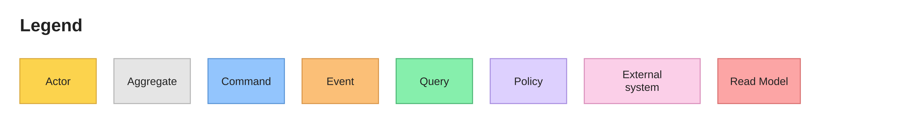
<figcaption style="font-size:0.9em;color:#555;margin-top:0.4em"><em>Legend — notación de colores empleada en el Event Storming.</em></figcaption>
</figure>

**Step 1 — Unstructured Exploration.** Lluvia de eventos de dominio sin orden ni agrupación, identificando el vocabulario inicial del negocio (sensores, alertas, reportes, recetas, suscripción).

<figure id="fig-step1" style="margin:1.5em 0;text-align:center">
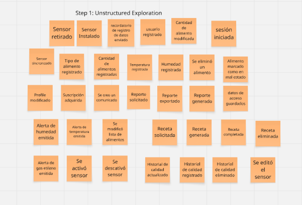
<figcaption style="font-size:0.9em;color:#555;margin-top:0.4em"><em>Step 1: Unstructured Exploration — lluvia inicial de eventos de dominio.</em></figcaption>
</figure>

**Step 2 — Timelines.** Los eventos se ordenan cronológicamente según el ciclo de vida del usuario y del dispositivo, desde el registro hasta la generación de reportes y recetas.

<figure id="fig-step2" style="margin:1.5em 0;text-align:center">
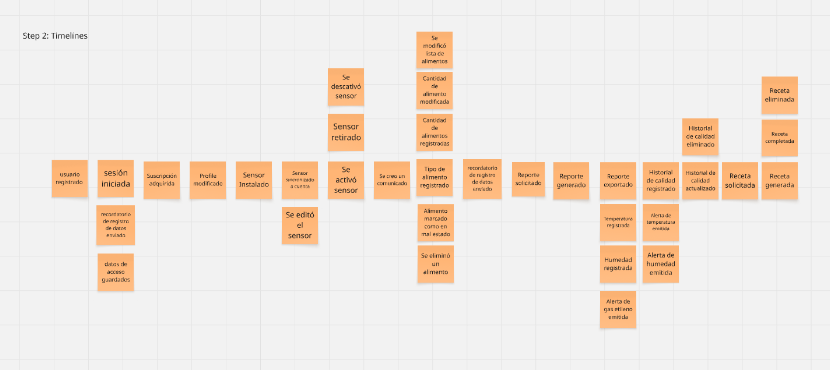
<figcaption style="font-size:0.9em;color:#555;margin-top:0.4em"><em>Step 2: Timelines — eventos ordenados cronológicamente.</em></figcaption>
</figure>

**Steps 3–5 (Actors, Commands, Aggregates preliminares)** se trabajaron de forma iterativa junto con el resto de pasos; su resultado consolidado se refleja directamente en los Steps 6 a 10 que se muestran a continuación.

**Step 6 — Policies.** Se identificaron las políticas ("cuando ocurre X, automáticamente se hace Y") que conectan eventos con nuevos comandos sin intervención directa del usuario — por ejemplo, *"si los valores del sensor superan los umbrales configurados, se emite una alerta"*.

<figure id="fig-step6" style="margin:1.5em 0;text-align:center">
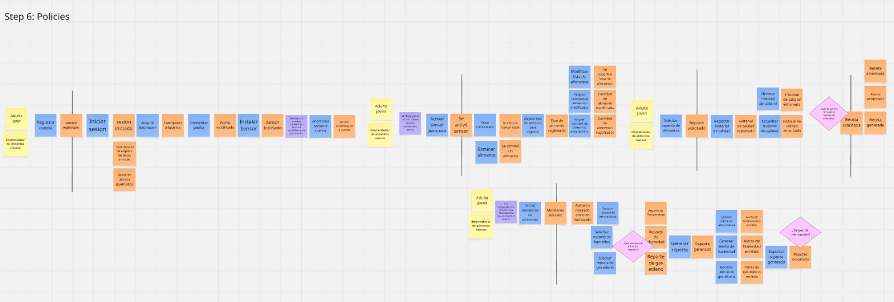
<figcaption style="font-size:0.9em;color:#555;margin-top:0.4em"><em>Step 6: Policies del dominio FreshSense.</em></figcaption>
</figure>

**Step 7 — Read Models.** Se definieron las vistas de solo lectura que necesita cada actor: la lista de alimentos, el historial de calidad, el inventario y los reportes.

<figure id="fig-step7" style="margin:1.5em 0;text-align:center">
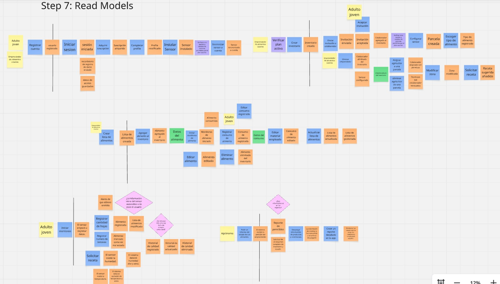
<figcaption style="font-size:0.9em;color:#555;margin-top:0.4em"><em>Step 7: Read Models identificados.</em></figcaption>
</figure>

**Step 8 — External Systems.** Se ubicó al dispositivo FreshSense (sensor físico) y a los servicios de notificación como sistemas externos que interactúan con el dominio mediante comandos y eventos.

<figure id="fig-step8" style="margin:1.5em 0;text-align:center">
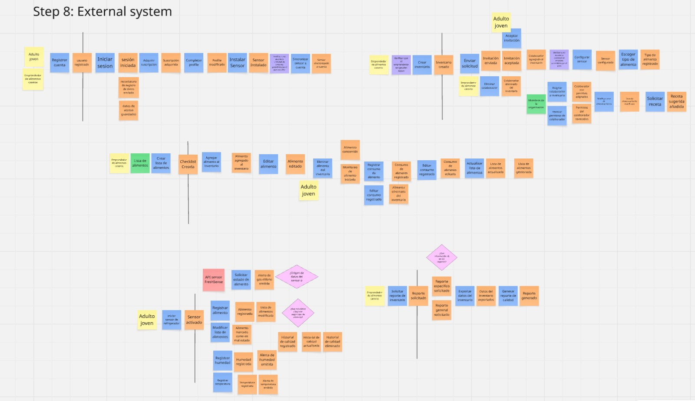
<figcaption style="font-size:0.9em;color:#555;margin-top:0.4em"><em>Step 8: External Systems del dominio.</em></figcaption>
</figure>

**Step 9 — Aggregates.** Los comandos y eventos se agruparon alrededor de siete agregados candidatos: `User`, `Profile`, `Subscription`, `Sensor`, `Inventory/Organization`, `Food List/Consumption`, `Monitoring` y `Reports`.

<figure id="fig-step9" style="margin:1.5em 0;text-align:center">
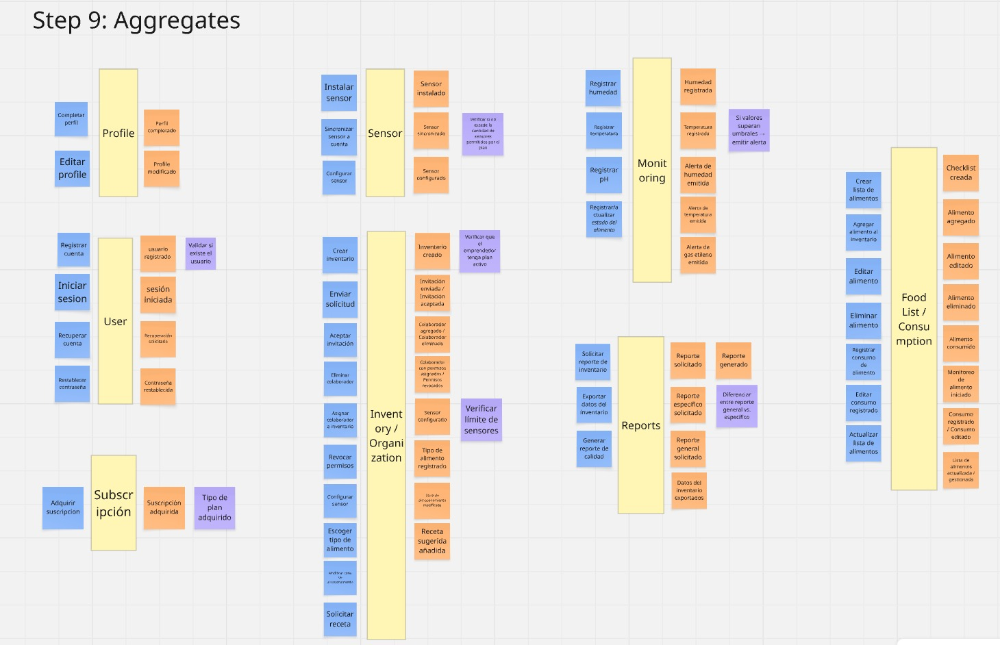
<figcaption style="font-size:0.9em;color:#555;margin-top:0.4em"><em>Step 9: Aggregates — agrupación de comandos y eventos.</em></figcaption>
</figure>

**Step 10 — Bounded Context.** Finalmente, los agregados se agruparon en ocho *bounded contexts*, trazando las primeras fronteras del dominio que se detallan en la sección 4.1.1.1.

<figure id="fig-step10" style="margin:1.5em 0;text-align:center">
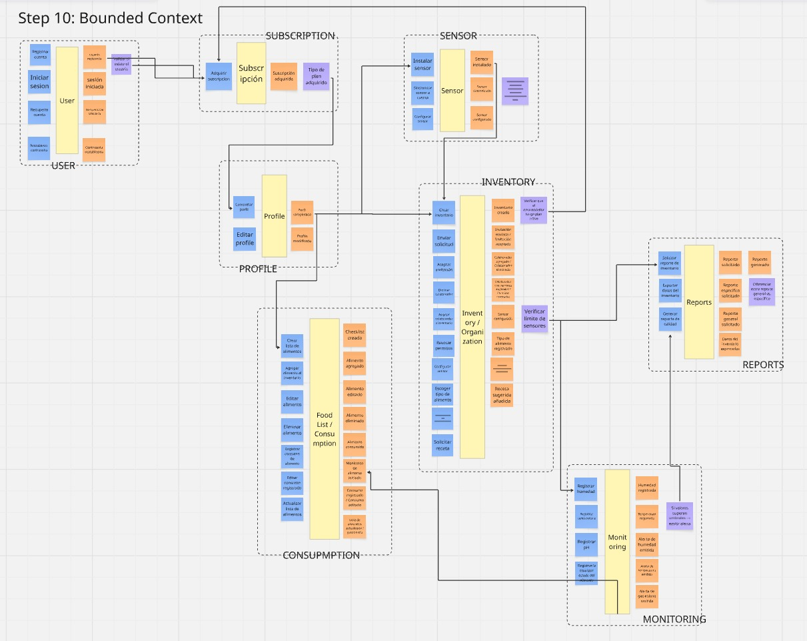
<figcaption style="font-size:0.9em;color:#555;margin-top:0.4em"><em>Step 10: Bounded Context — fronteras candidatas del dominio.</em></figcaption>
</figure>

#### 4.1.1.1 Candidate Context Discovery

Identificar contextos candidatos es un paso clave para gestionar la complejidad del sistema. A partir de los agregados del Step 9 y las fronteras trazadas en el Step 10, se agruparon los conceptos del dominio FreshSense en **ocho bounded contexts** lógicos y coherentes, cada uno con una responsabilidad de negocio propia:

| Bounded Context candidato | Responsabilidad principal |
|---|---|
| User Management | Registro, autenticación y recuperación de cuentas. |
| Profile Management | Datos personales, segmento de usuario y preferencias de notificación. |
| Subscription Management | Plan contratado (FREE/PREMIUM) y límites asociados. |
| Sensor Management | Instalación, sincronización y configuración del dispositivo FreshSense. |
| Inventory Management | Organización del inventario, colaboradores, zonas y recetas. |
| Consumption Management | Lista de alimentos, vencimientos y registro de consumo. |
| IoT Monitoring | Lecturas del sensor, umbrales, alertas y calidad del alimento. |
| Report Management | Reportes de inventario, calidad y consumo con métricas de sostenibilidad. |

Esta separación facilita el diseño e implementación del sistema y potencia su escalabilidad, desempeño y mantenibilidad — por ejemplo, permite que el equipo evolucione el algoritmo de alertas de **IoT Monitoring** sin afectar la lógica de **Subscription Management**, o que se sustituya el proveedor de notificaciones sin tocar el dominio de inventario.

#### 4.1.1.2 Domain Message Flows Modeling

Para analizar y diseñar sistemas de software, se usa el Modelado de Flujos de Mensajes de Dominio, un método que ilustra la transferencia de información entre componentes mediante mensajes. Este proceso se centra en especificar los mensajes enviados y recibidos por los diferentes actores del sistema y en descifrar sus relaciones. El uso de esta metodología aporta claridad para entender y representar las vías de información del sistema, permitiendo detectar problemas potenciales más fácilmente y optimizar la estructura del diseño. A modo de ejemplo, se muestran a continuación algunos diagramas aplicados a nuestro sistema.

<figure id="fig-notation" style="margin:1.5em 0;text-align:center">
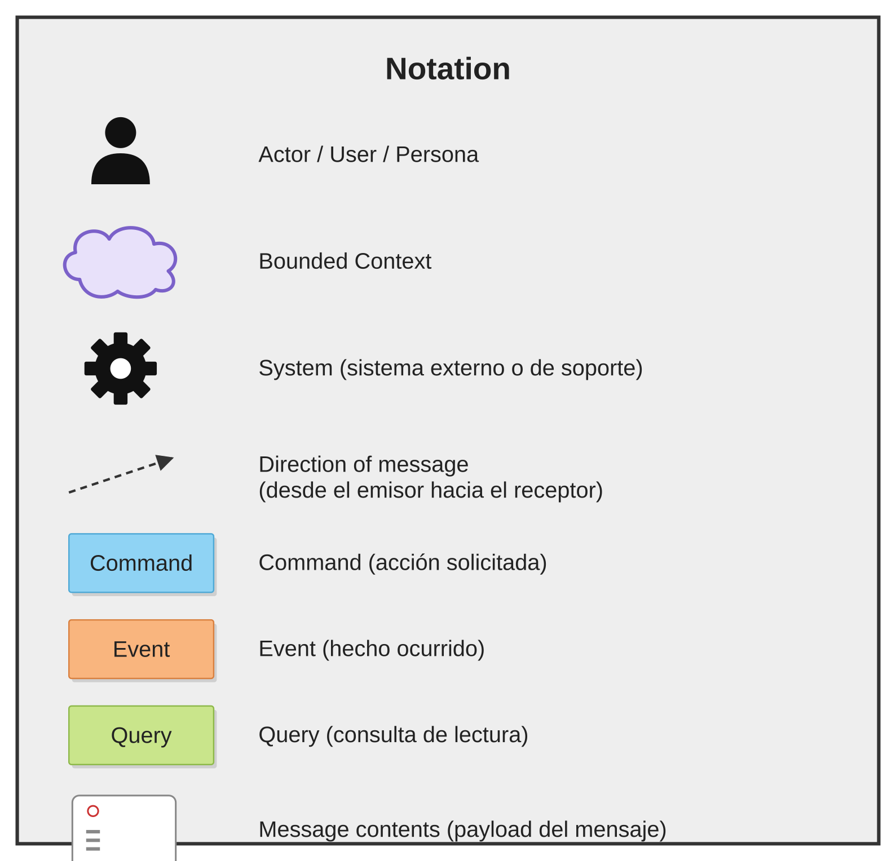
<figcaption style="font-size:0.9em;color:#555;margin-top:0.4em"><em>Notación utilizada en los Domain Message Flows.</em></figcaption>
</figure>

**Escenario 1 — Registro de usuario y asignación del plan gratuito.** El adulto joven se registra en la app; **User Management** valida y crea la cuenta, publica `UserRegistered`, y **Subscription Management** reacciona asignando automáticamente el plan FREE, que a su vez habilita el perfil.

<figure id="fig-dmfm1" style="margin:1.5em 0;text-align:center">
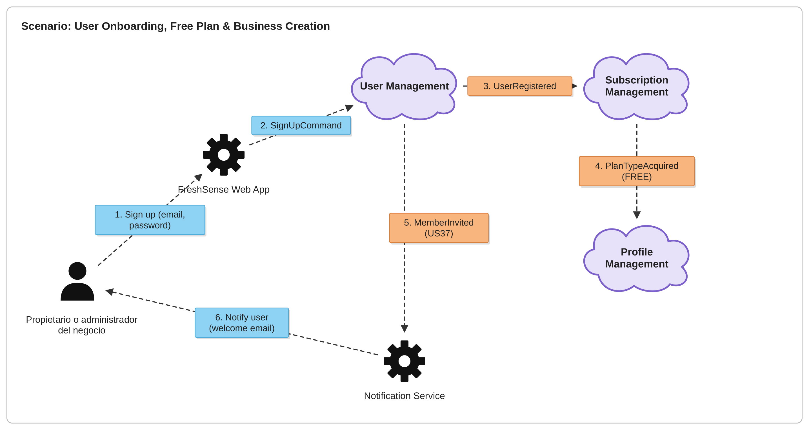
<figcaption style="font-size:0.9em;color:#555;margin-top:0.4em"><em>Escenario: User Onboarding & Free Plan Assignment.</em></figcaption>
</figure>

**Escenario 2 — Lectura del sensor y alerta de etileno.** El dispositivo físico envía una lectura; **IoT Monitoring** la traduce, evalúa los umbrales configurados, actualiza la condición del alimento en **Consumption Management** y notifica al usuario cuando el nivel de gas etileno es crítico.

<figure id="fig-dmfm2" style="margin:1.5em 0;text-align:center">
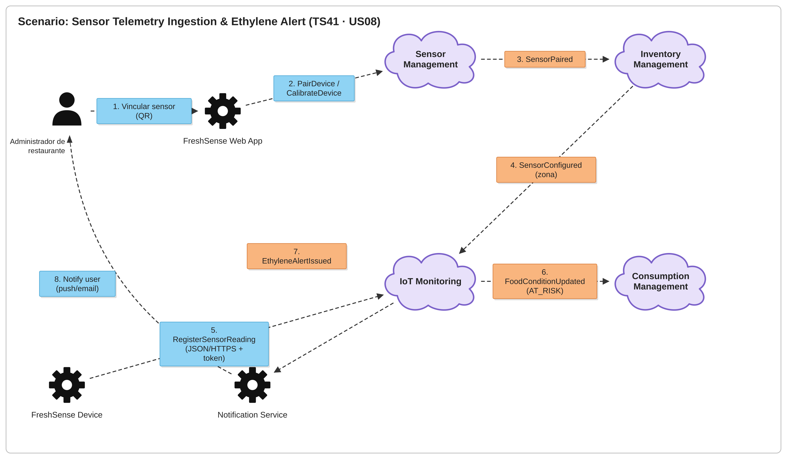
<figcaption style="font-size:0.9em;color:#555;margin-top:0.4em"><em>Escenario: Sensor Reading & Ethylene Alert.</em></figcaption>
</figure>

**Escenario 3 — Generación de un reporte de inventario.** El emprendedor solicita un reporte general; **Report Management** verifica el acceso premium y consulta a los contextos de Inventory, Consumption y Monitoring antes de generar y entregar el reporte.

<figure id="fig-dmfm3" style="margin:1.5em 0;text-align:center">
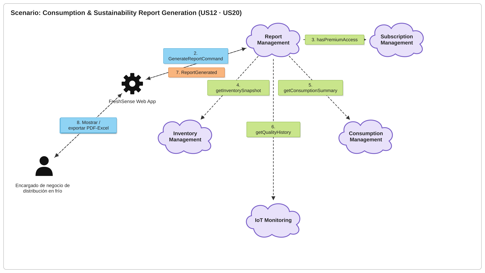
<figcaption style="font-size:0.9em;color:#555;margin-top:0.4em"><em>Escenario: Inventory Report Generation.</em></figcaption>
</figure>

#### 4.1.1.3 Bounded Context Canvases

Cada bounded context candidato se documentó con un *Bounded Context Canvas*, que resume su propósito, su clasificación estratégica, sus roles de dominio, su lenguaje ubicuo, sus decisiones de negocio y sus comunicaciones entrantes y salientes.

**User Management**

<figure id="fig-canvas-iam" style="margin:1.5em 0;text-align:center">
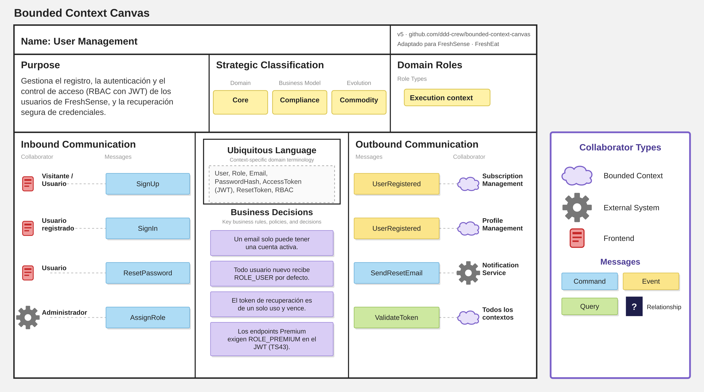
<figcaption style="font-size:0.9em;color:#555;margin-top:0.4em"><em>Bounded Context Canvas — User Management.</em></figcaption>
</figure>

**Subscription Management**

<figure id="fig-canvas-sub" style="margin:1.5em 0;text-align:center">
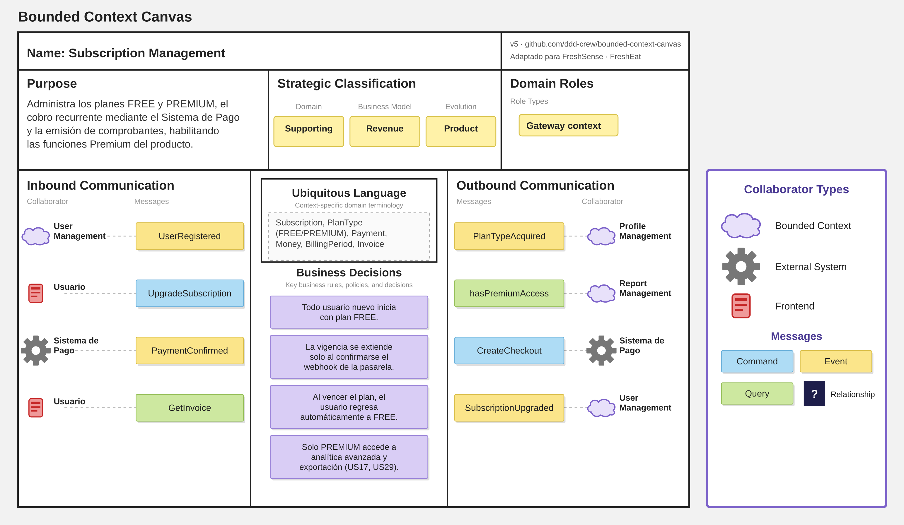
<figcaption style="font-size:0.9em;color:#555;margin-top:0.4em"><em>Bounded Context Canvas — Subscription Management.</em></figcaption>
</figure>

**Profile Management**

<figure id="fig-canvas-pro" style="margin:1.5em 0;text-align:center">
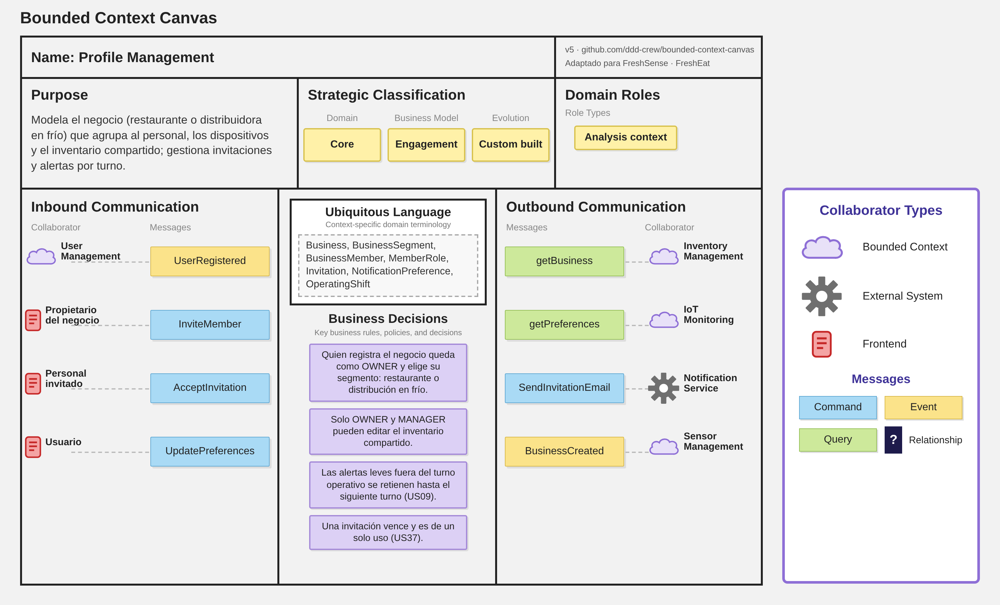
<figcaption style="font-size:0.9em;color:#555;margin-top:0.4em"><em>Bounded Context Canvas — Profile Management.</em></figcaption>
</figure>

**Sensor Management**

<figure id="fig-canvas-sen" style="margin:1.5em 0;text-align:center">
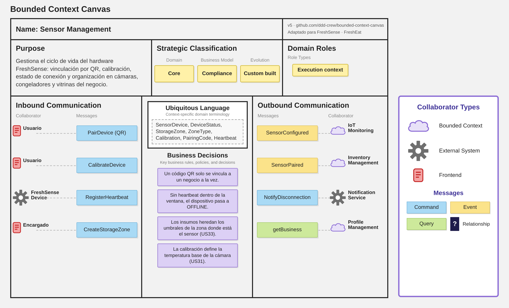
<figcaption style="font-size:0.9em;color:#555;margin-top:0.4em"><em>Bounded Context Canvas — Sensor Management.</em></figcaption>
</figure>

**Inventory Management**

<figure id="fig-canvas-inv" style="margin:1.5em 0;text-align:center">
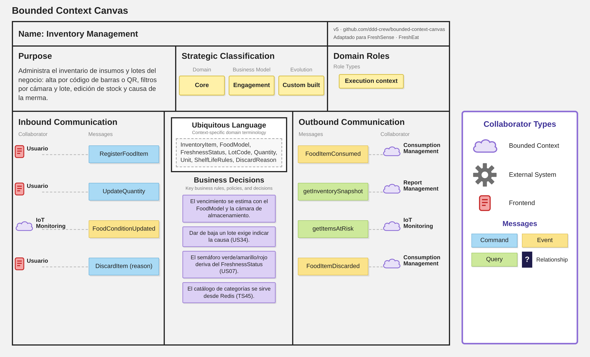
<figcaption style="font-size:0.9em;color:#555;margin-top:0.4em"><em>Bounded Context Canvas — Inventory Management.</em></figcaption>
</figure>

**Consumption Management**

<figure id="fig-canvas-con" style="margin:1.5em 0;text-align:center">
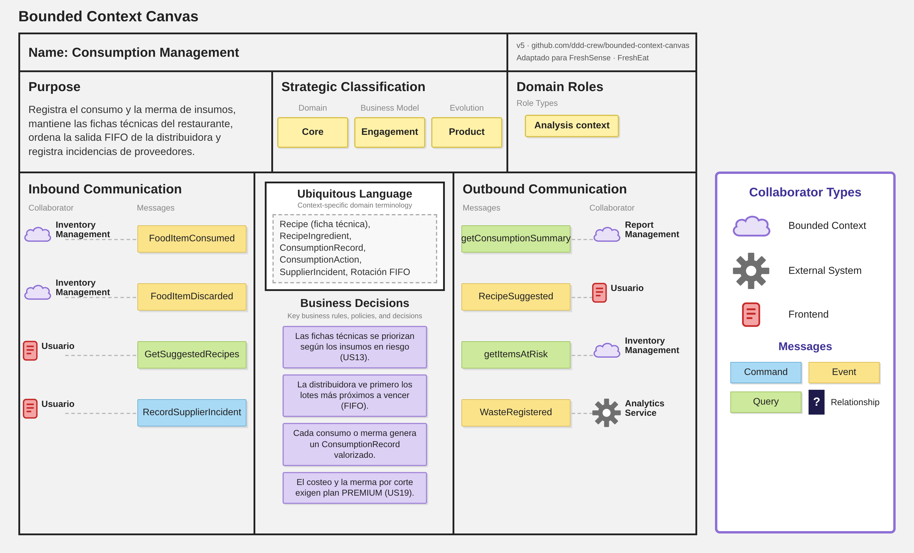
<figcaption style="font-size:0.9em;color:#555;margin-top:0.4em"><em>Bounded Context Canvas — Consumption Management.</em></figcaption>
</figure>

**IoT Monitoring**

<figure id="fig-canvas-mon" style="margin:1.5em 0;text-align:center">
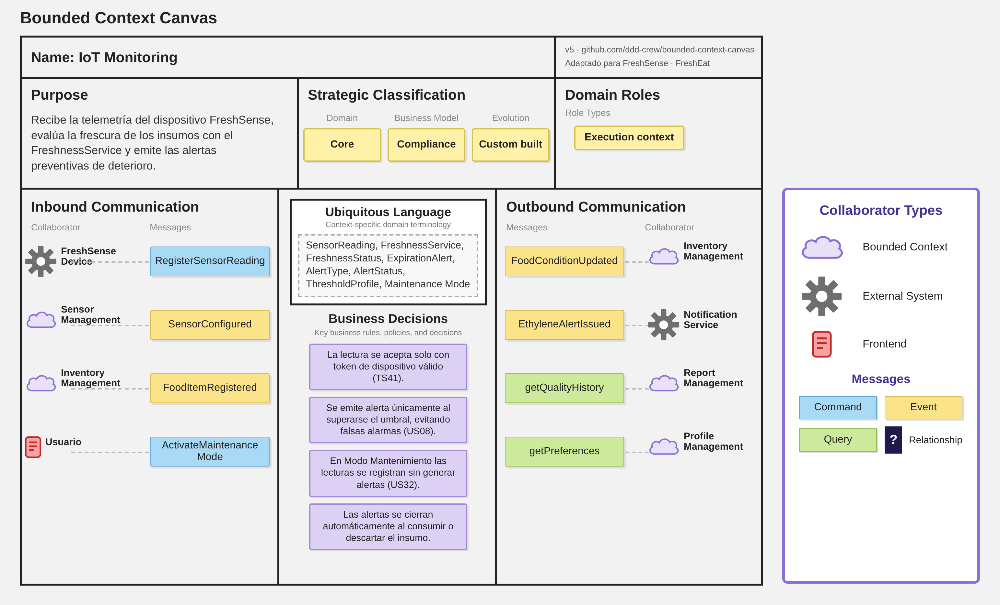
<figcaption style="font-size:0.9em;color:#555;margin-top:0.4em"><em>Bounded Context Canvas — IoT Monitoring.</em></figcaption>
</figure>

**Report Management**

<figure id="fig-canvas-rep" style="margin:1.5em 0;text-align:center">
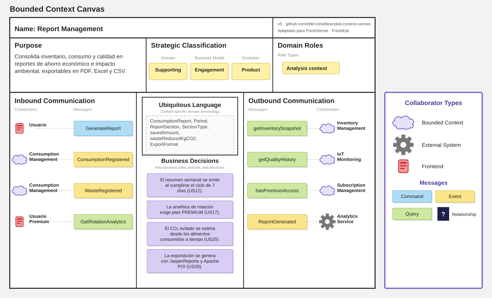
<figcaption style="font-size:0.9em;color:#555;margin-top:0.4em"><em>Bounded Context Canvas — Report Management.</em></figcaption>
</figure>

### 4.1.2. Context Mapping

En esta sección desarrollamos un conjunto de *context maps* para visualizar las relaciones entre los *bounded contexts* del sistema. A partir de la información recolectada en el Event Storming, exploramos distintas alternativas de diseño, cuestionando cómo cambiaría la estructura si reubicamos, dividimos o agrupamos *capabilities*. Finalmente, evaluamos cada propuesta considerando patrones como *Anti-corruption Layer*, *Conformist*, *Customer/Supplier* y *Shared Kernel*, con el fin de definir la mejor aproximación para la arquitectura del dominio. A continuación presentaremos las opciones que contemplamos para FreshSense y la estructura final.

**Opción 1**

En esta estructura mantenemos los cinco bounded contexts del núcleo operativo separados, con relaciones claramente definidas. Las ventajas de este tipo de contexto son, por un lado, la clara separación de responsabilidades y, por otro, que cada contexto se enfoca en una funcionalidad específica. Una de las principales desventajas es que hay una mayor complejidad en la sincronización entre contextos, especialmente entre Sensor Management e IoT Monitoring, que comparten el mismo origen de datos.

<figure id="fig-cmo1" style="margin:1.5em 0;text-align:center">
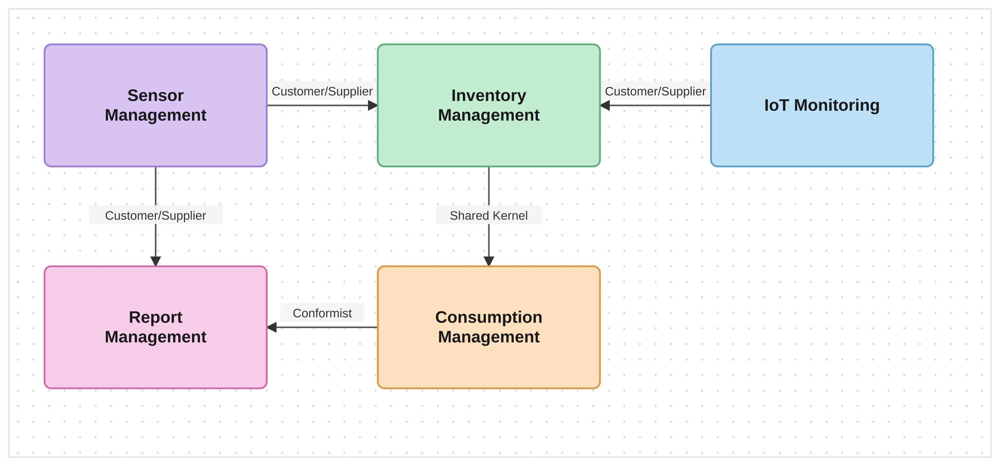
<figcaption style="font-size:0.9em;color:#555;margin-top:0.4em"><em>Opción 1 — cinco bounded contexts separados.</em></figcaption>
</figure>

**Opción 2**

Esta alternativa propone unir los contextos de Sensor Management e IoT Monitoring en un solo bounded context. Al hacerlo, se elimina la necesidad de sincronización externa entre ambos, manteniendo relaciones similares con los demás contextos del sistema.

Esta combinación presenta ventajas como la simplificación de la arquitectura al disminuir la cantidad de bounded contexts y una comunicación más directa entre la lectura del sensor y la interpretación de su estado. No obstante, tiene desventajas en la combinación de responsabilidades distintas, ya que una parte se enfoca en la infraestructura de sensores y la otra en la interpretación de datos y generación de alertas. Esto podría dificultar que el usuario realice la instalación del sistema sin ayuda técnica, y además genera el riesgo de que un solo contexto asuma demasiadas funciones.

<figure id="fig-cmo2" style="margin:1.5em 0;text-align:center">
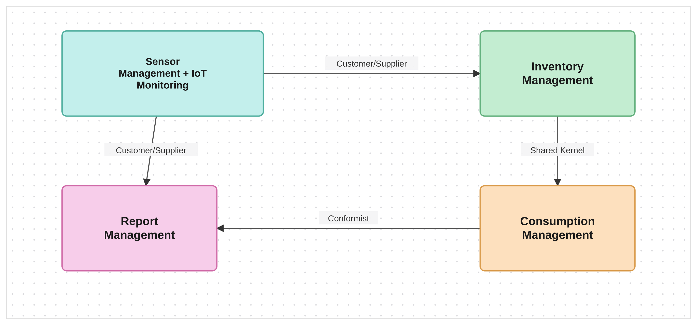
<figcaption style="font-size:0.9em;color:#555;margin-top:0.4em"><em>Opción 2 — Sensor Management e IoT Monitoring fusionados.</em></figcaption>
</figure>

**Opción 3**

Esta alternativa propone una arquitectura compuesta por cinco bounded contexts bien definidos, con relaciones claras entre ellos. La estructura busca equilibrar la separación de responsabilidades, para permitir que el sistema escale y se mantenga con facilidad. Además, facilita la instalación sin asistencia técnica y asegura tiempos de respuesta adecuados, lo que contribuye directamente a mejorar la experiencia del cliente en el uso del sistema FreshSense.

- Sensor Management se comunica con Inventory Management y Report Management, proporcionando la información de los sensores instalados y su configuración. En ambos casos, la relación es del tipo Customer/Supplier, donde Sensor Management es el proveedor.
- Inventory Management y Consumption Management comparten el modelo de "alimento" y su estado de frescura. Por eso, tienen una relación de tipo Shared Kernel, lo que asegura que ambos usen los mismos conceptos para evitar errores o confusión.
- Consumption Management también se relaciona con Report Management, pero en este caso la relación es Conformist. Report utiliza información de consumo, pero se adapta a su estructura sin modificarla.
- IoT Monitoring se conecta con Inventory Management mediante una Anti-corruption Layer. Esta capa traduce los datos que vienen de los sensores (temperatura, humedad y etileno) a un formato que Inventory Management pueda entender. Así, se protege el sistema de los detalles técnicos del IoT y se facilita la instalación del sistema sin ayuda especializada.

<figure id="fig-cmo3" style="margin:1.5em 0;text-align:center">
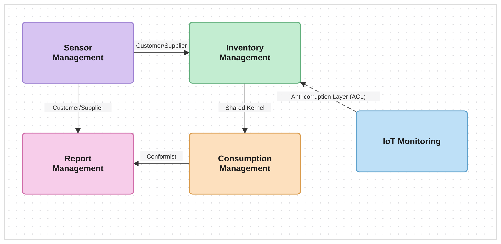
<figcaption style="font-size:0.9em;color:#555;margin-top:0.4em"><em>Opción 3 (elegida) — cinco bounded contexts con Anti-corruption Layer.</em></figcaption>
</figure>

**Elección**

Elegimos la **opción 3**, ya que proporciona el mejor equilibrio entre la separación de responsabilidades, la facilidad de implementación y el cumplimiento de los requisitos del sistema.

Al definir cinco bounded contexts con relaciones claras, se facilita la evolución independiente de cada parte del sistema, lo que mejora su escalabilidad y mantenibilidad. Además, al separar la gestión del hardware (Sensor Management) de la interpretación de las lecturas (IoT Monitoring) mediante una Anti-corruption Layer, se simplifica la instalación y el reemplazo del dispositivo. Asimismo, esta estructura garantiza tiempos de respuesta rápidos ante alertas de frescura y optimiza la gestión de inventario, consumo y reportes, brindando una experiencia más fluida y eficiente para los usuarios.

Finalmente, el siguiente *context map* consolidado muestra la totalidad de los ocho bounded contexts de FreshSense — incluyendo los contextos de cuenta (User, Subscription y Profile Management) — con las relaciones resultantes de la opción elegida.

<figure id="fig-cmap" style="margin:1.5em 0;text-align:center">
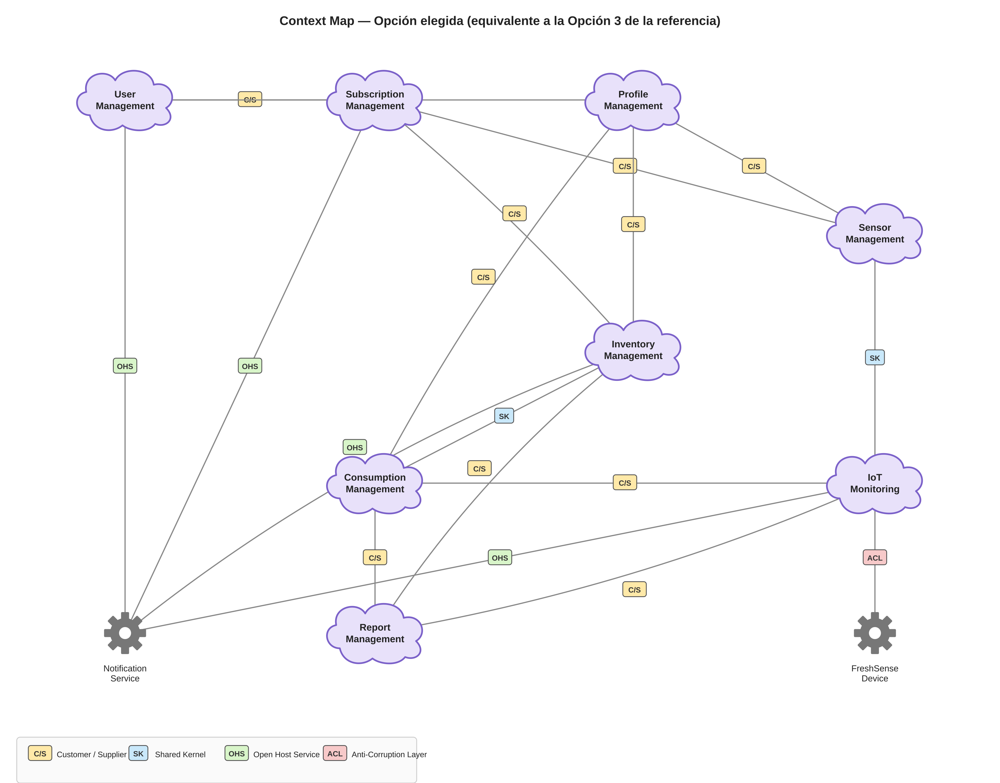
<figcaption style="font-size:0.9em;color:#555;margin-top:0.4em"><em>Context Map consolidado — los ocho bounded contexts de FreshSense.</em></figcaption>
</figure>

### 4.1.3. Software Architecture

Se utiliza el **C4 Model** para representar la arquitectura de software de FreshSense en tres niveles de abstracción: contexto, contenedores y despliegue físico.

#### 4.1.3.1. Software Architecture Context Level Diagrams

Este diagrama muestra al sistema FreshSense (representado como una única entidad) interactuando con sus tres tipos de usuario y con el **Dispositivo FreshSense**, el hardware con sensores de temperatura, humedad y gas etileno que se instala en el refrigerador o cámara fría y envía su telemetría al endpoint REST seguro definido en la **TS41**. El sistema se comunica además con el Notification Service para las alertas.

<figure id="fig-c4c" style="margin:1.5em 0;text-align:center">
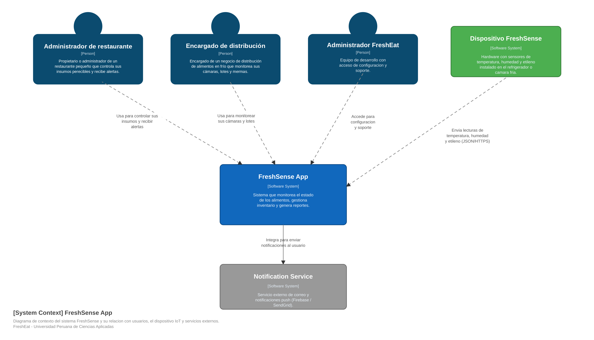
<figcaption style="font-size:0.9em;color:#555;margin-top:0.4em"><em>Software Architecture Context Level Diagram.</em></figcaption>
</figure>

#### 4.1.3.2. Software Architecture Container Level Diagrams

Este diagrama muestra que el sistema FreshSense está compuesto por una **Landing Page** (HTML, CSS, JS), una **Single Page Application** desarrollada en **Angular 19** con NGX-Translate y Angular Material, y una **API REST en Spring Boot + Java 24** que organiza los ocho bounded contexts. La API persiste en **MySQL** y documenta sus endpoints con **Swagger/OpenAPI**; estos cinco elementos son los únicos containers dentro del límite del sistema, ya que representan unidades de software desplegables. Conforme al modelo C4 y a la norma ISO/IEC/IEEE 42010 sobre vistas y puntos de vista arquitectónicos, el **hardware no se modela como container**: el **Dispositivo FreshSense** se representa como sistema externo que envía su telemetría a la API mediante JSON sobre HTTPS con token de dispositivo (**TS41**). Del mismo modo, la API **consume** tres sistemas de terceros externos al límite: el **Sistema de Pago**, para crear el cobro de las suscripciones Premium y recibir su confirmación de forma asíncrona (**TS44**); el **Analytics Service**, al que publica métricas para generar reportes; y el **Notification Service** (Firebase/SendGrid), al que invoca para despachar las alertas por correo y push (**TS42**).

<figure id="fig-c4co" style="margin:1.5em 0;text-align:center">

<figcaption style="font-size:0.9em;color:#555;margin-top:0.4em"><em>Software Architecture Container Level Diagram.</em></figcaption>
</figure>

#### 4.1.3.3. Software Architecture Deployment Diagrams

Este diagrama muestra que el sistema FreshSense se despliega en tres entornos principales: los **dispositivos cliente** (navegador web y móvil), el **refrigerador o cámara fría del usuario**, donde el dispositivo FreshSense mide temperatura, humedad y gas etileno y transmite por la red Wi-Fi local, y la **nube**, que aloja el frontend estático, el contenedor de la API (Spring Boot + Java 24), la base de datos MySQL administrada, la caché Redis exigida por la **TS45** y la documentación Swagger/OpenAPI. Todas las comunicaciones utilizan HTTPS, y la ingesta de telemetría se autentica con token de dispositivo (**TS41**).

<figure id="fig-c4d" style="margin:1.5em 0;text-align:center">
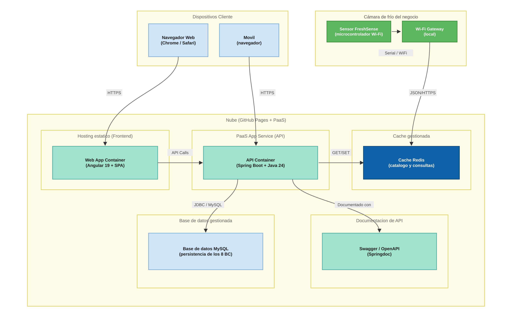
<figcaption style="font-size:0.9em;color:#555;margin-top:0.4em"><em>Software Architecture Deployment Diagram.</em></figcaption>
</figure>


---

## 4.2. Tactical-Level Domain-Driven Design

Esta sección detalla el diseño táctico de cada uno de los ocho bounded contexts de FreshSense, siguiendo la arquitectura en capas (Domain, Interface, Application, Infrastructure) y el patrón CQS (Command/Query Separation) usado de forma consistente en todo el backend.

### 4.2.1 Bounded Context: User Management

El **User Management (IAM — Identity and Access Management) Bounded Context** es responsable de gestionar la autenticación y la creación de usuarios en el sistema. Este contexto asegura que los usuarios puedan registrarse, iniciar sesión y gestionar sus credenciales de manera segura, cumpliendo con los estándares de seguridad y privacidad. Implementa el control de acceso basado en roles (RBAC) con tokens JWT exigido por la **TS43**, y el flujo de recuperación de contraseña de la **US35**.

#### 4.2.1.1. Domain Layer

La Domain Layer del User Management Bounded Context encapsula la lógica de negocio del contexto. En esta capa se definen los agregados, entidades, objetos de valor, servicios de dominio y políticas que representan los conceptos clave del sistema.

**Aggregates**

1. **User**
   - *Propósito:* Agregado raíz que representa a una persona con cuenta en FreshSense. Encapsula credenciales, datos de identidad y roles de acceso.

   - *Atributos:*
| Atributo | Tipo | Descripción |
|---|---|---|
| id | UUID | Identificador único del usuario. |
| email | Email (VO) | Correo electrónico único, usado como nombre de usuario. |
| fullName | String | Nombre completo del usuario. |
| passwordHash | PasswordHash (VO) | Contraseña almacenada con hash BCrypt (nunca en texto plano). |
| roles | Set&lt;Role&gt; | Roles asignados (ROLE_USER, ROLE_PREMIUM, ROLE_ADMIN). |
| createdAt / updatedAt | DateTime | Campos de auditoría. |
   - *Métodos:*
| Método | Descripción |
|---|---|
| User(SignUpCommand, Set&lt;Role&gt;) | Crea un usuario validando unicidad del email y la política de contraseña. |
| addRole(Role) / addRoles(List&lt;Role&gt;) | Asigna uno o varios roles válidos al usuario (US36). |
| requestPasswordReset() | Genera un `ResetToken` temporal y único para la recuperación (US35). |
| resetPassword(token, newHash) | Valida el token vigente, reemplaza el hash y lo invalida (uso único). |
| registerSignIn() | Registra el último acceso y habilita la emisión del JWT. |
**Entities**

1. **Role** — Rol que puede asignarse a un usuario para el control de acceso RBAC (TS43, US36).

| Atributo | Tipo | Descripción |
|---|---|---|
| id | UUID | Identificador del rol. |
| name | Roles (enum) | ROLE_USER, ROLE_PREMIUM o ROLE_ADMIN. |

| Método | Descripción |
|---|---|
| getDefaultRole() | Devuelve ROLE_USER. |
| toRoleFromName(String) | Convierte un nombre en instancia de Role. |
| validateRoleSet(List&lt;Role&gt;) | Asigna el rol por defecto si el conjunto es nulo o vacío. |
2. **ResetToken** — Token de un solo uso para restablecer la contraseña (US35).

| Atributo | Tipo | Descripción |
|---|---|---|
| id | UUID | Identificador. |
| tokenHash | String | Hash del token enviado por correo. |
| expiresAt | DateTime | Vencimiento del enlace de recuperación. |
| used | boolean | Indica si ya fue consumido. |

| Método | Descripción |
|---|---|
| isExpired() | Evalúa si el token venció. |
| markUsed() | Invalida el token. |
**Value Objects**

| Value Object | Descripción |
|---|---|
| Email | Encapsula y valida el formato del correo electrónico. |
| PasswordHash | Encapsula el hash BCrypt; impide exponer la contraseña en texto plano. |
| Roles | Enumeración inmutable: `ROLE_USER`, `ROLE_PREMIUM`, `ROLE_ADMIN`. |
| AccessToken | Token JWT emitido tras la autenticación, con los claims de rol (TS43). |

**Domain Services**

| Servicio | Descripción |
|---|---|
| PasswordPolicyService | Valida longitud mínima, mayúscula, minúscula y número antes de aceptar una contraseña. |
| TokenService | Genera y valida los tokens JWT que protegen los endpoints, incluidos los Premium (TS43). |

**Domain Events**

| Evento | Descripción |
|---|---|
| UserRegistered | Se creó la cuenta (ES: *cuenta registrada*). Dispara la creación del plan FREE y del perfil. |
| SessionStarted | El usuario se autenticó correctamente (ES: *sesión iniciada*). |
| PasswordResetRequested | Se solicitó el enlace de recuperación (US35). |
| PasswordReset | Se restableció la contraseña. |
| UserRoleChanged | Un administrador modificó el rol o plan del usuario (US36). |

**Policies**

- **Validar si existe el usuario**: no se permite registrar dos cuentas con el mismo email.
- **Asignar rol por defecto**: cuando se registra un usuario sin roles, el sistema le asigna automáticamente `ROLE_USER`.
- **Bloquear endpoints Premium**: cuando un JWT sin `ROLE_PREMIUM` invoca un endpoint exclusivo, el middleware responde `403 Forbidden` (TS43).

#### 4.2.1.2. Interface Layer

La Interface Layer del User Management expone los puntos de entrada del contexto mediante controladores REST, recursos y *assemblers* que traducen entre el modelo HTTP y el modelo de dominio.

**Controllers**

1. **AuthenticationController** — Registro, inicio de sesión y recuperación de credenciales.

| Método | Endpoint | Descripción |
|---|---|---|
| POST | /api/v1/authentication/sign-up | Registra un nuevo usuario en el sistema. |
| POST | /api/v1/authentication/sign-in | Autentica al usuario y genera un token de acceso. |
| POST | /api/v1/authentication/forgot-password | Envía el enlace de restablecimiento (US35). |
| POST | /api/v1/authentication/reset-password | Restablece la contraseña con el token recibido. |

   - *Dependencias:* UserCommandService

2. **UsersController** — Gestiona las operaciones relacionadas con los usuarios.

| Método | Endpoint | Descripción |
|---|---|---|
| GET | /api/v1/users | Obtiene la lista de todos los usuarios (solo ROLE_ADMIN). |
| GET | /api/v1/users/{userId} | Obtiene los detalles de un usuario específico por su ID. |
| PATCH | /api/v1/users/{userId}/roles | Modifica los roles del usuario (US36). |

   - *Dependencias:* UserQueryService, UserCommandService

3. **RolesController** — Gestiona las consultas relacionadas con los roles.

| Método | Endpoint | Descripción |
|---|---|---|
| GET | /api/v1/roles | Obtiene la lista de todos los roles disponibles. |

   - *Dependencias:* RoleQueryService

**Resources**

| Resource | Campos |
|---|---|
| UserResource | id, email, fullName, roles |
| AuthenticatedUserResource | id, email, token (JWT) |
| SignUpResource | email, fullName, password, roles |
| SignInResource | email, password |
| ResetPasswordResource | token, newPassword |
| RoleResource | id, name |

**Transformers / Assemblers**

| Assembler | Transformación |
|---|---|
| UserResourceFromEntityAssembler | Convierte una entidad `User` en un recurso `UserResource`. |
| AuthenticatedUserResourceFromEntityAssembler | Convierte un `User` y su token en `AuthenticatedUserResource`. |
| SignUpCommandFromResourceAssembler | Convierte `SignUpResource` en el comando `SignUpCommand`. |
| SignInCommandFromResourceAssembler | Convierte `SignInResource` en el comando `SignInCommand`. |
| RoleResourceFromEntityAssembler | Convierte una entidad `Role` en un recurso `RoleResource`. |

#### 4.2.1.3 Application Layer

La Application Layer del User Management coordina las operaciones entre la Interface Layer y la Domain Layer, orquestando comandos, consultas y la reacción a eventos de otros contextos.

**Command Services**

| Servicio | Comandos que maneja | Descripción |
|---|---|---|
| UserCommandServiceImpl | SignUpCommand, SignInCommand, RequestPasswordResetCommand, ResetPasswordCommand | Registra usuarios, autentica credenciales, emite el JWT y gestiona la recuperación de contraseña. |
| RoleCommandServiceImpl | SeedRolesCommand, AssignRoleCommand | Crea los roles predefinidos al iniciar el sistema y asigna roles a los usuarios (US36). |

**Query Services / Facades**

| Servicio | Consultas | Descripción |
|---|---|---|
| UserQueryServiceImpl | GetAllUsersQuery, GetUserByIdQuery, GetUserByEmailQuery | Recupera usuarios registrados sin modificar el estado del sistema. |
| RoleQueryServiceImpl | GetAllRolesQuery, GetRoleByNameQuery | Recupera los roles disponibles. |
| IamContextFacade | existsUserById, getRolesOf | Open Host Service que exponen los demás bounded contexts para validar identidad. |

**Event Handlers**

| Handler | Evento que escucha | Reacción |
|---|---|---|
| ApplicationReadyEventHandler | ApplicationReadyEvent (Spring Boot) | Ejecuta `SeedRolesCommand` para crear ROLE_USER, ROLE_PREMIUM y ROLE_ADMIN si no existen. |
| SubscriptionChangedEventHandler | PlanTypeAcquired (Subscription Management) | Sincroniza el rol `ROLE_PREMIUM` del usuario cuando su plan cambia. |

#### 4.2.1.4. Infrastructure Layer

La Infrastructure Layer del User Management implementa la persistencia y las integraciones técnicas (ACL) hacia otros contextos y sistemas externos.

| Componente | Tipo | Responsabilidad |
|---|---|---|
| UserRepository | JPA Repository | Persistencia de usuarios; `findByEmail`, `existsByEmail`. |
| RoleRepository | JPA Repository | Persistencia de roles; `findByName`, `existsByName`. |
| ResetTokenRepository | JPA Repository | Persistencia de los tokens de recuperación (US35). |
| BCryptHashingService | Servicio técnico | Codifica y verifica contraseñas con BCrypt. |
| JwtTokenService | Servicio técnico | Genera y valida los tokens JWT con los claims de rol (TS43). |
| NotificationGatewayAdapter | ACL saliente | Solicita al Notification Service el envío del correo de recuperación (TS42). |

#### 4.2.1.5. Bounded Context Software Architecture Component Level Diagrams

<figure id="fig-comp-iam" style="margin:1.5em 0;text-align:center">

<figcaption style="font-size:0.9em;color:#555;margin-top:0.4em"><em>Component Level Diagram — User Management.</em></figcaption>
</figure>

#### 4.2.1.6. Bounded Context Software Architecture Code Level Diagrams

##### 4.2.1.6.1. Bounded Context Domain Layer Class Diagrams

<figure id="fig-class-iam" style="margin:1.5em 0;text-align:center">
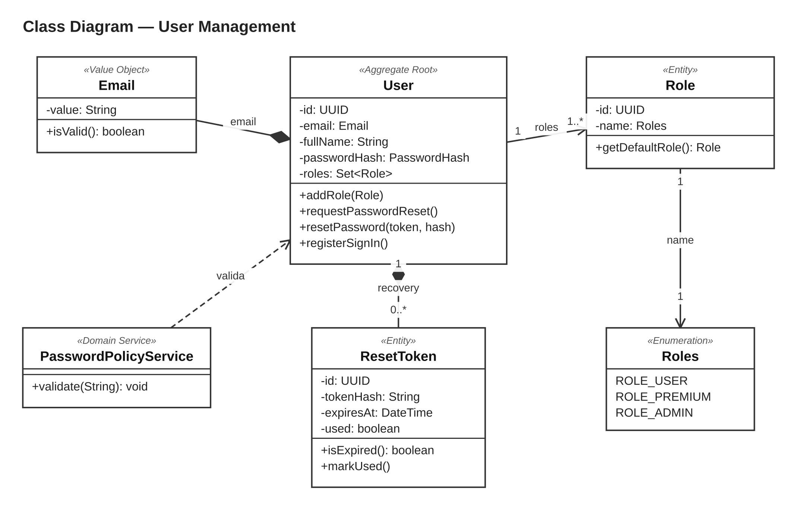
<figcaption style="font-size:0.9em;color:#555;margin-top:0.4em"><em>Class Diagram (Domain Layer) — User Management.</em></figcaption>
</figure>

##### 4.2.1.6.2. Bounded Context Database Design Diagram

<figure id="fig-er-iam" style="margin:1.5em 0;text-align:center">
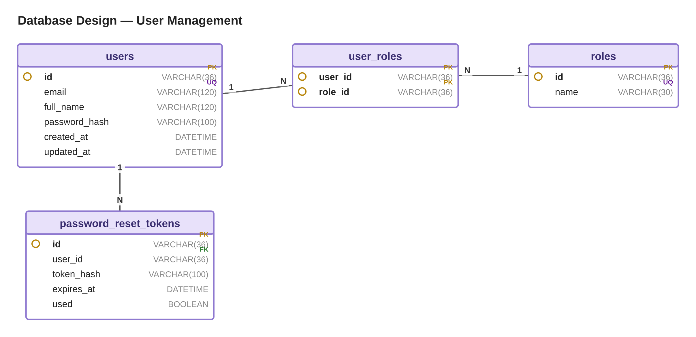
<figcaption style="font-size:0.9em;color:#555;margin-top:0.4em"><em>Database Design Diagram — User Management.</em></figcaption>
</figure>

### 4.2.2 Bounded Context: Subscription Management

El **Subscription Management Bounded Context** administra el ciclo de vida de los planes de FreshSense (FREE y PREMIUM), el cobro recurrente a través de la pasarela de pagos y la emisión de comprobantes. Implementa la integración con el **Sistema de Pago** exigida por la **TS44** y la descarga de facturas de la **US38**. Es el contexto que habilita las funcionalidades Premium (US17-US19).

#### 4.2.2.1. Domain Layer

La Domain Layer del Subscription Management Bounded Context encapsula la lógica de negocio del contexto. En esta capa se definen los agregados, entidades, objetos de valor, servicios de dominio y políticas que representan los conceptos clave del sistema.

**Aggregates**

1. **Subscription**
   - *Propósito:* Agregado raíz que representa el plan contratado por un usuario y su vigencia.

   - *Atributos:*
| Atributo | Tipo | Descripción |
|---|---|---|
| id | UUID | Identificador de la suscripción. |
| userId | UUID | Usuario propietario del plan. |
| plan | PlanType (VO) | FREE o PREMIUM. |
| startedAt | DateTime | Fecha de inicio de la vigencia. |
| endsAt | DateTime? | Fecha de término; nula para el plan FREE. |
| active | boolean | Indica si la suscripción está vigente. |
   - *Métodos:*
| Método | Descripción |
|---|---|
| isActive() | Indica si el plan está vigente a la fecha actual. |
| upgradeToPremium(period) | Cambia el plan a PREMIUM y fija la fecha de término. |
| renew(days) | Extiende la vigencia al confirmarse el webhook de pago (TS44). |
| cancel() | Desactiva la renovación automática y marca el fin del periodo. |
**Entities**

1. **Payment** — Cobro procesado por la pasarela para una suscripción (TS44, US38).

| Atributo | Tipo | Descripción |
|---|---|---|
| id | UUID | Identificador del pago. |
| subscriptionId | UUID | Suscripción asociada. |
| amount | Money (VO) | Importe cobrado. |
| provider | String | Identificador del medio de pago procesado por el Sistema de Pago. |
| externalRef | String | Identificador del cobro en la pasarela. |
| paidAt | DateTime | Fecha de confirmación. |
| invoiceUrl | String | Enlace al comprobante en PDF (US38). |

| Método | Descripción |
|---|---|
| confirm(externalRef) | Marca el pago como confirmado tras el webhook. |
| generateInvoice() | Produce el comprobante descargable en PDF. |
**Value Objects**

| Value Object | Descripción |
|---|---|
| PlanType | Enumeración inmutable: `FREE`, `PREMIUM`. |
| Money | Importe con moneda; evita operar con números sueltos. |
| BillingPeriod | Periodo de facturación: `MONTHLY` o `ANNUAL`. |

**Domain Services**

| Servicio | Descripción |
|---|---|
| PlanEntitlementService | Determina qué funcionalidades (analítica avanzada, recetas gourmet, exportación) habilita cada plan. |

**Domain Events**

| Evento | Descripción |
|---|---|
| PlanTypeAcquired | Se asignó un plan al usuario (ES: *tipo de plan adquirido*). |
| SubscriptionUpgraded | El usuario pasó de FREE a PREMIUM. |
| SubscriptionRenewed | La pasarela confirmó la renovación y se extendió la vigencia (TS44). |
| SubscriptionExpired | Venció la suscripción y el usuario regresó al plan FREE. |
| PaymentConfirmed | Se registró un cobro exitoso y su comprobante (US38). |

**Policies**

- **Asignar plan gratuito**: cuando ocurre `UserRegistered`, se crea automáticamente una suscripción FREE.
- **Extender vigencia por webhook**: cuando la pasarela confirma la renovación mensual, se extiende la fecha de vigencia 30 días (TS44).
- **Degradar al vencer**: cuando `endsAt` es anterior a la fecha actual, la suscripción se marca inactiva y el usuario vuelve a FREE.

#### 4.2.2.2. Interface Layer

La Interface Layer del Subscription Management expone los puntos de entrada del contexto mediante controladores REST, recursos y *assemblers* que traducen entre el modelo HTTP y el modelo de dominio.

**Controllers**

1. **SubscriptionsController** — Gestiona la consulta y el cambio de plan del usuario.

| Método | Endpoint | Descripción |
|---|---|---|
| GET | /api/v1/subscriptions/me | Obtiene la suscripción vigente del usuario autenticado. |
| POST | /api/v1/subscriptions/upgrade | Inicia el cambio a plan PREMIUM consumiendo el Sistema de Pago para crear el cobro (TS44). |
| POST | /api/v1/subscriptions/cancel | Cancela la renovación automática. |

   - *Dependencias:* SubscriptionCommandService, SubscriptionQueryService

2. **PaymentsController** — Expone el historial de pagos y los comprobantes (US38).

| Método | Endpoint | Descripción |
|---|---|---|
| GET | /api/v1/payments | Lista los cobros del usuario. |
| GET | /api/v1/payments/{paymentId}/invoice | Descarga el comprobante en PDF. |

   - *Dependencias:* PaymentQueryService

3. **BillingWebhookController** — Recibe las notificaciones de la pasarela de pagos (TS44).

| Método | Endpoint | Descripción |
|---|---|---|
| POST | /api/v1/billing/webhook | Procesa la notificación del Sistema de Pago y extiende la vigencia. |

   - *Dependencias:* SubscriptionCommandService

**Resources**

| Resource | Campos |
|---|---|
| SubscriptionResource | id, plan, startedAt, endsAt, active |
| UpgradeResource | plan, billingPeriod |
| PaymentResource | id, amount, provider, paidAt, invoiceUrl |
| WebhookPayloadResource | eventType, externalRef, amount, status |

**Transformers / Assemblers**

| Assembler | Transformación |
|---|---|
| SubscriptionResourceFromEntityAssembler | Convierte `Subscription` en `SubscriptionResource`. |
| PaymentResourceFromEntityAssembler | Convierte `Payment` en `PaymentResource`. |
| UpgradeCommandFromResourceAssembler | Convierte `UpgradeResource` en `UpgradeSubscriptionCommand`. |

#### 4.2.2.3 Application Layer

La Application Layer del Subscription Management coordina las operaciones entre la Interface Layer y la Domain Layer, orquestando comandos, consultas y la reacción a eventos de otros contextos.

**Command Services**

| Servicio | Comandos que maneja | Descripción |
|---|---|---|
| SubscriptionCommandServiceImpl | CreateFreeSubscriptionCommand, UpgradeSubscriptionCommand, RenewSubscriptionCommand, CancelSubscriptionCommand | Crea, actualiza y cancela suscripciones; al ejecutar `UpgradeSubscriptionCommand` consume el `PaymentGatewayAdapter` para iniciar el cobro en el Sistema de Pago. |
| PaymentCommandServiceImpl | ConfirmPaymentCommand, GenerateInvoiceCommand | Registra los cobros confirmados y genera los comprobantes en PDF (US38). |

**Query Services / Facades**

| Servicio | Consultas | Descripción |
|---|---|---|
| SubscriptionQueryServiceImpl | GetSubscriptionByUserQuery, GetActivePlanQuery | Recupera el plan vigente del usuario. |
| PaymentQueryServiceImpl | GetPaymentsByUserQuery, GetInvoiceQuery | Recupera el historial de cobros y comprobantes. |
| SubscriptionsContextFacade | hasPremiumAccess(userId) | Open Host Service consultado por Report e Inventory para habilitar funciones Premium. |

**Event Handlers**

| Handler | Evento que escucha | Reacción |
|---|---|---|
| UserRegisteredEventHandler | UserRegistered (User Management) | Crea automáticamente una suscripción FREE para el usuario recién registrado. |
| BillingWebhookEventHandler | PaymentConfirmed (pasarela externa) | Extiende la vigencia de la suscripción 30 días y emite `SubscriptionRenewed` (TS44). |

#### 4.2.2.4. Infrastructure Layer

La Infrastructure Layer del Subscription Management implementa la persistencia y las integraciones técnicas (ACL) hacia otros contextos y sistemas externos.

| Componente | Tipo | Responsabilidad |
|---|---|---|
| SubscriptionRepository | JPA Repository | Persistencia de suscripciones; `findByUserId`, `findActiveByUserId`. |
| PaymentRepository | JPA Repository | Persistencia de los cobros y sus comprobantes. |
| PaymentGatewayAdapter | ACL saliente | Consume la API del Sistema de Pago para crear el cobro y traduce su confirmación al modelo de dominio (TS44). |
| InvoicePdfGenerator | Servicio técnico | Genera el comprobante en PDF con JasperReports (US38). |
| ExternalUserService | ACL entrante | Consulta el `IamContextFacade` para validar la existencia del usuario. |

#### 4.2.2.5. Bounded Context Software Architecture Component Level Diagrams

<figure id="fig-comp-sub" style="margin:1.5em 0;text-align:center">
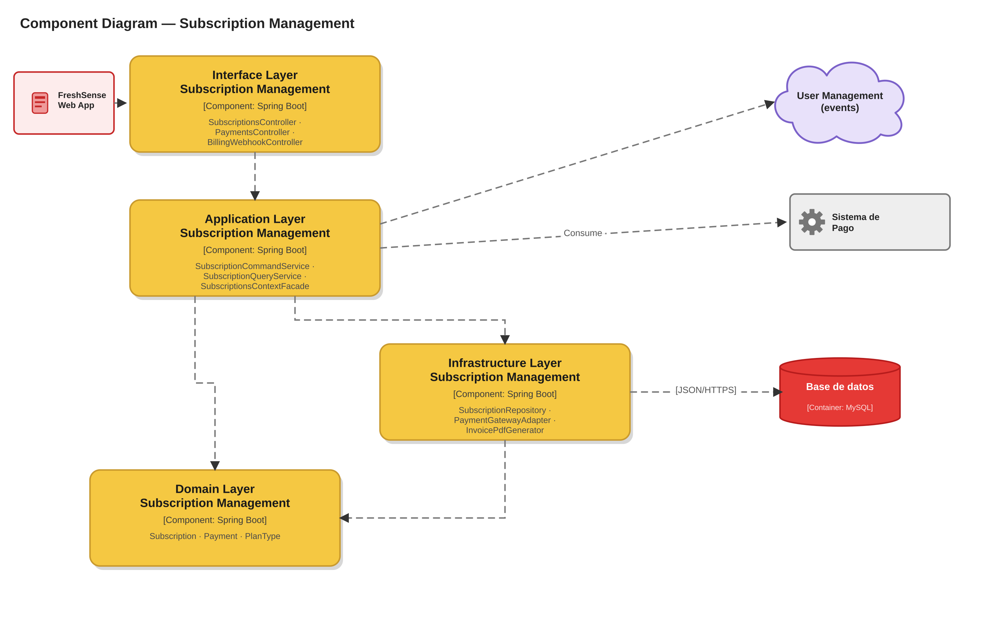
<figcaption style="font-size:0.9em;color:#555;margin-top:0.4em"><em>Component Level Diagram — Subscription Management.</em></figcaption>
</figure>

#### 4.2.2.6. Bounded Context Software Architecture Code Level Diagrams

##### 4.2.2.6.1. Bounded Context Domain Layer Class Diagrams

<figure id="fig-class-sub" style="margin:1.5em 0;text-align:center">
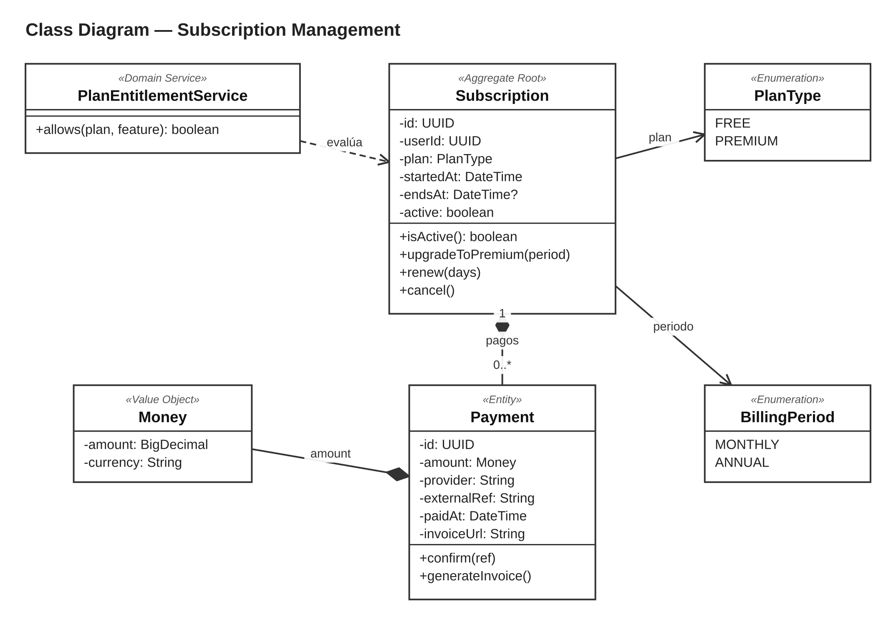
<figcaption style="font-size:0.9em;color:#555;margin-top:0.4em"><em>Class Diagram (Domain Layer) — Subscription Management.</em></figcaption>
</figure>

##### 4.2.2.6.2. Bounded Context Database Design Diagram

<figure id="fig-er-sub" style="margin:1.5em 0;text-align:center">
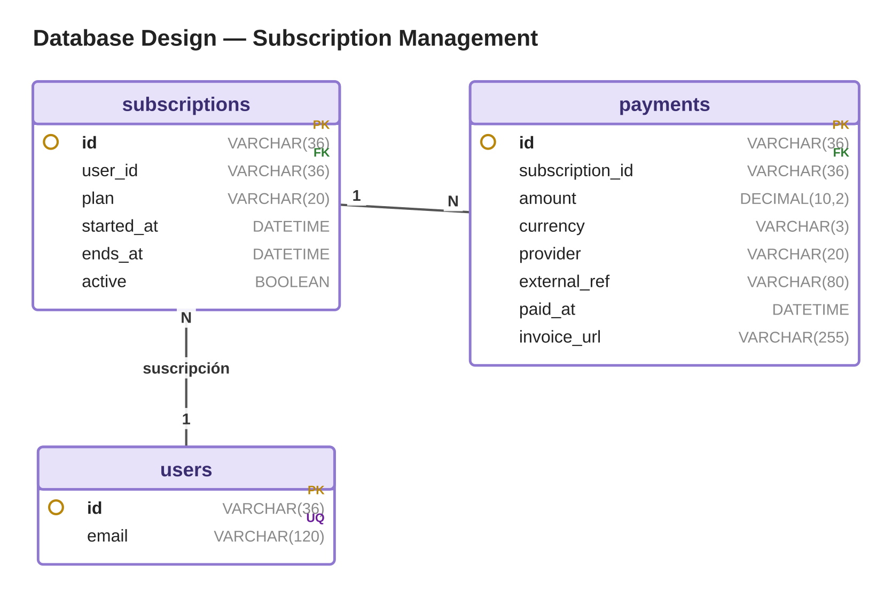
<figcaption style="font-size:0.9em;color:#555;margin-top:0.4em"><em>Database Design Diagram — Subscription Management.</em></figcaption>
</figure>

### 4.2.3 Bounded Context: Profile Management

El **Profile Management Bounded Context** modela el **hogar o negocio** (`Household`) que agrupa a los usuarios y sus dispositivos, la gestión de miembros exigida por la **US37**, y las preferencias de notificación de la **US09** y **US24**. Es el contexto que permite que varias personas —familiares o empleados— compartan un mismo inventario, y que cada una configure cómo y cuándo recibir alertas.

#### 4.2.3.1. Domain Layer

La Domain Layer del Profile Management Bounded Context encapsula la lógica de negocio del contexto. En esta capa se definen los agregados, entidades, objetos de valor, servicios de dominio y políticas que representan los conceptos clave del sistema.

**Aggregates**

1. **Household**
   - *Propósito:* Agregado raíz que representa el hogar o negocio de alimentos al que pertenecen los usuarios, los dispositivos y el inventario compartido.

   - *Atributos:*
| Atributo | Tipo | Descripción |
|---|---|---|
| id | UUID | Identificador del hogar o negocio. |
| name | String | Nombre asignado (por ejemplo, «Casa» o «Restaurante El Sabor»). |
| members | List&lt;HouseholdMember&gt; | Miembros vinculados con su rol. |
| createdAt / updatedAt | DateTime | Campos de auditoría. |
   - *Métodos:*
| Método | Descripción |
|---|---|
| invite(email, role) | Emite una invitación para incorporar a un miembro (US37). |
| addMember(userId, role) | Vincula un usuario al hogar cuando acepta la invitación. |
| removeMember(userId) | Desvincula a un miembro y revoca su acceso al inventario. |
| changeMemberRole(userId, role) | Modifica el rol del miembro dentro del hogar. |
**Entities**

1. **HouseholdMember** — Vínculo entre un usuario y un hogar o negocio, con el rol que desempeña (US37).

| Atributo | Tipo | Descripción |
|---|---|---|
| id | UUID | Identificador del vínculo. |
| householdId | UUID | Hogar o negocio al que pertenece. |
| userId | UUID | Usuario vinculado. |
| role | MemberRole (VO) | OWNER, MEMBER o STAFF. |
| joinedAt | DateTime | Fecha de incorporación. |

| Método | Descripción |
|---|---|
| canManageInventory() | Indica si el rol permite editar el inventario compartido. |
2. **Invitation** — Invitación pendiente para incorporar a un nuevo miembro (US37).

| Atributo | Tipo | Descripción |
|---|---|---|
| id | UUID | Identificador de la invitación. |
| email | Email (VO) | Correo del invitado. |
| token | String | Token único del enlace de vinculación. |
| expiresAt | DateTime | Vencimiento de la invitación. |
| status | InvitationStatus | PENDING, ACCEPTED o EXPIRED. |

| Método | Descripción |
|---|---|
| accept(userId) | Convierte la invitación en un `HouseholdMember`. |
| isExpired() | Evalúa el vencimiento. |
3. **NotificationPreference** — Preferencias de canal y horario de silencio de cada usuario (US09, US24).

| Atributo | Tipo | Descripción |
|---|---|---|
| id | UUID | Identificador. |
| userId | UUID | Usuario propietario. |
| emailEnabled | boolean | Habilita el envío por correo. |
| pushEnabled | boolean | Habilita las notificaciones push. |
| quietHours | TimeWindow (VO) | Rango de silencio (por ejemplo, 22:00–07:00). |
| updatedAt | DateTime | Última modificación. |

| Método | Descripción |
|---|---|
| isQuiet(at) | Indica si un instante cae dentro del horario de silencio. |
| routeFor(severity) | Determina el canal de destino según la severidad (US24). |
**Value Objects**

| Value Object | Descripción |
|---|---|
| MemberRole | Enumeración: `OWNER`, `MEMBER`, `STAFF`. |
| TimeWindow | Rango horario con inicio y fin, usado para el modo silencio. |
| InvitationStatus | Enumeración: `PENDING`, `ACCEPTED`, `EXPIRED`. |

**Domain Services**

| Servicio | Descripción |
|---|---|
| NotificationRoutingService | Decide el canal de entrega (push, correo, reloj inteligente) según severidad y preferencias (US24). |

**Domain Events**

| Evento | Descripción |
|---|---|
| HouseholdCreated | Se creó el hogar o negocio tras registrarse el usuario. |
| MemberInvited | Se envió una invitación a un nuevo miembro (US37). |
| MemberJoined | Un invitado aceptó y quedó vinculado al hogar. |
| NotificationPreferencesUpdated | El usuario cambió sus preferencias de alerta (US09). |
| QuietHoursConfigured | Se definió el rango de silencio para las notificaciones. |

**Policies**

- **Crear hogar al registrarse**: cuando ocurre `UserRegistered`, se crea un `Household` con el usuario como `OWNER`.
- **Retener alertas en silencio**: cuando se dispara una alerta de baja severidad dentro del rango de quietud, se retiene hasta que finalice el periodo (US09).
- **Invitación de un solo uso**: una invitación aceptada o vencida no puede volver a utilizarse.

#### 4.2.3.2. Interface Layer

La Interface Layer del Profile Management expone los puntos de entrada del contexto mediante controladores REST, recursos y *assemblers* que traducen entre el modelo HTTP y el modelo de dominio.

**Controllers**

1. **HouseholdsController** — Gestiona el hogar o negocio y sus miembros.

| Método | Endpoint | Descripción |
|---|---|---|
| GET | /api/v1/households/me | Obtiene el hogar del usuario autenticado y sus miembros. |
| POST | /api/v1/households/{id}/invitations | Envía una invitación a un nuevo miembro (US37). |
| POST | /api/v1/invitations/{token}/accept | Acepta la invitación y vincula al usuario. |
| DELETE | /api/v1/households/{id}/members/{userId} | Desvincula a un miembro. |

   - *Dependencias:* HouseholdCommandService, HouseholdQueryService

2. **NotificationPreferencesController** — Gestiona las preferencias de notificación (US09, US24).

| Método | Endpoint | Descripción |
|---|---|---|
| GET | /api/v1/notification-preferences | Obtiene las preferencias del usuario. |
| PUT | /api/v1/notification-preferences | Actualiza canales y horario de silencio. |

   - *Dependencias:* NotificationPreferenceCommandService

**Resources**

| Resource | Campos |
|---|---|
| HouseholdResource | id, name, members[] |
| HouseholdMemberResource | userId, fullName, role, joinedAt |
| InvitationResource | email, role |
| NotificationPreferenceResource | emailEnabled, pushEnabled, quietStart, quietEnd |

**Transformers / Assemblers**

| Assembler | Transformación |
|---|---|
| HouseholdResourceFromEntityAssembler | Convierte `Household` y sus miembros en `HouseholdResource`. |
| NotificationPreferenceResourceFromEntityAssembler | Convierte `NotificationPreference` en su recurso. |
| InviteMemberCommandFromResourceAssembler | Convierte `InvitationResource` en `InviteMemberCommand`. |

#### 4.2.3.3 Application Layer

La Application Layer del Profile Management coordina las operaciones entre la Interface Layer y la Domain Layer, orquestando comandos, consultas y la reacción a eventos de otros contextos.

**Command Services**

| Servicio | Comandos que maneja | Descripción |
|---|---|---|
| HouseholdCommandServiceImpl | CreateHouseholdCommand, InviteMemberCommand, AcceptInvitationCommand, RemoveMemberCommand | Crea el hogar, gestiona invitaciones y administra la membresía compartida (US37). |
| NotificationPreferenceCommandServiceImpl | UpdatePreferencesCommand, SetQuietHoursCommand | Actualiza canales y horarios de silencio de las alertas (US09). |

**Query Services / Facades**

| Servicio | Consultas | Descripción |
|---|---|---|
| HouseholdQueryServiceImpl | GetHouseholdByUserQuery, GetMembersQuery | Recupera el hogar y sus miembros. |
| ProfileContextFacade | getHouseholdOf(userId), getPreferencesOf(userId) | Open Host Service consultado por Inventory (inventario compartido) y por IoT Monitoring (envío de alertas). |

**Event Handlers**

| Handler | Evento que escucha | Reacción |
|---|---|---|
| UserRegisteredEventHandler | UserRegistered (User Management) | Crea el `Household` inicial con el usuario como OWNER y sus preferencias de notificación por defecto. |
| PlanTypeAcquiredEventHandler | PlanTypeAcquired (Subscription Management) | Ajusta el número máximo de miembros permitidos según el plan contratado. |

#### 4.2.3.4. Infrastructure Layer

La Infrastructure Layer del Profile Management implementa la persistencia y las integraciones técnicas (ACL) hacia otros contextos y sistemas externos.

| Componente | Tipo | Responsabilidad |
|---|---|---|
| HouseholdRepository | JPA Repository | Persistencia de hogares; `findByMemberUserId`. |
| HouseholdMemberRepository | JPA Repository | Persistencia de los vínculos usuario–hogar. |
| InvitationRepository | JPA Repository | Persistencia de invitaciones pendientes (US37). |
| NotificationPreferenceRepository | JPA Repository | Persistencia de las preferencias de alerta. |
| ExternalUserService | ACL entrante | Consulta el `IamContextFacade` para resolver los datos del usuario. |
| NotificationGatewayAdapter | ACL saliente | Envía el correo de invitación mediante el Notification Service (TS42). |

#### 4.2.3.5. Bounded Context Software Architecture Component Level Diagrams

<figure id="fig-comp-pro" style="margin:1.5em 0;text-align:center">
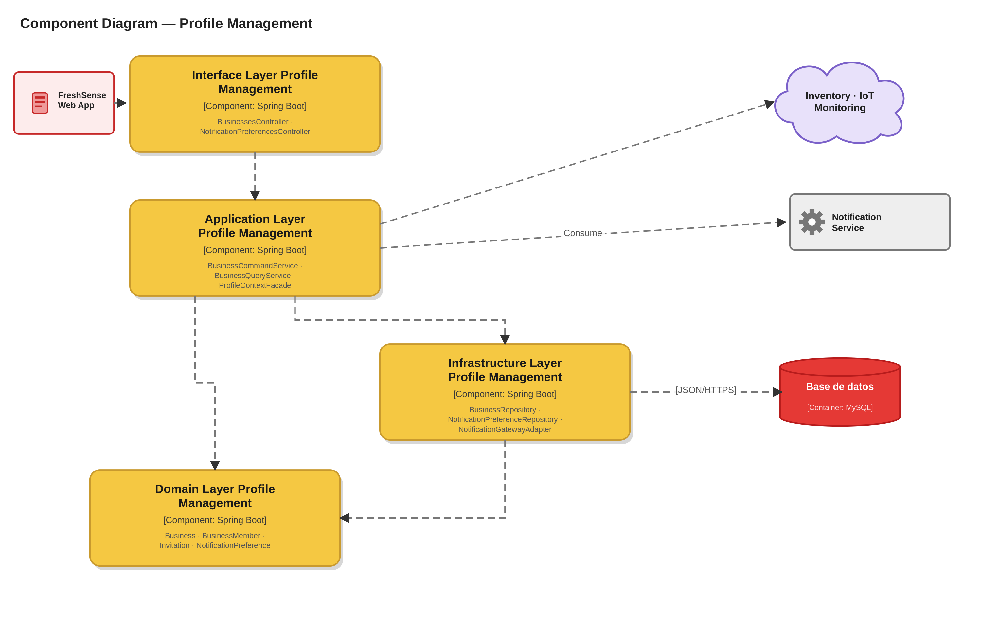
<figcaption style="font-size:0.9em;color:#555;margin-top:0.4em"><em>Component Level Diagram — Profile Management.</em></figcaption>
</figure>

#### 4.2.3.6. Bounded Context Software Architecture Code Level Diagrams

##### 4.2.3.6.1. Bounded Context Domain Layer Class Diagrams

<figure id="fig-class-pro" style="margin:1.5em 0;text-align:center">
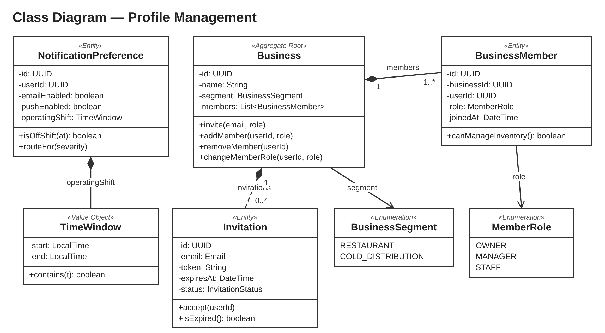
<figcaption style="font-size:0.9em;color:#555;margin-top:0.4em"><em>Class Diagram (Domain Layer) — Profile Management.</em></figcaption>
</figure>

##### 4.2.3.6.2. Bounded Context Database Design Diagram

<figure id="fig-er-pro" style="margin:1.5em 0;text-align:center">
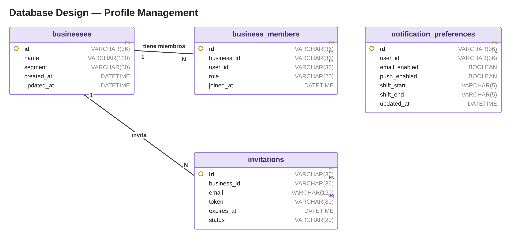
<figcaption style="font-size:0.9em;color:#555;margin-top:0.4em"><em>Database Design Diagram — Profile Management.</em></figcaption>
</figure>

### 4.2.4 Bounded Context: Sensor Management

El **Sensor Management Bounded Context** gestiona el ciclo de vida del hardware **FreshSense Device**: la vinculación mediante código QR y la calibración exigidas por la **US31**, el control del estado de conexión de la **US06**, y la organización en **zonas de almacenamiento** (cámaras frías, congeladores) que pide la **US33**. Este contexto conoce el dispositivo como equipo físico; la interpretación de sus lecturas corresponde a IoT Monitoring.

#### 4.2.4.1. Domain Layer

La Domain Layer del Sensor Management Bounded Context encapsula la lógica de negocio del contexto. En esta capa se definen los agregados, entidades, objetos de valor, servicios de dominio y políticas que representan los conceptos clave del sistema.

**Aggregates**

1. **SensorDevice**
   - *Propósito:* Agregado raíz que representa un dispositivo FreshSense instalado en un refrigerador, cámara fría o congelador.

   - *Atributos:*
| Atributo | Tipo | Descripción |
|---|---|---|
| id | UUID | Identificador del dispositivo. |
| householdId | UUID | Hogar o negocio propietario. |
| model | String | Modelo del hardware. |
| firmwareVersion | String | Versión de firmware instalada. |
| status | DeviceStatus (VO) | ACTIVE, OFFLINE o UNPAIRED. |
| zoneId | UUID? | Zona de almacenamiento asignada (US33). |
| calibration | Calibration (VO) | Temperatura base configurada durante la instalación (US31). |
| registeredAt / updatedAt | DateTime | Campos de auditoría. |
   - *Métodos:*
| Método | Descripción |
|---|---|
| register() | Da de alta el dispositivo en el sistema. |
| pairToHousehold(Household) | Vincula el dispositivo al hogar tras escanear su código QR (US31). |
| calibrate(baseTemperature) | Registra la temperatura base del refrigerador para ajustar los umbrales. |
| assignToZone(zoneId) | Asigna el dispositivo a una cámara o congelador concreto (US33). |
| markOffline() | Marca el dispositivo como desconectado al no recibirse el *heartbeat* (US06). |
**Entities**

1. **StorageZone** — Área de almacenamiento del hogar o negocio, con sus propias reglas de temperatura (US33).

| Atributo | Tipo | Descripción |
|---|---|---|
| id | UUID | Identificador de la zona. |
| householdId | UUID | Hogar o negocio propietario. |
| name | String | Nombre asignado (por ejemplo, «Cámara Fría 1» o «Congelador Carnes»). |
| type | ZoneType (VO) | FRIDGE, FREEZER o COLD_ROOM. |
| targetTempC | float | Temperatura objetivo de la zona. |

| Método | Descripción |
|---|---|
| appliesRulesTo(PantryItem) | Indica si un alimento hereda las reglas de temperatura de la zona. |
**Value Objects**

| Value Object | Descripción |
|---|---|
| DeviceStatus | Enumeración: `ACTIVE`, `OFFLINE`, `UNPAIRED`. |
| ZoneType | Enumeración: `FRIDGE`, `FREEZER`, `COLD_ROOM`. |
| Calibration | Temperatura base y desviación aceptada, definidas al instalar el equipo (US31). |
| PairingCode | Código QR impreso en el hardware que identifica al dispositivo durante la vinculación. |

**Domain Services**

| Servicio | Descripción |
|---|---|
| DeviceHealthService | Evalúa el *heartbeat* recibido y determina cuándo un dispositivo pasa a OFFLINE (US06). |

**Domain Events**

| Evento | Descripción |
|---|---|
| SensorRegistered | Se dio de alta un dispositivo en el sistema. |
| SensorPaired | El dispositivo quedó vinculado al hogar tras escanear el QR (ES: *sensor instalado*). |
| SensorCalibrated | Se registró la temperatura base del refrigerador (US31). |
| SensorConfigured | Se asignó el dispositivo a una zona de almacenamiento (ES: *sensor configurado*). |
| SensorDisconnected | El dispositivo perdió el enlace Wi-Fi y se notificó al usuario (US06). |

**Policies**

- **Vinculación única**: un código QR solo puede vincularse a un hogar a la vez.
- **Notificar desconexión**: cuando el servidor no recibe *heartbeat* dentro de la ventana esperada, se marca el dispositivo OFFLINE y se avisa al usuario (US06).
- **Heredar reglas de zona**: cuando un dispositivo se asigna a una zona, los alimentos asociados adoptan sus umbrales de temperatura (US33).

#### 4.2.4.2. Interface Layer

La Interface Layer del Sensor Management expone los puntos de entrada del contexto mediante controladores REST, recursos y *assemblers* que traducen entre el modelo HTTP y el modelo de dominio.

**Controllers**

1. **DevicesController** — Gestiona el alta, vinculación y calibración de los dispositivos.

| Método | Endpoint | Descripción |
|---|---|---|
| GET | /api/v1/devices | Lista los dispositivos del hogar. |
| POST | /api/v1/devices/pair | Vincula un dispositivo escaneando su código QR (US31). |
| PATCH | /api/v1/devices/{id}/calibration | Registra la temperatura base de calibración. |
| PATCH | /api/v1/devices/{id}/zone | Asigna el dispositivo a una zona de almacenamiento. |

   - *Dependencias:* DeviceCommandService, DeviceQueryService

2. **StorageZonesController** — Administra las zonas de almacenamiento del negocio (US33).

| Método | Endpoint | Descripción |
|---|---|---|
| GET | /api/v1/storage-zones | Lista las zonas configuradas. |
| POST | /api/v1/storage-zones | Crea una nueva cámara, congelador o refrigerador. |
| DELETE | /api/v1/storage-zones/{id} | Elimina una zona sin dispositivos asociados. |

   - *Dependencias:* StorageZoneCommandService

3. **DeviceHeartbeatController** — Recibe la señal periódica de vida del dispositivo (US06).

| Método | Endpoint | Descripción |
|---|---|---|
| POST | /api/v1/devices/{id}/heartbeat | Registra el *ping* del dispositivo y actualiza su estado. |

   - *Dependencias:* DeviceCommandService

**Resources**

| Resource | Campos |
|---|---|
| DeviceResource | id, model, firmwareVersion, status, zoneId, calibration |
| PairDeviceResource | pairingCode (QR), householdId |
| CalibrationResource | baseTemperatureC |
| StorageZoneResource | id, name, type, targetTempC |

**Transformers / Assemblers**

| Assembler | Transformación |
|---|---|
| DeviceResourceFromEntityAssembler | Convierte `SensorDevice` en `DeviceResource`. |
| StorageZoneResourceFromEntityAssembler | Convierte `StorageZone` en su recurso. |
| PairDeviceCommandFromResourceAssembler | Convierte `PairDeviceResource` en `PairDeviceCommand`. |

#### 4.2.4.3 Application Layer

La Application Layer del Sensor Management coordina las operaciones entre la Interface Layer y la Domain Layer, orquestando comandos, consultas y la reacción a eventos de otros contextos.

**Command Services**

| Servicio | Comandos que maneja | Descripción |
|---|---|---|
| DeviceCommandServiceImpl | RegisterDeviceCommand, PairDeviceCommand, CalibrateDeviceCommand, AssignZoneCommand, RegisterHeartbeatCommand | Da de alta, vincula, calibra y monitorea el estado de conexión de los dispositivos. |
| StorageZoneCommandServiceImpl | CreateZoneCommand, DeleteZoneCommand | Administra las áreas de almacenamiento del hogar o negocio (US33). |

**Query Services / Facades**

| Servicio | Consultas | Descripción |
|---|---|---|
| DeviceQueryServiceImpl | GetDevicesByHouseholdQuery, GetDeviceByIdQuery | Recupera los dispositivos y su estado. |
| StorageZoneQueryServiceImpl | GetZonesByHouseholdQuery | Recupera las zonas configuradas. |
| SensorContextFacade | existsDevice(id), getZoneOf(deviceId), getCalibration(deviceId) | Open Host Service consultado por IoT Monitoring para validar el origen de las lecturas. |

**Event Handlers**

| Handler | Evento que escucha | Reacción |
|---|---|---|
| HouseholdCreatedEventHandler | HouseholdCreated (Profile Management) | Crea la zona de almacenamiento por defecto («Refrigerador principal») para el nuevo hogar. |
| PlanTypeAcquiredEventHandler | PlanTypeAcquired (Subscription Management) | Ajusta el número máximo de dispositivos y zonas permitidos según el plan. |

#### 4.2.4.4. Infrastructure Layer

La Infrastructure Layer del Sensor Management implementa la persistencia y las integraciones técnicas (ACL) hacia otros contextos y sistemas externos.

| Componente | Tipo | Responsabilidad |
|---|---|---|
| SensorDeviceRepository | JPA Repository | Persistencia de dispositivos; `findByHouseholdId`, `findByPairingCode`. |
| StorageZoneRepository | JPA Repository | Persistencia de las zonas de almacenamiento. |
| HeartbeatScheduler | Spring Scheduler | Revisa periódicamente los *heartbeats* y marca los dispositivos OFFLINE (US06). |
| ExternalHouseholdService | ACL entrante | Consulta el `ProfileContextFacade` para validar el hogar propietario. |
| NotificationGatewayAdapter | ACL saliente | Notifica al usuario la desconexión del dispositivo (TS42). |

#### 4.2.4.5. Bounded Context Software Architecture Component Level Diagrams

<figure id="fig-comp-sen" style="margin:1.5em 0;text-align:center">

<figcaption style="font-size:0.9em;color:#555;margin-top:0.4em"><em>Component Level Diagram — Sensor Management.</em></figcaption>
</figure>

#### 4.2.4.6. Bounded Context Software Architecture Code Level Diagrams

##### 4.2.4.6.1. Bounded Context Domain Layer Class Diagrams

<figure id="fig-class-sen" style="margin:1.5em 0;text-align:center">
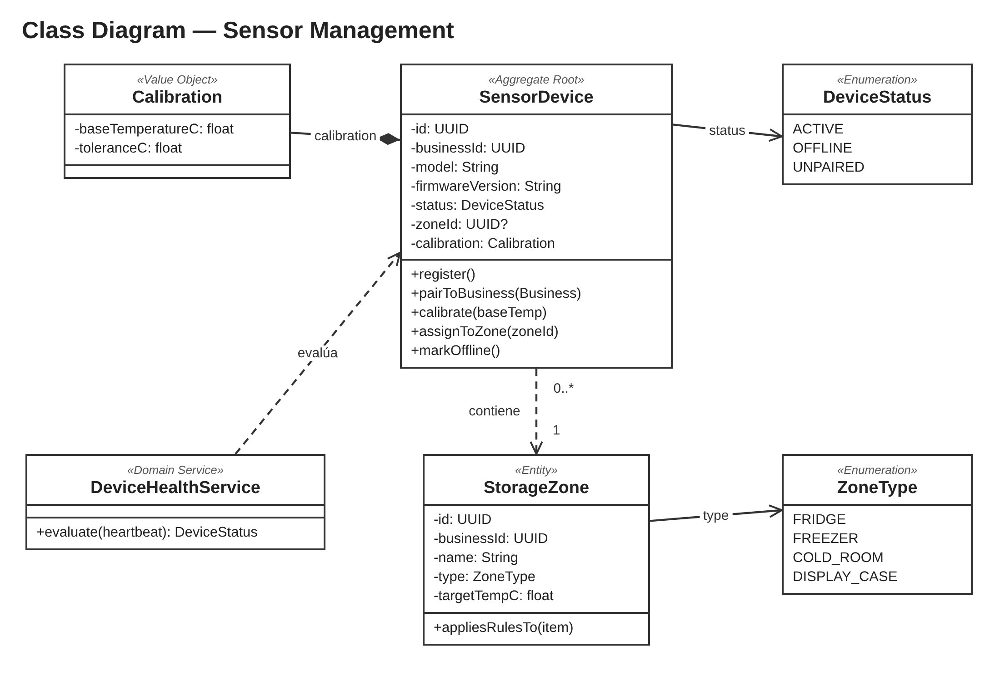
<figcaption style="font-size:0.9em;color:#555;margin-top:0.4em"><em>Class Diagram (Domain Layer) — Sensor Management.</em></figcaption>
</figure>

##### 4.2.4.6.2. Bounded Context Database Design Diagram

<figure id="fig-er-sen" style="margin:1.5em 0;text-align:center">
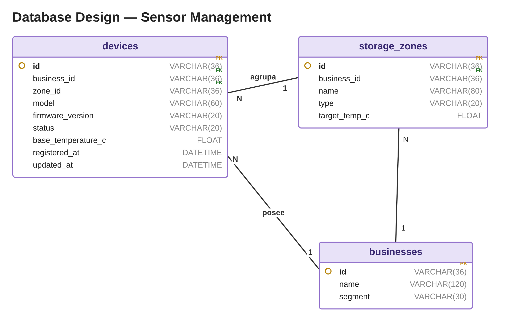
<figcaption style="font-size:0.9em;color:#555;margin-top:0.4em"><em>Database Design Diagram — Sensor Management.</em></figcaption>
</figure>

### 4.2.5 Bounded Context: Inventory Management

El **Inventory Management Bounded Context** administra la despensa digital del hogar o negocio: el alta de alimentos por voz o escaneo de código de barras (**US10**), la edición manual del stock (**US11**), la categorización personalizada (**US28**) y el registro del motivo de descarte (**US34**). Contiene el agregado `PantryItem` y el catálogo `FoodModel`, que define la vida útil estimada por categoría de alimento y las reglas usadas para estimar la fecha de consumo preferente.

#### 4.2.5.1. Domain Layer

La Domain Layer del Inventory Management Bounded Context encapsula la lógica de negocio del contexto. En esta capa se definen los agregados, entidades, objetos de valor, servicios de dominio y políticas que representan los conceptos clave del sistema.

**Aggregates**

1. **PantryItem**
   - *Propósito:* Agregado raíz que representa un alimento registrado en la despensa, con su cantidad, vencimiento estimado y estado de frescura.

   - *Atributos:*
| Atributo | Tipo | Descripción |
|---|---|---|
| id | UUID | Identificador del alimento. |
| userId | UUID | Usuario o miembro que lo registró. |
| foodModelId | UUID | Categoría del catálogo que define su vida útil. |
| name | String | Nombre del alimento. |
| quantity | Quantity (VO) | Cantidad disponible. |
| unit | Unit (VO) | Unidad de medida (kg, unidades, litros). |
| addedAt | DateTime | Fecha de registro en la despensa. |
| bestBefore | DateTime? | Fecha estimada de consumo preferente. |
| status | FreshnessStatus (VO) | FRESH, AT_RISK o SPOILED. |
| notes | String | Observaciones y etiquetas personalizadas (US28). |
   - *Métodos:*
| Método | Descripción |
|---|---|
| markConsumed() | Registra el consumo del alimento y descuenta la cantidad. |
| markDiscarded(reason) | Registra el descarte indicando la causa: caducado, contaminado o mal estado (US34). |
| updateQuantity(qty) | Corrige manualmente el stock disponible (US11). |
| updateStatus(FreshnessStatus) | Actualiza el estado de frescura según la evaluación del dominio. |
| estimateBestBefore(FoodModel) | Calcula la fecha de consumo preferente a partir de la vida útil del catálogo. |
**Entities**

1. **FoodModel** — Catálogo que define la vida útil y las reglas de conservación de cada categoría de alimento.

| Atributo | Tipo | Descripción |
|---|---|---|
| id | UUID | Identificador del modelo. |
| name | String | Nombre de la categoría. |
| category | String | Agrupación (Fruta, Verdura, Lácteo, Carne). |
| shelfLifeDays | int | Vida útil estimada en días. |
| rulesJson | ShelfLifeRules (VO) | Umbrales de temperatura, humedad y etileno aplicables. |

| Método | Descripción |
|---|---|
| rulesFor(zoneType) | Devuelve los umbrales ajustados al tipo de zona de almacenamiento. |
**Value Objects**

| Value Object | Descripción |
|---|---|
| FreshnessStatus | Enumeración: `FRESH`, `AT_RISK`, `SPOILED`. |
| Quantity | Cantidad con validación de no negatividad. |
| Unit | Unidad de medida del alimento (kg, g, L, unidades). |
| ShelfLifeRules | Reglas de vida útil y umbrales por categoría, serializadas en JSON. |
| DiscardReason | Enumeración: `EXPIRED`, `CONTAMINATED`, `BAD_ON_PURCHASE` (US34). |

**Domain Services**

| Servicio | Descripción |
|---|---|
| ShelfLifeEstimationService | Estima la fecha de consumo preferente combinando el `FoodModel` y la zona de almacenamiento. |
| BarcodeLookupService | Resuelve el nombre y la categoría del producto a partir del código de barras escaneado (US10). |

**Domain Events**

| Evento | Descripción |
|---|---|
| FoodItemRegistered | Se agregó un alimento a la despensa (ES: *alimento agregado*). |
| FoodItemUpdated | Se modificó manualmente la cantidad o los datos del alimento (US11). |
| FoodItemConsumed | El alimento fue consumido (ES: *alimento consumido*). |
| FoodItemDiscarded | El alimento fue descartado indicando la causa (US34). |
| FoodConditionUpdated | Cambió el estado de frescura del alimento tras una evaluación. |

**Policies**

- **Estimar vencimiento al registrar**: cuando se agrega un alimento, el sistema calcula automáticamente su `bestBefore` a partir del `FoodModel`.
- **Heredar reglas de la zona**: cuando el alimento se asocia a una zona de almacenamiento, adopta sus umbrales de temperatura (US33).
- **Solicitar motivo al descartar**: cuando el usuario elimina un producto marcándolo como desechado, la aplicación exige el motivo para el informe de mermas (US34).

#### 4.2.5.2. Interface Layer

La Interface Layer del Inventory Management expone los puntos de entrada del contexto mediante controladores REST, recursos y *assemblers* que traducen entre el modelo HTTP y el modelo de dominio.

**Controllers**

1. **PantryItemsController** — Gestiona el inventario de alimentos del hogar o negocio.

| Método | Endpoint | Descripción |
|---|---|---|
| GET | /api/v1/pantry-items | Lista los alimentos con su estado de frescura (semáforo, US07). |
| POST | /api/v1/pantry-items | Registra un alimento por voz, código de barras o manualmente (US10). |
| PUT | /api/v1/pantry-items/{id} | Actualiza cantidad, unidad o etiquetas (US11, US28). |
| POST | /api/v1/pantry-items/{id}/consume | Marca el alimento como consumido. |
| POST | /api/v1/pantry-items/{id}/discard | Marca el alimento como descartado con su causa (US34). |

   - *Dependencias:* PantryItemCommandService, PantryItemQueryService

2. **FoodModelsController** — Expone el catálogo de categorías y vida útil.

| Método | Endpoint | Descripción |
|---|---|---|
| GET | /api/v1/food-models | Lista las categorías disponibles. |
| GET | /api/v1/food-models/{id} | Obtiene las reglas de vida útil de una categoría. |

   - *Dependencias:* FoodModelQueryService

3. **InventorySearchController** — Búsqueda global con autocompletado sobre el inventario (US39).

| Método | Endpoint | Descripción |
|---|---|---|
| GET | /api/v1/inventory/search | Devuelve coincidencias en vivo de alimentos y recetas. |

   - *Dependencias:* PantryItemQueryService

**Resources**

| Resource | Campos |
|---|---|
| PantryItemResource | id, name, quantity, unit, addedAt, bestBefore, status, notes |
| CreatePantryItemResource | name, quantity, unit, foodModelId, barcode? |
| DiscardResource | reason (EXPIRED, CONTAMINATED o BAD_ON_PURCHASE) |
| FoodModelResource | id, name, category, shelfLifeDays |

**Transformers / Assemblers**

| Assembler | Transformación |
|---|---|
| PantryItemResourceFromEntityAssembler | Convierte `PantryItem` en `PantryItemResource`. |
| FoodModelResourceFromEntityAssembler | Convierte `FoodModel` en su recurso. |
| CreatePantryItemCommandFromResourceAssembler | Convierte el recurso de alta en `RegisterFoodItemCommand`. |

#### 4.2.5.3 Application Layer

La Application Layer del Inventory Management coordina las operaciones entre la Interface Layer y la Domain Layer, orquestando comandos, consultas y la reacción a eventos de otros contextos.

**Command Services**

| Servicio | Comandos que maneja | Descripción |
|---|---|---|
| PantryItemCommandServiceImpl | RegisterFoodItemCommand, UpdateFoodItemCommand, ConsumeFoodItemCommand, DiscardFoodItemCommand | Registra, actualiza, consume y descarta alimentos, publicando los eventos correspondientes. |
| FoodModelCommandServiceImpl | SeedFoodModelsCommand | Carga el catálogo inicial de categorías y vidas útiles al iniciar el sistema. |

**Query Services / Facades**

| Servicio | Consultas | Descripción |
|---|---|---|
| PantryItemQueryServiceImpl | GetPantryItemsQuery, GetItemsAtRiskQuery, SearchInventoryQuery | Recupera el inventario, los alimentos en riesgo y las coincidencias de búsqueda (US39). |
| FoodModelQueryServiceImpl | GetAllFoodModelsQuery, GetFoodModelByIdQuery | Recupera el catálogo de categorías. |
| InventoryContextFacade | getInventorySnapshot(householdId), getItemsAtRisk(userId) | Open Host Service consultado por Consumption y Report Management. |

**Event Handlers**

| Handler | Evento que escucha | Reacción |
|---|---|---|
| FoodConditionUpdatedEventHandler | FoodConditionUpdated (IoT Monitoring) | Actualiza el `status` del `PantryItem` a AT_RISK o SPOILED según la evaluación del FreshnessService. |
| SensorConfiguredEventHandler | SensorConfigured (Sensor Management) | Asocia los alimentos de la zona con el dispositivo que la monitorea. |

#### 4.2.5.4. Infrastructure Layer

La Infrastructure Layer del Inventory Management implementa la persistencia y las integraciones técnicas (ACL) hacia otros contextos y sistemas externos.

| Componente | Tipo | Responsabilidad |
|---|---|---|
| PantryItemRepository | JPA Repository | Persistencia del inventario; `findByUserId`, `findByStatus`. |
| FoodModelRepository | JPA Repository | Persistencia del catálogo de categorías. |
| BarcodeApiAdapter | ACL saliente | Consulta el catálogo externo de códigos de barras (US10). |
| RedisCacheAdapter | Caché | Almacena el catálogo y las consultas frecuentes del inventario (TS45). |
| ExternalSensorService | ACL entrante | Consulta el `SensorContextFacade` para conocer la zona del alimento. |

#### 4.2.5.5. Bounded Context Software Architecture Component Level Diagrams

<figure id="fig-comp-inv" style="margin:1.5em 0;text-align:center">
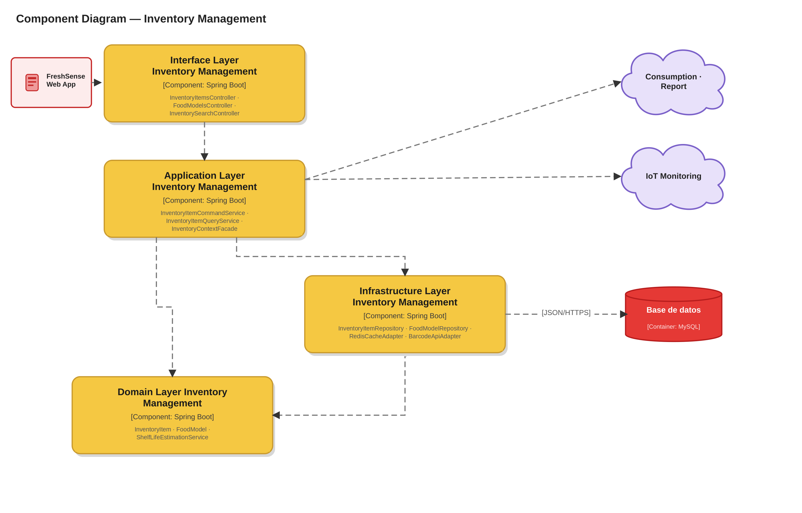
<figcaption style="font-size:0.9em;color:#555;margin-top:0.4em"><em>Component Level Diagram — Inventory Management.</em></figcaption>
</figure>

#### 4.2.5.6. Bounded Context Software Architecture Code Level Diagrams

##### 4.2.5.6.1. Bounded Context Domain Layer Class Diagrams

<figure id="fig-class-inv" style="margin:1.5em 0;text-align:center">
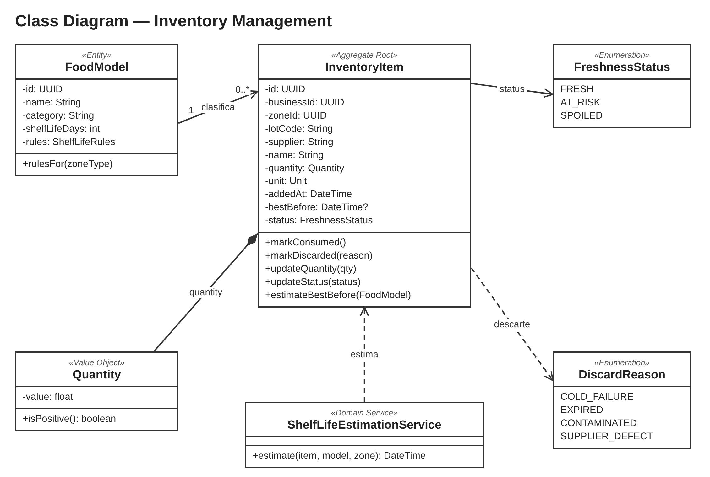
<figcaption style="font-size:0.9em;color:#555;margin-top:0.4em"><em>Class Diagram (Domain Layer) — Inventory Management.</em></figcaption>
</figure>

##### 4.2.5.6.2. Bounded Context Database Design Diagram

<figure id="fig-er-inv" style="margin:1.5em 0;text-align:center">
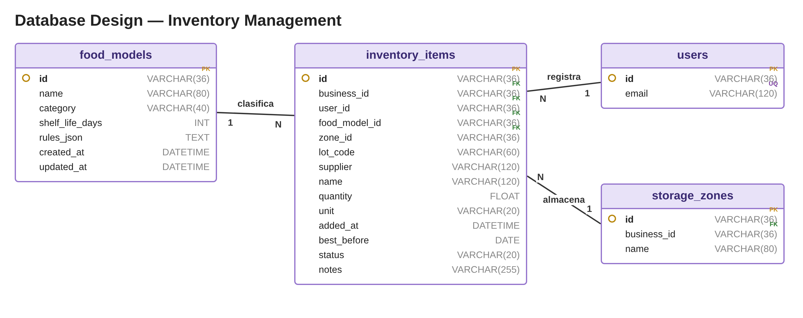
<figcaption style="font-size:0.9em;color:#555;margin-top:0.4em"><em>Database Design Diagram — Inventory Management.</em></figcaption>
</figure>

### 4.2.6 Bounded Context: Consumption Management

El **Consumption Management Bounded Context** registra el consumo y descarte efectivo de los alimentos y gestiona el **motor de sugerencia de recetas** (**EP05**). Propone platillos priorizando los ingredientes en riesgo (**US13**), permite filtrarlos por tiempo, dificultad y tipo de dieta (**US14**), y recoge las calificaciones de la comunidad (**US40**). Su registro de consumo es la fuente de los reportes de ahorro e impacto ambiental.

#### 4.2.6.1. Domain Layer

La Domain Layer del Consumption Management Bounded Context encapsula la lógica de negocio del contexto. En esta capa se definen los agregados, entidades, objetos de valor, servicios de dominio y políticas que representan los conceptos clave del sistema.

**Aggregates**

1. **Recipe**
   - *Propósito:* Agregado raíz que representa una receta sugerida por la plataforma para aprovechar alimentos próximos a vencer.

   - *Atributos:*
| Atributo | Tipo | Descripción |
|---|---|---|
| id | UUID | Identificador de la receta. |
| title | String | Nombre del platillo. |
| prepMinutes | int | Tiempo de preparación en minutos. |
| difficulty | Difficulty (VO) | EASY, MEDIUM o HARD. |
| instructions | String | Pasos de preparación. |
| ingredients | List&lt;RecipeIngredient&gt; | Ingredientes requeridos. |
| isPremium | boolean | Indica si pertenece al catálogo gourmet exclusivo (US19). |
   - *Métodos:*
| Método | Descripción |
|---|---|
| matches(atRiskItems) | Evalúa cuántos ingredientes en riesgo cubre la receta (US13). |
| addIngredient(name, qty, unit, optional) | Incorpora un ingrediente a la receta. |
| rate(userId, stars, comment) | Registra la calificación y reseña de un usuario (US40). |
**Entities**

1. **RecipeIngredient** — Ingrediente que forma parte de una receta.

| Atributo | Tipo | Descripción |
|---|---|---|
| id | UUID | Identificador. |
| recipeId | UUID | Receta a la que pertenece. |
| name | String | Nombre del ingrediente. |
| qty | Quantity (VO) | Cantidad requerida. |
| unit | Unit (VO) | Unidad de medida. |
| optional | boolean | Indica si el ingrediente es opcional. |

| Método | Descripción |
|---|---|
| isSatisfiedBy(pantryItems) | Indica si el inventario cubre este ingrediente. |
2. **ConsumptionRecord** — Registro histórico de cada alimento consumido o descartado, base de los reportes (US29, US34).

| Atributo | Tipo | Descripción |
|---|---|---|
| id | UUID | Identificador del registro. |
| userId | UUID | Usuario que realizó la acción. |
| pantryItemId | UUID | Alimento afectado. |
| action | ConsumptionAction (VO) | CONSUMED o DISCARDED. |
| reason | DiscardReason? | Causa del descarte, si aplica (US34). |
| estimatedValue | Money (VO) | Valor económico del alimento. |
| recordedAt | DateTime | Fecha del registro. |

| Método | Descripción |
|---|---|
| isWaste() | Indica si el registro representa una merma. |
| carbonFootprint() | Estima el CO₂ asociado al alimento (US20). |
**Value Objects**

| Value Object | Descripción |
|---|---|
| Difficulty | Enumeración: `EASY`, `MEDIUM`, `HARD`. |
| ConsumptionAction | Enumeración: `CONSUMED`, `DISCARDED`. |
| DietTag | Etiqueta dietética de la receta: vegana, keto, sin gluten (US14). |
| Rating | Calificación de 1 a 5 estrellas con reseña opcional (US40). |

**Domain Services**

| Servicio | Descripción |
|---|---|
| RecipeSuggestionService | Selecciona y ordena las recetas según los alimentos en estado AT_RISK del inventario (US13). |
| WasteValuationService | Calcula el valor económico y la huella de carbono del consumo y la merma (US18, US20). |

**Domain Events**

| Evento | Descripción |
|---|---|
| ConsumptionRegistered | Se registró el consumo de un alimento (ES: *alimento consumido*). |
| WasteRegistered | Se registró el descarte de un alimento con su causa (ES: *alimento desechado*). |
| RecipeSuggested | Se propusieron recetas a partir de los alimentos en riesgo (ES: *receta sugerida*). |
| RecipeRated | Un usuario calificó una receta (US40). |

**Policies**

- **Sugerir recetas al detectar riesgo**: cuando existen alimentos en estado AT_RISK, el motor propone recetas que los utilicen como base (US13).
- **Registrar valor al consumir**: cuando ocurre `FoodItemConsumed`, se crea un `ConsumptionRecord` con el valor económico estimado.
- **Restringir catálogo gourmet**: cuando un usuario sin plan PREMIUM consulta las recetas exclusivas, el acceso se bloquea (US19).

#### 4.2.6.2. Interface Layer

La Interface Layer del Consumption Management expone los puntos de entrada del contexto mediante controladores REST, recursos y *assemblers* que traducen entre el modelo HTTP y el modelo de dominio.

**Controllers**

1. **RecipesController** — Expone el catálogo y las sugerencias de recetas.

| Método | Endpoint | Descripción |
|---|---|---|
| GET | /api/v1/recipes | Lista las recetas con filtros de tiempo, dificultad y dieta (US14). |
| GET | /api/v1/recipes/suggested | Devuelve las recetas sugeridas según los alimentos en riesgo (US13). |
| GET | /api/v1/recipes/{id} | Obtiene el detalle e ingredientes de una receta. |
| POST | /api/v1/recipes/{id}/ratings | Registra una calificación y reseña (US40). |

   - *Dependencias:* RecipeQueryService, RecipeCommandService

2. **ConsumptionController** — Expone el historial de consumo y descarte.

| Método | Endpoint | Descripción |
|---|---|---|
| GET | /api/v1/consumption | Lista los registros de consumo y merma por periodo. |
| GET | /api/v1/consumption/export | Descarga el historial en CSV o Excel (US29). |

   - *Dependencias:* ConsumptionQueryService

**Resources**

| Resource | Campos |
|---|---|
| RecipeResource | id, title, prepMinutes, difficulty, instructions, ingredients[] |
| RecipeIngredientResource | name, qty, unit, optional |
| RatingResource | stars, comment |
| ConsumptionRecordResource | id, pantryItemId, action, reason, estimatedValue, recordedAt |

**Transformers / Assemblers**

| Assembler | Transformación |
|---|---|
| RecipeResourceFromEntityAssembler | Convierte `Recipe` y sus ingredientes en `RecipeResource`. |
| ConsumptionRecordResourceFromEntityAssembler | Convierte `ConsumptionRecord` en su recurso. |
| RatingCommandFromResourceAssembler | Convierte `RatingResource` en `RateRecipeCommand`. |

#### 4.2.6.3 Application Layer

La Application Layer del Consumption Management coordina las operaciones entre la Interface Layer y la Domain Layer, orquestando comandos, consultas y la reacción a eventos de otros contextos.

**Command Services**

| Servicio | Comandos que maneja | Descripción |
|---|---|---|
| RecipeCommandServiceImpl | SeedRecipesCommand, RateRecipeCommand | Carga el catálogo de recetas y registra las calificaciones de la comunidad (US40). |
| ConsumptionCommandServiceImpl | RegisterConsumptionCommand, RegisterWasteCommand | Crea los registros de consumo y merma con su valoración económica y ambiental. |

**Query Services / Facades**

| Servicio | Consultas | Descripción |
|---|---|---|
| RecipeQueryServiceImpl | GetRecipesQuery, GetSuggestedRecipesQuery, GetRecipeByIdQuery | Recupera el catálogo y las sugerencias priorizadas por riesgo (US13, US14). |
| ConsumptionQueryServiceImpl | GetConsumptionByPeriodQuery, ExportConsumptionQuery | Recupera el historial y genera la exportación en CSV/Excel (US29). |
| ConsumptionContextFacade | getConsumptionSummary(userId, period) | Open Host Service consultado por Report Management para construir los reportes. |

**Event Handlers**

| Handler | Evento que escucha | Reacción |
|---|---|---|
| FoodItemConsumedEventHandler | FoodItemConsumed (Inventory Management) | Crea un `ConsumptionRecord` de tipo CONSUMED y calcula el valor económico rescatado. |
| FoodItemDiscardedEventHandler | FoodItemDiscarded (Inventory Management) | Crea un `ConsumptionRecord` de tipo DISCARDED con su causa y estima la huella de carbono. |
| FoodConditionUpdatedEventHandler | FoodConditionUpdated (IoT Monitoring) | Recalcula las sugerencias de recetas cuando un alimento entra en estado AT_RISK (US13). |

#### 4.2.6.4. Infrastructure Layer

La Infrastructure Layer del Consumption Management implementa la persistencia y las integraciones técnicas (ACL) hacia otros contextos y sistemas externos.

| Componente | Tipo | Responsabilidad |
|---|---|---|
| RecipeRepository | JPA Repository | Persistencia de recetas; `findByDifficulty`, `findByIngredientName`. |
| RecipeIngredientRepository | JPA Repository | Persistencia de los ingredientes de cada receta. |
| ConsumptionRecordRepository | JPA Repository | Persistencia del historial de consumo y merma. |
| RedisCacheAdapter | Caché | Sirve el catálogo de recetas filtradas en menos de 50 ms (TS45). |
| CsvExcelExporter | Servicio técnico | Genera el archivo CSV/Excel del historial con Apache POI (US29). |
| ExternalInventoryService | ACL entrante | Consulta el `InventoryContextFacade` para obtener los alimentos en riesgo. |

#### 4.2.6.5. Bounded Context Software Architecture Component Level Diagrams

<figure id="fig-comp-con" style="margin:1.5em 0;text-align:center">
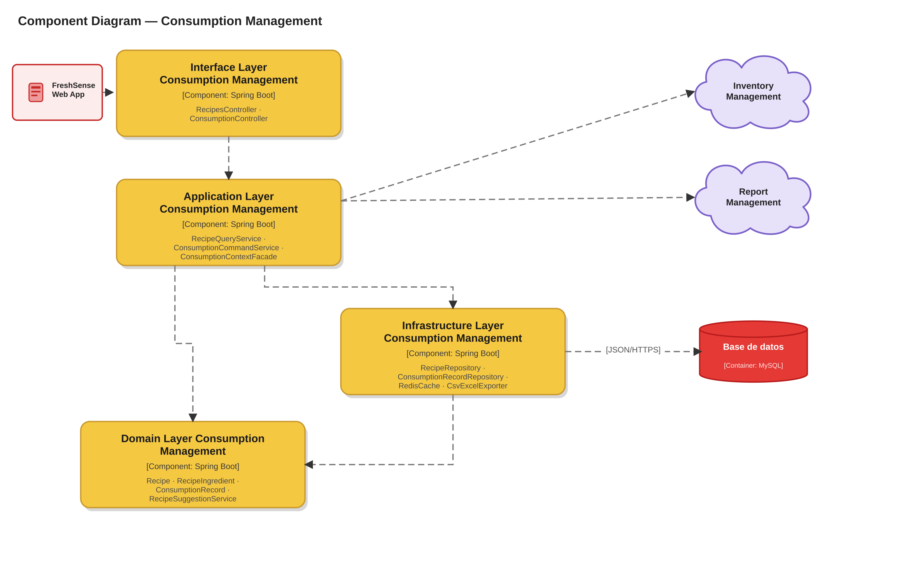
<figcaption style="font-size:0.9em;color:#555;margin-top:0.4em"><em>Component Level Diagram — Consumption Management.</em></figcaption>
</figure>

#### 4.2.6.6. Bounded Context Software Architecture Code Level Diagrams

##### 4.2.6.6.1. Bounded Context Domain Layer Class Diagrams

<figure id="fig-class-con" style="margin:1.5em 0;text-align:center">
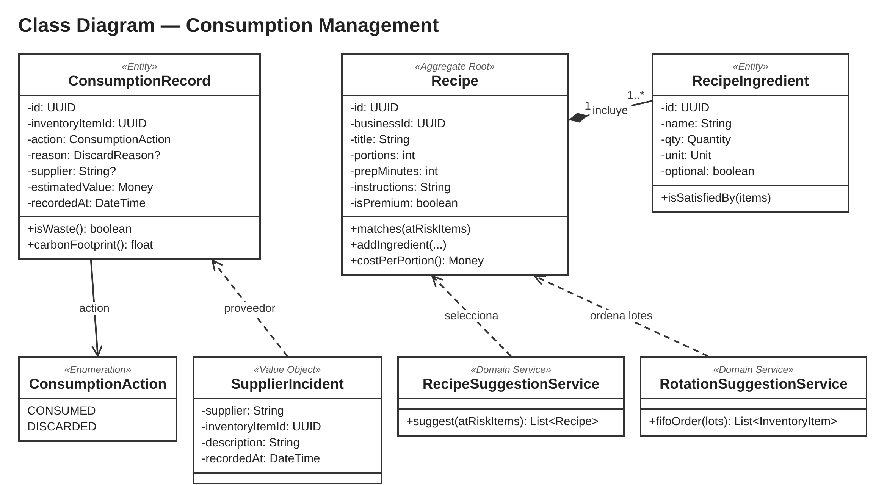
<figcaption style="font-size:0.9em;color:#555;margin-top:0.4em"><em>Class Diagram (Domain Layer) — Consumption Management.</em></figcaption>
</figure>

##### 4.2.6.6.2. Bounded Context Database Design Diagram

<figure id="fig-er-con" style="margin:1.5em 0;text-align:center">
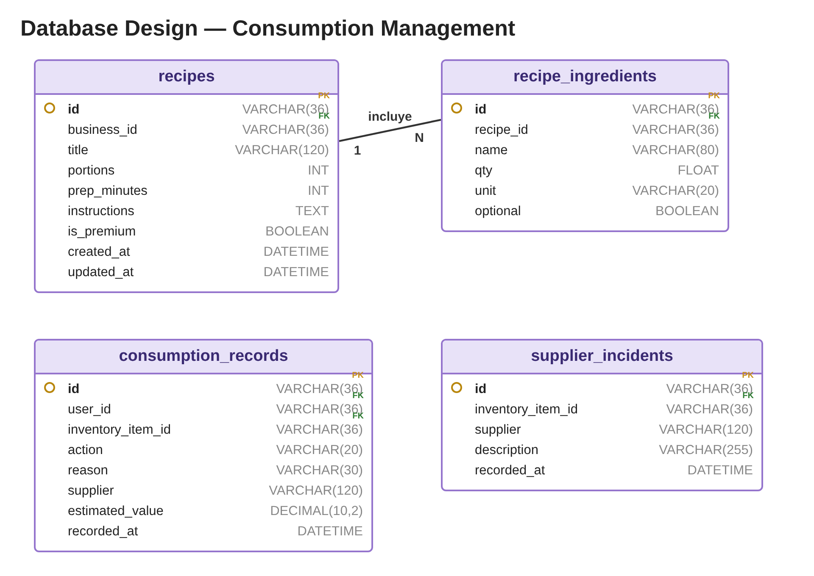
<figcaption style="font-size:0.9em;color:#555;margin-top:0.4em"><em>Database Design Diagram — Consumption Management.</em></figcaption>
</figure>

### 4.2.7 Bounded Context: IoT Monitoring

El **IoT Monitoring Bounded Context** es el núcleo de la integración IoT del producto. Recibe la telemetría del dispositivo FreshSense mediante el endpoint REST seguro definido en la **TS41**, evalúa las lecturas contra los umbrales de cada alimento a través del `FreshnessService` del modelo de dominio, y emite las alertas preventivas de la **US08**, respetando el **Modo Vacaciones** de la **US32**. Este contexto traduce la señal física (temperatura, humedad, etileno) en conocimiento de negocio: el estado de frescura del alimento.

#### 4.2.7.1. Domain Layer

La Domain Layer del IoT Monitoring Bounded Context encapsula la lógica de negocio del contexto. En esta capa se definen los agregados, entidades, objetos de valor, servicios de dominio y políticas que representan los conceptos clave del sistema.

**Aggregates**

1. **SensorReading**
   - *Propósito:* Agregado raíz que representa una lectura de telemetría enviada por el dispositivo FreshSense.

   - *Atributos:*
| Atributo | Tipo | Descripción |
|---|---|---|
| id | UUID | Identificador de la lectura. |
| deviceId | UUID | Dispositivo que la originó. |
| timestamp | DateTime | Instante de la medición. |
| temperatureC | float | Temperatura en grados Celsius. |
| humidityPct | float | Humedad relativa en porcentaje. |
| ethylenePpm | float | Concentración de gas etileno en ppm. |
| meta | String | Metadatos del envío (versión de firmware, calidad de señal). |
   - *Métodos:*
| Método | Descripción |
|---|---|
| isValid() | Valida que los rangos de las tres magnitudes sean físicamente posibles. |
| exceeds(ShelfLifeRules) | Indica si la lectura supera los umbrales de la categoría del alimento. |
| toQualityRecord() | Proyecta la lectura al histórico de calidad consultado en los reportes. |
**Entities**

1. **ExpirationAlert** — Alerta generada cuando un alimento entra en riesgo de deterioro (US08).

| Atributo | Tipo | Descripción |
|---|---|---|
| id | UUID | Identificador de la alerta. |
| pantryItemId | UUID | Alimento afectado. |
| raisedAt | DateTime | Momento en que se emitió. |
| type | AlertType (VO) | NEARING_EXPIRY, HIGH_ETHYLENE o TEMP_RISK. |
| status | AlertStatus (VO) | OPEN, SENT, SNOOZED o RESOLVED. |
| meta | String | Valores que motivaron la alerta. |

| Método | Descripción |
|---|---|
| resolve() | Marca la alerta como resuelta cuando el alimento se consume o descarta. |
| snooze(until) | Pospone la alerta según las preferencias del usuario (US09). |
| markSent() | Registra que la notificación fue despachada. |
2. **ThresholdProfile** — Perfil de umbrales aplicado a una zona, incluido el Modo Vacaciones (US32).

| Atributo | Tipo | Descripción |
|---|---|---|
| id | UUID | Identificador del perfil. |
| zoneId | UUID | Zona de almacenamiento a la que aplica. |
| maxTemperatureC | float | Temperatura máxima tolerada. |
| maxEthylenePpm | float | Concentración máxima de etileno tolerada. |
| vacationMode | boolean | Indica si el modo de baja sensibilidad está activo (US32). |

| Método | Descripción |
|---|---|
| applyVacationMode() | Recalibra los umbrales al no abrirse la puerta durante 24 horas. |
| evaluate(SensorReading) | Determina si la lectura constituye una desviación. |
**Value Objects**

| Value Object | Descripción |
|---|---|
| AlertType | Enumeración: `NEARING_EXPIRY`, `HIGH_ETHYLENE`, `TEMP_RISK`. |
| AlertStatus | Enumeración: `OPEN`, `SENT`, `SNOOZED`, `RESOLVED`. |
| FreshnessStatus | Enumeración compartida con Inventory: `FRESH`, `AT_RISK`, `SPOILED` (Shared Kernel). |
| Severity | Nivel de la alerta empleado para decidir el canal de entrega (US24). |

**Domain Services**

| Servicio | Descripción |
|---|---|
| FreshnessService | Servicio de dominio central del modelo: `evaluate(PantryItem, SensorReading*)` determina el `FreshnessStatus` y `estimateBestBefore(PantryItem, FoodModel, SensorReading*)` ajusta la fecha de consumo preferente con la telemetría real. |
| ThresholdEvaluationService | Compara cada lectura con el `ThresholdProfile` vigente y decide si corresponde emitir una alerta. |

**Domain Events**

| Evento | Descripción |
|---|---|
| SensorReadingRegistered | Se persistió una lectura del dispositivo (ES: *registrar humedad / temperatura / etileno*). |
| FoodConditionUpdated | El `FreshnessService` recalculó el estado del alimento (ES: *estado del alimento actualizado*). |
| EthyleneAlertIssued | La concentración de etileno superó el umbral y se emitió la alerta (ES: *alerta emitida*). |
| TemperatureAlertIssued | La temperatura salió del rango tolerado de la zona. |
| AlertResolved | La alerta se cerró al consumirse o descartarse el alimento. |
| VacationModeActivated | Se recalibraron los umbrales por ausencia prolongada (US32). |

**Policies**

- **Emitir alerta al superar umbrales**: cuando los valores del sensor superan los umbrales configurados, se emite una alerta de expiración (US08).
- **Evitar falsas alarmas**: cuando no existen desviaciones en los parámetros, el chequeo periódico no emite ninguna notificación (US08).
- **Recalibrar en Modo Vacaciones**: cuando transcurren más de 24 horas sin apertura de puerta, se ajusta la sensibilidad del etileno (US32).
- **Respetar el horario de silencio**: cuando una alerta de baja severidad cae en el rango de quietud, se retiene hasta que finalice (US09).

#### 4.2.7.2. Interface Layer

La Interface Layer del IoT Monitoring expone los puntos de entrada del contexto mediante controladores REST, recursos y *assemblers* que traducen entre el modelo HTTP y el modelo de dominio.

**Controllers**

1. **SensorReadingsController** — Endpoint de ingesta de telemetría del dispositivo IoT (TS41).

| Método | Endpoint | Descripción |
|---|---|---|
| POST | /api/v1/sensor-readings | Recibe un JSON con temperatura, humedad y etileno; valida el token del dispositivo y responde 201. |
| GET | /api/v1/sensor-readings | Consulta el histórico de lecturas por dispositivo y periodo. |

   - *Dependencias:* MonitoringCommandService, MonitoringQueryService

2. **AlertsController** — Expone y gestiona las alertas de expiración (US08).

| Método | Endpoint | Descripción |
|---|---|---|
| GET | /api/v1/alerts | Lista las alertas abiertas del usuario. |
| POST | /api/v1/alerts/{id}/snooze | Pospone la alerta según las preferencias (US09). |
| POST | /api/v1/alerts/{id}/resolve | Marca la alerta como resuelta. |

   - *Dependencias:* AlertCommandService, AlertQueryService

3. **ThresholdsController** — Configura los umbrales y el Modo Vacaciones (US32).

| Método | Endpoint | Descripción |
|---|---|---|
| GET | /api/v1/thresholds/{zoneId} | Obtiene el perfil de umbrales de la zona. |
| PUT | /api/v1/thresholds/{zoneId} | Actualiza los umbrales o activa el Modo Vacaciones. |

   - *Dependencias:* ThresholdCommandService

**Resources**

| Resource | Campos |
|---|---|
| SensorReadingResource | deviceId, timestamp, temperatureC, humidityPct, ethylenePpm, meta |
| AlertResource | id, pantryItemId, type, status, raisedAt, meta |
| ThresholdProfileResource | zoneId, maxTemperatureC, maxEthylenePpm, vacationMode |
| QualityHistoryResource | deviceId, period, avgTemperature, avgHumidity, maxEthylene |

**Transformers / Assemblers**

| Assembler | Transformación |
|---|---|
| SensorReadingCommandFromResourceAssembler | Convierte el JSON entrante del dispositivo en `RegisterSensorReadingCommand` (TS41). |
| AlertResourceFromEntityAssembler | Convierte `ExpirationAlert` en `AlertResource`. |
| ThresholdProfileResourceFromEntityAssembler | Convierte `ThresholdProfile` en su recurso. |

#### 4.2.7.3 Application Layer

La Application Layer del IoT Monitoring coordina las operaciones entre la Interface Layer y la Domain Layer, orquestando comandos, consultas y la reacción a eventos de otros contextos.

**Command Services**

| Servicio | Comandos que maneja | Descripción |
|---|---|---|
| MonitoringCommandServiceImpl | RegisterSensorReadingCommand | Valida el token del dispositivo, persiste la lectura y dispara la evaluación de frescura (TS41). |
| AlertCommandServiceImpl | IssueAlertCommand, SnoozeAlertCommand, ResolveAlertCommand | Emite, pospone y cierra las alertas de expiración (US08, US09). |
| ThresholdCommandServiceImpl | UpdateThresholdsCommand, ActivateVacationModeCommand | Ajusta los umbrales por zona y activa el Modo Vacaciones (US32). |

**Query Services / Facades**

| Servicio | Consultas | Descripción |
|---|---|---|
| MonitoringQueryServiceImpl | GetReadingsByDeviceQuery, GetQualityHistoryQuery | Recupera el histórico de telemetría y las métricas agregadas de calidad. |
| AlertQueryServiceImpl | GetOpenAlertsQuery, GetAlertsByItemQuery | Recupera las alertas vigentes del usuario. |
| MonitoringContextFacade | getQualityHistory(householdId, period), getOpenAlerts(userId) | Open Host Service consultado por Report Management e Inventory Management. |

**Event Handlers**

| Handler | Evento que escucha | Reacción |
|---|---|---|
| SensorConfiguredEventHandler | SensorConfigured (Sensor Management) | Crea el `ThresholdProfile` inicial de la zona con los umbrales por defecto de sus alimentos. |
| FoodItemRegisteredEventHandler | FoodItemRegistered (Inventory Management) | Asocia el nuevo alimento a la zona monitoreada y comienza a evaluarlo. |
| PantryItemResolvedEventHandler | FoodItemConsumed / FoodItemDiscarded (Inventory Management) | Cierra automáticamente las alertas abiertas del alimento (`AlertResolved`). |

#### 4.2.7.4. Infrastructure Layer

La Infrastructure Layer del IoT Monitoring implementa la persistencia y las integraciones técnicas (ACL) hacia otros contextos y sistemas externos.

| Componente | Tipo | Responsabilidad |
|---|---|---|
| SensorReadingRepository | JPA Repository | Persistencia de la telemetría; `findByDeviceIdAndTsBetween`. |
| ExpirationAlertRepository | JPA Repository | Persistencia de alertas; `findByStatus`, `findByPantryItemId`. |
| ThresholdProfileRepository | JPA Repository | Persistencia de los perfiles de umbrales por zona. |
| DeviceTokenValidator | ACL entrante | Valida el token del dispositivo antes de aceptar la lectura (TS41). |
| NotificationGatewayAdapter | ACL saliente | Despacha la alerta a la cola de eventos del Notification Service (TS42). |
| FreshnessEvaluationScheduler | Spring Scheduler | Ejecuta el chequeo periódico de frescura sobre los alimentos activos. |

#### 4.2.7.5. Bounded Context Software Architecture Component Level Diagrams

<figure id="fig-comp-mon" style="margin:1.5em 0;text-align:center">

<figcaption style="font-size:0.9em;color:#555;margin-top:0.4em"><em>Component Level Diagram — IoT Monitoring.</em></figcaption>
</figure>

#### 4.2.7.6. Bounded Context Software Architecture Code Level Diagrams

##### 4.2.7.6.1. Bounded Context Domain Layer Class Diagrams

<figure id="fig-class-mon" style="margin:1.5em 0;text-align:center">
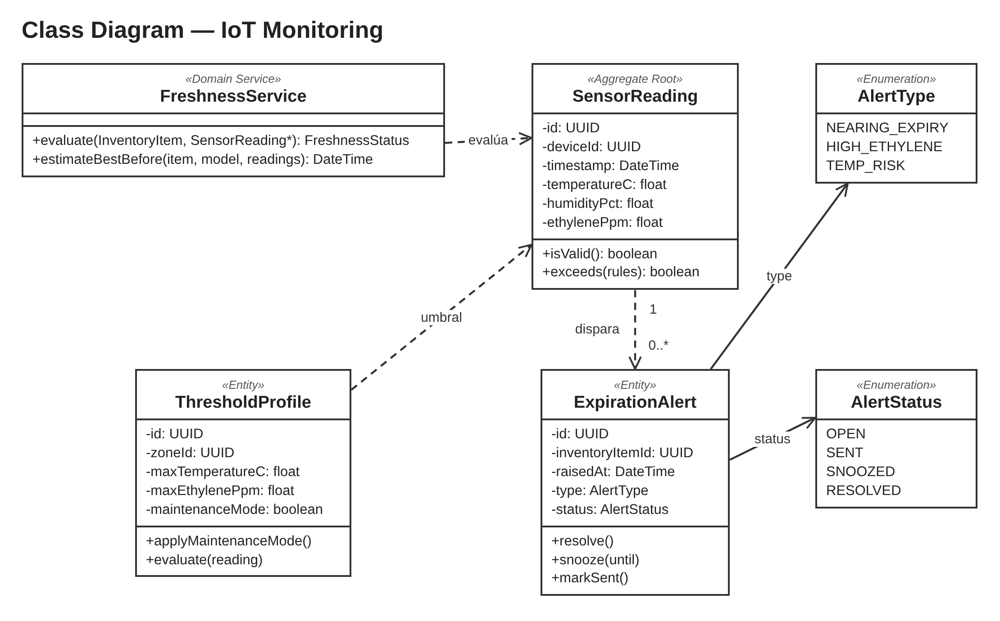
<figcaption style="font-size:0.9em;color:#555;margin-top:0.4em"><em>Class Diagram (Domain Layer) — IoT Monitoring.</em></figcaption>
</figure>

##### 4.2.7.6.2. Bounded Context Database Design Diagram

<figure id="fig-er-mon" style="margin:1.5em 0;text-align:center">
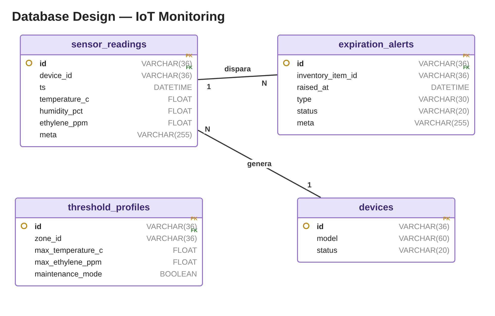
<figcaption style="font-size:0.9em;color:#555;margin-top:0.4em"><em>Database Design Diagram — IoT Monitoring.</em></figcaption>
</figure>

### 4.2.8 Bounded Context: Report Management

El **Report Management Bounded Context** consolida la información de los demás contextos para producir los **reportes de consumo y sostenibilidad**: el informe semanal de hábitos (**US12**), la analítica avanzada de rotación (**US17**), el panel de ahorro económico (**US18**) y las métricas de impacto ecológico en kg de CO₂ evitado (**US20**). Genera los archivos descargables en PDF y Excel con JasperReports y Apache POI, y expone la información al Analytics Service externo.

#### 4.2.8.1. Domain Layer

La Domain Layer del Report Management Bounded Context encapsula la lógica de negocio del contexto. En esta capa se definen los agregados, entidades, objetos de valor, servicios de dominio y políticas que representan los conceptos clave del sistema.

**Aggregates**

1. **ConsumptionReport**
   - *Propósito:* Agregado raíz que representa un reporte consolidado de consumo, merma y ahorro para un periodo determinado.

   - *Atributos:*
| Atributo | Tipo | Descripción |
|---|---|---|
| id | UUID | Identificador del reporte. |
| userId | UUID | Usuario o negocio destinatario. |
| period | Period (VO) | Rango de fechas cubierto (periodStart–periodEnd). |
| savedAmount | Money (VO) | Valor económico rescatado al consumir a tiempo (US18). |
| wasteReducedKgCO2 | float | Kilogramos de CO₂ evitados (US20). |
| sections | List&lt;ReportSection&gt; | Bloques del reporte: inventario, consumo, calidad. |
| createdAt | DateTime | Fecha de generación. |
   - *Métodos:*
| Método | Descripción |
|---|---|
| generate(inventory, consumption, quality) | Construye el reporte a partir de los tres contextos fuente. |
| exportTo(format) | Exporta el reporte a PDF o Excel (US29). |
| isPremiumOnly() | Indica si el nivel de detalle requiere plan PREMIUM (US17). |
**Entities**

1. **ReportSection** — Bloque temático del reporte con sus métricas calculadas.

| Atributo | Tipo | Descripción |
|---|---|---|
| id | UUID | Identificador de la sección. |
| reportId | UUID | Reporte al que pertenece. |
| type | SectionType (VO) | INVENTORY, CONSUMPTION, QUALITY o SUSTAINABILITY. |
| metricsJson | String | Métricas calculadas serializadas. |
| order | int | Posición dentro del reporte. |

| Método | Descripción |
|---|---|
| render(format) | Produce la representación de la sección en el formato solicitado. |
**Value Objects**

| Value Object | Descripción |
|---|---|
| Period | Rango de fechas con inicio y fin; valida que el fin sea posterior al inicio. |
| Money | Importe con moneda, usado para el ahorro estimado (US18). |
| SectionType | Enumeración: `INVENTORY`, `CONSUMPTION`, `QUALITY`, `SUSTAINABILITY`. |
| ExportFormat | Enumeración: `PDF`, `XLSX`, `CSV` (US29). |

**Domain Services**

| Servicio | Descripción |
|---|---|
| ReportAssemblyService | Orquesta la consulta a Inventory, Consumption e IoT Monitoring y arma las secciones del reporte. |
| SustainabilityMetricsService | Convierte los kilogramos de alimento salvado en CO₂ evitado y litros de agua preservados (US20). |

**Domain Events**

| Evento | Descripción |
|---|---|
| ReportRequested | El usuario solicitó un reporte (ES: *solicitar reporte*). |
| ReportGenerated | El reporte se construyó y quedó disponible (ES: *reporte generado*). |
| WeeklyReportSent | Se despachó el resumen semanal al correo del usuario (US12). |
| ReportExported | El usuario descargó el reporte en PDF, Excel o CSV (US29). |

**Policies**

- **Emitir reporte semanal**: cuando se cumple el ciclo de 7 días, el servidor consolida los datos y envía un resumen gráfico al correo y al panel (US12).
- **Verificar plan antes de la analítica avanzada**: cuando un usuario sin PREMIUM solicita la rotación detallada, el acceso se bloquea (US17).
- **Calcular impacto ambiental**: cuando se genera el reporte, se estima el CO₂ evitado a partir de los alimentos consumidos a tiempo (US20).

#### 4.2.8.2. Interface Layer

La Interface Layer del Report Management expone los puntos de entrada del contexto mediante controladores REST, recursos y *assemblers* que traducen entre el modelo HTTP y el modelo de dominio.

**Controllers**

1. **ReportsController** — Genera y expone los reportes de consumo y sostenibilidad.

| Método | Endpoint | Descripción |
|---|---|---|
| GET | /api/v1/reports | Lista los reportes generados del usuario. |
| POST | /api/v1/reports | Genera un reporte para el periodo indicado (US12). |
| GET | /api/v1/reports/{id} | Obtiene el detalle del reporte y sus secciones. |
| GET | /api/v1/reports/{id}/export | Descarga el reporte en PDF, Excel o CSV (US29). |

   - *Dependencias:* ReportCommandService, ReportQueryService

2. **AnalyticsController** — Expone la analítica avanzada y el panel de ahorro (US17, US18).

| Método | Endpoint | Descripción |
|---|---|---|
| GET | /api/v1/analytics/rotation | Gráficos de rotación de inventario (solo PREMIUM). |
| GET | /api/v1/analytics/savings | Ahorro acumulado estimado en moneda local. |
| GET | /api/v1/analytics/sustainability | Métricas de CO₂ evitado y agua preservada (US20). |

   - *Dependencias:* ReportQueryService

**Resources**

| Resource | Campos |
|---|---|
| ReportResource | id, period, savedAmount, wasteReducedKgCO2, sections[], createdAt |
| ReportSectionResource | type, metrics, order |
| CreateReportResource | periodStart, periodEnd, scope |
| SustainabilityResource | kgCO2Avoided, litersWaterSaved, itemsSaved |

**Transformers / Assemblers**

| Assembler | Transformación |
|---|---|
| ReportResourceFromEntityAssembler | Convierte `ConsumptionReport` y sus secciones en `ReportResource`. |
| SustainabilityResourceFromEntityAssembler | Convierte las métricas ambientales en su recurso. |
| CreateReportCommandFromResourceAssembler | Convierte `CreateReportResource` en `GenerateReportCommand`. |

#### 4.2.8.3 Application Layer

La Application Layer del Report Management coordina las operaciones entre la Interface Layer y la Domain Layer, orquestando comandos, consultas y la reacción a eventos de otros contextos.

**Command Services**

| Servicio | Comandos que maneja | Descripción |
|---|---|---|
| ReportCommandServiceImpl | GenerateReportCommand, ExportReportCommand | Construye el reporte consultando los contextos fuente y genera el archivo descargable. |
| WeeklyReportSchedulerImpl | SendWeeklyReportCommand | Consolida y despacha el resumen semanal de hábitos al correo del usuario (US12). |

**Query Services / Facades**

| Servicio | Consultas | Descripción |
|---|---|---|
| ReportQueryServiceImpl | GetReportsByUserQuery, GetReportByIdQuery, GetSustainabilityMetricsQuery | Recupera los reportes generados y las métricas de impacto ambiental. |
| AnalyticsQueryServiceImpl | GetRotationAnalyticsQuery, GetSavingsQuery | Recupera la analítica avanzada y el ahorro acumulado, previa verificación del plan (US17, US18). |
| ReportContextFacade | getLatestReport(userId) | Open Host Service consultado por el Analytics Service externo. |

**Event Handlers**

| Handler | Evento que escucha | Reacción |
|---|---|---|
| ConsumptionRegisteredEventHandler | ConsumptionRegistered (Consumption Management) | Acumula el valor rescatado y actualiza las métricas del periodo en curso. |
| WasteRegisteredEventHandler | WasteRegistered (Consumption Management) | Acumula la merma y recalcula la huella de carbono del periodo (US20). |
| WeeklyCycleEventHandler | WeeklyCycleCompleted (Spring Scheduler) | Dispara `SendWeeklyReportCommand` para generar y enviar el resumen (US12). |

#### 4.2.8.4. Infrastructure Layer

La Infrastructure Layer del Report Management implementa la persistencia y las integraciones técnicas (ACL) hacia otros contextos y sistemas externos.

| Componente | Tipo | Responsabilidad |
|---|---|---|
| ConsumptionReportRepository | JPA Repository | Persistencia de reportes; `findByUserIdAndPeriod`. |
| ReportSectionRepository | JPA Repository | Persistencia de las secciones de cada reporte. |
| JasperPdfExporter | Servicio técnico | Genera el reporte en PDF con JasperReports. |
| ApachePoiExcelExporter | Servicio técnico | Genera el reporte en Excel con Apache POI (US29). |
| ExternalInventoryService | ACL entrante | Consulta el `InventoryContextFacade` para el snapshot de inventario. |
| ExternalConsumptionService | ACL entrante | Consulta el `ConsumptionContextFacade` para el resumen de consumo. |
| ExternalMonitoringService | ACL entrante | Consulta el `MonitoringContextFacade` para el histórico de calidad. |
| AnalyticsServiceAdapter | ACL saliente | Publica las métricas consolidadas al Analytics Service externo. |

#### 4.2.8.5. Bounded Context Software Architecture Component Level Diagrams

<figure id="fig-comp-rep" style="margin:1.5em 0;text-align:center">

<figcaption style="font-size:0.9em;color:#555;margin-top:0.4em"><em>Component Level Diagram — Report Management.</em></figcaption>
</figure>

#### 4.2.8.6. Bounded Context Software Architecture Code Level Diagrams

##### 4.2.8.6.1. Bounded Context Domain Layer Class Diagrams

<figure id="fig-class-rep" style="margin:1.5em 0;text-align:center">
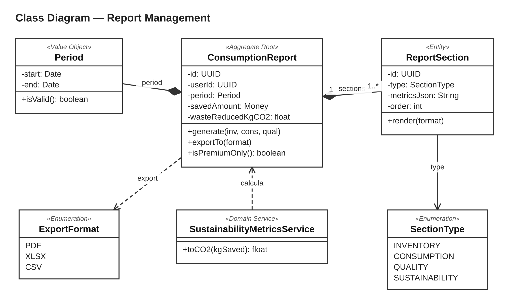
<figcaption style="font-size:0.9em;color:#555;margin-top:0.4em"><em>Class Diagram (Domain Layer) — Report Management.</em></figcaption>
</figure>

##### 4.2.8.6.2. Bounded Context Database Design Diagram

<figure id="fig-er-rep" style="margin:1.5em 0;text-align:center">
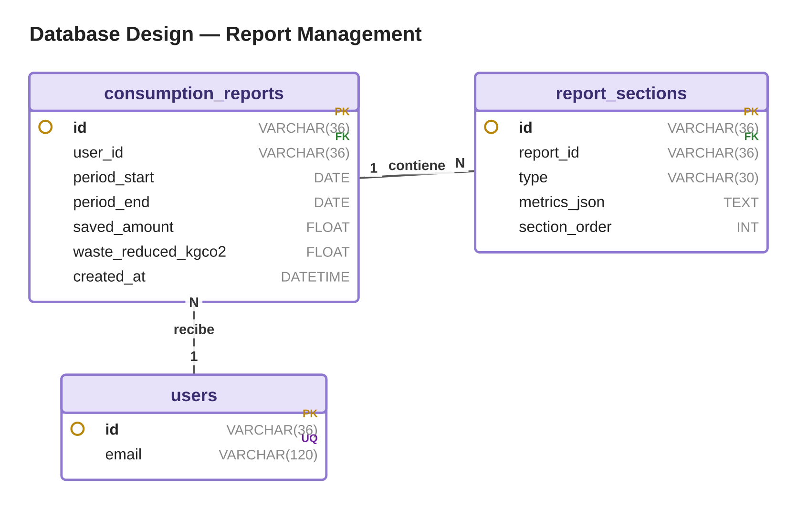
<figcaption style="font-size:0.9em;color:#555;margin-top:0.4em"><em>Database Design Diagram — Report Management.</em></figcaption>
</figure>

<div style="page-break-after: always;"></div>

# Capítulo V: Solution UI/UX Design

## 5.1. Style Guidelines

### 5.1.1. General Style Guidelines

### 5.1.2. Web, Mobile and IoT Style Guidelines

## 5.2. Information Architecture

### 5.2.1. Organization Systems

### 5.2.2. Labeling Systems

### 5.2.3. SEO Tags and Meta Tags

### 5.2.4. Searching Systems

### 5.2.5. Navigation Systems

## 5.3. Landing Page UI Design

### 5.3.1. Landing Page Wireframe

### 5.3.2. Landing Page Mock-up

## 5.4. Applications UX/UI Design

### 5.4.1. Applications Wireframes

### 5.4.2. Applications Wireflow Diagrams

### 5.4.2. Applications Mock-ups

### 5.4.3. Applications User Flow Diagrams

## 5.5. Applications Prototyping

## 5.6. IoT Device Design

# Capítulo VI: Product Implementation, Validation & Deployment

## 6.1. Software Configuration Management

FreshSense se configura como un solo producto para los dos segmentos: propietarios y administradores de restaurantes, y encargados de negocios de distribución de alimentos en fríos. No hay una rama ni un repositorio por rubro. Los dos usan el mismo frontend y el mismo API. En el restaurante la cámara es la de cocina. En la distribución es la cámara o la vitrina del lote.

El código de esa aplicación y este informe se versionan aparte, en la organización `1ASI0572-2620-8725`. Así un cambio del informe no mezcla el historial de la app. El entorno de desarrollo está en 6.1.1, el manejo de ramas y módulos en 6.1.2, el estilo en 6.1.3 y el despliegue en 6.1.4.

### 6.1.1. Software Development Environment Configuration

Para el frontend usamos Node.js 20, npm 10 y Angular 20. El backend lo levantamos en este orden: Eureka en el puerto 8761, alertas en 8083, recetas en 8082 y el monolito en 8080. El frontend en desarrollo queda en el puerto 4200.

Si se quiere ver frontend, backend y base de datos juntos, desde la carpeta del `docker-compose.yml` se corre:

```bash
docker compose build
docker compose up
```

La aplicación abre en `http://localhost`. Para entrar usamos `demo@freshsense.com` con la clave `Demo1234!`.

Si solo se levanta el frontend, el backend ya tiene que estar corriendo:

```bash
npm install
npm start
```

Queda en `http://localhost:4200`. En local el API está en `http://localhost:8080/api`, eso está en `src/environments/environment.ts`.

### 6.1.2. Source Code Management

El código de la aplicación y el informe no están en el mismo repositorio, para poder versionar cada uno sin pisar al otro.

| Repositorio | Visibilidad | Rama estable | Qué guarda |
| :--- | :--- | :--- | :--- |
| [Frontend](https://github.com/1ASI0572-2620-8725/Frontend) | Privado | `main` | Aplicación web que usan los dos segmentos |
| [report](https://github.com/1ASI0572-2620-8725/report) | Público | `main` | Este informe y las figuras de `Assets/` |

En el informe usamos estas ramas:

| Rama | Para qué la usamos | Ejemplo |
| :--- | :--- | :--- |
| `main` | Versión que ya se puede mostrar | `main` |
| `develop` | Juntar avances antes de pasarlos a `main` | `develop` |
| `chapterN-vN` | Cierre de un capítulo | `chapter2-v3` |
| `feature/...` | Una entrega concreta, sin tocar la versión cerrada | `feature/chapter-6.1-6.1.2-6.2.1.3-6.2.1.6` |

El flujo del informe es corto. Se saca la rama `feature` desde la versión del capítulo que estamos usando, se modifica `README.md`, el commit lleva el prefijo `docs:` y se sube esa rama. Recién después de la revisión se integra a `main`.

El frontend está dividido según lo que hace la aplicación, y esos módulos son los mismos para los dos segmentos. En `src/app` están `accounts`, `inventory`, `monitoring`, `alerts`, `recipes`, `reports`, `notifications` y `billing`. `shared` y `core` son soporte, no un rubro distinto. Las rutas de las pantallas están en `src/app/app.routes.ts`: al entrar redirige a `/login`, y con sesión se abre `/inventory`, `/monitoring`, `/devices`, `/alerts`, `/recipes`, `/reports`, `/notifications` y `/settings`.

Dentro de cada módulo de negocio van `domain`, `application`, `infrastructure` y `presentation`. Los textos de pantalla están en `public/i18n/es.json` y `public/i18n/en.json`.

No subimos contraseñas ni llaves. La URL del API va en `src/environments/environment.ts` cuando se corre en local (`http://localhost:8080/api`), en `environment.production.ts` para la app de Azure y en `environment.docker.ts` cuando Nginx publica `/api`.

### 6.1.3. Source Code Style Guide & Conventions

En el frontend seguimos esto:

| Qué | Cómo lo hacemos |
| :--- | :--- |
| Vistas | Componentes standalone. El nombre de la clase termina en `View`. |
| Estado | Signals. En los servicios usamos `inject()`. |
| Suscripciones | `takeUntilDestroyed()` para que no se queden abiertas. |
| CSS | El selector del componente lleva el prefijo `fs-`. |
| Formato | Prettier, comillas simples y ancho de 100. |
| Textos | No dejamos el texto escrito en el componente. Va en los archivos de i18n. |
| Idioma | Español por defecto. También está el cambio a inglés. |
| Login | El token va en la cookie `authToken`. No lo guardamos en `localStorage`. |

Los roles que tenemos ahora son `USER_STANDARD`, `USER_PREMIUM` y `ADMIN`.

### 6.1.4. Software Deployment Configuration

| Qué | Dónde está |
| :--- | :--- |
| Frontend | `https://proud-rock-06bc9ad10.7.azurestaticapps.net` |
| API | `https://freshsense-backend.mangoground-03a86fb8.eastus.azurecontainerapps.io/api` |
| Swagger | `https://freshsense-backend.mangoground-03a86fb8.eastus.azurecontainerapps.io/swagger-ui/index.html` |
| Build | `dist/frontend/browser` |

Cuando se hace push a `main` del frontend, el workflow de Azure Static Web Apps compila y publica. En Docker, Nginx sirve la página y manda `/api` al backend. Esa build usa `environment.docker.ts`. La de producción usa `environment.production.ts` y apunta al API de Azure.

## 6.2. Landing Page, Services & Applications Implementation

### 6.2.1. Sprint 1

En el sprint 1 queremos que una persona de cualquiera de los dos segmentos pueda entender FreshSense, pedir una demo y entrar a ver la cámara: la lectura, el color y la alerta. Los segmentos son propietarios y administradores de restaurantes, y encargados de negocios de distribución de alimentos en fríos.

#### 6.2.1.1. Sprint Planning 1

| Dato | Detalle |
| :--- | :--- |
| Objetivo | Que el dueño o administrador del restaurante, y el encargado del negocio de distribución en fríos, vean la propuesta, dejen sus datos y entren al panel de la cámara. |
| Duración | 2 semanas |
| De dónde sale | Product Backlog, del puesto 1 al 11 |
| Segmentos | Propietarios y administradores de restaurantes. Encargados de negocios de distribución de alimentos en fríos. |

#### 6.2.1.2. Aspect Leaders and Collaborators

#### 6.2.1.3. Sprint Backlog 1

Del Product Backlog se tomaron las primeras 11 historias. Suman 37 puntos. El sprint 1 no arma dos productos. Arma el mismo recorrido para propietarios y administradores de restaurantes y para encargados de negocios de distribución de alimentos en fríos:

1. Entrar a la misma aplicación, por registro o por login (US01 a US05 y TS43). En el código eso es `/register` y `/login`.
2. Recibir la lectura del sensor de la cámara (TS41). En el API es `POST /api/edge/readings` y `POST /api/monitoring`.
3. Ver esa lectura con color, y la alerta si el frío se pierde (US06, US07, US08 y TS42). En la app son `/monitoring` y `/alerts`.

En el restaurante la cámara es la de cocina y el producto es un insumo. En la distribución la cámara es la de la mercadería y el producto es un lote. Las fichas de platillo y el costeo no entran aquí: son del restaurante y van después en el backlog.

| Orden | ID | Título | Puntos | A quién le sirve |
| :-: | :--- | :--- | :--- | :--- |
| 1 | US01 | Visualización de propuesta B2B | 2 | Los dos segmentos |
| 2 | US02 | Sección para Restaurantes y Negocios en Frío | 2 | Los dos segmentos |
| 3 | US03 | Formulario de contacto y demos B2B | 2 | Los dos segmentos |
| 4 | US04 | Call to Action (CTA) Corporativo | 2 | Los dos segmentos |
| 5 | US05 | Adaptabilidad en móviles y tablets | 3 | Los dos segmentos |
| 6 | TS43 | API Gestor de Autenticación y RBAC B2B | 5 | Los dos segmentos |
| 7 | TS41 | API Ingesta de Sensores IoT B2B | 5 | Los dos segmentos |
| 8 | US06 | Telemetría y monitoreo IoT de cámaras frías | 5 | Los dos segmentos |
| 9 | US07 | Dashboard con semáforo comercial | 3 | Los dos segmentos |
| 10 | US08 | Alertas preventivas de temperatura | 5 | Los dos segmentos |
| 11 | TS42 | Microservicio de Notificaciones de Emergencia | 3 | Los dos segmentos |

Una historia de esta lista se cierra cuando se cumplen sus tres escenarios. Si en la revisión falta uno, se deja anotado cuál y por qué no se pudo probar.

#### 6.2.1.4. Development Evidence for Sprint Review

#### 6.2.1.5. Testing Suite Evidence for Sprint Review

#### 6.2.1.6. Execution Evidence for Sprint Review

La aplicación es una sola para los dos segmentos. No hay una pantalla de restaurante y otra de distribución. El propietario o administrador del restaurante y el encargado del negocio de distribución de alimentos en fríos entran al mismo registro, al mismo monitoreo, a las mismas alertas y al mismo inventario. Lo que cambia es la lectura: cocina e insumos en el restaurante, cámara o vitrina y lote por entregar en la distribución.

En esta parte van tres enlaces. El back y la landing ya están. El del front se cambia cuando nos lo pasen.

| Dónde | Enlace |
| :--- | :--- |
| Back | [http://35.224.123.160:8080/swagger-ui/index.html](http://35.224.123.160:8080/swagger-ui/index.html) |
| Landing | [https://1asi0572-2620-8725.github.io/landing-page/](https://1asi0572-2620-8725.github.io/landing-page/) |
| Front | Pendiente. Reemplazar este enlace cuando nos pasen el del front. |

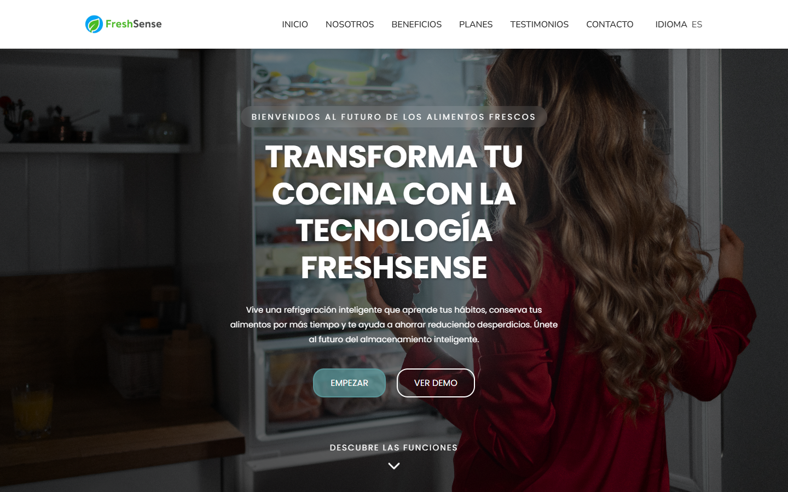

Landing ya desplegada. Desde ahí se entra a la aplicación. La misma página es la puerta para el propietario o administrador del restaurante y para el encargado de la distribución de alimentos en fríos.

El recorrido de la aplicación es uno solo. Se hace igual si quien entra es propietario o administrador de un restaurante, o encargado de un negocio de distribución de alimentos en fríos.

1. `/register` crea la cuenta. Si ya existe, `/login`. En Swagger: `POST /api/accounts/register` y `POST /api/accounts/login`.
2. `/monitoring` muestra temperatura, humedad y el color verde, amarillo o rojo. En Swagger: `GET /api/monitoring/latest` y `POST /api/monitoring`. El sensor manda la lectura con `POST /api/edge/readings`.
3. `/alerts` lista el aviso si la cámara está en rojo. En Swagger: `GET /api/alerts` y `POST /api/alerts`.
4. `/inventory` muestra el producto, la cantidad y el vencimiento. En Swagger: `GET /api/products` y `POST /api/products`.
5. `/devices` empareja el sensor de esa cámara. En Swagger: `POST /api/devices`.

| Pantalla | Ruta | Operación | Cómo lo lee el restaurante | Cómo lo lee la distribución en fríos |
| :--- | :--- | :--- | :--- | :--- |
| Registro | `/register` | `POST /api/accounts/register` | Alta del administrador del local | Alta del encargado del negocio |
| Ingreso | `/login` | `POST /api/accounts/login` | Entra al turno de cocina | Entra a revisar la mercadería |
| Monitoreo | `/monitoring` | `GET /api/monitoring/latest` | Cámara de cocina | Cámara o vitrina del lote |
| Alertas | `/alerts` | `GET /api/alerts` | El frío de los insumos se perdió | El lote no está para salir |
| Inventario | `/inventory` | `GET /api/products` | Insumo, cantidad y vencimiento | Lote, cantidad y vencimiento |
| Dispositivos | `/devices` | `POST /api/devices` | Sensor de la cocina | Sensor de la cámara de distribución |

Las capturas de abajo son del recorrido de la aplicación. El enlace público del front se reemplaza en la tabla de arriba cuando nos lo pasen. La cuenta demo no tenía productos ni una lectura reciente: monitoreo, alertas e inventario se ven vacíos, y sin lectura reciente esa fila no queda en verde.

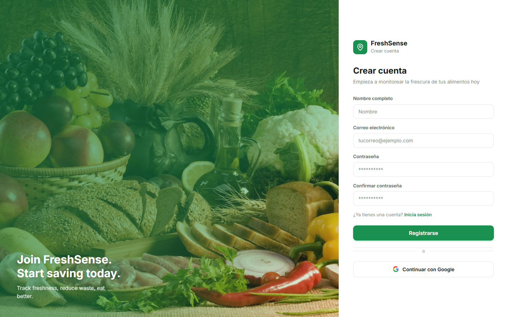

Registro. La misma pantalla sirve para el administrador del restaurante y para el encargado de la distribución de alimentos en fríos.

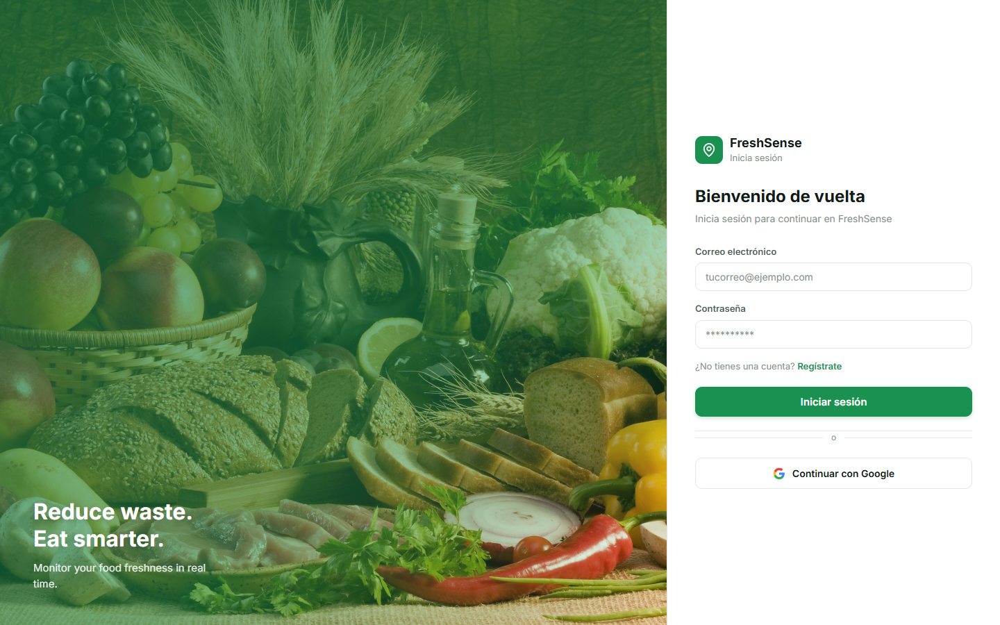

Ingreso. Después de entrar, el panel es el mismo para los dos segmentos.

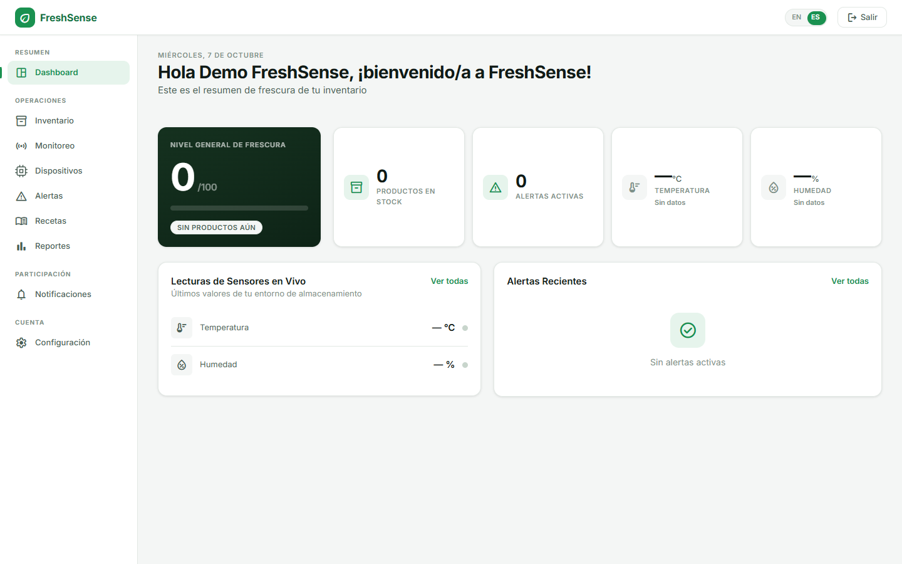

Panel de la cuenta demo. Temperatura y humedad salen sin datos porque no había una lectura reciente.

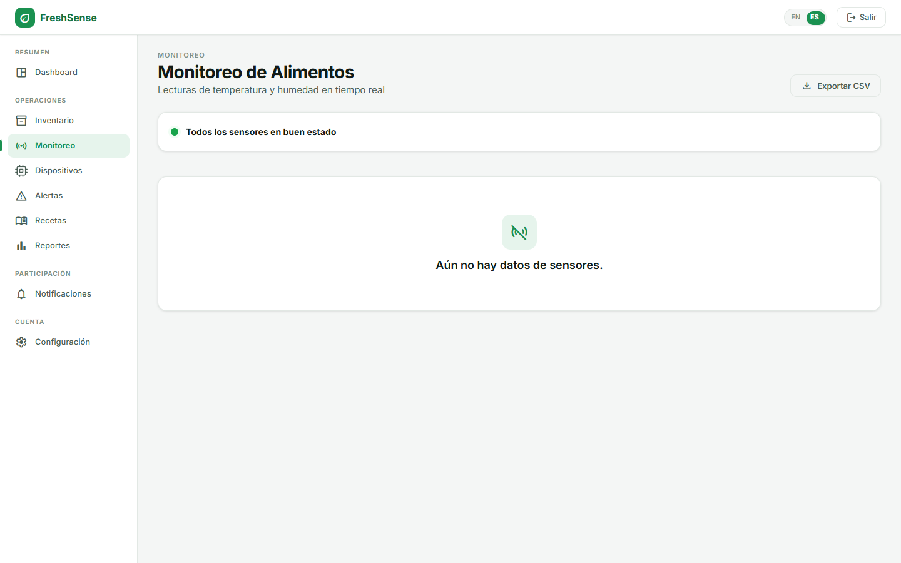

Monitoreo. En el restaurante se lee como la cámara de cocina; en la distribución, como la cámara o vitrina del lote.

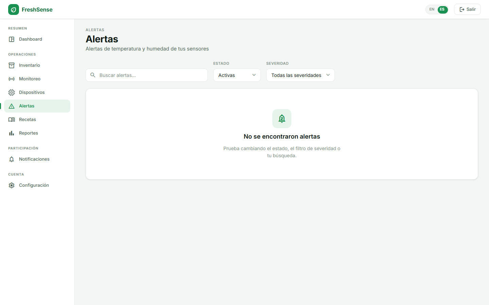

Alertas. Sin aviso activo en la cuenta demo.

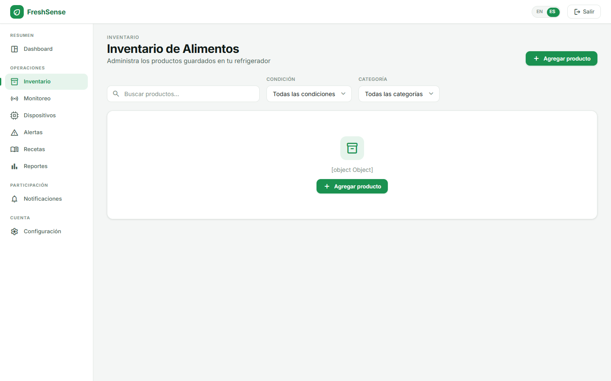

Inventario. Sin productos cargados: insumo en el restaurante, lote en la distribución.

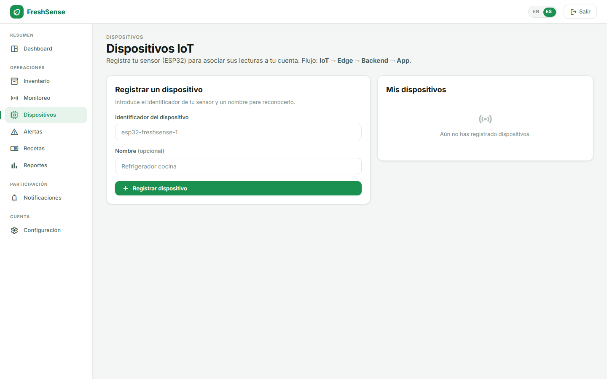

Dispositivos. Aquí se registra el sensor de la cocina o el de la cámara de distribución.

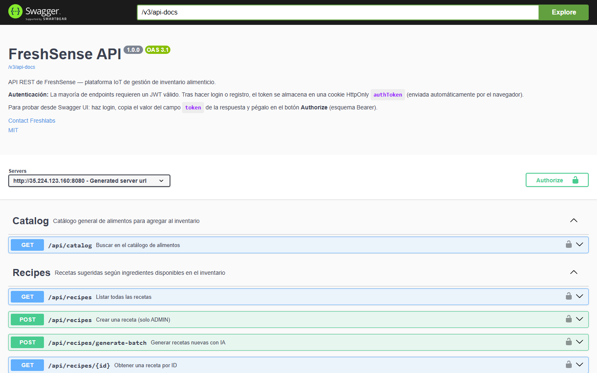

Swagger del API en `http://35.224.123.160:8080`.

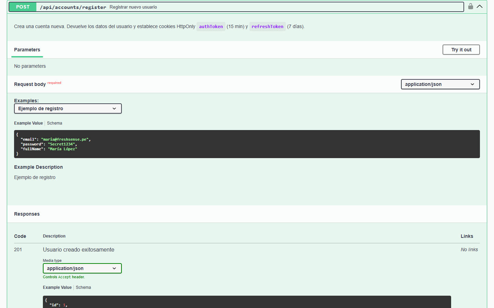

Operación de registro en Swagger, la misma que usa `/register`.

Si no llega una lectura reciente, esa fila no se marca en verde. Quien no tiene permiso de facturación igual entra por `/login` al panel. `/plan` queda para la suscripción, no para esta revisión de la cámara.

#### 6.2.1.7. Services Documentation Evidence for Sprint Review

#### 6.2.1.8. Software Deployment Evidence for Sprint Review

#### 6.2.1.9. Team Collaboration Insights during Sprint

## 6.3. Validation Interviews

### 6.3.1. Diseño de Entrevistas

### 6.3.2. Registro de Entrevistas

### 6.3.3. Evaluaciones según heurísticas

## 6.4. Video About-the-Product

## Conclusiones

El análisis realizado permitió identificar que los propietarios y administradores de restaurantes, y los encargados de negocios de distribución de alimentos en fríos, enfrentan dificultades relacionadas con el control constante de sus productos perecibles y las condiciones necesarias para su adecuada conservación. El deterioro de los alimentos, las fallas en la cadena de frío y la falta de información oportuna pueden generar mermas y pérdidas económicas que afectan directamente la rentabilidad del negocio. Asimismo, se identificó la necesidad de contar con una solución tecnológica sencilla que facilite el monitoreo del inventario, permita recibir alertas ante posibles riesgos y proporcione información útil para tomar decisiones oportunas. En este contexto, FreshSense busca responder a estas necesidades mediante una herramienta que contribuya a reducir las pérdidas, mejorar el control de los productos y optimizar la gestión del negocio.


## Video About-the-Team
## Bibliografía
## Anexos

Link a repositorio de github: https://github.com/1ASI0572-2620-8725/report
